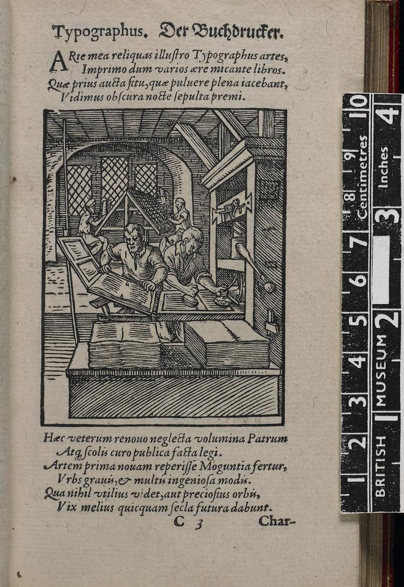

## General Introductory Texts
The best English-language introduction to the field is Elizabeth L. Eisenstein, The Printing Press as an Agent of Change: Communications and Cultural Transformations in Early Modern Europe, 2 vols. (Cambridge:  Cambridge University Press, 1979). This was later abridged as Eisenstein, The Printing Revolution in Early Modern Europe (Cambridge:  Cambridge University Press, 1983.  However, Eisenstein does not replace the classic treatment of the introduction of printing, the French edition first published in 1958, followed by two English editions: L. Febvre and H.-J. Martin, The Coming of the Book: The Impact of Printing, 1450–1800 (London:  Verso, 1984).

These two works serve to introduce the reader to the basic chronologies and narratives in the history of print culture.
-   Eisenstein, Elizabeth L.  
    “An Unknowledge Revolution Revisited,” American Historical Review 107 (2002) 87-105  
    Van Pelt Library. E171 .A57  
    http://www.jstor.org/stable/10.1086/532098

-   Eisenstein, Elizabeth L.  
    The printing revolution in early modern Europe.  
    Cambridge UK ; New York: Cambridge University Press, 2005  
    Katz Center - Stacks. Z124 .E374 2005  
    Van Pelt Library. Z124 .E374 2005  
    Rare Book & Manuscript Library - Furness Collection. Z124 .E374 2005

-   Eisenstein, Elizabeth L.  
    The printing press as an agent of change : communications and cultural transformations in early modern Europe, 2 volumes  
    Cambridge, UK ; New York : Cambridge University Press, 1979  
    Van Pelt Library. Z124 .E37  
    Rare Book & Manuscript Library Reading Room. Z124 .E37 1980  
    Annenberg Library - Reference. Z124 .E37 1980

-   Febvre, Lucien and Henri-Jean Martin  
    L'apparition du livre  
    Paris : A. Michel, c1999 \[repr. of Paris : A. Michel, c1958\]  
    Van Pelt Library. Z4 .F4 1999

-   Febvre, Lucien and Henri-Jean Martin, tr. by David Gerard ; edd. Geoffrey Nowell-Smith and David Wootton  
    The coming of the book : the impact of printing 1450-1800  
    London : NLB ; Atlantic Highlands \[N.J.\] : Humanities Press, 1976  
    Van Pelt Library. Z4 .F413 1976  
    London: Verso, 1990 \[repr. of  1976 edition\]  
    Van Pelt Library. Z4 .F413 1990  
    Rare Book & Manuscript Library - Furness Shakespeare Library (Van Pelt 628). Z4 .F413 1990

-   Grafton, Anthony  
    “AHR Forum.  How Revolutionary was the Print Revolution.  Introduction,” American Historical Review 107 (2002) 84-86  
    Van Pelt Library. E171 .A57  
    http://www.jstor.org/stable/10.1086/532097

-   Grafton, Anthony  
    “The Humanist as Reader,” pp. 179-212 in, A History of Reading in the West (Amherst:  University of Massachusetts Press, 2003) edd Guglielmo Cavallo and Roger Chartier, trans. Lydia G. Cochrane  
    Van Pelt Library. Z1003.3.E85 S7613 1999  
    Rare Book & Manuscript Library - Furness Collection. Z1003.3.E85 S7613 1999  
    Rare Book & Manuscript Library - Furness Shakespeare Library (Van Pelt 628). Z1003.3.E85 S7613 1999

-   Johns, Adrian  
    “How to Acknowledge a Revolution,” American Historical Review 107 (2002) 106-122  
    Van Pelt Library. E171 .A57  
    http://www.jstor.org/stable/10.1086/532099

-   Johns, Adrian  
    The Nature of the Book:  Print and Knowledge in the Making  
    Chicago:  University of Chicago Press, 1998  
    Van Pelt Library. Z124 .J64 1998  
    Rare Book & Manuscript Library - Furness Collection. Z124 .J64 1998
### General Texts in Hebrew Bibliography
-   Baruchson-Arbib Shifra and Gila Prebor“Sefer Ha-Ziquq (An Index of Forbidden Hebrew Books) -The Book's use and it's influence on Hebrew Printing,” La Bibliofilia 109.1 (2007) 3-31  
    Van Pelt Library. [Z1007 .B56](http://franklin.library.upenn.edu/record.html?id=FRANKLIN_1969)

-   Baruchson, Zipporah  
    “In search of the Lost Books of the 15th-16th Centuries,” \[Hebrew\] Alei Sefer 16 (1990) 37-58  
    Katz Center – Periodicals Gallery. [Z228.H4 A57](http://franklin.library.upenn.edu/record.html?id=FRANKLIN_2385488)  
    Van Pelt Library. [Z228.H4 A57](http://franklin.library.upenn.edu/record.html?id=FRANKLIN_2385488)

-   Ben Menahem, Naftali  
    “The Early Editions of the Shulhan Arukh,” \[Hebrew\] pp. 101-120 in,   רבי יוסף קארו : עיונים ומחקרים במשנת מרן בעל ה״שלחן ערוך״   = Rabbi Yosef Karo:  Inquiries and Studies in the teachings of Maran, the author of Shulhan Arukh (Jerusalem :  Mossad Harav Kook, 1969) ed. Yitzhak Raphael  
    Katz Center - Stacks. [BM520.88 .R3 1969](http://franklin.library.upenn.edu/record.html?id=FRANKLIN_907879)  
    Van Pelt Library. [BM520.88 .R3](http://franklin.library.upenn.edu/record.html?id=FRANKLIN_907879)

-   Berlin, Charles, ed.  
    Hebrew printing and bibliography  
    New York : New York Public Library : Ktav, 1976  
    Katz Center – Reference Room. [Z228.H4 H43 1976](http://franklin.library.upenn.edu/record.html?id=FRANKLIN_2366278)

-   Brisman, Shimeon  
    A history and guide to Judaic bibliography  
    Cincinnati : Hebrew Union College Press, 1977  
    Katz Center – Reference Room. [Z6366 .B8](http://franklin.library.upenn.edu/record.html?id=FRANKLIN_2377854)

-   Habermann, Abraham Meir  
    פרקים בתולדות המדפסים העברים ועניני ספרים = Studies in the history of Hebrew printers and books  
    Jerusalem : R. Mas, 738, 1978  
    Katz Center – Reference Room. [Z228.H4 H19 1978](http://franklin.library.upenn.edu/record.html?id=FRANKLIN_2382549)  
    Katz Center – Stacks. [Z228.H4 H19 1978](http://franklin.library.upenn.edu/record.html?id=FRANKLIN_2382549)  
    Van Pelt Library. [Z228.H4 H19](http://franklin.library.upenn.edu/record.html?id=FRANKLIN_2382549)

-   Habermann, Abraham Meir  
    הספר העברי בהתפתחותו : מסימנים לאותיות וממגילה לספר = History of the Hebrew book  
    Jerusalem : R. Mas,1968  
    Katz Center – Reference Room. [Z240 .H33 1968](http://franklin.library.upenn.edu/record.html?id=FRANKLIN_2387099)

-   Hacker, Joseph R. and Adam Shear, edd.  
    The Hebrew book in early modern Italy  
    Philadelphia : University of Pennsylvania Press, c2011  
    Katz Center – Stacks. [Z228.H4 H425 2011](http://franklin.library.upenn.edu/record.html?id=FRANKLIN_5112631)  
    Van Pelt Library. [Z228.H4 H425 2011](http://franklin.library.upenn.edu/record.html?id=FRANKLIN_5112631)  
    [http://site.ebrary.com/lib/upenn/docDetail.action?docID=10642680](http://site.ebrary.com/lib/upenn/docDetail.action?docID=10642680)  
    [http://muse.jhu.edu/books/9780812205091](http://muse.jhu.edu/books/9780812205091)

-   Harris Constance  
    "The Sixteenth Century:  Let There Be Books," pp. 40-78 in, The Way Jews Lived: Five Hundred Years of Printed Words and Images (Jefferson, N.C. : McFarland & Company, 2009)  
    Fine Arts Library. [N7415 .H36 2009](http://franklin.library.upenn.edu/record.html?id=FRANKLIN_4451669)  
    [https://books.google.com/books?id=f7ZXXhkkq7EC&pg=PA56&dq=Bragadin+hebrew&hl=en&sa=X&ved=0ahUKEwj1uJ-E0YvMAhWFyj4KHUM\_AJc4ChDoAQgoMAI#v=onepage&q=Bragadin%20hebrew&f=false](https://books.google.com/books?id=f7ZXXhkkq7EC&pg=PA56&dq=Bragadin+hebrew&hl=en&sa=X&ved=0ahUKEwj1uJ-E0YvMAhWFyj4KHUM_AJc4ChDoAQgoMAI#v=onepage&q=Bragadin%20hebrew&f=false)

-   Heller, Marvin J.  
    The sixteenth century Hebrew book : an abridged thesaurus, 2 volumes  
    Leiden; Boston : Brill, 2004  
    Katz Center – Reference Folio. [Z228.H4 H45 2004](http://franklin.library.upenn.edu/record.html?id=FRANKLIN_3530946)  
    Van Pelt Library. [Z228.H4 H45 2004](http://franklin.library.upenn.edu/record.html?id=FRANKLIN_3530946)

-   Heller, Marvin J.  
    The seventeenth century Hebrew book : an abridged thesaurus, 2 volumes  
    Leiden; Boston : Brill, 2010  
    Katz Center – Reference Folio. [Z228.H4 H449 2010](http://franklin.library.upenn.edu/record.html?id=FRANKLIN_4939536)  
    Van Pelt Library. [Z228.H4 H449 2010](http://franklin.library.upenn.edu/record.html?id=FRANKLIN_4939536)

-   Heller, Marvin J.  
    Studies in the making of the early Hebrew book  
    Leiden; Boston : Brill, 2008  
    Katz Center – Stacks. [Z228.H4 H46 2008](http://franklin.library.upenn.edu/record.html?id=FRANKLIN_4262233)  
    Van Pelt Library. [Z228.H4 H46 2008](http://franklin.library.upenn.edu/record.html?id=FRANKLIN_4262233)

-   Heller, Marvin J.  
    Further studies in the making of the early Hebrew book  
    Leiden: Brill, 2013  
    Katz Center – Stacks. [Z228.H4 H442 2013](http://franklin.library.upenn.edu/record.html?id=FRANKLIN_5938607)  
    Van Pelt Library. [Z228.H4 H442 2013](http://franklin.library.upenn.edu/record.html?id=FRANKLIN_5938607)

-   Heller, Marvin  
    “Unicums, fragments and other Hebrew book rarities,” Judaica Librarianship 18 (2014) 130-153  
    [http://ajlpublishing.org/cgi/viewcontent.cgi?article=1036&context=jl](http://ajlpublishing.org/cgi/viewcontent.cgi?article=1036&context=jl)

-   Hill, Brad Sabin  
    “A Century of Hebraica at the Library of Congress,” Jewish Quarterly Review 106 (2016) 101-129  
    Katz Center - Periodicals Gallery. [DS101 .J48](http://franklin.library.upenn.edu/record.html?id=FRANKLIN_183435)

-   Kaplan, Mordecai Menahem  
    Panorama of Ancient Letters:  Four and a Half Centuries of Hebraica and Judaica.  Bibliographical notes and descriptions of 1,000 rare books and manuscripts  
    New York \[Prepared and photo-offset by Academy Photo Offset\] 1942  
    Katz Center - Reference Room. [Z7070 .K28 1942](http://franklin.library.upenn.edu/record.html?id=FRANKLIN_2397347)  
    Katz Center - Stacks. [Z7070 .K28 1942](http://franklin.library.upenn.edu/record.html?id=FRANKLIN_2397347)  
    Van Pelt Library. [Z7070 .K28 1942](http://franklin.library.upenn.edu/record.html?id=FRANKLIN_2397347)

-   Manfred R. Lehmann Memorial Master Workshop in the History of the Jewish Book  
    DVD’s in Katz Center – Librarian’s Office 2003

	-   Glatzer, Mordechai, “Early Hebrew printing” 2004
	-   Glatzer, Mordechai, “Hebrew printing, 1470-1570” 2006
	-   Berger, Shlomo, “The early Yiddish book”
	-   Hacker, Joseph, “Chapters in the early history of Hebrew printing in the Ottoman empire” 2008
	-   Schmelzer, Menachem, “From manuscript to print : reading colophons, title pages, and other paratexts” 2009
	-   Rosman, Moshe, “The traditional eastern European Jewish book, 1500-1900” 2010
	-   Schrijver, Emile G.L., “The Jewish book in and around Amsterdam” 2011,
	-   Lakerson, Shimon, “Collectors and collections : Hebrew manuscripts and incunabula in Russia”

-   Margaliot, Reuven  
    “The First Edition of the Shulhan Arukh,” \[Hebrew\] pp. 89-100 in,  רבי יוסף קארו : עיונים ומחקרים במשנת מרן בעל ה״שלחן ערוך״       = Rabbi Yosef Karo:  Inquiries and Studies in the teachings of Maran, the author of Shulhan Arukh (Jerusalem :  Mossad Harav Kook, 1969) ed. Yitzhak Raphael  
    Katz Center - Stacks. [BM520.88 .R3 1969](http://franklin.library.upenn.edu/record.html?id=FRANKLIN_907879)  
    Van Pelt Library. [BM520.88 .R3](http://franklin.library.upenn.edu/record.html?id=FRANKLIN_907879)

-   Marx, Alexander  
    Studies in Jewish history and booklore  
    New York, The Jewish Theological Seminary of America, 5704-1944  
    Katz Center – Stacks. [BM45 .M379 1944](http://franklin.library.upenn.edu/record.html?id=FRANKLIN_2398551)  
    Katz Center – Hurowitz Collection. [BM45 .M379 1944](http://franklin.library.upenn.edu/record.html?id=FRANKLIN_2398551)

-   Marx, Moses  
    History and annals of Hebrew printing \[1501-1600\] , 13 reels  
    Cincinnati : Library, Hebrew Union College, 1989  
    Katz Center – Microfilm. [Z124.A2 M37 1989](http://franklin.library.upenn.edu/record.html?id=FRANKLIN_2386609)

-   Pollak, Michael  
    "The invention of printing in Hebrew lore," Gutenberg-Jahrbuch (1977) 22-28  
    Van Pelt Library. [Z1008 .G98](http://franklin.library.upenn.edu/record.html?id=FRANKLIN_4184)  
    [http://www.digizeitschriften.de/dms/resolveppn/?PID=PPN366382810\_1977%7Clog12](http://www.digizeitschriften.de/dms/resolveppn/?PID=PPN366382810_1977%7Clog12)

-   Posner, Raphael and Israel Ta-Shema  
    The Hebrew book : an historical survey  
    New York : L. Amiel ; Jerusalem : Keter Pub. House, 1975  
    Katz Center - Reference Folio. [Z228.H4 H4 1975](http://franklin.library.upenn.edu/record.html?id=FRANKLIN_2457190)  
    Katz Center - Stacks Folio. [Z228.H4 H4 1975](http://franklin.library.upenn.edu/record.html?id=FRANKLIN_2457190)  
    Van Pelt Library. [Z228.H4 H4](http://franklin.library.upenn.edu/record.html?id=FRANKLIN_2457190)

-   Prebor, Gila  
    "Sefer HaZiquq" as a Source for Hebrew Bibliography," \[Hebrew\] Alei Sefer 23 (2011) 63-80  
    Katz Center – Periodicals Gallery. [Z228.H4 A57](http://franklin.library.upenn.edu/record.html?id=FRANKLIN_2385488)  
    Van Pelt Library. [Z228.H4 A57](http://franklin.library.upenn.edu/record.html?id=FRANKLIN_2385488)

-   Schmelzer, Menahem  
    "The aims of Hebrew bibliography in historical perspective," pp. 143-149 in, Threescore and Ten; Essays in Honor of Rabbi Seymour J. Cohen (Hoboken, NJ: Ktav, 1991) edd. Abraham J. Karp et al.  
    Katz Center - Stacks. [BM42 .T47 1991](http://franklin.library.upenn.edu/record.html?id=FRANKLIN_2429714)

-   Schmelzer, Menahem H., ed.  
    Bibliographical studies and notes on rare books and manuscripts in the library of the Jewish Theological Seminary of America.  Alexander Marx  
    New York : Jewish Theological Seminary of America, 1977  
    Katz Center – Reference Room. [Z7070 .M34 1977](http://franklin.library.upenn.edu/record.html?id=FRANKLIN_2366544)  
    Katz Center – Stacks. [Z7070 .M34 1977](http://franklin.library.upenn.edu/record.html?id=FRANKLIN_2366544)

-   Schrijver, Emile G.L.  
    “New Dimensions of Hebrew Bibliography,” \[important review article\] Studia Rosenthaliana 31 (1997) 175-182  
    Katz Center – Stacks. [DS135.N4 S8](http://franklin.library.upenn.edu/record.html?id=FRANKLIN_51770)  
    Van Pelt Library. [DS135.N4 S8](http://franklin.library.upenn.edu/record.html?id=FRANKLIN_51770)  
    [http://www.jstor.org/stable/41482360?seq=1#fndtn-page\_scan\_tab\_contents](http://www.jstor.org/stable/41482360?seq=1#fndtn-page_scan_tab_contents)

-   Sonne, Isaiah  
    “Journeys through History and Bibliography,” \[Hebrew\] pp. 209-235 in, Alexander Marx Jubilee Volume on the Occasion of His Seventieth Birthday.  Hebrew Section (New York :  Jewish Theological Seminary of America, 1950) ed. Saul Lieberman  
    Katz Center - Stacks. [BM42.M379 L5432 1950](http://franklin.library.upenn.edu/record.html?id=FRANKLIN_2380801)  
    Van Pelt - Judaica/Ancient Near East Resource Room (401). [BM40 .J54 1950](http://franklin.library.upenn.edu/record.html?id=FRANKLIN_1041690)

-   Steinschneider, Moritz  
    “Jüdische Typographie und Jüdischer Buchhandel,” pp. 21-94 in sect. 2, vol. 28 of, Allgemeine Encyklopaedie der Wissenschaften und Kunste (Leipzig:  F.A. Brockhaus, 1851) edd. Johann Samuel Ersch and Johann Gottfried Gruber  
    Available online at   [http://gdz.sub.uni-goettingen.de/dms/load/toc/?PPN=PPN362307695](http://gdz.sub.uni-goettingen.de/dms/load/toc/?PPN=PPN362307695)  
    
-   Tamari, Ittai Joseph  
                                                                                                                                                             “Notes on the Printing in Hebrew Typefaces from the 15th to 19th Centuries,” pp. 33-52 in, Middle Eastern Languages and the Print Revolution: A Cross-Cultural Encounter (Westhoven:  WVA Verlag Skulima, 2002) edd. Eva Hanebutt-Benz, Dagmar Glass and Geoffrey Roper  
                                                                                                                                                             Van Pelt Library. [Z126 .M53 2002](http://franklin.library.upenn.edu/record.html?id=FRANKLIN_3291203)

-   Vinograd, Yeshayahu  
    “Hebrew Printing in the Years of ‘Shin’ 1540-1640,” \[Hebrew\] Alei Sefer 15 (1989) 129-32  
    Katz Center – Periodicals Gallery. [Z228.H4 A57](http://franklin.library.upenn.edu/record.html?id=FRANKLIN_2385488)  
    Van Pelt Library. [Z228.H4 A57](http://franklin.library.upenn.edu/record.html?id=FRANKLIN_2385488)  
    [http://www.jstor.org/stable/24158779?seq=1#page\_scan\_tab\_contents](http://www.jstor.org/stable/24158779?seq=1#page_scan_tab_contents)

-   Zafren, Herbert C.  
    "Was Gutenberg Jewish? and Other Conundrums: Exploring The Margins of Judaica Bibliography," Judaica Librarianship 11 (2003) 28-55  
    [http://ajlpublishing.org/cgi/viewcontent.cgi?article=1116&context=jl](http://ajlpublishing.org/cgi/viewcontent.cgi?article=1116&context=jl)

-   Zwiep, Irene E., Emile G.L. Schrijver and Frits J. Hoogewoud, edd.  
    Omnia in Eo:  Studies on Jewish Books and Libraries in Honour of Adri Offenberg, Celebrating the 125th Anniversary of the Bibliotheca Rosenthaliana in Amsterdam = Studia Rosenthaliana 38/9 (2006)  
    Katz Center – Stacks. [DS135.N4 S8](http://franklin.library.upenn.edu/record.html?id=FRANKLIN_51770)  
    Van Pelt Library. [DS135.N4 S8](http://franklin.library.upenn.edu/record.html?id=FRANKLIN_51770)  
    [http://www.jstor.org/stable/i40072265](http://www.jstor.org/stable/i40072265)
## Authorship
The notion of an ‘author’ is, it might be argued, a relatively recent development. Investigators from various fields have attempted to describe the historical conditions underpinning its construction. R. Chartier, The Order of Books, Ch. 2 frames the questions and negoiates arguments involved.
-   Chartier, Roger; tr. by Lydia G. Cochrane  
    The order of books : readers, authors, and libraries in Europe between the fourteenth and eighteenth centuries  
    Stanford, Calif. : Stanford University Press, 1994  
    Van Pelt Library. [Z1003.5.E9 C4713 1994](http://franklin.library.upenn.edu/record.html?id=FRANKLIN_1815784)

-   Chartier, Roger; tr. by Lydia G. Cochrane  
    The Authors Hand and the Printers Mind: Transformations of the Written Word in Early Modern Europe  
    Cambridge, UK : Polity Press, 2013  
    Van Pelt Library. [Z124 C43 2014](http://franklin.library.upenn.edu/record.html?id=FRANKLIN_6048928)  
    Rare Book & Manuscript Library - Furness Shakespeare Library (Van Pelt 628). [Z124 C43 2014](http://franklin.library.upenn.edu/record.html?id=FRANKLIN_6048928)

-   Chartier, Roger, ed.; tr. by Lydia G. Cochrane  
    The Culture of print : power and the uses of print in early modern Europe  
    Princeton, N.J. : Princeton University Press, 1989  
    Rare Book & Manuscript Library - Furness Collection. [Z124 .U83 1989](http://franklin.library.upenn.edu/record.html?id=FRANKLIN_1013008)  
    Van Pelt Library. [Z124 .U83 1989](http://franklin.library.upenn.edu/record.html?id=FRANKLIN_1013008)

-   McKitterick, David  
    Print, Manuscript and the Search for Order, 1450-1830  
    Cambridge:  Cambridge University Press, 2003  
    Van Pelt Library. [Z124 .M39 2003](http://franklin.library.upenn.edu/record.html?id=FRANKLIN_3463757)  
    Rare Book & Manuscript Library - Furness Collection. [Z124 .M39 2003](http://franklin.library.upenn.edu/record.html?id=FRANKLIN_3463757)
### Authorship and the Hebrew Book
-   Beit-Arie, Malachi  
    “The Affinity Between Early Hebrew Printing and Manuscripts,” \[Hebrew\] pp. 27-39, 113 in, Essays and Studies in Librarianship Presented to Curt David Wormann (Jerusalem: Magnes Press, 1975) edd. Mordekhai Nadav and Jacob Rothschild  
    Katz Center - Reference Room. [Z674 .E78 1975](http://franklin.library.upenn.edu/record.html?id=FRANKLIN_2393789)

-   Beit-Arié, Malachi  
    “The Relationship between Early Hebrew Printing and Handwritten Books:  Attachment or Detachment?,” Scripta Hierosolymitana XXIX (1989) 1-26  
    Katz Center - Stacks. [Z843.I8 S34 1989](http://franklin.library.upenn.edu/record.html?id=FRANKLIN_2386983)  
    Research Annex (LIBRA). [AS591.J4 A25 v.29](http://franklin.library.upenn.edu/record.html?id=FRANKLIN_993372)

-   Campanini, Saverio  
    “On Abraham's Neck. The Editio Princeps of the Sefer Yetzirah (Mantua 1562) and Its context,” pp. 253 – 278 in, Rabbi Judah Moscato and the Jewish Intellectual World of Mantua in the 16th-17th Centuries (Leiden; Boston: Brill, 2012) edd. Giuseppe Veltri and Gianfranco Miletto     
    Katz Center - Stacks. [BM755.M59 R33 2012](http://franklin.library.upenn.edu/record.html?id=FRANKLIN_5653812)  
    Van Pelt Library. [BM755.M59 R33 2012](http://franklin.library.upenn.edu/record.html?id=FRANKLIN_5653812)

-   Chabás, José and Bernard R. Goldstein  
    Astronomy in the Iberian Peninsula:  Abraham Zacut and the Transition from Manuscript to Print  
    Transactions of the American Philosophical Society, n.s. 90.2 (2000)  
    Van Pelt Library. [Q11 .P6 v.90 pt.2](http://franklin.library.upenn.edu/record.html?id=FRANKLIN_2934094)

-   Cohen-Skalli, Cedric  
    “Authorship in the Age of Early Jewish Print:  Isaac Abravanel’s Ma‘aynei ha-Yeshu‘a and the First Printed Edition in Ferrara 1551,” pp. 185-201 in, Tradition, Heterodoxy and Religious Culture:  Judaism and Christianity in the Early Modern Period (Beer-Sheva:  Ben-Gurion University Press, 2006) edd. Chanita Goodblatt and Howard Kreisel  
    Van Pelt Library. [BM535 .T72 2006](http://franklin.library.upenn.edu/record.html?id=FRANKLIN_4157336)  
    [http://hsf.bgu.ac.il/cjt/files/library%20files/tradition/Cedric%20Cohen-Skalli.pdf](http://hsf.bgu.ac.il/cjt/files/library%20files/tradition/Cedric%20Cohen-Skalli.pdf)

-   Cohen-Skalli, Cedric  
    “Yitshaq Abravanel’s First Edition (Constantinople 1505) Rhetorical Content and Editorial Background,” Hispania Judaica 5 (2007) 153-76  
    Katz Center – Stacks. [DS135.S7 H576](http://franklin.library.upenn.edu/record.html?id=FRANKLIN_2822975)  
    Van Pelt Library. [DS135.S7 H576](http://franklin.library.upenn.edu/record.html?id=FRANKLIN_2822975)

-   Cooperman, Bernard Dov  
    “Organizing knowledge for the Jewish market: an editor/printer in sixteenth-century Rome,” pp. 78-129 in, Perspectives on the Hebraic Book: The Myron M. Weinstein Memorial Lectures at the Library of Congress (Washington D.C.:  Library of Congress, 2012) ed. Peggy K. Pearlstein  
    Available via BorrowDirect from Yale University

-   De Rossi, Giovanni Bernando; tr. by Marvin J. Heller  
    Translation of Dizionario Storico Degli Autori Ebrei E Delle Loro Opere/Dictionary of Hebrew Authors  
    Lewiston, NY : Edwin Mellen Press, 1999  
    Katz Center - Stacks. [PJ5014 .D4713 1999](http://franklin.library.upenn.edu/record.html?id=FRANKLIN_2715296)  
    Van Pelt Library. [PJ5014 .D4713 1999](http://franklin.library.upenn.edu/record.html?id=FRANKLIN_2715296)

-   Dweck, Yaacob  
    “Leon Modena's Ari Nohem Between Print and Manuscript,” pp.  50-57 in, Early Modern Workshop: Resources in Jewish History. EMW 2009: Reading across Cultures:  The Jewish Book and Its Readers in the Early Modern Period  
    [http://wesscholar.wesleyan.edu/emw/emw2009/](http://wesscholar.wesleyan.edu/emw/emw2009/)

-   Dweck, Yaacob  
    Editing Safed: The Career of Isaac Gershon  Jewish Studies Quarterly, Volume 17, Special Issue: Jews in Ottoman Lands (2010) 44-55  
    Katz Center - Periodicals Gallery [BM70 .J485](http://franklin.library.upenn.edu/record.html?id=FRANKLIN_1785897)  
    Van Pelt Library [BM70 .J485](http://franklin.library.upenn.edu/record.html?id=FRANKLIN_1785897)  
    [http://www.jstor.org/stable/pdf/40753504.pdf?\_=1464982575927](http://www.jstor.org/stable/pdf/40753504.pdf?_=1464982575927)

-   Grafton, Anthony  
    “The Importance of Being Printed,” Journal of Interdisciplinary History 11 (1980) 265-86  
    Research Annex (LIBRA). [D1 .J59](http://franklin.library.upenn.edu/record.html?id=FRANKLIN_21140)

-   Hacker, Joseph R.  
    “Authors, Readers and Printers of Sixteenth-Century Hebrew Books in the Ottoman Empire,” pp. 16-63 in, Perspectives on the Hebraic Book: The Myron M. Weinstein Memorial Lectures at the Library of Congress (Washington D.C.:  Library of Congress, 2012) ed. Peggy K. Pearlstein  
    Available via BorrowDirect from Yale University

-   Hacker, Joseph R.  
    “The intellectual activity of the Jews of the Ottoman Empire during the sixteenth and seventeenth centuries,” pp. 95-135 in, Jewish thought in the 17th century (Cambridge, Mass : Harvard University Center for Jewish Studies : Distributed by Harvard University Press, 1987) edd. Isadore Twersky and Bernard Septimus  
    Katz Center - Stacks. [BM193 .J48 1987](http://franklin.library.upenn.edu/record.html?id=FRANKLIN_2375519)  
    Van Pelt Library. BM193 .J482 1987

-   Idel, Moshe  
    “Printing Kabbalah in Sixteenth-Century Italy,” pp. 85-96 in, Jewish Culture in Early Modern Europe.  Essays in honor of David B. Ruderman (Pittsburgh, PA : University of Pittsburgh Press; Cincinnati, OH : Hebrew Union College Press, 2014) edd.  Richard I. Cohen, Natalie B. Dohrmann, Adam Shear, and Elchanan Reiner  
    Katz Center - Stacks. [DS135.E82 J49 2014](http://franklin.library.upenn.edu/record.html?id=FRANKLIN_6221853)

-   Idel, Moshe  
    “From R. Isaac Sagi Nahor and R. Isaac Luria:  From Hiding to Printing an Esoteric Lore,” Studia Judaica 21 (2014) 5-40  
    Katz Center - Stacks. [DS135.R7 S77](http://franklin.library.upenn.edu/record.html?id=FRANKLIN_2450566)

-   Maier, Johann  
    "Il 'Sefer Hasidim.'  Il manoscritto parmense 3280 e l'edizione di Bologna, 1538 - osservazioni critiche," pp. 129-136 in, Manoscritti, frammenti e libri ebraici nell'Italia dei secoli XV-XVI : Atti del VII congresso internazionale dell'AISG, S. Miniato, 7-8-9 novembre 1988 (Rome :  Carucci, 1991) edd. Giuliano Tamani and Angelo Vivian  
    Van Pelt Library. [DS135.I8 M36 1991](http://franklin.library.upenn.edu/record.html?id=FRANKLIN_1688377)

-   Okun, Yael  
    “The relations between manuscript and prints in the Library of Ish Ger \[Abraham Joseph Solomon ben Mordecai Graziano\],” \[Hebrew\] Asufot 10 (1997) 267-285  
    Katz Center - Periodicals Gallery. [BM1 .A79](http://franklin.library.upenn.edu/record.html?id=FRANKLIN_2387705)  
    Van Pelt Library. [BM1 .A79](http://franklin.library.upenn.edu/record.html?id=FRANKLIN_1618452)

-   Perani, Mauro  
    "La Bibbia ebraica Soncino di Brescia del 1494.  Un Esempio di continuita fra Manoscritto e Incunabolo," pp. 141-170 in, Gli ebrei a Castel Goffredo: con uno studio sulla Bibbia Soncino di Brescia del 1494 (Firenze :  Casa Editrice Giuntina, 1998) ed. Mauro Perani  
    Available via BorrowDirect from Harvard University, Brown University et al.

-   Regev, Shaul  
    “The Study, Writing and Printing of Philosophical Books in the Sixteenth Century,” \[Hebrew\] Pe’amim 97 (2003) 81-105  
    Katz Center - Periodicals Gallery. [DS101 .P47](http://franklin.library.upenn.edu/record.html?id=FRANKLIN_1189319)  
    Van Pelt Library. [DS101 .P47](http://franklin.library.upenn.edu/record.html?id=FRANKLIN_1189319)

-   Reiner, Elchanan  
    “The Ashkenazi Elite at the Beginning of the Modern Era - Manuscript Versus Printed Book,” Polin- Studies in Polish Jewry 10 (1997) 85-98  
    Katz Center – Stacks. [DS135.P6 P56](http://franklin.library.upenn.edu/record.html?id=FRANKLIN_597788)  
    Van Pelt Library. [DS135.P6 P56](http://franklin.library.upenn.edu/record.html?id=FRANKLIN_597788)

-   Stow, Kenneth R.  
    “Writing in Hebrew, Thinking in Italian,” pp. 1-15 in, Jewish Life in Early Modern Rome: Challenge, Conversion, and Private Life (Aldershot, ; Burlington, VT: Ashgate,Variorum, 2007) ed. Kenneth R. Stow  
    Van Pelt Library. [DS135.I85 R6635 2007](http://franklin.library.upenn.edu/record.html?id=FRANKLIN_4174220)

-   Tamani, Giuliano  
    "Dal libro manoscitto al libro stampato," pp. 9-27 in, Manoscritti, frammenti e libri ebraici nell'Italia dei secoli XV-XVI : Atti del VII congresso internazionale dell'AISG, S. Miniato, 7-8-9 novembre 1988 (Rome :  Carucci, 1991) edd. Giuliano Tamani and Angelo Vivian  
    Van Pelt Library. [DS135.I8 M36 1991](http://franklin.library.upenn.edu/record.html?id=FRANKLIN_1688377)

-   Timm, Erika  
    “Wie Elia Levita sein Bovobuch für den Druck über-arbeitete. Ein Kapitel aus der italo-jiddischen Literatur der Renaissancezeit,” Germanisch-Romanische Monatsschrift 41 (1991)  61-81  
    Van Pelt Library.  [PB3 .G3](http://franklin.library.upenn.edu/record.html?id=FRANKLIN_11989)
## Reading
The history of reading practices, as with the notion of ‘author’ seen above, is a relatively new subdiscipline. For a good starting point to understand the issues see Chartier, The Order of Books, Ch. 1; this may be supplemented by R. Chartier, “Texts, Printings, Readings,” in L. Hunt (ed.), The New Cultural History (University of California Press, 1989), 154–75, and, for a comprehensive survey of modern approaches up to the mid 1990’s, W. Sherman, John Dee: The Politics of Reading and Writing in the Renaissance (University of Massachusetts Press, 1995), Ch. 3. The study of readers’ marginalia and annotations as a means to uncover their approaches to the text is the basis of Sherman's book, and also in a paper by L. Jardine and A. Grafton: ““Studied for Action:”: How Gabriel Harvey read his Livy,” Past and Present, 129 (1990), 30–78.
-   Coppens, Christian  
    Printers and readers in the sixteenth century : including the proceedings from the colloquium organised by the Centre for European Culture, 9 June 2000 \[Bibliologia  v. 21\]  
    Brussels : AVWK \[i.e. Koninklijke Vlaamse Academie van Belgie voor Wetenschappen en Kunsten\] ; Turnhout : Brepols, c2005  
    Van Pelt Library. [Z145.P3 P75 2005](http://franklin.library.upenn.edu/record.html?id=FRANKLIN_4172110)

-   Harris, Kate  
    “Patrons, Buyers and Owners:  The Evidence for Ownership and the Role of Book Owners in Book Production and the Book Trade,” pp 163-199 in, Book Production and Publishing in Great Britain 1375-1475 (Cambridge \[England\] ; New York : Cambridge University Press, 1989) edd. Jeremy Griffiths and Derek Pearsall  
    Van Pelt Library.. [Z8G7 B66 1989](http://franklin.library.upenn.edu/record.html?id=FRANKLIN_1005125)

-   Hunt, Lynn, ed.  
    The New cultural history : essays by Aletta Biersack ... \[et al.\]  
    Berkeley : University of California Press, c1989  
    Van Pelt Library. [HN13 .N48 1989](http://franklin.library.upenn.edu/record.html?id=FRANKLIN_990163)

-   Jardine, Lisa and Anthony Grafton  
    ““Studied for Action:” How Gabriel Harvey read his Livy,” Past and Present 129 (1990) 30-78  
    Research Annex (LIBRA). [D1 .P37](http://franklin.library.upenn.edu/record.html?id=FRANKLIN_54246)

-   Jensen, Kristian  
    Incunabula and Their Readers: Printing, Selling and Using Books in the Fifteenth Century  
    London:  The British Library, 2003  
    Van Pelt Library. [Z126 .I53 2003](http://franklin.library.upenn.edu/record.html?id=FRANKLIN_3441676)

-   McDonald, Peter D. and Michael F. Suarez, edd.  
    Making meaning : “Printers of the mind” and other essays; D.F. McKenzie  
    Amherst : University of Massachusetts Press, c2002  
    Van Pelt Library. [Z1005 .M325 2002](http://franklin.library.upenn.edu/record.html?id=FRANKLIN_3249946)  
    Rare Book & Manuscript Library - Furness Collection. [Z1005 .M325 2002](http://franklin.library.upenn.edu/record.html?id=FRANKLIN_3249946)

-   Ostovich, Helen  and Elizabeth Sauer  
    Reading Early Modern Women: An Anthology of Texts in Manuscript and Print, 1550-1700  
    New York:  Routledge, 2004  
    Van Pelt Library. [PR1110.W6 R43 2004](http://franklin.library.upenn.edu/record.html?id=FRANKLIN_3501001)  
    Rare Book & Manuscript Library - Furness Shakespeare Library (Van Pelt 628). [PR1110.W6 R43 2004](http://franklin.library.upenn.edu/record.html?id=FRANKLIN_3501001)

-   Richardson, Brian  
    Printing, writers, and readers in Renaissance Italy  
    Cambridge, U.K. ; New York : Cambridge University Press, 1999  
    Van Pelt Library. [Z340 .R53 1999](http://franklin.library.upenn.edu/record.html?id=FRANKLIN_2612079)  
    Rare Book & Manuscript Library - Furness Collection. [Z340 .R53 1999](http://franklin.library.upenn.edu/record.html?id=FRANKLIN_2612079)

-   Sherman, William H.  
    John Dee : the politics of reading and writing in the English Renaissance  
    Amherst : University of Massachusetts Press, 1995  
    Rare Book & Manuscript Library - Furness Collection. [Z8220.9 .S48 1995](http://franklin.library.upenn.edu/record.html?id=FRANKLIN_1890309)
### Reading the Hebrew Book
-   Bar-Levav, Avriel  
    “Amsterdam and the Inception of the Jewish Republic of Letters,” pp. 225-37 in, The Dutch Intersection: The Jews and the Netherlands in Modern History (Leiden ; Boston : Brill, 2008) ed. Yosef Kaplan  
    Katz Center - Stacks. [DS135.N4 D87 2008](http://franklin.library.upenn.edu/record.html?id=FRANKLIN_4322491)  
    Van Pelt Library. [DS135.N4 D87 2008](http://franklin.library.upenn.edu/record.html?id=FRANKLIN_4322491)

-   Bar-Levav, Avriel  
    “What Could be Done with Four Hundred Books? A Proposal for a Jewish Library, Krakow 1571,” \[Hebrew\] Zmanim 112 (2010) 42-49  
    Katz Center - Periodicals B1. [D1 .Z39](http://franklin.library.upenn.edu/record.html?id=FRANKLIN_2393203)  
    Van Pelt Library. [D1 .Z39](http://franklin.library.upenn.edu/record.html?id=FRANKLIN_2393203)  
    [http://www.jstor.org/stable/pdf/23447047.pdf?\_=1463424761854](http://www.jstor.org/stable/pdf/23447047.pdf?_=1463424761854)

-   Bar-Levav, Avriel  
    “Between the World of the Texts and the World of the Readers,” \[Hebrew\] pp. 95-122 in,  **חוט של חן : שי לחוה טורניאנסקי**     = Touch of grace : presented to Chava Turniansky (Jerusalem: Zalman Shazar Center, 2013)  
    Van Pelt Library. [BM42 .H88 2013](http://franklin.library.upenn.edu/record.html?id=FRANKLIN_6093340)

-   Bar-Levav, Avriel  
    “Between Library Awareness and the Jewish Republic of Letters,” \[Hebrew\] pp. 209-220 in,   **ספריות ואוספי ספרים** = Libraries and Book Collections (Jerusalem:  Merkaz Zalman Shazar, 2006) edd. Yosef Kaplan and Moshe Sluhovsky  
    Katz Center - Stacks. [Z721 .S54 2006](http://franklin.library.upenn.edu/record.html?id=FRANKLIN_4040278)  
    Van Pelt Library. [Z721 .S54 2006](http://franklin.library.upenn.edu/record.html?id=FRANKLIN_4040278)

-   Bar-Levav, Avriel  
    “Amsterdam and the Inception of the Jewish Republic of Letters,” pp. 225-237 in, The Dutch Intersection.  The Jews and the Netherlands in Modern History (Leiden :  Brill, 2008) ed. Yosef Kaplan  
    Katz Center - Stacks. [DS135.N4 D87 2008](http://franklin.library.upenn.edu/record.html?id=FRANKLIN_4322491)  
    Van Pelt Library. [DS135.N4 D87 2008](http://franklin.library.upenn.edu/record.html?id=FRANKLIN_4322491)

-   Baruchson, Shifra  
    “Jewish Libraries:  Culture and Reading Interests in 16th Century Italy,” Library History 10 (1994) 19-26  
    Research Annex (LIBRA) [Z721 .L42](http://franklin.library.upenn.edu/record.html?id=FRANKLIN_1929682)  
    [http://hdl.library.upenn.edu/1017/89576](http://hdl.library.upenn.edu/1017/89576)

-   Baruchson, Shifra, ed.  
    ספרים וקוראים : תרבות הקריאה של יהודי איטליה בשלהי הרנסנס = Books and Readers: The Reading Interests of Italian Jews at the Close of the Renaissance  
    Ramat Gan, Bar-Ilan University Press, 1993  
    Katz Center - Stacks. [DS135.I8 B34 1993](http://franklin.library.upenn.edu/record.html?id=FRANKLIN_2438739)  
    \[La culture livresque des juifs d'Italie à la fin de la Renaissance (Paris : CNRS e´ditions, c2001) French tr. by Gabriel Roth  
    Katz Center - Stacks. [DS135.I8 B3714 2001](http://franklin.library.upenn.edu/record.html?id=FRANKLIN_3222491)\]

-   Baruchson, Shifra  
    “Diffusion of Books:  Sacred Writing and Classical Literature in the Libraries of Renaissance Jews,” \[Hebrew\] Italia 8 (1978) 87-99  
    Katz Center – Stacks. [DS135.I85 A1 I85](http://franklin.library.upenn.edu/record.html?id=FRANKLIN_2384692)  
    Van Pelt Library. [DS135.I8 I85](http://franklin.library.upenn.edu/record.html?id=FRANKLIN_2384692)

-   Baruchson, Shifra  
    “A Professional Library in Italy in the Late Renaissance \[Yitshak Sulam's professional library; Mantua, 1595\],” \[Hebrew\] Alei Sefer 10 (1982) 37-50  
    Katz Center - Periodicals Gallery. [Z228.H4 A57](http://franklin.library.upenn.edu/record.html?id=FRANKLIN_2385488)  
    Van Pelt Library. [Z228.H4 A57](http://franklin.library.upenn.edu/record.html?id=FRANKLIN_2385488)  
    [http://www.jstor.org/stable/pdf/24160127.pdf?\_=1462995713305](http://www.jstor.org/stable/pdf/24160127.pdf?_=1462995713305)

-   Bonfil, Robert  
    “The Libraries of Italian Jewry between the Middle Ages and Modern Times,” \[Hebrew\] Pe'amim 52 (1992) 4-15  
    Katz Center - Periodicals Gallery. [DS101 .P47](http://franklin.library.upenn.edu/record.html?id=FRANKLIN_1189319)  
    Van Pelt Library. [DS101 .P47](http://franklin.library.upenn.edu/record.html?id=FRANKLIN_1189319)

-   Bonfil, Robert  
    “Le biblioteche degli ebrei d'italia nel Rinascimento,” Manoscritti, frammenti e libri ebraici nell'Italia dei secoli XV–XVI,” pp. 137-150 in, Manoscritti, frammenti e libri ebraici  nell’Italia dei secoli XV-XVI (Rome :  Carucci, 1991) edd. Giulio Tamani and Angelo Vivian  
    Van Pelt Library. [DS135.I8 M36 1991](http://franklin.library.upenn.edu/record.html?id=FRANKLIN_1688377)

-   Bonfil, Robert  
    “Reading in the Jewish Communities of Western Europe in the Middle Ages,” pp. 149-178 in, A History of Reading in the West (Amherst:  University of Massachusetts Press, 1999) edd. Roger Chartier and Guglielmo Cavallo, trs. Lydia G. Cochrane  
    Van Pelt Library. [Z1003.3.E85 S7613 1999](http://franklin.library.upenn.edu/record.html?id=FRANKLIN_2586196)  
    Rare Book & Manuscript Library - Furness Collection. [Z1003.3.E85 S7613 1999](http://franklin.library.upenn.edu/record.html?id=FRANKLIN_2586196)

-   Burnett, Stephen G.  
    “Birth of a Christian Hebrew Reading Public,” pp. 11-48 in, Christian Hebraism in the Reformation Era (1500-1660): Authors, Books, and the Transmission of Jewish Learning (Leiden ; Boston : Brill, 2012)  
    Katz Center - Stacks. [PJ4533 .B87 2012](http://franklin.library.upenn.edu/record.html?id=FRANKLIN_5440068)  
    Rare Book & Manuscript Library - Furness Shakespeare Library (Van Pelt 628). [PJ4533 .B87 2012](http://franklin.library.upenn.edu/record.html?id=FRANKLIN_5440068)

-   Early Modern Workshop: Resources in Jewish History. EMW 2009: Reading across Cultures:  The Jewish Book and Its Readers in the Early Modern Period  
    15 papers  
    [http://wesscholar.wesleyan.edu/emw/emw2009/](http://wesscholar.wesleyan.edu/emw/emw2009/)

-   Grafton, Anthony and Joanna Weinberg  
    “How Casaubon Read Hebrew Texts,” pp. 60-120 in, I Have Always Loved the Holy Tongue: Isaac Casaubon, the Jews, and a Forgotten Chapter in Renaissance Scholarship (Harvard University Press, 2011)  
    Katz Center - Stacks. [PA85.C3 G73 2011](http://franklin.library.upenn.edu/record.html?id=FRANKLIN_4931124)  
    Rare Book & Manuscript Library - Furness Shakespeare Library (Van Pelt 628). [PA85.C3 G73 2011](http://franklin.library.upenn.edu/record.html?id=FRANKLIN_4931124)

-   Gries, Zeev  
    “L'imprimerie comme moyen de communication entre les communautes Juives (Prolégomèns à une analyse d'après des examples du XVIe siecle),” pp. 229-244, 659-664 in, La Socie´te´ juive a\` travers l'histoire, Tome IV, Le Peuple-Monde (Paris:  Fayard, 1993) ed. Shmuel Trigano  
    Available via BorrowDirect or E-Z Borrow

-   Gries, Zeev  
    “On Reading and Readers,” pp. 20-34 in, The Book in the Jewish World: 1700-1900 (Oxford ; Portland, Or.:  Littman Library of Jewish Civilization, 2007)  
    Katz Center - Stacks. [Z228.H4 G7513 2007](http://franklin.library.upenn.edu/record.html?id=FRANKLIN_4161595)  
    Van Pelt Library. [Z228.H4 G7513 2007](http://franklin.library.upenn.edu/record.html?id=FRANKLIN_4161595)

-   Gries, Zeev  
    “Print as an Agent of Communication between Jewish Communities in the Period Close to the Expulsion from Spain,” \[Hebrew\] Da'at 28 (1992) 5-17  
    Katz Center - Periodicals Gallery. [B154 .D3](http://franklin.library.upenn.edu/record.html?id=FRANKLIN_2385592)  
    Van Pelt Library. [B154 .D3](http://franklin.library.upenn.edu/record.html?id=FRANKLIN_2385592)

-   Hacker, Joseph R.  
    “Public Libraries of Hispanic Jewry in the Late Medieval and Early Modern Periods,” \[Hebrew\] pp. 263-283 in, **ראשונים ואחרונים : מחקרים בתולדות ישראל מוגשים לאברהם גרוסמן**  = From Sages to Savants: studies presented to Avraham Grossman (Jerusalem : Merkaz Zalman Shazar, 2010) edd. Joseph R. Hacker, Yosef Kaplan and B.Z. Kedar  
    Van Pelt Library. [DS102.4 .R57 2010](http://franklin.library.upenn.edu/record.html?id=FRANKLIN_4778629)

-   Kaplan, Yosef  
    “The Libraries of Three Sephardi Rabbis in Early Modern Western Europe,” \[Hebrew\] pp. 225-260 in,   ספריות ואוספי ספרים = Libraries and Book Collections (Jerusalem:  Merkaz Zalman Shazar, 2006) edd. Yosef Kaplan and Moshe Sluhovsky  
    Katz Center - Stacks. [Z721 .S54 2006](http://franklin.library.upenn.edu/record.html?id=FRANKLIN_4040278)  
    Van Pelt Library. [Z721 .S54 2006](http://franklin.library.upenn.edu/record.html?id=FRANKLIN_4040278)

-   Lapon-Kandelshein, Ester  
    "Hebrew natural science publications from the 15th to the 18th centuries: cultural and social aspects"  
    Library of Information Science, Bar-Ilan University, Ramat-Gan, Israel               
    [https://is.biu.ac.il/files/is/Kandelshein\_en.pdf](https://is.biu.ac.il/files/is/Kandelshein_en.pdf)

-   Lapon Kandelshein, E (s) and Baruchson-Arbib, Shifra  
    “Hebrew scientific publications from 15th to 18th centuries : Social and cultural aspects,” La Bibliofilia, 104.2 (2002) 167-188  
    Van Pelt Library. [Z1007 .B56](http://franklin.library.upenn.edu/record.html?id=FRANKLIN_1969)

-   Mann, Vivian B. and Daniel D. Chazin  
    “Printing, Patronage and Prayer:  Art Historical Issues in Three Responsa,” Images:  A Journal of Jewish Art and Visual Culture 1 (2007) 91-97  
    Research Annex (LIBRA). [N7415 .I459](http://franklin.library.upenn.edu/record.html?id=FRANKLIN_4103377)

-   Pavoncello, Nello  
    “La Biblioteca privata di un ebreo italiano del XVI secolo,” Accademie e Biblioteche d’Italia 62 (1994) 44-54  
    Van Pelt Library. [Z671 .A18](http://franklin.library.upenn.edu/record.html?id=FRANKLIN_554534)

-   Pavoncello, Nello  
    “Una lista di libri ebraici della prima metà del '500,” Annali – Istituto Universitario Orientale 53 (1993) 113-119  
    Van Pelt Library. [PJ6 .N32](http://franklin.library.upenn.edu/record.html?id=FRANKLIN_606)

-   Popkin, Richard H.  
    “Two Treasures of Marsh’s Library,” pp. 1-12 in, Judaeo-Christian Intellectual Culture in the Seventeenth Century: A celebration of the Library of Narcissus Marsh (1638-1713) edd. Allison P. Coudert, Sarah Hutton, Richard H. Popkin and Gordon M. Weiner (Dordrecht ; Boston : Kluwer Academic, c1999)  
    Katz Center - Stacks. [Z921.M37 J8 1999](http://franklin.library.upenn.edu/record.html?id=FRANKLIN_2603645)  
    Van Pelt Library. [Z921.M37 J8 1999](http://franklin.library.upenn.edu/record.html?id=FRANKLIN_2603645)

-   Reiner, Elchanan  
    “ “No Jew Should Learn Anything but the Talmud Alone”:  A Dispute over Books and Forbidden Books in 16th Century Ashkenaz,” \[Hebrew\] pp. II:725-27, 735-40 in,  **תא שמע : מחקרים במדעי היהדות לזכרו של ישראל מ׳ תא־שמע**  =   Ta Shma:  Studies in Judaica in Memory of Israel M. Ta-Shma, two volumes (Alon Shevut:  Tevunot Publishing, 2011) edd. Avraham Reiner, et al.  
    Van Pelt Library.  [BM42 .T37 2011](http://franklin.library.upenn.edu/record.html?id=FRANKLIN_5762763)

-   Reiner, Elchanan  
    “The Ashkenazi Elite at the Beginning of the Modern Era:  Manuscript versus Printed Book,” \[Hebrew\] Polin 10 (1997) 85-98  
    Katz Center – Stacks. [DS135.P6 P56](http://franklin.library.upenn.edu/record.html?id=FRANKLIN_597788)  
    Van Pelt Library. [DS135.P6 P56](http://franklin.library.upenn.edu/record.html?id=FRANKLIN_597788)

-   Romer-Segal, Agnes  
    “Yiddish Literature and its Readers in the 16th Century:  Books in the Censors’ Lists, Mantua 1595,” \[Hebrew\] Kiryat Sefer 53 (1978) 779-790  
    Katz Center - Periodicals Gallery. [Z6367 .K57](http://franklin.library.upenn.edu/record.html?id=FRANKLIN_48586)  
    Van Pelt Library. [Z6367 .K57](http://franklin.library.upenn.edu/record.html?id=FRANKLIN_48586)

-   Roth, Cecil  
    “A Seventeenth-Century Library and Trousseau,” pp. 160-169 in, Studies in Jewish Bibliography and Related Subjects in Memory of Abraham Solomon Freidus (1867-1923), late chief of the Jewish Division, New York Public Library  
    (New York:  Alexander Kohut Memorial Foundation, Distributed by the Jewish Division, New York Public Library, 1929)  
    Katz Center - Reference Room. [BM42 .F745 1929](http://franklin.library.upenn.edu/record.html?id=FRANKLIN_2379945)  
    Katz Center - Stacks. [BM42 .F745 1929](http://franklin.library.upenn.edu/record.html?id=FRANKLIN_2379945)  
    Research Annex. LIBRA. [274B St93](http://franklin.library.upenn.edu/record.html?id=FRANKLIN_1032893)

-   Rothschild, Jean-Pierre  
    “Les listes de livres, reflet de la culture des juifs en Italie du nord au XVe et au XVIe siècle ?,” \[analyzes 48 lists\] pp. 163-193 in, Manoscritti, frammenti e libri ebraici  nell’Italia dei secoli XV-XVI (Rome :  Carucci, 1991) edd. Giulio Tamani and Angelo Vivian  
    Van Pelt Library. [DS135.I8 M36 1991](http://franklin.library.upenn.edu/record.html?id=FRANKLIN_1688377)

-   Rothschild, Jean-Pierre  
    “Quelques listes de livres hébreux dans des manuscrits de la Bibliothèque nationale de Paris,” \[twelve lists, ## 1-3, 5 and 12 include printed books\] Revue d'histoire des textes 17 (1987) 291-346  
    Van Pelt Library. [Z4 .R48](http://franklin.library.upenn.edu/record.html?id=FRANKLIN_72057)  
    [http://www.persee.fr/doc/rht\_0373-6075\_1989\_num\_17\_1987\_1311](http://www.persee.fr/doc/rht_0373-6075_1989_num_17_1987_1311)

-   Rothschild, Jean-Pierre  
    “Listes de livres hébreux en Italie : nouveaux documents pour une typologie,” \[fifteen lists, ## 8, 9, 11 ? and 15 include printed books ; ## 5 and 14 include prices paid\] Revue d'histoire des textes 19 (1989) 291-339  
    Van Pelt Library. [Z4 .R48](http://franklin.library.upenn.edu/record.html?id=FRANKLIN_72057)  
    [http://www.persee.fr/doc/rht\_0373-6075\_1990\_num\_19\_1989\_1343](http://www.persee.fr/doc/rht_0373-6075_1990_num_19_1989_1343)

-   Rothschild, Jean-Pierre  
    “Deux bibliothèques juives comtadines vers 1630,” \[both lists are nearly all printed books ; no prices\] Revue des études Juives 145 (1986) 75-102  
    Katz Center - Periodicals Gallery. [DS101 .R45](http://franklin.library.upenn.edu/record.html?id=FRANKLIN_34359)  
    [http://poj.peeters-leuven.be/content.php?url=issue&journal\_code=REJ&issue=1&vol=145](http://poj.peeters-leuven.be/content.php?url=issue&journal_code=REJ&issue=1&vol=145)

-   Ruderman, David B.  
    "Knowledge Explosion," pp. 99-132 in, Early Modern Jewry: A New Cultural History (Princeton, New Jersey, 2010) ed. David B. Ruderman  
    Katz Center - Stacks. [DS113 .R79 2010](http://franklin.library.upenn.edu/record.html?id=FRANKLIN_4780809)  
    Van Pelt Library. [DS113 .R79 2010](http://franklin.library.upenn.edu/record.html?id=FRANKLIN_4780809)  
    Rare Book & Manuscript Library - Furness Shakespeare Library (Van Pelt 628). [DS113 .R79 2010](http://franklin.library.upenn.edu/record.html?id=FRANKLIN_4780809)  
    [http://huc.edu/ckimages/files/Digest/October%2021,%202010/The%20People%20and%20the%20Book%202.pdf](http://huc.edu/ckimages/files/Digest/October%2021,%202010/The%20People%20and%20the%20Book%202.pdf)

-   Schmelzer, Menahem  
    “Hebrew Manuscripts and Printed Books Among the Sephardim Before and After the Expulsion,” pp. 257-266 in, Crisis and Creativity in the Sephardic World 1391-1648 (New York : Columbia University Press, c1997) ed. Benjamin Gampel  
    Katz Center - Stacks. [DS134 .C75 1997](http://franklin.library.upenn.edu/record.html?id=FRANKLIN_2242582)  
    Van Pelt Library. [DS134 .C75 1997](http://franklin.library.upenn.edu/record.html?id=FRANKLIN_2242582)

-   Shulvass, Moses Avigdor  
    “Books and Libraries Among Italian Jews during the Renaissance,” \[Hebrew\] Talpiyot 4 (1910) 591-605  
    Katz Center - Periodicals B1. [PERIODICAL](http://franklin.library.upenn.edu/record.html?id=FRANKLIN_2439160)

    Simonsohn, Shlomo  
    “Books and Libraries of Mantuan Jews, 1595,” \[Hebrew\] Kiryat Sefer 37.1 (1961) 103-122  
    Katz Center - Periodicals Gallery. [Z6367 .K57](http://franklin.library.upenn.edu/record.html?id=FRANKLIN_48586)  
    Van Pelt Library. [Z6367 .K57](http://franklin.library.upenn.edu/record.html?id=FRANKLIN_48586)

-   Simonsohn, Shlomo  
    “Books and Libraries of the Jews of Mantua, 1591,” \[Hebrew\] Kiryat Sefer 37 (1961-1962) 103-122  
    Katz Center – Periodicals Gallery. [Z6367 .K57](http://franklin.library.upenn.edu/record.html?id=FRANKLIN_48586)  
    Van Pelt Library. [Z6367 .K57](http://franklin.library.upenn.edu/record.html?id=FRANKLIN_48586)

-   Walton, Michael T.  
    “Robert Boyle, “The Sceptical Chymist,” and Hebrew,” pp. 187-205 in,  Paracelsian Moments: Science, Medicine, & Astrology in Early Modern Europe (Kirksville, Mo. : Truman State University Press, 2002) edd. Gerhild Scholz Williams and Charles D. Gunnoe  
    Van Pelt Library. [R147.P2 P385 2002](http://franklin.library.upenn.edu/record.html?id=FRANKLIN_3405952)  
    Research Annex (LIBRA). [R147.P2 P385 2002](http://franklin.library.upenn.edu/record.html?id=FRANKLIN_3405952)

-   Weinberg, Joanna  
    “Real or Virtual Contact? Johannes Buxtorf's Reading of Jewish Literature,” EARLY MODERN WORKSHOP: Jewish History Resources.  Volume 9: Cross-Cultural Connections in the Early Modern Jewish World, Brown University, Providence, RI, February, 26-27, 2012  
    [http://wesscholar.wesleyan.edu/cgi/viewcontent.cgi?article=1115&context=emw](http://wesscholar.wesleyan.edu/cgi/viewcontent.cgi?article=1115&context=emw)

-   Williams, Benjamin  
    “More Than One Way to Read a Midrash: The Bodleian Copy of Bomberg’s Midrash Rabbah,” pp. 287-311 in, Jewish Books and their Readers (Leiden:  Brill, 2016) edd. Scott Mandelbrote and Joanna Weinberg  
    On order

-   Williams, Benjamin  
    “The 1525 Rabbinic Bible and How to Read It: A Study of the Annotated Copy in the John Rylands Library,” Bulletin of the John Rylands Library  92 (2016) 53-72  
    Katz Center - Periodicals B1. [Z921 .M18B](http://franklin.library.upenn.edu/record.html?id=FRANKLIN_53895)  
    Van Pelt Library. [Z921 .M18B](http://franklin.library.upenn.edu/record.html?id=FRANKLIN_53895)  
    [http://www.ingentaconnect.com/contentone/manup/bjrl/2016/00000092/00000001/art00003?crawler=true](http://www.ingentaconnect.com/contentone/manup/bjrl/2016/00000092/00000001/art00003?crawler=true)

-   Williams, Benjamin  
    “The Venetian Edition of Midrash Rabba in Cambridge University Library,” Transactions of the Cambridge Bibliographical Society 15 (2015) 583-594  
    Van Pelt Library. [Z1008 .C2](http://franklin.library.upenn.edu/record.html?id=FRANKLIN_182092)

-   Zwiep, Irene E.  
    “Adding the Reader’s Vooice:  Early Modern Ashkenzi Grammars of Hebrew,” Science in Context 20.2 (2007) 163-195  
    Van Pelt Library. [Q175.4 .S343](http://franklin.library.upenn.edu/record.html?id=FRANKLIN_966923)
### Women Reading the Hebrew Book
-   Adelman, Howard  
    “The Educations and Literary Activities of Jewish Women in Italy During the Renaissance and the Catholic Restoration,” \[Hebrew\] pp. 9-23 in, ספר יובל לשלמה סימונסון = Shlomo Simonsohn Jubilee Volume (Tel-Aviv: Tel-Aviv University Press, 1993) edd. Daniel Carpi et al.  
    Katz Center - Stacks. [BM42 .S566 1993](http://franklin.library.upenn.edu/record.html?id=FRANKLIN_2436607)  
    Van Pelt Library. [BM42 .S56 1993](http://franklin.library.upenn.edu/record.html?id=FRANKLIN_2436607)

-   Adelman, Howard  
    “Finding Women’s Voices in Italian Jewish Literature,” pp. 50-69 in, Women of the Word:  Jewish Women and Jewish Writing (Detroit:  Wayne State University Press, 1994) ed. Judith Baskin  
    Katz Center - Stacks. [PN842 .W66 1994](http://franklin.library.upenn.edu/record.html?id=FRANKLIN_1859817)

-   Baskin, Judith  
    “‘May the Writer Be Strong’:  Medieval Hebrew Manuscripts Copied by and for Women,” Nashim 16 (2008) 9-28  
    Van Pelt Library. [HQ1172 .N37](http://franklin.library.upenn.edu/record.html?id=FRANKLIN_2630174)  
    [http://muse.jhu.edu/journals/nashim/](http://muse.jhu.edu/journals/nashim/)

-   Baskin, Judith  
    “Some Parallels in the Education of Medieval Jewish and Christian Women,” Jewish History 5 (1991) 41-51  
    Katz Center - Periodicals Gallery. [DS101 .J46556](http://franklin.library.upenn.edu/record.html?id=FRANKLIN_1618927)  
    Van Pelt Library. [DS101 .J46556](http://franklin.library.upenn.edu/record.html?id=FRANKLIN_1618927)  
    [http://www.jstor.org/stable/pdf/20101094.pdf?acceptTC=true](http://www.jstor.org/stable/pdf/20101094.pdf?acceptTC=true)

-   Bell, Susan G.  
    “Women Medieval Book Owners:  Arbiters of Lay Piety and Ambassadors of Culture,” pp. 149-61 in,  
    Women and Power in the Middle Ages (Athens : University of Georgia Press, c1988) ed. Mary C. Erler  
    Van Pelt Library. [HQ1143 .W63 1988](http://franklin.library.upenn.edu/record.html?id=FRANKLIN_583125)  
    \[repr. pp. 135-161 from, repr. from Signs:  Journal of Women in Culture and Society 7(1982) 742-768   
    Van Pelt Library.  [HQ1101 .S5](http://franklin.library.upenn.edu/record.html?id=FRANKLIN_20887) \]

-   Boffey, Julia  
    “Women Authors and Women's Literacy in Fourteenth- and Fifteenth-Century England,” pp. 159-82 in, Women and Literature in Britian, 1150-1500 (Cambridge \[England\] ; New York : Cambridge University Press, 1993) ed. Carol C. Meale  
    Van Pelt Library. [PR113 .W64 1993](http://franklin.library.upenn.edu/record.html?id=FRANKLIN_1767940)

-   Cohen, Evelyn M.  
    “Women’s Illuminated Hebrew Prayer Books in Renaissance Italy,” pp. 305-312 in, Donne nella storia degli ebrei d’Italia:  Atti del IX Convegno internazionale “Italia Judaica” Lucca, 6-9 Giugno 2005 (Florence:  Giuntina, 2007) edd. Michele Luzzati and Cristina Galasso  
    Katz Center - Stacks. [HQ1172 .C66 2005](http://franklin.library.upenn.edu/record.html?id=FRANKLIN_4390041)  
    Van Pelt Library. [HQ1172 .C66 2005](http://franklin.library.upenn.edu/record.html?id=FRANKLIN_4390041)

-   Fram, Edward  
    My Dear Daughter:  Rabbi Benjamin Slonik and the Education of Jewish Women in Sixteenth-Century Poland  
    \[Slonik's_, Seder mitzvot nashim_ (Cracow :  Regra de Coisas Boas para Donas, 1577)\]  
    Cincinnati:  Hebrew Union College Press, 2007  
    Katz Center - Stacks. [BM729.W6 F72 2007](http://franklin.library.upenn.edu/record.html?id=FRANKLIN_4395618)  
    Van Pelt - Rosengarten Reserve. [BM729.W6 F72 2007](http://franklin.library.upenn.edu/record.html?id=FRANKLIN_4395618)

-   Green, Monica H.  
    “Books as a Source of Medical Education for Women in the Middle Ages,” DYNAMIS. Acta Hispanicad Medicinae Scientiarumque Historuiam Illustrandam 20 ( 2000) 331-369  
    [http://www.ugr.es/~dynamis/completo20/PDF/Dyna-11.PDF](http://www.ugr.es/~dynamis/completo20/PDF/Dyna-11.PDF)

-   Kogman-Appel, Katrin  
    “Portrayals of Women with Books: Female (Il)literacy in Medieval Jewish Culture,” pp. 525-563 in volume two, Reassessing the Roles of Women as ‘Makers’ of Medieval Art and Architecture, two volumes (Leiden : Brill, 2012) ed. Therese Martin  
    Fine Arts Library. [N5970 .R25 2012](http://franklin.library.upenn.edu/record.html?id=FRANKLIN_5809001)

-   Labalme, Patricia H.  
    “Women’s Roles in Early Modern Venice:  An Exceptional Case,” pp. 132-36 in, Beyond Their Sex:  Learned Women of the European Past (New York : New York University Press, c1980) ed. Patricia H. Labalme  
    Van Pelt Library. [HQ1148 .B49](http://franklin.library.upenn.edu/record.html?id=FRANKLIN_449000)

-   Meale, Carol C.  
    “‘Alle the bokes that I haue of latyn, englisch, and frensch’: Laywomen and their Books in Late Medieval England,” pp. 128-58 in, Women and Literature in Britian, 1150-1500 (Cambridge \[England\] ; New York : Cambridge University Press, 1993) ed. Carol C. Meale  
    Van Pelt Library. [PR113 .W64 1993](http://franklin.library.upenn.edu/record.html?id=FRANKLIN_1767940)

-   Richler, Benjamin  
    “On the Education of Daughters of Wealthy Jews in Renaissance Italy,” \[Hebrew\] Kiryat Sefer:  Collected Essays 68 (1998) 275-79  
    Katz Center - Periodicals Gallery. [Z6367 .K57](http://franklin.library.upenn.edu/record.html?id=FRANKLIN_48586)  
    Van Pelt Library. [Z6367 .K57](http://franklin.library.upenn.edu/record.html?id=FRANKLIN_48586)

-   Rodrigue Schwarzwald, Ora  
    “Two sixteenth-century Ladino prayer books for women,” European Judaism 43.2 (2010) 37-51  
    Katz Center - Periodicals B1. [BM1 .E86](http://franklin.library.upenn.edu/record.html?id=FRANKLIN_2428812)

-   Rosman, Moshe  
    “Edward Fram My Dear Daughter: Rabbi Benjamin Slonik and the Education of Jewish Women in Sixteenth-Century Poland With a transcription of Benjamin Slonik’s Seder mitzvot nashim (The Order of Women’s Commandments), translated by Edward Fram and Agnes Romer Segal (Cincinnati: Hebrew Union College Press, 2007),” \[important review article\] Nashim: A Journal of Jewish Women's Studies & Gender Issues 16 (2008) 242-247  
    Van Pelt Library. [HQ1172 .N37](http://franklin.library.upenn.edu/record.html?id=FRANKLIN_2630174)  
    [http://muse.jhu.edu/article/254183](http://muse.jhu.edu/article/254183)
## Production & Circulation
The machinery of printing houses changed only to the slightest extent between the days of Johannes Gutenberg (c.1450) and the early nineteenth-century. The craft and culture of the printing house were exhaustively described in Joseph Moxon's, Mechanick Exercises on the Whole Art of Printing, issued in parts in 1683 and available in a facsimile reprint.  The more technical aspects of the craft are analyzed, in D.F. McKenzie, ‘Printers of the Mind: some Notes on Bibliographical Theories and Printing-House Practices,’ Studies in Bibliography 22 (1969), 1–76; see also McKenzie, Bibliography and the Sociology of Texts (London:  British Library, 1985), Ch. 1.
-   Bidwell, John  
    “The Study of Paper as Evidence, Artefact and Commodity,” pp. 69-82 in, The Book Encompassed. Studies in Twentieth-century Bibliography (Cambridge: Cambridge University Press, 1992) ed. Peter Davison  
    Van Pelt Library. [Z1001.3 .B66 1992](http://franklin.library.upenn.edu/record.html?id=FRANKLIN_1738868)

-   Briquet, Charles Moi?¨se  
    Les filigranes, Dictionnaire historique des marques du papier des leur apparition vers 1282 jusqu'en 1600 / avec 39 figures dans le texte et 16,112 facsimilie´s de filigranes, 4 volumes  
    Leipzig :  Hiersemann, 1923  
    Van Pelt Library. [Z237 .B845](http://franklin.library.upenn.edu/record.html?id=FRANKLIN_654239)  
    Amsterdam, Paper Publications Society (Labarre Foundation), 1968  
    Rare Book & Manuscript Library Reading Room. Folio [Z237 .B845 1968](http://franklin.library.upenn.edu/record.html?id=FRANKLIN_1292021)  
    Mansfield Centre, Ct. : Maurizio Martino, 2000  
    Reprint of the 1923 Leipzig second edition.  
    Katz Center - Reference Room. [Z237 .B845 2000](http://franklin.library.upenn.edu/record.html?id=FRANKLIN_3280349)

-   Davis, Natalie Zemon  
    Society and culture in early modern France : eight essays  
    Stanford University Press ; London : Duckworth, 1975  
    Van Pelt Library. [DC33 .D33](http://franklin.library.upenn.edu/record.html?id=FRANKLIN_357021)

-   Gaskell, Philip  
    A new introduction to bibliography  
    New York, Oxford University Press, 1972  
    Van Pelt Library. [Z116.A2 G27 1972b](http://franklin.library.upenn.edu/record.html?id=FRANKLIN_235081)  
    Rare Book & Manuscript Library - Furness Collection. [Z116.A2 G27 1972b](http://franklin.library.upenn.edu/record.html?id=FRANKLIN_235081)

-   McKenzie, Donald Francis  
    “Printers of the Mind: some Notes on Bibliographical Theories and Printing-House Practices,” Studies in Bibliography 22 (1969) 1-76  
    Van Pelt Library Z1008 .V55  
    Rare Book & Manuscript Library - Rare Book Collection. [Z1008 .V55](http://franklin.library.upenn.edu/record.html?id=FRANKLIN_23892)  
    Rare Book & Manuscript Library - Furness Storage. [Z1008 .V55](http://franklin.library.upenn.edu/record.html?id=FRANKLIN_23892)

-   McKenzie, Donald Francis  
    Bibliography and the sociology of texts  
    Cambridge ; New York : Cambridge University Press, 1999  
    Van Pelt Library. [Z1001 .M156 1999](http://franklin.library.upenn.edu/record.html?id=FRANKLIN_2644099)  
    Rare Book & Manuscript Library - Furness Collection. [Z1001 .M156 1999](http://franklin.library.upenn.edu/record.html?id=FRANKLIN_2644099)  
    [http://ebooks.cambridge.org/ebook.jsf?bid=CBO9780511483226](http://ebooks.cambridge.org/ebook.jsf?bid=CBO9780511483226)

-   McKerrow, Ronald B.  
    An introduction to bibliography for literary students  
    Oxford : Clarendon Press, 1928  
    Katz Center - Reference Room. [Z1001 .M35 1928](http://franklin.library.upenn.edu/record.html?id=FRANKLIN_2379573)  
    Van Pelt Library. [Z1001 .M16 1928](http://franklin.library.upenn.edu/record.html?id=FRANKLIN_441024)  
    Rare Book & Manuscript Library Reading Room. [Z1001 .M16 1928](http://franklin.library.upenn.edu/record.html?id=FRANKLIN_441024)  
    Oxford : Oxford University Press, 1962  
    Reprint of the 2nd impression with corrections published by Clarendon Press in 1928  
    Rare Book & Manuscript Library - Furness Collection. [12 M19](http://franklin.library.upenn.edu/record.html?id=FRANKLIN_1518523)

-   Moxon, Joseph  
    Mechanick Exercises on the Whole Art of Printing (1683-4)  
    London: on the Westside of Fleet-ditch ''at the sign of the Atlas,'' 1683  
    Facs. ed., New York : Dover Publications, 1978 \[repr. of edd. Herbert Davis and Harry Carter, Oxford University Press, 1962\]  
    Van Pelt Library. [Z244 A2 M93 1978](http://franklin.library.upenn.edu/record.html?id=FRANKLIN_2173109)  
    Rare Book & Manuscript Library - Rare Book Collection. [Z244.A2 M93 1978](http://franklin.library.upenn.edu/record.html?id=FRANKLIN_5852573)

-   Needham, Paul  
    “A Gutenberg Bible used as Printer's Copy,” Transactions of the Cambridge Bibliographical Society 9 (1986) 36-75  
    Van Pelt Library. [Z1008 .C2](http://franklin.library.upenn.edu/record.html?id=FRANKLIN_182092)

-   Needham, Paul  
    “Aldus Manutius's Paper Stocks:  The Evidence of Two Uncut Books,” Princeton University Library Chronicle 55 (1994) 287-307  
    Katz Center - Stacks. [Z733.P93 C5](http://franklin.library.upenn.edu/record.html?id=FRANKLIN_66)  
    Van Pelt Library. [Z733.P93 C5](http://franklin.library.upenn.edu/record.html?id=FRANKLIN_66)  
    [http://libweb5.princeton.edu/visual\_materials/pulc/index.html](http://libweb5.princeton.edu/visual_materials/pulc/index.html)

-   Needham, Paul  
    “Concepts of Paper Study,” pp. 1-36 in, Puzzles in Paper:  Concepts in Historical Watermarks : essays from the International Conference on the History, Function, and Study of Watermarks, Roanoke, Virginia (New Castle, Del. : Oak Knoll Press, 2000) edd. Daniel W. Mosser, Michael Saffle and Ernest W. Sullivan II  
    Van Pelt Library. [Z237 .I58 1996](http://franklin.library.upenn.edu/record.html?id=FRANKLIN_2868486)

-   Needham, Paul  
    “The Compositor's Hand in the Gutenberg Bible:  A Review of the Todd Thesis,” Papers of the Bibliographical Society of America 77 (1983) 341-71  
    Van Pelt Library. [Z1008 .B51P](http://franklin.library.upenn.edu/record.html?id=FRANKLIN_48221)

-   Needham, Paul  
    “Division of Copy in the Gutenberg Bible:  Three Glosses on the Ink Evidence,” Papers of the Bibliographical Society of America 79 (1985) 411-26  
    Van Pelt Library. [Z1008 .B51P](http://franklin.library.upenn.edu/record.html?id=FRANKLIN_48221)

-   Needham, Paul  
    “The Paper Supply of the Gutenberg Bible,” Papers of the Bibliographical Society of America 79 (1985) 303-74  
    Van Pelt Library. [Z1008 .B51P](http://franklin.library.upenn.edu/record.html?id=FRANKLIN_48221)

-   Nuovo, Angela     
    Il commercio librario nell'Italia del Rinascimento.  
    Milano: Franco Angeli, 2003  
    Katz Center - Stacks. [Z340 .N86 1998](http://franklin.library.upenn.edu/record.html?id=FRANKLIN_2242900)  
    Van Pelt Library. [Z340 .N86 1998](http://franklin.library.upenn.edu/record.html?id=FRANKLIN_2242900)

-   Nuovo, Angela    
    The Book Trade in Renaissance Italy  
    Leiden-Boston: Brill, 2013  
    Van Pelt Library. [Z340 .N857 2013](http://franklin.library.upenn.edu/record.html?id=FRANKLIN_6014561)  
    Rare Book & Manuscript Library - Furness Shakespeare Library (Van Pelt 628). [Z340](http://franklin.library.upenn.edu/record.html?id=FRANKLIN_6014561) .N857 2013

-   Paper and watermarks as bibliographic evidence  
    [http://ihl.enssib.fr/en/paper-and-watermarks-as-bibliographical-evidence/bibliographical-annotations-and-orientations](http://ihl.enssib.fr/en/paper-and-watermarks-as-bibliographical-evidence/bibliographical-annotations-and-orientations)

-   Stevenson, Allan H.  
    “Watermarks are Twins,” Studies in Bibliography 4 (1951) 57-91, 235  
    Rare Book & Manuscript Library - Rare Book Collection. [Z1008 .V55](http://franklin.library.upenn.edu/record.html?id=FRANKLIN_23892)  
    Rare Book & Manuscript Library - Furness Storage. [Z1008 .V55](http://franklin.library.upenn.edu/record.html?id=FRANKLIN_23892)

-   Stevenson, Allan H.  
    “Chain-Indentations in Paper as Evidence,” Studies in Bibliography 6 (1953) 181-195  
    Rare Book & Manuscript Library - Rare Book Collection. [Z1008 .V55](http://franklin.library.upenn.edu/record.html?id=FRANKLIN_23892)  
    Rare Book & Manuscript Library - Furness Storage. [Z1008 .V55](http://franklin.library.upenn.edu/record.html?id=FRANKLIN_23892)

-   Tanselle, G. Thomas  
    “The Bibliographical Description of Paper,” Studies in Bibliography 24 (1971) 27-67  
    Rare Book & Manuscript Library - Rare Book Collection. [Z1008 .V55](http://franklin.library.upenn.edu/record.html?id=FRANKLIN_23892)  
    Rare Book & Manuscript Library - Furness Storage. [Z1008 .V55](http://franklin.library.upenn.edu/record.html?id=FRANKLIN_23892)

## Women Printers
-   Broomhall, Susan  
    Women and the Book Trade in Sixteenth-Century France  
    Aldershot, England ; Burlington, VT : Ashgate, 2002  
    Van Pelt Library. [Z144 .B76 2002](http://franklin.library.upenn.edu/record.html?id=FRANKLIN_3272583)

-   Chang, Leah L.  
    Into Print: The Production of Female Authorship in Early Modern France  
    Newark:  University of Delaware Press, 2009  
    Van Pelt Library. [Z305 .C543 2009](http://franklin.library.upenn.edu/record.html?id=FRANKLIN_4527625)

-   Classen, Albrecht  
    “Fifteenth and Sixteenth century German Women Scribes, Women Editors and Women Poets,” Amsterdamer Beiträge zur älteren Germanistik 56 (2002) 199-222  
    Van Pelt Library. [PD4 .A467](http://franklin.library.upenn.edu/record.html?id=FRANKLIN_71934)

-   Conway, Melissa  
    The ‘Diario’ of the Printing Press of San Jacopo di Ripoli (1476-1484):  Commentary and Transcription  
    Florence:  Leo S. Olschki 1999  
    Van Pelt Library. [Z232.F55 C66 1999](http://franklin.library.upenn.edu/record.html?id=FRANKLIN_2650987)

-   Dialeti, Androniki  
    “The Publisher Gabriel Giolito de’ Ferrari, Female Readers, and the Debate about Women in Sixteenth-Century Italy,” Renaissance and Reformation 28. 4 (2004) 5-32  
    Van Pelt Library. [CB359 .R45](http://franklin.library.upenn.edu/record.html?id=FRANKLIN_31560)

-   Edmunds, Sheila  
    “Anna Rügerin Revealed,” Journal of the Early Book Society for the Study of Manuscripts and Printing History 2 (1999) 179-181  
    Available via BorrowDirect or ILL

-   Erdmann, Axel  
    My Gracious Silence: Women in the Mirror of 16th Century Printing in Western Europe  
    Lucerne: Gilhofer & Ranschburg, 1999  
    Van Pelt Library. [Z124 .E73 1999](http://franklin.library.upenn.edu/record.html?id=FRANKLIN_2472446)  
    Rare Book & Manuscript Library - Rare Book Collection. [Z124 .M9 1999](http://franklin.library.upenn.edu/record.html?id=FRANKLIN_2472446)

-   Fuderer, Laura Sue  
    Women Printers and Booksellers:  A Checklist of Sources  
    [http://www.sharpweb.org/images/PDFdocs/bibwomen.pdf](http://www.sharpweb.org/images/PDFdocs/bibwomen.pdf)

-   Parker, Deborah  
    “Women in the Book Trade in Italy, 1475-1620,” Renaissance Quarterly 49 (1996) 509-541  
    Research Annex (LIBRA) [CB361 .R45](http://franklin.library.upenn.edu/record.html?id=FRANKLIN_99567)  
    Rare Book & Manuscript Library - Furness Storage. CB361 .R45  
    [http://www.jstor.org/journals/00344338.html](http://www.jstor.org/journals/00344338.html)  
    
-   Robin, Diana  
                                                                                                  “Courtesans, Celebrity, and Print Culture in Renaissance Venice: Tullia d'Aragona, Gaspara Stampa and Veronica Franco,” pp. 35-59 in, Italian women and the city: essays (Madison \[N.J.\]: Fairleigh Dickinson University Press, London; Cranbury, NJ: Associated University Presses, 2003) edd. Janet Levarie Smarr and Daria Valentini  
                                                                                                  Van Pelt Library. [PQ4055.W6 I85 2003](http://franklin.library.upenn.edu/record.html?id=FRANKLIN_3395967)

-   Robin, Diana  
    Publishing Women: Salons, the Presses, and the Counter-Reformation in Sixteenth-Century Italy  
    University of Chicago Press, 2007  
    Van Pelt Library. [Z340 .R628 2007](http://franklin.library.upenn.edu/record.html?id=FRANKLIN_4124630)

-   Smith, Helen  
    'Grossly Material Things' Women and Book Production in Early Modern England  
    Oxford:  Oxford University Press, 2012  
    Van Pelt Library. [Z325 .S655 2012](http://franklin.library.upenn.edu/record.html?id=FRANKLIN_5787784)  
    Rare Book & Manuscript Library - Furness Shakespeare Library (Van Pelt 628). [Z325 .S655 2012](http://franklin.library.upenn.edu/record.html?id=FRANKLIN_5787784)

-   Smith, Helen  
    ““Print\[ing\] Your Royal Father Off”: Early Modern Female Stationers and the Gendering of the British Book Trades,” Text 15 (2003) 163-186  
    [http://www.jstor.org/stable/30227790](http://www.jstor.org/stable/30227790)                                
    
-   Tombeur, Jef  
                                                                                    Femmes & métiers du livre: pays anglophones & fran cophones européens  
                                                                                    Soignies : Talus d'approche ; Paris : Convention typographique, 2004  
                                                                                    Available via ILL or BorrowDirect
### Jewish Women Printers
-   Akrap, Domagoi  
    “‘Viele Töchter hatten Erfolg.’ – Frauen im Jüdischen Buchwesen, ” 134-44 in, ? Beste aller Frauen: weibliche Dimensionen im Judentum (Wien:  Jüdisches Mus. d. Stadt Wien, 2007) edd. Gabriele Kohlbauer-Fritz, Wiebke Krohn and Domagoi Akrap.     
    Van Pelt Library. [HQ1172 .B47 2007](http://franklin.library.upenn.edu/record.html?id=FRANKLIN_4282464)

-   Breger, Jennifer  
    “The Role of Women in Hebrew Printing,” Antiquarian Bookman 91 (March 29, 1993) 1320-1329  
    Research Annex (LIBRA Special) - must be used in Rare Book Reading Room. [Z999.A01 A5](http://franklin.library.upenn.edu/record.html?id=FRANKLIN_6297348)

-   Breger, Jennifer  
    Online contribution to the Jewish Women’s Archive  
    [http://jwa.org/encyclopedia/article/printers](http://jwa.org/encyclopedia/article/printers)

-   Breger, Jennifer  
    “Books printed by Jewish women,” \[199-?\]  
    Photocopy of 13 unnumbered leaves typescript, held at the British Library; it is possible to order a pdf.

-   Galante, Abraham  
    Esther Kyra d'apres de nouveaux documents : contribution à l'histoire des Juifs de Turquie  
    Constantinople : Socie´te´ anonyme de papeterie et d'imprimerie (Fr. Hai¨m), 1926  
    Katz Center - Stacks. [DS135.T83 K9631 1926](http://franklin.library.upenn.edu/record.html?id=FRANKLIN_2410264)

-   Haberman, A.M.  
    “Jewish Women as Printers, Typesetters, Publishers and Book Patrons of Writers,” \[Hebrew\] (Berlin:  Rubin Mas, 1933)  
    HebrewBooks.org = [http://hebrewbooks.org/36857](http://hebrewbooks.org/36857)

-   Hill, Brad Sabin  
    “Index of women printers,” vol. 1, lxxxviii in volume one; “Index of typresetters,” vol. 1, xci-xcvi (lists only three women typesetters (Rebecca and Reichel Jüls, Bela Schlenker), Catalogue of Hebrew printers (ca. 1500-ca. 1900) : as represented in the holdings of the British Museum (now British Library) : reproduced from the unpublished manuscript held in the Hebrew Section, Oriental and India Office Collections, three volumes  
    London : British Library, 1995  
    Katz Center - Reference Folio. [Z231 .B75 1995a](http://franklin.library.upenn.edu/record.html?id=FRANKLIN_3233385)

-   Karp, Abraham J.  
    “Let Her Works Praise Her,” pp. 167-180 in, From the Ends of the Earth: Judaic Treasures of the Library of Congress (Washington D.C.: Library of Congress,1991) ed. Abraham J. Karp  
    Katz Center - Reference Folio. [Z6375 .K37 1991](http://franklin.library.upenn.edu/record.html?id=FRANKLIN_2461112)  
    Katz Center - Stacks. [Z6375 .K37 1991](http://franklin.library.upenn.edu/record.html?id=FRANKLIN_2461112)

-   Kayserling, Meyer  
    “Setzerinnen und Druckerinnen,” pp. 146-149 in, Die jüdischen Frauen in der Geschichte, Literatur und Kunst (Leipzig :  F. A. Brockhaus, 1879)  
    Katz Center - Stacks. [BS1199.W7 K39 1879](http://franklin.library.upenn.edu/record.html?id=FRANKLIN_2404655)

-   Mitrani-Samarian, Salomon  
    “Un typographe juif en Espagne avant 1482,” Revue des études juives 54 (1907) 246-49  
    Katz Center - Periodicals Gallery. [DS101 .R45](http://franklin.library.upenn.edu/record.html?id=FRANKLIN_34359)  
    Van Pelt Library. [DS101 .R45](http://franklin.library.upenn.edu/record.html?id=FRANKLIN_34359)

-   Mordtmann, J.H.  
    “Die jüdischen Kira im Serai der Sultane,” Westasiatische Studien = Mitteilungen des Seminars für orientalische Sprachen zu Berlin 32 (1929) 1-38  
    Van Pelt Library. [PJ25 .B5](http://franklin.library.upenn.edu/record.html?id=FRANKLIN_5926789)

-   Spiegel, Gideon  
    “The Jewess from Constantinople: The Story of Esther Kira (1539 - 1592),” \[Hebrew\] Mahut 20 (1998) 55-79  
    Katz Center - Periodicals B1.  [PJ5001.Z44](http://franklin.library.upenn.edu/record.html?id=FRANKLIN_1611834)  
    Van Pelt Library. [PJ5001 .Z44](http://franklin.library.upenn.edu/record.html?id=FRANKLIN_1611834)

-   Steinschneider, Moritz  
    “Die judischen Frauen und die judische Literatur: Druckerinnen und Setzerinnen,” Hebraische Bibliographie 1 (1858) 66–68 and 2 (1859) 33–35  
    Available via HathiTrust Digital Library [http://catalog.hathitrust.org/Record/000046137](http://catalog.hathitrust.org/Record/000046137)  
    
-   Yaari, Avraham  
                                                                                                                                                 “The Printing House of Rabbanit Judith Rosanes in Lvov,” \[Hebrew\] Kiryat Sefer 17 (1940) 95-108  
                                                                                                                                          Katz Center - Periodicals Gallery. [Z6367 .K57](http://franklin.library.upenn.edu/record.html?id=FRANKLIN_48586)  
                                                                                                                                                 Van Pelt Library. [Z6367 .K57](http://franklin.library.upenn.edu/record.html?id=FRANKLIN_48586)

-   Yaari, Avraham  
    “Women in the Holy Endeavor (of Printing),” \[Hebrew\] pp. 256-302 in, מחקרי ספר ; פרקים בתולדות הספר העברי = Studies in Hebrew booklore (Jerusalem: 1958)  
    Katz Center - Reference Room. [Z228.H4 Y12 1958](http://franklin.library.upenn.edu/record.html?id=FRANKLIN_2384795)
## Woodcuts of Early Printing Operations

<figure>
    
    <figcaption>An image from The British Museum  
Typographus. Der Buchdrucker (The Printer)/ Panoplia omnium illiberalium mechanicarum ... (Book of trades)</figcaption>
</figure>

-   A printing office of the sixteenth century.  
    Ahrens, Felix  
    Das Buch der Erfindungen : Gewerbe und Industrien, vol. 10 p. 143  
    Leipzig : O. Spamer, 1897-  
    Available via HathiTrust Digital Library.  [http://babel.hathitrust.org/cgi/pt?id=njp.32101049470683;view=1up;seq=163](http://babel.hathitrust.org/cgi/pt?id=njp.32101049470683;view=1up;seq=163)

-   Berner, Ernst  
    Geschichte des preussischen Staates, (Verlagsanstalt für Kunst und Wissenschaft, 1891) 179  
    "Inneres einer Buchdruckerei um die Mitte des 17. Jahrhunderts, Holzschnitt von Abraham von Weerdt (thätig um 1636-1680), auf etwa die Hälfte verkleinert."  
    Available via [HathiTrust Digital Library.  http://babel.hathitrust.org/cgi/pt?id=mdp.39015014820719;view=1up;seq=331](http://hathitrust%20digital%20library.%20%20http//babel.hathitrust.org/cgi/pt?id=mdp.39015014820719;view=1up;seq=331)  
    or

-   Geschichte des preussischen Staates, (2nd ed.; Verlagsanstalt für Kunst und Wissenschaft, 1896) 166  
    Available via HathiTrust Digital Library.  [http://babel.hathitrust.org/cgi/pt?id=uc1.b3544654;view=1up;seq=262;size=12](http://babel.hathitrust.org/cgi/pt?id=uc1.b3544654;view=1up;seq=262;size=12)

-   Bibliopola novus: Bilder u. Texte as d. Welt d. Buchhandels :  Festschrift f. Sigfred Taubert z. 60. Geb. am 8. Sep. 1974: tabula gratulatoria  
    Twelve prints from the collection of Ernst Hauswedell, with texts by Sabine Solf.  
    Hamburg:  Hauswedell, 1974  
    Rare Book and Maunscript Library- Reference Collection. [NC1763.B6.B52](http://franklin.library.upenn.edu/record.html?id=FRANKLIN_440811)

-   Clough, Shepard B.  
    Printing press of the seventeenth century, pl. VII following p. 192 in, The Economic History of Europe  
    [Full text available via Hathi Trust Library](http://catalog.hathitrust.org/api/volumes/oclc/4259312.html)

    

-   Kusukawa, Sachiko  
    Picturing the book of nature:  image, text, and argument in the sixteenth-century human anatomy and medical botany  
    Chicago; London:  University of Chicago Press, 2012  
    Rare Book and Maunscript Library- Reference Collection. [QH46.5.K87 2012](http://franklin.library.upenn.edu/record.html?id=FRANKLIN_5778738)

-   La Calle, Jean de  
    Interior of a print shop, p. 1 in,  Histoire de l'imprimerie et de la librairie: où l'on voit son origine & son progrés, jusqu'en 1689 : divise'e en deux livres (Paris : Chez Jean de la Caille ... : Imprime´ par Pierre Le Mercier aux de´pens de Jean de la Caille, 1689)  
    Rare Book & Manuscript Library - Rare Book Collection. [Z124 .L13 1689](http://franklin.library.upenn.edu/record.html?id=FRANKLIN_1797947)

-   McKitterick, David  
    Interior of an eighteenth century printing house, p. 175 in, Print, manuscript and the search for order, 1450-1830 (Cambridge ; New York : Cambridge University Press, 2003)  
    Rare Book & Manuscript Library - Furness Shakespeare Library (Van Pelt 628). [Z124 .M39 2003](http://franklin.library.upenn.edu/record.html?id=FRANKLIN_3463757)

-   Meggs, Philip B.  
    Woodcut of printing press in 1568, p. 64 in, A History of Graphic Design, 3rd ed. (New York:  John Wiley and Sons, 1998)  
    Van Pelt Library. [Z246 .M43 1998](http://franklin.library.upenn.edu/record.html?id=FRANKLIN_2296368)

-   Moran, James  
    Print shops prior to the year 1785, figs. 1-16 in, Printing presses; history and development from the fifteenth century to modern times (Berkeley:  University of California Press, 1973)  
    Van Pelt Library. [Z249 .M748 1973](http://franklin.library.upenn.edu/record.html?id=FRANKLIN_507791)

-   Newman, Jane O.  
    Interiors of early print shops, pp. 96, 99 and 101 in, “The Word Made Print:  Luther's 1522 New Testament in an Age of Mechanical Reproduction,” Representations 11 (Summer 1985) 95-133  
    Van Pelt Library. [NX1 .R46](http://franklin.library.upenn.edu/record.html?id=FRANKLIN_100351)  
    Fine Arts Library. [NX1 .R46](http://franklin.library.upenn.edu/record.html?id=FRANKLIN_100351)  
    [http://www.jstor.org/stable/pdf/2928428.pdf?\_=1460658467032](http://www.jstor.org/stable/pdf/2928428.pdf?_=1460658467032)

-   Oswald, John Clyde  
    Title page of a book printed in 1522, p. 335 in, A History of Printing.  Its development through five hundred years (New York; London:  D. Appleton, 1928)  
    Katz Center - Stacks. Z124 .O86 1928  
    Available via HathiTrust Digital Library [http://catalog.hathitrust.org/api/volumes/oclc/00692201.html](http://catalog.hathitrust.org/api/volumes/oclc/00692201.html)  
    
-   Sachs, Hans  
                                                                                                                                                                     Eygentliche Beschreibung aller Stände auff Erden, hoher und nidriger, geistlicher und weltlicher, aller Künsten, Handwercken und Händeln \[Ständebuch von 1568 mit Holzschnitten von Jost Amman\]  
                                                                                                                                                                             Frankfurt am Main :  S. Feyerabents, 1568  
                                                                                                                                                                             Rare Book & Manuscript Library - Rare Book Collection. [HT690.G3 S23 1568](http://franklin.library.upenn.edu/record.html?id=FRANKLIN_6274050)  
                                                                                                                                                                             Available via HathiTrust Digital Library.  [http://babel.hathitrust.org/cgi/pt?id=wu.89006409585](http://babel.hathitrust.org/cgi/pt?id=wu.89006409585)  
                                                                                                                                                                             [http://www.digitalis.uni-koeln.de/Amman/amman\_index.html](http://www.digitalis.uni-koeln.de/Amman/amman_index.html)

-   Taubert, Sifred  
    Bibliopola:  Bilder und Texte aus der Welt des Buchhandels = Pictures and texts about the book trade = Images et texte sur la librarie  
    Hambrug:  E. Hauswedell, 1966  
    Rare Book and Maunscript Library- Reference Collection folio. [Z280.T3](http://franklin.library.upenn.edu/record.html?id=FRANKLIN_2556556)
## Production and Circulation of the Hebrew Book
The following is a highly condensed summary of Terry Belanger’s “Descriptive Bibliography,” pp. 97-101 in, Book Collecting: A Modern Guide (New York and London: R. R. Bowker, 1977) Jean Peters, ed.
Van Pelt Library. Z987 .B68

This section of the research guide is concerned primarily with descriptive bibliography, especially with the terms one must master before he or she can use descriptive bibliographies intelligently. For this purpose, we need to sharpen the definition of such a common word as edition that has a precise bibliographical meaning. An edition of a book is all copies printed at one or later times from the same setting of type.  Within an edition, all copies printed at any one time are called an impression.  A number of impressions from the same setting of type may be produced over a period of many years, but they are all part of the same edition, because the type itself is identical in each of these impressions.  An issue is that part of an edition offered for sale at one time, or as a consciously planned unit, and an edition is occasionally sold by means of several different issues. Different issues within an edition will be largely the same, but they might, for example, have different title pages.  State refers to the minor differences in the printed text between one copy and another of the same book.  When an error in the text is discovered during the printing of the pages, for example, the press is stopped long enough to make the correction.  Sheets printed before the error was noticed constitute the uncorrected state; sheets printed after it was caught constitute the corrected state.
The word bibliography properly means the study of books.  Analytical bibliography is the study of books as physical objects; the details of their production, the effects of the method of manufacture on the text.  Descriptive bibliography is the close physical description of books. How is the book put together? What sort of type is used and what kind of paper? How are the illustrations incorporated into the book? How is it bound? The descriptive bibliographer must have a good working knowledge of the state of the technology of the period in order to describe a book’s physical appearance both accurately and economically.
### General
-   Gradenwitz, Joseph  
    “The Early Hebrew Book,” pp. 165-184 in,  **ברכתא דאליהו**   The Blessing of Eliyahu.  A volume dedicated to the memory of Rabbi Dr. Eliyahu Munk (London : Golders Green Beth Hamedrash Congregation, 1982)  
    Van Pelt Library. [BM42 .B57 1982](http://franklin.library.upenn.edu/record.html?id=FRANKLIN_235675)

-   Heller, Marvin J.  
    “Observations on the Worker to Book Production Ratio in an Eighteenth Century Hebrew Printing House,” pp. 257-65 in, Studies in the Making of the Early Hebrew Book (Leiden, Boston:  Brill, 2008)  
    Katz Center - Stacks. [Z228.H4 H46 2008](http://franklin.library.upenn.edu/record.html?id=FRANKLIN_4262233)  
    Van Pelt Library. [Z228.H4 H46 2008](http://franklin.library.upenn.edu/record.html?id=FRANKLIN_4262233)

-   Heller, Marvin J.  
    “And the work, the work of heaven, was performed on Shabbat,” 266-77 in, Studies in the making of the early Hebrew Book (Leiden; Boston:  Brill, 2008)  
    Katz Center - Stacks. [Z228.H4 H46 2008](http://franklin.library.upenn.edu/record.html?id=FRANKLIN_4262233)  
    Van Pelt Library. [Z228.H4 H46 2008](http://franklin.library.upenn.edu/record.html?id=FRANKLIN_4262233)

-   Hill, Brad Sabin  
    Catalogue of Hebrew printers (ca. 1500-ca. 1900) : as represented in the holdings of the British Museum (now British Library) : reproduced from the unpublished manuscript held in the Hebrew Section, Oriental and India Office Collections, three volumes  
    London : British Library, 1995  
    Katz Center - Reference Folio. [Z231 .B75 1995a](http://franklin.library.upenn.edu/record.html?id=FRANKLIN_3233385)

-   Hill, Brad Sabin  
    “A ‘Catalogue of Hebrew Printers’,” British Library Journal 21 (1995) 34-65  
    Van Pelt Library. [Z921.B854 B73](http://franklin.library.upenn.edu/record.html?id=FRANKLIN_49013)  
    [http://www.bl.uk/eblj/1995articles/pdf/article4.pdf](http://www.bl.uk/eblj/1995articles/pdf/article4.pdf)

-   Hurwitz, Phinehas Elijah  
    “Instructions to the printers,” \[Hebrew\] second introduction pp. 21-23 in, ספר הברית השלם  = The complete book of the covenant (Jerusalem:  S. Kroyz, 1989 or 1990)  
    Katz Center - Stacks. [Q157 .H79 1989](http://franklin.library.upenn.edu/record.html?id=FRANKLIN_2443369)

-   Ruderman, David B.  
    A full translation of the preceding, “Appendix 2. Hurwitz’s Instructions on Printing His Book, from His Second Introduction,” pp. 130-134 in, A Best-Selling Hebrew Book of the Modern Era:  The Book of the Covenant of Pinhas Hurwitz and Its Remarkable Legacy (Seattle ; London : University of Washington Press, 2015)  
    Van Pelt Library. [Q157.H79 R833 2014](http://franklin.library.upenn.edu/record.html?id=FRANKLIN_6322781)

-   Yaari, Abraham  
    “Copyeditors’ Complaints about Printing on the Sabbath by Gentiles,” \[Hebrew\] pp. 170-78 in,מחקרי ספר ; פרקים בתולדות הספר העברי = Studies in Hebrew booklore (Jerusalem: Mosad ha-Rav K?uk?, 1958)  
    Katz Center - Reference Room. [Z228.H4 Y12 1958](http://franklin.library.upenn.edu/record.html?id=FRANKLIN_2384795)
### Finances and Business Practices
-   Abrahams, Israel and Charles E. Sayle  
    “The Purchase of Hebrew Books by the English Parliment in 1647,” \[with 20 contemporary book prices\] Transactions of the Jewish Historical Society of England 8 (1918) 63-77  
    Katz Center – Stacks. [DS135.E5 A2](http://franklin.library.upenn.edu/record.html?id=FRANKLIN_2429516)

-   Baruchson, Shifra  
    “Money and Culture:  Financing Sources and Methods in the Hebrew Printing Shops in Cinquecento Italy,” La Bibliofilia 92 (2000) 23-39  
    Van Pelt Library. [Z1007 .B56](http://franklin.library.upenn.edu/record.html?id=FRANKLIN_1969)

-   Baruchson-Arbib, Shifra  
    “The Prices of Printed Hebrew Books in Cinquecento Italy,” La Bibliofilia 97.2 (1995) 149-61  
    Van Pelt Library. [Z1007 .B56](http://franklin.library.upenn.edu/record.html?id=FRANKLIN_1969)

-   Baruchson-Arbib, Shifra  
    “On the trade in Hebrew books between Italy and the Ottoman Empire during the 16th century,” \[Hebrew\] pp. 53-77 in, ממזרח וממערב : קובץ מחקרים בתולדות היהודים במזרח ובמגרב = East and Maghreb 5.  Researches in the History of the Jews in the Orient and North Africa (Ramat Gan:  Bar-Ilan University Press, 1986) ed. Ariel Toaff  
    Katz Center - Periodicals Gallery. [DS135.T8 M53](http://franklin.library.upenn.edu/record.html?id=FRANKLIN_2380749)  
    Van Pelt Library. [DS135.T8 M53](http://franklin.library.upenn.edu/record.html?id=FRANKLIN_2380749)

-   Berger, Shlomo  
    “Selling Books in Eighteenth-Century Amsterdam: A Yiddish Sale Advertisement from circa 1760,” Zutot 5 (2008) 129-134  
    Van Pelt Library. [DS101 .Z886](http://franklin.library.upenn.edu/record.html?id=FRANKLIN_3517840)  
    [http://booksandjournals.brillonline.com/content/journals/10.1163/187502108785806851](http://booksandjournals.brillonline.com/content/journals/10.1163/187502108785806851)

-   Bonfil, Robert  
    “A contract for printing books in 19th century Livorno,” \[Hebrew\] Kiryat Sefer 64 (1992/3) 1089-94  
    Katz Center - Periodicals Gallery. [Z6367 .K57](http://franklin.library.upenn.edu/record.html?id=FRANKLIN_48586)  
    Van Pelt Library. [Z6367 .K57](http://franklin.library.upenn.edu/record.html?id=FRANKLIN_48586)

-   Bregoli, Francesca  
    “Commerce and Jewish Culture.  The Business of Hebrew Publishing,” pp. 181-207 in, Mediterranean Enlightenment :  Livornese Jews, Tuscan culture, and eighteenth-century reform (Stanford, CA : Stanford University Press, 2014) ed. Francesca Bregoli  
    Van Pelt Library. [DS135.I85 L5817 2014](http://franklin.library.upenn.edu/record.html?id=FRANKLIN_6237538)

-   Dotan-Ofir, Shalhevet  
    “Advertising Yiddish Books: Solomon Zalman London's Koheles Shlomo,” Zutot 6 (2009) 61-70  
    Katz Center – Stacks.  [DS101 .Z886](http://franklin.library.upenn.edu/record.html?id=FRANKLIN_3517840)  
    Van Pelt Library. [DS101 .Z886](http://franklin.library.upenn.edu/record.html?id=FRANKLIN_3517840)  
    [http://booksandjournals.brillonline.com/docserver/15717283/v6n1\_splitsection9.pdf?expires=1463675295&id=id&accname=guest&checksum=55ABEF07E1CED1C9775F2AB30A2F0C17](http://booksandjournals.brillonline.com/docserver/15717283/v6n1_splitsection9.pdf?expires=1463675295&id=id&accname=guest&checksum=55ABEF07E1CED1C9775F2AB30A2F0C17)

-   Fuks, Lajb and Renate G. Fuks-Mansfeld  
    “The Financiers of Menasseh Ben Israel’s Printing House in Amsterdam, 1627-1655,” pp. 313-319 in, יד להימן קובץ מחקרים לזכר א"מ הברמן = The A. M. Habermann Memorial Volume (Lod : Mekhon Haberman le-meh?k?ere sifrut, 1983) ed. Zevi Malachi  
    Van Pelt Library. [PJ5016 .Y33 1983](http://franklin.library.upenn.edu/record.html?id=FRANKLIN_256389)

-   Fuks-Mansfeld, Renate G.  
    “The Hebrew Book Trade in Amsterdam in the Seventeenth Century,” \[with some financials\] pp. 155-68 in, Le Magasin de l'Univers = The Dutch Republic as the centre of the European book trade : papers presented at the International Colloquium, held at Wassenaar, 5-7 July 1990  
    (Leiden ; New York : E.J. Brill, 1992) ed. Christiane Berkvens-Stevelinck  
    Van Pelt Library. [Z358 .M33 1992](http://franklin.library.upenn.edu/record.html?id=FRANKLIN_1668056)

-   Fumagalli, Pier Francesco  
    “Documenti sul commercio di libri ebraici nel Ducato di Milano,” La Rassegna Mensile di Israel 52,2-3 (1987) 345-356.  
    [http://www.jstor.org/action/showPublication?journalCode=rassmensisrael](http://www.jstor.org/action/showPublication?journalCode=rassmensisrael)

-   Heller, Marvin J.  
    “The Hebrew book-trade as reflected in book catalogues,” pp. 241-56 in, Studies in the making of the early Hebrew Book (Leiden; Boston:  Brill, 2008)  
    Katz Center - Stacks. [Z228.H4 H46 2008](http://franklin.library.upenn.edu/record.html?id=FRANKLIN_4262233)  
    Van Pelt Library. [Z228.H4 H46 2008](http://franklin.library.upenn.edu/record.html?id=FRANKLIN_4262233)

-   Lowry, Martin  
    Book prices in Renaissance Venice:  The stockbook of Bernardo Giunti \[price for one Hebrew Bible\]  
    Occasional Papers (University of California, Los Angeles. Library. Dept. of Special Collections) 5  
    (Los Angeles:  Dept. of Special Collections, University Research Library, University of California, 1991)  
    Van Pelt Library. [Z340 .L68 1991](http://franklin.library.upenn.edu/record.html?id=FRANKLIN_1719660)

-   Lowry, Martin  
    The World of Aldus Manutius: Business and Scholarship in Renaissance Venice  
    Ithaca, N.Y. : Cornell University Press, 1979  
    Rare Book & Manuscript Library - Rare Book Collection. [Z232.M3 L68 1979](http://franklin.library.upenn.edu/record.html?id=FRANKLIN_402263)

-   Malone, Edward A  
    “Learned Correctors as Technical Editors:  Specialization and Collaboration in Early Modern European Printing Houses,” Journal of Business and Technical Communication 20.4 (Oct 2006) 389-424  
    [http://jbt.sagepub.com/content/20/4/389.full.pdf+html](http://jbt.sagepub.com/content/20/4/389.full.pdf+html)

-   Nuovo, Angela  
    The Book Trade in the Italian Renaissance  
    Leiden ; Boston : Brill, 2013  
    Van Pelt Library. [Z340 .N857 2013](http://franklin.library.upenn.edu/record.html?id=FRANKLIN_6014561)  
    Rare Book & Manuscript Library - Furness Shakespeare Library (Van Pelt 628). [Z340 .N857 2013](http://franklin.library.upenn.edu/record.html?id=FRANKLIN_6014561)

-   Offenberg, Adri K.  
    “Some remarks on the date and original price of a rare Iberian Hebrew incunable,” Zutot 1 (2001) p. 114-117 (erroneous ill. corrected in vol. 2 (2002) 219)    
    Van Pelt Library. [DS101 .Z886](http://franklin.library.upenn.edu/record.html?id=FRANKLIN_3517840)  
    [http://booksandjournals.brillonline.com/content/journals/18750214](http://booksandjournals.brillonline.com/content/journals/18750214)

-   Pettas, William A.  
    “The Cost of Printing a Florentine Incunable,” La Bibliofilia 75 (1973) 67-85  
    Van Pelt Library. [Z1007 .B56](http://franklin.library.upenn.edu/record.html?id=FRANKLIN_1969)

-   Pollak, Michael  
    “Production Costs in Fifteenth Century Printing,” Library Quarterly 39 (1969) 318-30  
    Research Annex (LIBRA). [Z671 .L713](http://franklin.library.upenn.edu/record.html?id=FRANKLIN_48488)  
    [http://www.jstor.org/stable/4306023](http://www.jstor.org/stable/4306023)

-   Pollak, Michael  
    “The Daily Performance of a Printing Press in 1476:  Evidence from a Hebrew Incunable,” Gutenberg-Jahrbuch (1974) 66-76  
    Van Pelt Library. [Z1008 .G98](http://franklin.library.upenn.edu/record.html?id=FRANKLIN_4184)  
    [https://www.digizeitschriften.de/dms/img/?PID=GDZPPN000484997](https://www.digizeitschriften.de/dms/img/?PID=GDZPPN000484997)

-   Pollak, Michael  
    “The Performance of the Wooden Printing Press,” The Library Quarterly: Information, Community, Policy 42.2 (1972) 218 - 264  
    [http://www.jstor.org/stable/pdf/4306163.pdf?acceptTC=true](http://www.jstor.org/stable/pdf/4306163.pdf?acceptTC=true)

-   Roberts, Julian and G.J. Toomer  
    “The Fetherstone Catalogue of Hebrew Books,” Bodleian Library Record 19.1 (2006) 47-76 \[in the year 1650, George Walker purchased 101 Hebrew imprints from Henry Fetherstone for Sion College, London\]  
    Research Annex (LIBRA). [Z792.O94 B6](http://franklin.library.upenn.edu/record.html?id=FRANKLIN_182079)

-   Rosenthal, Avraham  
    “Some remarks on «The daily performance of a printing press in 1476»,” Gutenberg- Jahrbuch 54 (1979) 39-50  
    Van Pelt Library. [Z1008 .G98](http://franklin.library.upenn.edu/record.html?id=FRANKLIN_4184)  
    [https://www.digizeitschriften.de/dms/img/?PID=GDZPPN000488267](https://www.digizeitschriften.de/dms/img/?PID=GDZPPN000488267)

-   Schwarz, Arthur Z.  
    “Eine Verkaufsbestätigung des Geršom Soncino,” Soncino Blätter 1 (1925/6) 14-15  
    Katz Center - Reference Folio. [Z6367 .S69](http://franklin.library.upenn.edu/record.html?id=FRANKLIN_2458739)

-   Simonsohn, Shlomo  
    “A Contact for the Printing of Hebrew Books in Cremona,” \[Hebrew\], pp. 143-50 in, Scritti in Memoria di Umberto Nahon : saggi sull' ebraismo italiano (Jerusalem:  Sally Mayer Foundation, 1978) edd. Robert Bonfil et al.  
    Katz Center - Stacks. [BM42.N346 B664 1978](http://franklin.library.upenn.edu/record.html?id=FRANKLIN_2382021)

-   Simpson, Julianne  
    “Selling the Biblia Regia: The Marketing and Distribution Methods for Christopher Plantin's Polyglot Bible,” pp. 27-55 in, Books for Sale: The Advertising and Promotion of Print since the Fifteenth Century (New Castle, DE : Oak Knoll Press ; London : British Library, 2009) edd. Robin Myers, Michael Harris and Giles Mandelbrote  
    Van Pelt Library. [Z280 .B68 2009](http://franklin.library.upenn.edu/record.html?id=FRANKLIN_4641345)

-   Van Rooden, Peter T. and Jan Wim Wesselius  
    “Two Early Cases of Publication by Subscription in Holland and Germany; Jacob Abendana’s Mikhlol  Yofi (1661) and David Cohen de Lara’s Keter kehunah (1667),” Quaerendo 16 (1986) 110-30  
    Van Pelt Library. [Z1007 .Q13](http://franklin.library.upenn.edu/record.html?id=FRANKLIN_78898)  
    [http://booksandjournals.brillonline.com/content/journals/10.1163/157006986x00125](http://booksandjournals.brillonline.com/content/journals/10.1163/157006986x00125)

-   Yaari, Abraham  
    “A Safad Bookseller of the XVIth Century,” \[Hebrew\] Kiryat Sefer 25 (1949) 305-310  
    Katz Center - Periodicals Gallery. [Z6367 .K57](http://franklin.library.upenn.edu/record.html?id=FRANKLIN_48586)  
    Van Pelt Library. [Z6367 .K57](http://franklin.library.upenn.edu/record.html?id=FRANKLIN_48586)

-   Yudlov, Isaac  
    “A Document Regarding the Sale of Incunabulum in Naples in the Fifteenth Century,” \[Hebrew\] Asufot 10 (1995) 71-108.  
    Katz Center - Periodicals Gallery. [BM1 .A79](http://franklin.library.upenn.edu/record.html?id=FRANKLIN_2387705)  
    Van Pelt Library. [BM1 .A79](http://franklin.library.upenn.edu/record.html?id=FRANKLIN_1618452)
### Paratextual Elements
-   Benayahu, Meir  
    הסכמה ורשות בדפוסי ויניציאה : הספר העברי מעת הבאתו לדפוס ועד צאתו לאור.  
    \= Copyright, Authorization and Imprimatur for Hebrew Books Printed in Venice: The Hebrew Book from Printing to Publication Jerusalem: Ben-Zvi Institute and Mosad ha-Rav Kook, 1971  
    Van Pelt Library. [Z156 .B43](http://franklin.library.upenn.edu/record.html?id=FRANKLIN_879846)

-   Berger, Shlomo  
    “An Invitation to Buy and Read: Paratexts of Yiddish Books in Amsterdam, 1650-1800,” Book History 7 (2004) 31-61  
    Van Pelt Library.  [Z4 .B645](http://franklin.library.upenn.edu/record.html?id=FRANKLIN_2690210)  
    [http://muse.jhu.edu/journals/book\_history/](http://muse.jhu.edu/journals/book_history/)

-   Berger, Shlomo  
    Producing Redemption in Amsterdam: Early Modern Yiddish Books in Paratextual Perspective  
    Leiden:  Brill, 2013  
    Katz Center - Stacks. [PJ5124 .B38 2013](http://franklin.library.upenn.edu/record.html?id=FRANKLIN_5919361)  
    Van Pelt Library. [PJ5124 .B38 2013](http://franklin.library.upenn.edu/record.html?id=FRANKLIN_5919361)

-   Berger, Shlomo  
    “A publisher in service of his readers: prefaces to Amsterdam 1711 edition of the Tsene Rene,” pp. 28-37 in, Early Modern Workshop: Resources in Jewish History. EMW 2009: Reading across Cultures:  The Jewish Book and Its Readers in the Early Modern Period  
    [http://wesscholar.wesleyan.edu/emw/emw2009/](http://wesscholar.wesleyan.edu/emw/emw2009/)

-   Breger, Jennifer  
    “Competition in the Hebrew Book Market,” AB Bookman’s Weekly (Feb. 27, 1995) 940-952  
    Available at many BorrowDirect libraries, but does not circulate

-   Brilling, Bernhard  
    “Die Privilegien der hebraischen Buchdruckereien in Altona (1726-1836),” Studies in Bibliography and Booklore 9 (1969-1971) 155-156 and 11 (1976) 41-56  
    Katz Center - Periodicals Gallery. [PN6067 .S883L](http://franklin.library.upenn.edu/record.html?id=FRANKLIN_64053)  
    Van Pelt Library. [PN6067 .S883](http://franklin.library.upenn.edu/record.html?id=FRANKLIN_64053)  
    [http://www.jstor.org/action/showPublication?journalCode=studbibliobook](http://www.jstor.org/action/showPublication?journalCode=studbibliobook)

-   Campanini, Saverio  
    “Le prefazioni, le dediche, e i colophon di Gershom Soncino,” pp. 31-58 in, L'attività editoriale di Gershom Soncino 1502-1527. Atti del convegno Soncino, 17 settembre 1995 (Soncino (Cremona) : Edizioni dei Soncino, c1997) ed. by Giuliano Tamani  
    Van Pelt Library. [Z232.S69 A88 1997](http://franklin.library.upenn.edu/record.html?id=FRANKLIN_2254481)

-   Cooperman, Bernard Dov  
    “Amicitia and Hermeticism.  Paratext as Key to Judah Moscato’s Nefușot Yehudah,” pp. 79-104 in, Rabbi Judah Moscato and the Jewish Intellectual World of Mantua in the 16th-17th Centuries (Leiden; Boston: Brill, 2012) edd. Giuseppe Veltri and Gianfranco Miletto     
    Katz Center - Stacks. [BM755.M59 R33 2012](http://franklin.library.upenn.edu/record.html?id=FRANKLIN_5653812)  
    Van Pelt Library. [BM755.M59 R33 2012](http://franklin.library.upenn.edu/record.html?id=FRANKLIN_5653812)

-   Fontaine Verwey, Herman de la  
    “Les debuts de la protection des caracteres typographiques au XVe siecle,” Gutenberg-Jahrbuch (1965) 24-34  
    Van Pelt Library. [Z1008 .G98](http://franklin.library.upenn.edu/record.html?id=FRANKLIN_4184)  
    [https://www.digizeitschriften.de/dms/img/?PID=PPN366382810\_1965|log11](https://www.digizeitschriften.de/dms/img/?PID=PPN366382810_1965|log11)

-   Freehof, Solomon Bennett  
    “Some Autographs on Title Pages of Hebrew Books,” Studies in Bibliography and Booklore 9 (1970) 106-112  
    Katz Center - Periodicals Gallery. [PN6067 .S883L](http://franklin.library.upenn.edu/record.html?id=FRANKLIN_64053)  
    Van Pelt Library. [PN6067 .S883](http://franklin.library.upenn.edu/record.html?id=FRANKLIN_64053)  
    [http://www.jstor.org/action/showPublication?journalCode=studbibliobook](http://www.jstor.org/action/showPublication?journalCode=studbibliobook)

-   Gries, Zeev  
    “Tradition and Change in the Transition from Manuscript to Print,” \[Hebrew\] Alei Sefer 24-25 (2015) 17-33  
    Katz Center - Periodicals Gallery. [Z228.H4 A57](http://franklin.library.upenn.edu/record.html?id=FRANKLIN_2385488)  
    Van Pelt Library [Z228.H4 A57](http://franklin.library.upenn.edu/record.html?id=FRANKLIN_2385488)  
    [http://www.jstor.org/tc/verify?origin=/stable/pdf/aleisefer.24-25.17.pdf?\_=1459436773211](http://www.jstor.org/tc/verify?origin=/stable/pdf/aleisefer.24-25.17.pdf?_=1459436773211)

-   Gries, Zev  
    “The Hasidic Managing Editor as an Agent of Culture,” pp. 141-155 in, Hasidism Reappraised (London ; Portland, Or. : Vallentine Mitchell, 1996) ed. Ada Rapoport-Albert  
    Katz Center - Stacks. [BM198.3 .H38 1996](http://franklin.library.upenn.edu/record.html?id=FRANKLIN_2448196)  
    Van Pelt Library. [BM198.3 .H38 1996](http://franklin.library.upenn.edu/record.html?id=FRANKLIN_1996435)

-   Haberman, Abraham Meir  
    “Declarations made by authors and printers in order to obtain approbations from the local authority,” \[Hebrew\] pp. 60-71 in, Essays and Studies in Librarianship Presented to Curt David Wormann  (Jerusalem: Magnes Press, Hebrew University, 1975) edd. Mordekhai Nadav and Jacob Rothschild.  
    Katz Center - Reference Room. [Z674 .E78 1975](http://franklin.library.upenn.edu/record.html?id=FRANKLIN_2393789)

-   Habermann, Abraham Meir, Isaac Rivkind and Abraham Yaari  
    “Notes on Signatures Found in Hebrew Books II,” Studies in Bibliography and Booklore 1 (1953/4) 77-81  
    Katz Center - Periodicals Gallery. [PN6067 .S883L](http://franklin.library.upenn.edu/record.html?id=FRANKLIN_64053)  
    Van Pelt Library. [PN6067 .S883](http://franklin.library.upenn.edu/record.html?id=FRANKLIN_64053)  
    [http://www.jstor.org/action/showPublication?journalCode=studbibliobook](http://www.jstor.org/action/showPublication?journalCode=studbibliobook)

-   Heller, Marvin J.  
    “The Eagle Motif in 16th and 17th Century Hebrew Books,” Printing History, n.s. 17 (2015) 16-40  
    Rare Book & Manuscript Library - Rare Book Collection. [Z124.A2 P74](http://franklin.library.upenn.edu/record.html?id=FRANKLIN_100342)  
    Van Pelt Library. [Z124.A2 P755](http://franklin.library.upenn.edu/record.html?id=FRANKLIN_100342)

-    Heller, Marvin J.  
    “Mars and Minerva on the Hebrew Title Page,” pp. 1-17 in, Studies in the making of the early Hebrew Book (Leiden; Boston:  Brill, 2008)  
    Katz Center - Stacks. [Z228.H4 H46 2008](http://franklin.library.upenn.edu/record.html?id=FRANKLIN_4262233)  
    Van Pelt Library. [Z228.H4 H46 2008](http://franklin.library.upenn.edu/record.html?id=FRANKLIN_4262233)

-   Heller, Marvin J.  
    “Mirror-image Monograms as Printers' Devices on Title Pages of Hebrew Books Printed in the Seventeenth and Eighteenth Centuries,” pp. 33-43 in, Studies in the making of the early Hebrew Book (Leiden; Boston:  Brill, 2008)  
    Katz Center - Stacks. [Z228.H4 H46 2008](http://franklin.library.upenn.edu/record.html?id=FRANKLIN_4262233)  
    Van Pelt Library. [Z228.H4 H46 2008](http://franklin.library.upenn.edu/record.html?id=FRANKLIN_4262233)

-   Heller, Marvin J.  
    “Often Overlooked:  Examples of Front-matter in Early Hebrew Books,” Quntres (2011) 1-21  
    [https://taljournal.jtsa.edu/index.php/quntres/article/viewFile/67/33](https://taljournal.jtsa.edu/index.php/quntres/article/viewFile/67/33)

-   Jakimyszyn, Anna  
    “Jewish Printers’ Marks from Germanic States and the Polish-Lithuanian Commonwealth (16th –18th Centuries),” Bulletin der Polnischen Historischen Mission 9 (2014) 199-213  
    [http://apcz.pl/czasopisma/index.php/BPMH/article/viewFile/4422/4220](http://apcz.pl/czasopisma/index.php/BPMH/article/viewFile/4422/4220)

-   Karp, Abraham J.  
    “Notes on Signatures Found in Hebrew Books III,” Studies in Bibliography and Booklore 15 (1984) 22-26  
    Katz Center - Periodicals Gallery. [PN6067 .S883L](http://franklin.library.upenn.edu/record.html?id=FRANKLIN_64053)  
    Van Pelt Library. [PN6067 .S883](http://franklin.library.upenn.edu/record.html?id=FRANKLIN_64053)  
    [http://www.jstor.org/action/showPublication?journalCode=studbibliobook](http://www.jstor.org/action/showPublication?journalCode=studbibliobook)

-   Kaufmann, David  
    "The first approbation of Hebrew books," Jewish Quarterly Review 10 (1898) 383-384  
    Katz Center - Periodicals Gallery [DS101 .J48](http://franklin.library.upenn.edu/record.html?id=FRANKLIN_183435)  
    Research Annex (LIBRA).  [DS101 .J48](http://franklin.library.upenn.edu/record.html?id=FRANKLIN_4983130)  
    Available via HathiTrust Digital Library.  [http://babel.hathitrust.org/cgi/pt?id=mdp.39015005453132;view=1up;seq=11](http://babel.hathitrust.org/cgi/pt?id=mdp.39015005453132;view=1up;seq=11)

-   Meral, Yasin  
    “Erken Dönem ibrani Matbaaciliginda Haham Onaylari ve Cemaat Içi Sansür,” \[Approbation of the Rabbis in Early Hebrew Printing and Internal Censorship\] Dini Araştırmalar 18.47 (2015) 96-118  
    [http://dergipark.ulakbim.gov.tr/da/article/viewFile/5000164553/5000148951](http://dergipark.ulakbim.gov.tr/da/article/viewFile/5000164553/5000148951)  
    Also available on line via Google+, Facebook or Twitter.  [https://www.academia.edu/19881130/Erken\_D%C3%B6nem\_%C4%B0brani\_Matbaac%C4%B1l%C4%B1%C4%9F%C4%B1nda\_Haham\_Onaylar%C4%B1\_ve\_Cemaat\_%C4%B0%C3%A7i\_Sans%C3%BCr\_Approbation\_of\_the\_Rabbis\_in\_Early\_Hebrew\_Printing\_and\_Internal\_Censorship\_](https://www.academia.edu/19881130/Erken_D%C3%B6nem_%C4%B0brani_Matbaac%C4%B1l%C4%B1%C4%9F%C4%B1nda_Haham_Onaylar%C4%B1_ve_Cemaat_%C4%B0%C3%A7i_Sans%C3%BCr_Approbation_of_the_Rabbis_in_Early_Hebrew_Printing_and_Internal_Censorship_)

-   Meral, Yasin  
    “Ibrani Matbaaciliginda Telif Haklari: 16-18. Yüzyillar \[Copyright in Hebrew Printing: 16th -18th Centuries\],” Insan ve Toplum Bilimleri Arastirmalari Dergisi \[Journal of the Human and Social Sciences Researches\] 5.2 (2016) 298-320  
    [http://itobiad.com/article/viewFile/5000147978/5000163021](http://itobiad.com/article/viewFile/5000147978/5000163021)

-   Netanel, Neil Weinstock  
    “Maharam of Padua v. Giustiniani; the Sixteenth-Century Origins of the Jewish Law of Copyright,” Houston Law Review 44 (2007) 821-70  
    [http://papers.ssrn.com/sol3/papers.cfm?abstract\_id=1066285](http://papers.ssrn.com/sol3/papers.cfm?abstract_id=1066285)

-   Offenberg, Adri K.  
    “How to define printing in Hebrew:  a fifteenth-century list of the goods of a Jewish traveller and his wife,” The Library.  Transactions of the Bibliographical Society, s. 6 16 (1994) 43-49  
    Van Pelt Library. [Z671 .L69](http://franklin.library.upenn.edu/record.html?id=FRANKLIN_99509)

-   Pollak, Michael  
    “The Prophetess Deborah and the Invention of Printing,” \[concerning the colophon in Arba’a Turim, Piove de Sacco, 1475\] Visible Language 7.4 (1973) 345-50  
    Van Pelt Library. [Z119 .J88](http://franklin.library.upenn.edu/record.html?id=FRANKLIN_64061)

-   Pollak, Michael  
    “Some Observations on Printing in a Hebrew Text Dated 1612,” Gutenberg-Jahrbuch (1976) 315-325  
    Van Pelt Library. [Z1008 .G98](http://franklin.library.upenn.edu/record.html?id=FRANKLIN_4184)  
    [https://www.digizeitschriften.de/dms/img/?PID=GDZPPN000486612](https://www.digizeitschriften.de/dms/img/?PID=GDZPPN000486612)

-   Rosman, Moshe  
    “Shlomo Lutzker's Introduction to Magid Devarav Le-Ya'akov,” pp. 38-49 in, Early Modern Workshop: Resources in Jewish History. EMW 2009: Reading across Cultures:  The Jewish Book and Its Readers in the Early Modern Period  
    [http://wesscholar.wesleyan.edu/emw/emw2009/](http://wesscholar.wesleyan.edu/emw/emw2009/)

-   Shear, Adam  
    “The Paratexts of Judah Marcaria: Addressing the (Imagined) Reader in Mid-Sixteenth-Century Italy,” pp. 58-75 in, Early Modern Workshop: Resources in Jewish History. EMW 2009: Reading across Cultures:  The Jewish Book and Its Readers in the Early Modern Period  
    [http://wesscholar.wesleyan.edu/emw/emw2009/](http://wesscholar.wesleyan.edu/emw/emw2009/)

-   Sonne, Isaiah and Herbert C. Zafren  
    “Notes on Signatures Found in Hebrew Books I,” Studies in Bibliography and Booklore 1 (1953/4) 14-20  
    Katz Center - Periodicals Gallery. [PN6067 .S883L](http://franklin.library.upenn.edu/record.html?id=FRANKLIN_64053)  
    Van Pelt Library. [PN6067 .S883](http://franklin.library.upenn.edu/record.html?id=FRANKLIN_64053)  
    [http://www.jstor.org/action/showPublication?journalCode=studbibliobook](http://www.jstor.org/action/showPublication?journalCode=studbibliobook)

-   Weinberg, Bella Haas  
    “The Earliest Hebrew Citation Indexes,” Journal of the American Society for Information Science (1986-1998) 48 (1997) 318-330  
    [http://search.proquest.com/docview/216904727?pq-origsite=summon](http://search.proquest.com/docview/216904727?pq-origsite=summon)

-   Witcombe, Christopher L.C.E.  
    Copyright in the Renaissance:  Prints and the Privilegio in Sixteenth-Century Venice and Rome  
    Leiden:  Brill, 2004  
    Van Pelt Library. [KKH1160 .W58 2004](http://franklin.library.upenn.edu/record.html?id=FRANKLIN_3551893)

-   Yaari, Abraham  
    דגלי המדפיסים העבריים : מראשית הדפוס העברי ועד סוף המאה התשע-עשרה =  Hebrew printers' marks from the beginning of Hebrew printing to the end of the 19th century  
    Jerusalem : The Hebrew University Press Association, 1943  
    Katz Center - Reference Room. [Z236.H4 Y2 1943](http://franklin.library.upenn.edu/record.html?id=FRANKLIN_2384068)  
    Katz Center - Stacks. [Z236.H4 Y2 1943](http://franklin.library.upenn.edu/record.html?id=FRANKLIN_2384068)  
    Katz Center - Reference Room. [Z236.H4 Y2 1971](http://franklin.library.upenn.edu/record.html?id=FRANKLIN_2393462)

-   Yudlov, Isaac  
    דגלי מדפיסים : חמישים וארבעה סמלי מדפיסים מו״לים ומחברים עבריים = Hebrew printers' marks  
    Jerusalem : Y. Yudlov, 2001  
    Katz Center - Reference Room. [Z236.H4 Y8 2001](http://franklin.library.upenn.edu/record.html?id=FRANKLIN_3280309)  
    Van Pelt Library. [Z236.H4 Y8 2001](http://franklin.library.upenn.edu/record.html?id=FRANKLIN_3280309)

-   Zafren, Herbert C.  
    “The Value of Face Value,” HUCA 40/41 (1969/70) 555-580  
    Katz Center - Periodicals Gallery. [BM11 .H4](http://franklin.library.upenn.edu/record.html?id=FRANKLIN_36148)  
    Van Pelt - Judaica/Ancient Near East Resource Room (401). [BM11 .H4](http://franklin.library.upenn.edu/record.html?id=FRANKLIN_36148)  
    [http://www.jstor.org/action/showPublication?journalCode=hebruniocollannu](http://www.jstor.org/action/showPublication?journalCode=hebruniocollannu)
### Paper, Vellum, Watermarks
-   Allan, Nigel  
    “A Typographical Odyssey:  the 1505 Constantinople Pentateuch,” Journal of the Royal Asiatic Society 31.3 (1991) 343-53  
    [http://www.jstor.org/stable/25182384](http://www.jstor.org/stable/25182384)

-   Alston, Robin Carfrae and Brad Sabin Hill  
    Books printed on vellum in the collections of the British Library \[compiled by Alston\] ; with a catalogue of Hebrew books printed on vellum \[compiled by Hill\].  
    London : British Library, 1996.  
    Van Pelt Library. [Z921.A14 L6 1996](http://franklin.library.upenn.edu/record.html?id=FRANKLIN_1962124)

-   Brückle, Irene  
    “The historical manufacture of blue-coloured paper,” Paper Conservator 17 (1993) 295-325  
    Rare Book & Manuscript Library - Reference Collection. [TS1109 .P174](http://franklin.library.upenn.edu/record.html?id=FRANKLIN_4472917)

-   Catastini, Alessandro  
    “An unknown parchment copy of a XVI century Seder Tefillôt”  
    Quntres: An Online Journal for the History, Culture, and Art of the Jewish Book 3.1 (2012)  
    [https://taljournal.jtsa.edu/index.php/quntres/article/viewFile/81/39](https://taljournal.jtsa.edu/index.php/quntres/article/viewFile/81/39)

-   Freimann, Aaron  
    “Die hebraischen Pergamentdrucke,” Zeitschrift für hebräische Bibliographie 15 (1911) 46-57, 82-92 and 186-7 (with addenda by A. Marx, E.N. Adler, et al.)  
    Katz Center - Reference Room. [Z6367 .Z48](http://franklin.library.upenn.edu/record.html?id=FRANKLIN_2394020)  
    Katz Center - Stacks [Z6367 .Z48](http://franklin.library.upenn.edu/record.html?id=FRANKLIN_2394020)  
    Available via HathiTrust Digital Library. [http://catalog.hathitrust.org/api/volumes/oclc/1606086.html](http://catalog.hathitrust.org/api/volumes/oclc/1606086.html)

-   Hill, Brad Sabin  
    "Hebrew Printing on Vellum," and, "Catalogue of Hebrew Books printed on vellum," pp. 179-212 in, Books printed on vellum in the Collections of the British Library (London :  British Library, 1996) ed. Robin C. Alston  
    Van Pelt Library. [Z921.A14 L6 1996](http://franklin.library.upenn.edu/record.html?id=FRANKLIN_1962124)

-   Hill, Brad Sabin  
    “Hebrew Printing on Blue and Other Coloured Papers,” pp. 84-111 in, Treasures of the Valmadonna Trust Library.  A Catalogue of 15th-century Books and Five Centuries of Deluxe Hebrew Printing (New York and London:  Valmadonna Trust Library, 2011) ed. David Sclar  
    Katz Center - Reference Folio. [Z228.H4 T74 2011](http://franklin.library.upenn.edu/record.html?id=FRANKLIN_5030725)  
    Van Pelt Library. [Z228.H4 T74 2011](http://franklin.library.upenn.edu/record.html?id=FRANKLIN_5030725)

-   Hill, Brad Sabin  
    “Hebrew Printing on Coloured Paper,” pp. 56-57 in, Bibliotheca Rosenthaliana :  Treasures of Jewish Booklore:  Marking the 200th Anniversary of the Birth of Leeser Rosenthal 1794-1994  
    Amsterdam university press, 1994  
    Katz Center - Reference Folio. [Z688.J48 B43 1994](http://franklin.library.upenn.edu/record.html?id=FRANKLIN_2463145)  
    Van Pelt Library. [Z6375 .B534 1994](http://franklin.library.upenn.edu/record.html?id=FRANKLIN_1858570)

-   Kittler, Juraj  
    “From Rags to Riches.  The limits of early paper manufacturing and their impact on book print in Renaissance Venice,” Media History 21 (2015) 8-22  
    [http://www.tandfonline.com/doi/pdf/10.1080/13688804.2014.955840](http://www.tandfonline.com/doi/pdf/10.1080/13688804.2014.955840)

-   Offenberg, Adri K.  
    “The Dating of the Kol Bô -- watermarks and Hebrew Bibliography,” Studia Rosenthaliana 6 (1972) 86-106  
    Katz Center – Stacks. [DS135.N4 S8](http://franklin.library.upenn.edu/record.html?id=FRANKLIN_51770)  
    Van Pelt Library. [DS135.N4 S8](http://franklin.library.upenn.edu/record.html?id=FRANKLIN_51770)  
    [http://www.jstor.org/stable/41481071?seq=1#page\_scan\_tab\_contents](http://www.jstor.org/stable/41481071?seq=1#page_scan_tab_contents)

-   Offenberg, Adri K.  
    “Hoe waterdicht zijn dateringen met watermerken?,” De Boekenwereld: Tijdschrift voor boek & prent, 9 (1992) 2-11  
    Available via BorrowDirect from Cornell University or Harvard University

-   Spanier, Arthur  
    “Eine neu Entdeckte Hebräische Inkunabel aus Italien,” Mitteilungen der Soncino-Gesellschaft 6 (1930) 25-26  
    Available through ILL :  NYPL, Harvard University, et al.

-   Weiss, Wisso  
    "Blaues Papier für Druckzwecke, " Gutenberg-Jahrbuch (1959) 26-35  
    Van Pelt Library. Z1008 .G98  
    [https://www.digizeitschriften.de/dms/img/?PID=PPN366382810\_1959|log12](https://www.digizeitschriften.de/dms/img/?PID=PPN366382810_1959|log12)

-   Yaari, Avraham  
    "Printed books on vellum in the Sassoon Collection," \[Hebrew\] Kiryat Sefer 14 (1937) 389-391 and 533 (addenda by I. Sonne)  
    Katz Center - Periodicals Gallery. [Z6367 .K57](http://franklin.library.upenn.edu/record.html?id=FRANKLIN_48586)  
    Van Pelt Library. [Z6367 .K57](http://franklin.library.upenn.edu/record.html?id=FRANKLIN_48586)

-   Yudlov, Isaac  
    "The collection of Hebrew books printed on parchment in the JNUL," Books & People: bulletin of the Jewish National & University Library 9 (1995) 2-6  
    Katz Center - Stacks Box 1. [Z844.B48 B48](http://franklin.library.upenn.edu/record.html?id=FRANKLIN_2437845)

-   Yudlov, Isaac  
    “Printed Books on Vellum in the Jewish National and University Library in Jerusalem,” \[Hebrew\]  
    Kiryat Sefer:  Collected Essays 68, \[supplement, Hebrew\] (1998) 261-73  
    Katz Center - Periodicals Gallery. [Z6367 .K57](http://franklin.library.upenn.edu/record.html?id=FRANKLIN_48586)  
    Van Pelt Library [Z6367 .K57](http://franklin.library.upenn.edu/record.html?id=FRANKLIN_48586)

-   Zerdoun Bat-Yehouda, Monique  
    Les papiers filigrane´s des manuscrits he´breux date´s jusqu'a\` 1450 conserve´s en France et en Israe¨l \[Bibliologia vol. 16-17\]  
    Turnhout : Brepols, 1997  
    Van Pelt Library. [Z2347 .Z47 1997](http://franklin.library.upenn.edu/record.html?id=FRANKLIN_2287895)
### Miniatures
-   Bromer, Anne C. and Julian I. Edison  
    Miniature books: 4,000 years of tiny treasures  
    New York:  Abrams in association with Grolier Club, 2007  
    Van Pelt Library. [Z1033.M6 B76 2007](http://franklin.library.upenn.edu/record.html?id=FRANKLIN_4130826)

-   Cohen, Evelyn  
    “M. Isaac Norsa’s Hebrew Miscellany of 1523,” Princeton University Library Chronicle 64.1 (2002) 87-106  
    Van Pelt Library. Z733.P93 C5  
    [http://libweb5.princeton.edu/visual\_materials/pulc/index.html](http://libweb5.princeton.edu/visual_materials/pulc/index.html)

-   Contessa, Andreina  
    “Jewish Book Collection and Patronage in Renaissance Italy,” pp. 37-57 in, The Italia Judaica Jubilee Conference (Leiden; Boston:  Brill, 2013) edd. Shlomo Simonsohn and Joseph Shatzmiller  
    Katz Center - Stacks. [DS135.I8 I883 2010](http://franklin.library.upenn.edu/record.html?id=FRANKLIN_5884544)  
    Van Pelt Library. [DS135.I8 I883 2010](http://franklin.library.upenn.edu/record.html?id=FRANKLIN_5884544)

-   Edison, Julian I.  
    “Miniature Judaica,” Miniature Book News 59 (December 1988) 1-4, http://digital.library.unt.edu/ark:/67531/metadc9436/m1/1/  
    continued in 60 (March 1989) 1-2  
    [http://digital.library.unt.edu/ark:/67531/metadc9435/m1/1/](http://digital.library.unt.edu/ark:/67531/metadc9435/m1/1/)

-   Feffer, Solomon  
    “Hebrew Miniature Books,” Jewish Book Annual 27 (1969) 35-41  
    Katz Center – Stacks. [PN6067 .J4](http://franklin.library.upenn.edu/record.html?id=FRANKLIN_97816)  
    Van Pelt Library. [PN6067 .J4](http://franklin.library.upenn.edu/record.html?id=FRANKLIN_97816)  
    \[repr., pp. 384-90 in, Essays on Jewish Booklore (New York:  KTAV, 1972) ed. Philip Goodman; Katz Center - Stacks. [PN842 .G66 1971](http://franklin.library.upenn.edu/record.html?id=FRANKLIN_2379902)\]

-   Grunberger, Michael W.  
    “Miniature Hebrew Books,” Miniature Book News 78 (Sept. 1993) 8  
    [http://digital.library.unt.edu/ark:/67531/metadc9420/m1/8/](http://digital.library.unt.edu/ark:/67531/metadc9420/m1/8/)  
    and continued as “Hebrew Bibles,” Miniature Book News, 79 (December 1993) 2-7  
    [http://digital.library.unt.edu/ark:/67531/metadc9419/m1/7/](http://digital.library.unt.edu/ark:/67531/metadc9419/m1/7/)  
    \[repr. of AB Antiquarian Bookman's Weekly (May 7, 1990) 1941-1948

-   Offenberg, Adri K.  
    “Was the Real First Printed Hebrew Biblical Text a Pocket-Sized Psalter?” pp. 227-35 in, Give Ear to My Words: Psalms and Other Poetry In and Around the Hebrew Bible: Essays in Honour of Professor N.A. van Uchelen (Amsterdam ; Kampen, NL : Societas Hebraica Amstelodamensis : KOK Pharos Publishing House, 1996) ed. Janet Dyk  
    Katz Center - Stacks. [BM42.U35 D95 1996](http://franklin.library.upenn.edu/record.html?id=FRANKLIN_2448045)  
    Van Pelt Library. [BM42.U35 D65 1996](http://franklin.library.upenn.edu/record.html?id=FRANKLIN_2448045)

-   Rivkind, Isaac  
    “A Pocket Edition Prayer Book for German Jewish Emigrants to America, 1842,” Publications of the American Jewish Historical Society 35 (1939) 207-212  
    Katz Center - Periodicals Gallery. [E184.J5 A5](http://franklin.library.upenn.edu/record.html?id=FRANKLIN_108091)  
    Research Annex (LIBRA).  [E184.J5 A5](http://franklin.library.upenn.edu/record.html?id=FRANKLIN_108091)

-   University of North Texas Libraries Miniature Book Collection  
    [https://www.library.unt.edu/collections/special-collections/miniatures](https://www.library.unt.edu/collections/special-collections/miniatures)

-   Welsh, Doris V.  
    The History of Miniature Books  
    Albany, N.Y. :  Fort Orange Press, 1987  
    Available via BorrowDirect from Johns Hopkins University
### Ink

Printer's ink, even though a subsidiary invention, was a completely new development.  Unlike ink applied with the pen, printing ink had to be highly viscous, rather like a thick paste.
-   Bloy, Colin Henry  
    A History of Printing Ink, Balls and Rollers 1440-1850 (London: Wynkyn de Worde Society, 1967).  Available locally, Drexel University.  TP949.B55  
    Available locally, Chemical Heritage Foundation. TP949.B69 1972  
    Available locally, American Philosophical Society Library.   655.32 B62H

-   Dane, Joseph A.  
    “Two-Color Printing in the Fifteenth Century as Evidenced by Incunables at the Huntington Library,” Gutenberg-Jahrbuch 74 (1999) 131-145  
    Van Pelt Library. [Z1008.G98](http://franklin.library.upenn.edu/record.html?id=FRANKLIN_4184)

-   Scholderer, Victor  
    “Red Printing in Early Books,” Gutenberg-Jahrbuch 33 (1958) 105-107  
    Van Pelt Library. [Z1008.G98](https://www.digizeitschriften.de/download/PPN366382810_1958/log26.pdf)   
    [https://www.digizeitschriften.de/dms/img/?PID=GDZPPN000475769](https://www.digizeitschriften.de/dms/img/?PID=GDZPPN000475769)  
    \[repr. pp. 265-67 in, Fifty Essays in Fifteenth- and Sixteenth-Century Bibliography (Amsterdam:  Hertzberger, 1966) ed. Dennis E. Rhodes    
    Rare Book & Manuscript Library - Furness Collection. [Z1005 .S374 1966](http://franklin.library.upenn.edu/record.html?id=FRANKLIN_1123155)\]

-   Scholderer, Victor  
    “A Further Note on Red Printing in Early Books,” Gutenberg-Jahrbuch 34 (1959) 59-60  
    Van Pelt Library. [Z1008.G98](http://franklin.library.upenn.edu/record.html?id=FRANKLIN_4184)  
    [https://www.digizeitschriften.de/dms/img/?PID=GDZPPN000476374](https://www.digizeitschriften.de/dms/img/?PID=GDZPPN000476374)  
    \[repr. pp. 267-68 in, Fifty Essays in Fifteenth- and Sixteenth-Century Bibliography (Amsterdam:  Hertzberger, 1966) ed. Dennis E. Rhodes    
    Rare Book & Manuscript Library - Furness Collection. [Z1005 .S374 1966](http://franklin.library.upenn.edu/record.html?id=FRANKLIN_1123155)\]  
    

-   Smith, Margaret M.    
    “From Manuscript to Print: Early Design Changes,” Archiv für Geschichte des Buchwesens 59 (2005) 1-10; pp. 3-6 on red ink  
    Van Pelt Library. [Z4 .A7](http://franklin.library.upenn.edu/record.html?id=FRANKLIN_47265)
### Hebrew Types
-   Beaujon, Paul \[= Beatrice Warde\]  
    “The ‘Garamond Types’ Sixteenth & Seventeenth century sources considered,” The Fleuron:  A Journal of Typography 5 (1926) 131-79  
    Rare Book & Manuscript Library - Rare Book Collection. [655.05 F639](http://franklin.library.upenn.edu/record.html?id=FRANKLIN_3547354)

-   Carter, Harry Graham, ed.  
    Sixteenth-Century French Typefounders:  The Le Bé Memorandum  
    Paris :  Privately printed for A. Jammes, 1967  
    Rare Book & Manuscript Library - Rare Book Collection. [Z250.A2 L4](http://franklin.library.upenn.edu/record.html?id=FRANKLIN_567371)

-   De Rossi, Giovanni Bernardo  
    De Hebraicae Typographiae  
    Parmae \[Italy\] : ex Regio typographeo, 1776  
    Katz Center - Stacks. [Z7070 .D47](http://franklin.library.upenn.edu/record.html?id=FRANKLIN_2365628)  
    Available via HathiTrust Digital Library. [http://catalog.hathitrust.org/api/volumes/oclc/8885789.html](http://catalog.hathitrust.org/api/volumes/oclc/8885789.html)

-   Dreyfus, John with Hendrik Désiré Louis Vervliet and Harry Carter  
    Type Specimen Facsimiles: vol. 2, Reproductions of Christopher Plantin's 'Index sive specimen characterum' 1567 & folio specimen of c.1585, together with the Le Bé-Moretus specimen, c.1599 (Toronto : University of Toronto Press, 1963-1972)  
    Rare Book & Manuscript Library - Reference Collection Folio. [Z250 .T9653](http://franklin.library.upenn.edu/record.html?id=FRANKLIN_1641621)

-   Eames, Wilberforce  
    On the use of Hebrew types in English America before 1735  
    New York : \[s.n.\], 1929  
    Katz Center - Reference Room. [Z251.H4 E2](http://franklin.library.upenn.edu/record.html?id=FRANKLIN_2366873)  
    \[repr.  pp. 481-502 in, Studies in Jewish bibliography and related subjects, in memory of Abraham Solomon Freidus (1867-1923), late chief of the Jewish Division, New York Public Library  
    (New York : The Alexander Kohut Memorial Foundation, Distributed by the Jewish Division, New York Public Library, 1929)  
    Katz Center - Stacks. [BM42 .F745 1929](http://franklin.library.upenn.edu/record.html?id=FRANKLIN_2379945)  
    Katz Center - Reference Room. [BM42 .F745 1929](http://franklin.library.upenn.edu/record.html?id=FRANKLIN_2379945)  
    Research Annex. (LIBRA). [274B St93](http://franklin.library.upenn.edu/record.html?id=FRANKLIN_1032893)\]

-   Freimann, Aaron  
    Thesaurus typographiae hebraicae saeculi XV  
    (Jerusalem, Universitas Booksellers, c1968 \[Appeared originally in 8 parts. Published in Berlin 1924-1931\])  
    Katz Center - Reference Folio. [Z240 .F77 1968](http://franklin.library.upenn.edu/record.html?id=FRANKLIN_2458325) with supplement

-   Fuks, Leo and Renate Fuks  
    “Hebrew Typography in Leiden, 1585-1759,” Quaerendo 9.1 (1979) 3-42  
    Van Pelt Library. [Z1007 .Q13](http://franklin.library.upenn.edu/record.html?id=FRANKLIN_78898)  
    [http://booksandjournals.brillonline.com/content/journals/10.1163/157006979x00097](http://booksandjournals.brillonline.com/content/journals/10.1163/157006979x00097)

-   Fuks, Leo and Renate Fuks-Mansfeld  
    Hebrew Typography in the Northern Netherlands, 1585-1815: Historical Evaluation, and Descriptive Bibliography, 2 volumes  
    Leiden : Brill, 1984  
    Katz Center - Reference Room. [Z228.H4 F84 1984](http://franklin.library.upenn.edu/record.html?id=FRANKLIN_2388026)  
    Van Pelt Library. [Z228.H4 F84 1984](http://franklin.library.upenn.edu/record.html?id=FRANKLIN_575878)

-   Fuks, Leo and Rena Fuks  
    “The First Hebrew Types of Menasseh ben Israel,” Studies in Bibliography and Booklore 12 (1979) 3-8  
    Katz Center - Periodicals Gallery. [PN6067 .S883](http://franklin.library.upenn.edu/record.html?id=FRANKLIN_64053)  
    Van Pelt Library. [PN6067 .S883](http://franklin.library.upenn.edu/record.html?id=FRANKLIN_64053)  
    [http://www.jstor.org/action/showPublication?journalCode=studbibliobook](http://www.jstor.org/action/showPublication?journalCode=studbibliobook)

-   Haebler, Konrad  
    “Typefounding and Commerce in Type during the early years of printing,” Ars Typographica 3 (1926) 32-35  
    Available via BorrowDirect from Johns Hopkins University

    Haiman, György  
    Nicholas Kis:  Hungarian Punch-Cutter and Printer, 1650-1702  
    San Francisco : J.W. Stauffacher/Greenwood Press in association with J. Howell-Books, 1983  
    Van Pelt Library. [Z232.T814 H3313 1983](http://franklin.library.upenn.edu/record.html?id=FRANKLIN_233629)

-   Haiman, György  
    "Blank spots in the history of Tótfalusi Kis Miklós' types,"  
    Acta Litteraria Academiae Scientiarum Hungaricae 28 (1986) 261-265  
    Research Annex (LIBRA). [PN1 .A3](http://franklin.library.upenn.edu/record.html?id=FRANKLIN_98964)

-   Howe, Ellic  
    “An introduction to Hebrew Typography,” Signature.  A Quadrimestrial of Typography and Graphic Arts 5 (1937) 12-29  
    Rare Book & Manuscript Library - Rare Book Collection. [Z119 .S57](http://franklin.library.upenn.edu/record.html?id=FRANKLIN_97862)

-   Klocke, Heiner, and Ittai Joseph Tamari, edd.  
    Hebrew Typography in German-Speaking Regions: An Interim Report / Hebräische Typographie im deutschsprachigen Raum: Eine Zwischenbilanz  
    Cologne: Fachhochschule Köln, Campus Gummersbach, 2001  
    [http://www.gm.fh-koeln.de/hebrewtype/englisch/e\_willkommen.html](http://www.gm.fh-koeln.de/hebrewtype/englisch/e_willkommen.html)

-   Lane, John A.  
    "The Printing Office of Gerrit Harmansz van Riemsdijck, Israël Abrahamsz de Paull, Abraham Olofsz, Andries Pietersz, Jan Claesz Groenewoudt & Elizabeth Abrahams Wiaer c.1660-1709," Quaerendo 43 (2013) 311-439  
    Van Pelt Library. [Z1007 .Q13](http://franklin.library.upenn.edu/record.html?id=FRANKLIN_78898)  
    [http://booksandjournals.brillonline.com/content/journals/10.1163/15700690-12341283](http://booksandjournals.brillonline.com/content/journals/10.1163/15700690-12341283)

-   Lane, John  
    "The Types of Nicholas Kis," Journal of the Printing Historical Society 18 (1983/4) 61-65  
    Van Pelt Library. [Z119 .P745](http://franklin.library.upenn.edu/record.html?id=FRANKLIN_90734)

-   Lubell, Stephen  
    Sixteenth-Century Hebrew Typography: A Typographical and Historical Analysis Based Primarily on the Guillaume I Le Bé Documents in the Bibliothèque Nationale de France  
    PhD. dissertation.  University of London, 2014  
    Two volumes in one file.  [http://sas-space.sas.ac.uk/5641/2/Stephen\_Lubell\_MA\_Dissertation\_%28May\_2014%29.pdf](http://sas-space.sas.ac.uk/5641/2/Stephen_Lubell_MA_Dissertation_%28May_2014%29.pdf)

-   Lubell, Stephen  
    The use of Hebrew in the Antwerp Polyglot Bible  
    MA Thesis.  University of London, 2008; revised 2009  
    [http://sas-space.sas.ac.uk/2571/3/Lubell\_-\_dissertation\_revised\_January09.pdf](http://sas-space.sas.ac.uk/2571/3/Lubell_-_dissertation_revised_January09.pdf)

-   Marx, Alexander  
    “Aldus and the first Use of Hebrew Type in Venice,” The Papers of the Bibliographic Society of America 13 (1919) 64-67  
    Van Pelt Library. [010.6 B473](http://franklin.library.upenn.edu/record.html?id=FRANKLIN_48221)  
    Research Annex (LIBRA). [10.6 B473](http://franklin.library.upenn.edu/record.html?id=FRANKLIN_48221)

-   Nelson, Stan  
    “Mould Making, Matrix Fitting, and Hand Casting,” Visible Language 19 (1985) 106-20  
    Van Pelt Library. [Z119 .J88](http://franklin.library.upenn.edu/record.html?id=FRANKLIN_64061)

-   Offenberg, Adri K.  
    “Hebräische Schrifttypen,” Lexikon des gesamten Buchwesens, 2nd edition, 3 (1991) 407-08  
    Rare Book & Manuscript Library - Reference Collection. [Z118 .L67 1985](http://franklin.library.upenn.edu/record.html?id=FRANKLIN_12187)

-   Offenberg, Adri K.  
    “The Hidden Treasure of Athias,” Quaerendo 37.2 (2007) 96 – 110  
    Van Pelt Library. [Z1007 .Q13](http://franklin.library.upenn.edu/record.html?id=FRANKLIN_78898)  
    [http://booksandjournals.brillonline.com/content/journals/10.1163/157006907x174247](http://booksandjournals.brillonline.com/content/journals/10.1163/157006907x174247)

-   Omont, Henri  
    Spécimens de Charactères Hébreux Gravés a Venisé et a Paris par Guillaume le Bé (1546-1574)  
    Paris 1887) 1-9 \[extract from Mémoires de la Société de l’Histoire de Paris et de l’Ile-de-France 14 (1887)  257-264\]  
    Katz Center - Stacks. [PJ5031 .O46 1887](http://franklin.library.upenn.edu/record.html?id=FRANKLIN_2437179)  
    Van Pelt Library [944.36 So13.2](http://franklin.library.upenn.edu/record.html?id=FRANKLIN_2126897)  
    Available via HathiTrust Digital Library.  [http://babel.hathitrust.org/cgi/pt?id=hvd.hnkw1f](http://babel.hathitrust.org/cgi/pt?id=hvd.hnkw1f)

-   Parker, Mike  
    “Punches and Matrices of the Museum Plantin-Moretus,” Printing & Graphic Arts 6 (1958) 53-66  
    Research Annex (LIBRA). [655.05 P936](http://franklin.library.upenn.edu/record.html?id=FRANKLIN_3038327)

-   Parker, Mike and Karl Melis  
    Inventaris van de Stempels en Matrijzen van het Museum Plantin-Moretus.  Inventory of the Plantin-Moretus Museum Punches and Matrices.  English  
    Antwerp:  Museum-Plantin Moretus, (Reproduced from typewritten copy for private circulation, April 1960)  
    Research Annex (LIBRA). [655.1493 An88](http://franklin.library.upenn.edu/record.html?id=FRANKLIN_2547488)

-   Parker, Mike, Karl Melis and Hendrik Désiré Louis Vervliet  
    “Typographica Plantiniana II:  Early Inventories of Punches, Matrices and Moulds in the Plantin-Moretus Archives,” De Gulden Passer 38 (1960) 1-139  
    Van Pelt Library. [Z1007 .G93](http://franklin.library.upenn.edu/record.html?id=FRANKLIN_108901)

-   Rex, Richard  
    “The earliest use of Hebrew in books printed in England:  dating some works of Richard Pace and Robert Wakefield,” Transactions of the Cambridge Bibliographical Society 9 (1990) 517-525  
    Van Pelt Library.  [Z1008 .C2](http://franklin.library.upenn.edu/record.html?id=FRANKLIN_182092)  
    [http://www.jstor.org/stable/41154795?seq=1#page\_scan\_tab\_contents](http://www.jstor.org/stable/41154795?seq=1#page_scan_tab_contents)

-   Sixtová, Olga  
    “The beginnings of Prague Hebrew typography 1512-1569,” pp. 75-121 in, Hebrew Printing in Bohemia and Moravia (Prague: Academia – The Jewish Museum in Prague, 2012) Olga Sixtova´, ed.; tr. by Pavel Sla´dek et al.  
    Van Pelt Library. [Z228.H4 H43713 2012](http://franklin.library.upenn.edu/record.html?id=FRANKLIN_5977134)  
    Fine Arts Library. [Z228.H4 H43713 2012](http://franklin.library.upenn.edu/record.html?id=FRANKLIN_5977134)

-   Tamari, Ittai Joseph  
    “Hebräisch-schriftliche Drucke aus dem 15. bis 19. Jahrhundert,” pp. 33-52, 452-460 in, Sprachen des Nahen Ostens und die Druckrevolution (Westhofen : WVA-Verlag Skulima, 2002) edd. Eva Hanebutt-Benz, Dagmar Glass, and Geoffrey Roper  
    Van Pelt Library. [Z126 .M53 2002](http://franklin.library.upenn.edu/record.html?id=FRANKLIN_3291203)

-   Vervliet, Hendrik Désiré Louis  
    “Hebrews” pp. 366-406 in, French Renaissance printing types: a conspectus (New Castle, Delaware: The Bibliographical Society, The Printing Historical Society and Oak Knoll Press, 2010) Hendrik Désiré Louis Vervliet  
    Rare Book & Manuscript Library Reading Room. [Z250.A2 V46 2010](http://franklin.library.upenn.edu/record.html?id=FRANKLIN_4799465)  
    Van Pelt Library. [Z250.A2 V46 2010](http://franklin.library.upenn.edu/record.html?id=FRANKLIN_4799465)

-   Vervliet, Hendrik Désiré Louis  
    “The Garamond Types of Christopher Plantin,” Journal of the Printing Historical Society 1 (1965) 14-20  
    Van Pelt Library. [Z119 .P745](http://franklin.library.upenn.edu/record.html?id=FRANKLIN_90734)

-   Vervliet, Hendrik Désiré Louis  
    The Palaeotypography of the French Renaissance: Selected Papers on Sixteenth-century Typefaces, two volumes  
    Leiden ; Boston : Brill, 2008  
    “The Printing Types of the Young Robert I Estienne 1526-1530” I: 97-104  
    “Robert Estienne’s Printing Types,” I:105-48  
    “Cyrillic & Oriental Typography in Rome at the End of the Sixteenth Century:  An Inquiry into the Later Work of Robert Granjon; 1578-1590,” \[revised translation of “Robert Granjon a\` Rome 1578-1589 : notes pre´liminaires a\` une histoire de la typographie romaine a\` la fin du XVIe sie\`cle,” Bulletin de l’Institut historique belge à Rome, vol. 38 (1967) 177–231\] II 427-74  
    Van Pelt Library. [Z250.A2 V47 2008](http://franklin.library.upenn.edu/record.html?id=FRANKLIN_4444913)

-   Vervliet, Hendrik Désiré Louis  
    “Robert Estienne’s Printing Types,” The Library, ser. 7, 5.2 (2004) 107-175  
    Van Pelt Library. [Z671 .L69](http://franklin.library.upenn.edu/record.html?id=FRANKLIN_99509)

-   Zafren, Herbert C.  
    “Variety in the Typography of Yiddish:  1535-1635,” HUCA 53 (1982) 137-163  
    Katz Center - Periodicals Gallery. [BM90 .H43](http://franklin.library.upenn.edu/record.html?id=FRANKLIN_2452882)  
    Van Pelt - Judaica/Ancient Near East Resource Room (401). [BM11 .H4](http://franklin.library.upenn.edu/record.html?id=FRANKLIN_36148)  
    [http://www.jstor.org/action/showPublication?journalCode=hebruniocollannu](http://www.jstor.org/action/showPublication?journalCode=hebruniocollannu)
### Illumination, Illustration, Decoration
-   Bowen, Karen Lee  
    Christopher Plantin and Engraved Book Illustrations in Sixteenth-Century Europe  
    Cambridge ; New York : Cambridge University Press, 2008  
    Van Pelt Library. [Z291.3 .B79 2008](http://franklin.library.upenn.edu/record.html?id=FRANKLIN_4320927)

-   Brodsky, Harold  
    “The seventeenth-century Haggadah map of Abraham Bar Yaacov,” Jewish Art 19-20 (1993/4) 148-57  
    Katz Center – Stacks. [N7415 .J68](http://franklin.library.upenn.edu/record.html?id=FRANKLIN_567541)  
    Fine Arts Library. [N7415 .J68](http://franklin.library.upenn.edu/record.html?id=FRANKLIN_567541)

-   Deluga, Waldemar  
    “Jewish Printed Amulets,” Print Quarterly 20 (2OO3) 369-373  
    Fine Arts Library NE1 .P765  
    [https://www.jstor.org/stable/pdf/41826489.pdf](https://www.jstor.org/stable/pdf/41826489.pdf)

-   Epstein, Morris  
    "Simon Levi Ginzburg's Illustrated Custumal (Minhagim Book) of Venice, 1593, and its Travels," pp. IV:197-218 in, Proceedings of the Fifth World Congress of Jewish Studies (Jerusalem :  World Union of Jewish Studies, 1973)  
    Katz Center - Periodicals Gallery. [BM30 .W6 1969](http://franklin.library.upenn.edu/record.html?id=FRANKLIN_2456380)  
    [http://www.jstor.org/tc/verify?origin=/stable/pdf/23522735.pdf?\_=1461255785294](http://www.jstor.org/tc/verify?origin=/stable/pdf/23522735.pdf?_=1461255785294)

-   Feuchtwanger-Sarig, Naomi  
    “An Illustrated Minhagim Book Printed in Amsterdam:  Simeon Levi Günzburg, Sefer  
    Ha-Minhagim, Published by Uri Fayvesh Halevi,” pp. 36-37 in, Treasures of Jewish Booklore: Marking the 200th Anniversary of the Birth of Leeser Rosenthal 1794-1994 (Amsterdam : Amsterdam University Press, 1994) edd. Adri K. Offenberg et al.  
    Katz Center - Reference Folio. [Z688.J48 B43 1994](http://franklin.library.upenn.edu/record.html?id=FRANKLIN_2463145)  
    Van Pelt Library. [Z6375 .B534 1994](http://franklin.library.upenn.edu/record.html?id=FRANKLIN_1858570)

-   Feuchtwanger-Sarig, Naomi  
    “Bernard Picart: Image, Text and Material Culture,” pp. 82-96 in, Gifts from the Heart. Ceremonial Objects from the Jewish Historical Museum (Amsterdam :  Zwolle, 2004) edd. Julie-Marthe Cohen, Jelka Kröger and Emile G.L. Schrijver  
    Katz Center - Stacks. [NK1672 .G55 2004](http://franklin.library.upenn.edu/record.html?id=FRANKLIN_3777707)  
    Fine Arts Library. [NK1672 .G55 2004](http://franklin.library.upenn.edu/record.html?id=FRANKLIN_3777707)  
    Research Annex (LIBRA). [NK1672 .G55 2004](http://franklin.library.upenn.edu/record.html?id=FRANKLIN_3777707)

-   Feuchtwanger-Sarig, Naomi  
    “Gender in Woodcut and Engraving: Images from Jewish Venice at the Turn of the 17th Century (A Re-Examination of Sefer haMinhagim, Venice, 1593 and 1601),” pp. 101-117 in, Ein Leben für die jüdische Kunst. Gedenkband für Hannelore Künzl  (Heidelberg : Universitätsverlag C. Winter, 2003) ed. Michael Graetz  
    Katz Center - Stacks. [N7415 .L42 2003](http://franklin.library.upenn.edu/record.html?id=FRANKLIN_3777602)  
    Fine Arts Library. [N7415 .L42 2003](http://franklin.library.upenn.edu/record.html?id=FRANKLIN_3777602)

-   Frankel, David  
    "Illustration, allusion, and commentary.  Choosing the four sons in 1695," Images: a journal of Jewish art and visual culture 4 (2010) 18-24  
    Available on-line.  [http://booksandjournals.brillonline.com/content/journals/10.1163/187180010x547611](http://booksandjournals.brillonline.com/content/journals/10.1163/187180010x547611)

-   Freimann, Aaron  
    “Zur Geschichte der judischen Buchillustration bis 1540,” Zeitschrift für hebräische Bibliographie 21 (1916) 25-32  
    Katz Center - Reference Room. [Z6367 .Z48](http://franklin.library.upenn.edu/record.html?id=FRANKLIN_2394020)  
    Katz Center - Stacks [Z6367 .Z48](http://z6367%20.z48/)  
    Available via HathiTrust Digital Library.  [http://catalog.hathitrust.org/api/volumes/oclc/1606086.html](http://catalog.hathitrust.org/api/volumes/oclc/1606086.html)

-   Friedman, Mira  
    “Transplanted Illustrations in Jewish Printed Books,” \[On the woodcuts used in the book "Mas’at Moshe" by Moses Alshekh\] Jewish art 4 (1988) 44-55  
    Katz Center – Stacks. [N7415 .J68](http://franklin.library.upenn.edu/record.html?id=FRANKLIN_567541)  
    Fine Arts Library. [N7415 .J68](http://franklin.library.upenn.edu/record.html?id=FRANKLIN_567541)

-   Frojmovic, Eva  
    “From Naples to Constantinople: the Aesop workshop's woodcuts in the oldest illustrated printed Haggadah,” The Library ser. 6, 18, no. 2 (1996) 87-109  
    Van Pelt Library. [Z671 .L69](http://franklin.library.upenn.edu/record.html?id=FRANKLIN_99509)  
    [http://library.oxfordjournals.org/content/s6-XVIII/2/87.full.pdf](http://library.oxfordjournals.org/content/s6-XVIII/2/87.full.pdf)

-   Goldschmidt, Lazarus  
    The earliest illustrated Haggadah printed by Gershom Cohen at Prague discovered and described  
    London:  Barmerlea Book Sales ltd, 1940  
    Katz Center - Rare Book Room. [BM675.P4 G6 1940](http://franklin.library.upenn.edu/record.html?id=FRANKLIN_2394703)

-   Habermann, Abraham Meir  
    “An Unknown Leaf of the Haggadah, Constantinople?, 1515?,” \[Hebrew\] Kiryat Sefer 38 (1963) 273-75  
    Katz Center - Periodicals Gallery. [Z6367 .K57](http://franklin.library.upenn.edu/record.html?id=FRANKLIN_48586)  
    Van Pelt Library [Z6367 .K57](http://franklin.library.upenn.edu/record.html?id=FRANKLIN_48586)

-   Habermann, Abraham Meir  
    “The Jewish Art of the Printed Book,” pp. 163-74 + 8 pls. in, Jewish Art: An Illustrated History, Cecil Roth rev. ed. by Bezalel Narkiss (London, Vallentine, Mitchell, 1971)  
    Katz Center - Reference Room. [N7415 .R625 1971](http://franklin.library.upenn.edu/record.html?id=FRANKLIN_2397393)  
    Research Annex (LIBRA).  [N7415 .R625 1971](http://franklin.library.upenn.edu/record.html?id=FRANKLIN_5818243)

-   Habermann, Abraham Meir  
    “Who Printed the Illustrated Haggadah (Constantinople? 1505?),” \[Hebrew\] Kiryat Sefer 47 (1971) 159-61 + 8 pls.  
    Katz Center - Periodicals Gallery. [Z6367 .K57](http://franklin.library.upenn.edu/record.html?id=FRANKLIN_48586)  
    Van Pelt Library. [Z6367 .K57](http://franklin.library.upenn.edu/record.html?id=FRANKLIN_48586)

-   Heller, Marvin J.  
    “Behold, You are Beautiful, My Love:  The Use of Ornamental Frames in Hebrew Incunabula,” Printing History n.s. 10.10 (2011) 39-55  
    Van Pelt Library. [Z124.A2 P755](http://franklin.library.upenn.edu/record.html?id=FRANKLIN_100342)

-   Heyd, Milly  
    “Illustrations in Early Editions of the Tsene-U'rene — Jewish Adaptations of Christian Sources,” Journal of Jewish Art 10 (1984) 64-86  
    Katz Center – Stacks. [N7415 .J68](http://franklin.library.upenn.edu/record.html?id=FRANKLIN_567541)  
    Fine Arts Library. [N7415 .J68](http://franklin.library.upenn.edu/record.html?id=FRANKLIN_567541)

-   Higgins, Dick  
    “Hebrew,” pp. 54-57 in, Pattern Poetry: Guide to an Unknown Literature (Albany:  SUNY Press, 1987)  
    Van Pelt Library. [PN1455 .H54 1987](http://franklin.library.upenn.edu/record.html?id=FRANKLIN_4841)

-   Glatstein, Jeremy  
    The Watching Night: Print, Power and Jewish Vision in Early Modern Italy  
    Los Angeles :  University of Southern California, ProQuest Dissertations Publishing, 2013  
    [http://search.proquest.com/docview/1498563463?pq-origsite=summon](http://search.proquest.com/docview/1498563463?pq-origsite=summon)

-   Hunt, Lynn Avery, Margaret C. Jacob and Wijnand W. Mijnhardt  
    The Book that Changed Europe: Picart & Bernard's Religious Ceremonies of the World \[especially pp. 169-93, chapter 7, “Familiarizing Judaism”\]  
    Cambridge, Mass. : Belknap Press of Harvard University Press, 2010  
    Van Pelt Library. [BL80.3 .H86 2010](http://franklin.library.upenn.edu/record.html?id=FRANKLIN_4758795)

-   Kalman, Ruthie  
    “What is Venus Doing in the 1574-1575 Hebrew Edition of Maimonides Mishneh Torah?,” \[Hebrew\] Pe’amim 120 (2009) 61-91  
    Katz Center - Periodicals Gallery. [DS101 .P47](http://franklin.library.upenn.edu/record.html?id=FRANKLIN_1189319)  
    Van Pelt Library. [DS101 .P47](http://franklin.library.upenn.edu/record.html?id=FRANKLIN_1189319)

-   Kaplan, Paul H.D.  
    “Jewish Artists and Images of Black Africans in Renaissance Venice,” pp. 67-90 in, Multicultural Europe and cultural exchange in the Middle Ages and Renaissance (Turnhout:  Brepols, 2005) ed. James P. Helfers  
    Van Pelt Library.  [HM1271 .M835 2005](http://franklin.library.upenn.edu/record.html?id=FRANKLIN_3935115)

-   Kogman-Appel, Katrin  
    אמנות יהודית בין איסלם לנצרות : עיטור ספרי תנ״ך עבריים בספרד = Jewish art between Islam and Christianity  
    Tel Aviv : ha-K?ibuts ha-me?uh?ad, 2001  
    Katz Center - Stacks. [N7415 .K65 2001](http://franklin.library.upenn.edu/record.html?id=FRANKLIN_3133485)  
    Research Annex (LIBRA). [N7415 .K65 2001](http://franklin.library.upenn.edu/record.html?id=FRANKLIN_3133485)

-   Kogman-Appel, Katrin  
    Jewish Book Art Between Islam and Christianity: The Decoration of Hebrew Bibles in Medieval Spain  
    Leiden ; Boston : Brill, 2004  
    Katz Center - Stacks. [ND2935 .K6413 2004](http://franklin.library.upenn.edu/record.html?id=FRANKLIN_3565824)  
    Fine Arts Library. [ND2935 .K6413 2004](http://franklin.library.upenn.edu/record.html?id=FRANKLIN_3565824)

-   Kogman-Appel, Katrin  
    “Picture Bibles and the Re-written Bible:  The Place of Moses dal Castellazzo in Early Modern Book History,” Ars Judaica - the Bar-Ilan journal of Jewish art 2 (2006) 35-52  
    Katz Center – Stacks. [N7415 .A76](http://franklin.library.upenn.edu/record.html?id=FRANKLIN_4593597)  
    Research Annex (LIBRA). [N7415 .A76](http://franklin.library.upenn.edu/record.html?id=FRANKLIN_4593597)

-   Marx, Alexander  
    “Illustrated Haggadahs,” Jewish Quarterly Review n.s. 13 (1922) 513-19  
    Katz Center - Periodicals Gallery. [DS101 .J48](http://franklin.library.upenn.edu/record.html?id=FRANKLIN_183435)  
    [http://www.jstor.org/journals/00216682.html](http://www.jstor.org/journals/00216682.html)

-   Mortaro-Ottolenghi, Luisa  
    “Miniature ebraiche italiane,” pp. 211-227 in, Italia Judaica. Atti del  I convegno internazionale, Bari 18-22 maggio 1981 (Rome : Ministero per i beni culturali e ambientali, 1983)  
    Katz Center - Stacks. [DS135.I8 I86 1983](http://franklin.library.upenn.edu/record.html?id=FRANKLIN_2375728)  
    Van Pelt Library. [DS135.I8 I86 1983](http://franklin.library.upenn.edu/record.html?id=FRANKLIN_232716)

-   Naményi, Ernest M.  
    “The Illumination of Hebrew Manuscripts after the Inventing of Printing,” pp. 149-162 + 8 pls. in, Jewish Art: An Illustrated History (London, Vallentine, Mitchell, 1971) Cecil Roth rev. ed. by Bezalel Narkiss  
    Katz Center - Reference Room. [N7415 .R625 1971](http://franklin.library.upenn.edu/record.html?id=FRANKLIN_2397393)  
    Research Annex (LIBRA).  [N7415 .R625 1971](http://franklin.library.upenn.edu/record.html?id=FRANKLIN_5818243)

-   Naményi, Ernest M.  
    “La miniature juive au XVIIe et au XVIIIe siècle,” Revue des études juives 116 (1957) 27-71  
    Katz Center - Periodicals Gallery. [DS101 .R45](http://franklin.library.upenn.edu/record.html?id=FRANKLIN_34359)

-   Narkiss, Mordechai  
    “The work of the Jewish painter and engraver Shalom Italia (1619-1655?),” \[Hebrew\] Tarbiz 25 (1955) 441-51 and 26 (1956) 87-101  
    Katz Center - Periodicals Gallery. [DS101 .T35](http://franklin.library.upenn.edu/record.html?id=FRANKLIN_21219)  
    Van Pelt Library. [DS101 .T35](http://franklin.library.upenn.edu/record.html?id=FRANKLIN_21219)

-   Pagis, Dan  
    “Carmma figuraia in pre-modern Hebrew poetry,” \[Hebrew\] Ha-Sifrut 25 (1977) 13-27  
    Katz Center - Periodicals B1. [PJ500l .S54](http://franklin.library.upenn.edu/record.html?id=FRANKLIN_182356)  
    Van Pelt Library. [PJ500l .S54](http://franklin.library.upenn.edu/record.html?id=FRANKLIN_182356)

-   Roth, Cecil  
    “The Border of the Naples Bible of 1491/2,” The Bodleian Library Record, 4 (1953) 295-303  
    Research Annex (LIBRA). [Z792.O94 B6](http://franklin.library.upenn.edu/record.html?id=FRANKLIN_182079)  
    Available via HathiTrust Digital Library. [http://catalog.hathitrust.org/api/volumes/oclc/01536631.html](http://catalog.hathitrust.org/api/volumes/oclc/01536631.html)  
    \[repr. pp. 413- 21 in, Remember the days: essays on Anglo-Jewish history presented to Cecil Roth by members of the Council of the Jewish Historical Society of England (Jewish Historical Society of England, 1966) ed. John M. Shaftesley  
    Katz Center - Stacks. [BM42.R684 S434 1966](http://franklin.library.upenn.edu/record.html?id=FRANKLIN_2382310)\]

-   Roth, Cecil  
    “The art in the printed Hebrew book,” \[Hebrew\] cols. 411-48 in, האמנות היהודית = Jewish Art  
    (Tel-Aviv : Masadah, 1959)  
    Katz Center - Reference Folio. [N7415 .O586 1959](http://franklin.library.upenn.edu/record.html?id=FRANKLIN_2662793)

-   Sabar, Shalom  
    "From Amsterdam to Bombay, Baghdad, and Casablanca: The Influence of the Amsterdam Haggadah on Haggadah Illustration among the Jews in India and the Lands of Islam," pp. 279-300 and illustrations pp. 498-517 in, The Dutch Intersection.  The Jews and the Netherlands in Modern History (Leiden :  Brill, 2008) ed. Yosef Kaplan  
    Katz Center - Stacks. [DS135.N4 D87 2008](http://franklin.library.upenn.edu/record.html?id=FRANKLIN_4322491)  
    Van Pelt Library. [DS135.N4 D87 2008](http://franklin.library.upenn.edu/record.html?id=FRANKLIN_4322491)

-   Sabar, Shalom  
    “Messianic aspirations and Renaissance urban ideals:  the image of Jerusalem in the Venice Haggadah, 1609,” Jewish Art 23-24 (1997/8) 295-312  
    Katz Center – Stacks. [N7415 .J68](http://franklin.library.upenn.edu/record.html?id=FRANKLIN_567541)  
    Fine Arts Library. [N7415 .J68](http://franklin.library.upenn.edu/record.html?id=FRANKLIN_567541)

-   Schreiber, Alexander  
    “New Pages from the First Printed, Illustrated Haggadah,” Studies in Bibliography and Booklore 7 (1965) 26-36  
    Katz Center - Periodicals Gallery. [PN6067 .S883L](http://franklin.library.upenn.edu/record.html?id=FRANKLIN_64053)  
    Van Pelt Library. [PN6067 .S883](http://franklin.library.upenn.edu/record.html?id=FRANKLIN_64053)  
    [http://www.jstor.org/action/showPublication?journalCode=studbibliobook](http://www.jstor.org/action/showPublication?journalCode=studbibliobook)

-   Schreiber, Alexander  
    “Who Printed the First Illustrated Haggadah?,” \[Hebrew\] Kiryat Sefer 57 (1981), 185-86, correct his Taylor-Schechter Additonal Series 197.249 to read 247  
    Katz Center - Periodicals Gallery. [Z6367 .K57](http://franklin.library.upenn.edu/record.html?id=FRANKLIN_48586)  
    Van Pelt Library. [Z6367 .K57](http://franklin.library.upenn.edu/record.html?id=FRANKLIN_48586)

-   Schubert, Kurt  
    Bilder-Pentateuch von Moses dal Castellazzo. I.: Vollständige und originalgetreue Faksimile-Ausgabe des Bilder-Pentateuch von Moses dal Castellazzo, Venedig 1521, Codex 1164 aus dem Ju¨dischen Historischen Institut Warschau - II.: Wissenschaftlicher Kommentarband zum Bilderpentateuch, two volumes  
    Wien : Bernthaler & Windischgraetz, 1983-1986  
    Available at Columbia University or Harvard University, but does not circulate

-   Schubert, Ursula and Kurt Schubert  
    Jüdische Buchkunst, two volumes  
    Graz, Austria : Akademische Druck- u. Verlagsanstalt, 1983-1992  
    Katz Center - Reference Room. [ND2935 .S38 1983](http://franklin.library.upenn.edu/record.html?id=FRANKLIN_2439436)

-   Schubert, Ursula  
    אמנות-הספר היהודית : מהרנסאנס עד הרוקוקו = Jewish Book Art : from the Renaissance to Rococo  
    Tel Aviv : ha-K?ibuts ha-me?uh?ad, 1994  
    Katz Center - Reference Room. [Z228.H4 S39146 1994](http://franklin.library.upenn.edu/record.html?id=FRANKLIN_2446948)

-   Schwarz, Karl  
    “Buchkunst und Graphik,” pp. 93-100 in, Die Juden in der Kunst (Berlin :  Der Heine-Bund, 1928) ed. Karl Schwarz  
    Katz Center - Stacks. [N7415 .S3 1928](http://franklin.library.upenn.edu/record.html?id=FRANKLIN_2406706)  
    Katz Center - Stacks. [N7415 .S3 1936](http://franklin.library.upenn.edu/record.html?id=FRANKLIN_2424601)

-   Shmeruk, Chone  
    “The Itinerary of an Illustration since 1593,” Jewish Art 8 (1981) 54-59  
    Katz Center – Stacks. [N7415 .J68](http://franklin.library.upenn.edu/record.html?id=FRANKLIN_64205)  
    Fine Arts Library. [N7415 .J68](http://franklin.library.upenn.edu/record.html?id=FRANKLIN_64205)

-   Shmeruk, Chone  
    "The illustrations from Sefer Minhagim in Yiddish , Venice 353 / 1593 , in the reprint editions of 17th century Prague," \[Hebrew\]  
    Studies in Bibliography and Booklore 15 (1984) 52-31  
    Katz Center - Periodicals Gallery. [PN6067 .S883L](http://franklin.library.upenn.edu/record.html?id=FRANKLIN_64053)  
    Van Pelt Library. [PN6067 .S883](http://franklin.library.upenn.edu/record.html?id=FRANKLIN_64053)  
    [http://www.jstor.org/stable/27943510?seq=1#page\_scan\_tab\_contents](http://www.jstor.org/stable/27943510?seq=1#page_scan_tab_contents)

-   Shmeruk, Chone  
    האיורים לספרי יידיש במאות הט"ז-הי"ז : הטקסטים, התמונות ונמעניהם  \= The Illustrations in Yiddish Books of the Sixteenth and Seventeenth Centuries:  The Text, the Picture and their Audience  
    Jerusalem :  Akademon Press, 1986  
    Available at the Jewish Theological Seminary in New York

-   Sonne, Isaiah  
    “The Zodiac Theme in Ancient Synagogues and in Hebrew Printed Books,” Studies in Bibliography and Booklore 1 (1953) 3-13  
    Katz Center - Periodicals Gallery. [PN6067 .S883L](http://franklin.library.upenn.edu/record.html?id=FRANKLIN_64053)  
    Van Pelt Library. [PN6067 .S883](http://franklin.library.upenn.edu/record.html?id=FRANKLIN_64053)  
    [http://www.jstor.org/stable/pdf/27943170.pdf?\_=1461326838201](http://www.jstor.org/stable/pdf/27943170.pdf?_=1461326838201)

-   Tamani, Giuliano  
    “Dall'amanuense al tipografo,” \[Italian Hebrew incunable decoration\] pp. 37-61 in, I tipografi ebrei a Soncino 1483—90, Atti del convegno. Soncino, 12 dicembre 1988 (Soncino, 1989) ed. Giuliano  
    Tamani  
    Available via BorrowDirect from Princeton University or Columbia University

-   Voit, Petr    
    "Ornamentation of Prague Hebrew Books during the first Half of the 16th Century as a Part of Bohemian Book Design," pp. 123-151 in, Hebrew Printing in Bohemia and Moravia. Academia  (Prague:  Jewish Museum in Prague, 2012)  
    Van Pelt Library. [Z228.H4 H43713 2012](http://franklin.library.upenn.edu/record.html?id=FRANKLIN_5977134)  
    Fine Arts Library. [Z228.H4 H43713 2012](http://franklin.library.upenn.edu/record.html?id=FRANKLIN_5977134)  
    [http://eprints.rclis.org/18144/1/Voit\_Hebrew\_Books\_EN.pdf](http://eprints.rclis.org/18144/1/Voit_Hebrew_Books_EN.pdf)

-   Weil. Ernst  
    “Venezianische Haggadahholzschnitte aus dem 15 Jahrhundert,” Soncino-Blätter 1 (1925/6) 45-46 + pl.  
    Katz Center - Reference Folio. [Z6367 .S69](http://franklin.library.upenn.edu/record.html?id=FRANKLIN_2458739)

-   Wischnitzer, Rachel  
    “Von der Holbeinbibel zur Amsterdamer Haggadah,” pp. 29-48 in, From Dura to Rembrandt : studies in the history of art (Milwaukee, USA : Aldrich ; Vienna, Austria : IRSA ; Jerusalem, Israel :  Center for Jewish Art, 1990) ed. Rachel Wischnitzer \[repr. of  Monatschrift für Geschichte und Wissenschaft des Judentums 75 (1931) 269-286, 76 (1932) 239-242\]  
    Katz Center - Stacks. [N7416 .W58 1990](http://franklin.library.upenn.edu/record.html?id=FRANKLIN_1622738)  
    Fine Arts Library. [N5303 .W57 1990](http://franklin.library.upenn.edu/record.html?id=FRANKLIN_1622738)  
    Research Annex (LIBRA). [N5303 .W57 1990](http://franklin.library.upenn.edu/record.html?id=FRANKLIN_1622738)

-   Wischnitzer, Rachel  
    “Gleanings: The Zeena U-Reena and its Illustrations,” pp. 130-133 in, From Dura to Rembrandt:  studies in the history of art (Milwaukee, USA : Aldrich ; Vienna, Austria : IRSA ;Jerusalem, Israel : Center for Jewish Art, 1990) ed. Rachel Wischnitzer  
    Katz Center - Stacks. [N7416 .W58 1990](http://franklin.library.upenn.edu/record.html?id=FRANKLIN_1622738)  
    Fine Arts Library. [N5303 .W57 1990](http://franklin.library.upenn.edu/record.html?id=FRANKLIN_1622738)

-   Wolfthal, Diane  
    Picturing Yiddish: Gender, Identity, and Memory in the Illustrated Yiddish Books of Renaissance Italy  
    Leiden : Boston : Brill, 2004  
    Katz Center - Stacks. [NC982 .W65 2004](http://franklin.library.upenn.edu/record.html?id=FRANKLIN_3553563)  
    Fine Arts Library. [NC982 .W65 2004](http://franklin.library.upenn.edu/record.html?id=FRANKLIN_3553563)

-   Yaari, Avraham  
    “Illustrations of Jerusalem and the Temple as decoration for Hebrew books,” \[Hebrew\] Kiryat Sefer 15 (1938/9) 377-82  
    Katz Center - Periodicals Gallery. [Z6367 .K57](http://franklin.library.upenn.edu/record.html?id=FRANKLIN_48586)  
    Van Pelt Library. [Z6367 .K57](http://franklin.library.upenn.edu/record.html?id=FRANKLIN_48586)

-   Yaari, Abraham  
    ההגדות ביבליוגרפיה של הגדות פסח = Bibliography of the Passover Haggadah  
    Jerusalem, 1960  
    Katz Center - Reference Folio. [Z6371.L5 Y18 1960](http://franklin.library.upenn.edu/record.html?id=FRANKLIN_2457171)  
    Van Pelt Library. [Z6371.L5 Y18](http://franklin.library.upenn.edu/record.html?id=FRANKLIN_705487)  
    Van Pelt - Judaica/Ancient Near East Resource Room (401). Oversize [Z6371.L5 Y18 1960](http://franklin.library.upenn.edu/record.html?id=FRANKLIN_705487)

-   Zlocisti, Theodor  
    "Die Haggadah von Mantua (1560)," Ost und West 4 (1904) 266-282  
    [http://sammlungen.ub.uni-frankfurt.de/cm/periodical/titleinfo/2590031](http://sammlungen.ub.uni-frankfurt.de/cm/periodical/titleinfo/2590031)
### Bindings
-   17th century blind tooled binding, Meir Nativ (Venice:  Bomberg, 1523):  Cambridge, St. John's College.  
    [http://www.joh.cam.ac.uk/library/special\_collections/early\_books/pix/provenance/scarlet/scarlet.htm](http://www.joh.cam.ac.uk/library/special_collections/early_books/pix/provenance/scarlet/scarlet.htm)

-   17th century blind tooled binding, Ketuvim (Basle, 1619):  British Library.  
    [http://www.bl.uk/catalogues/bookbindings/Results.aspx?SearchType=AlphabeticSearch&ListType=Owner&Value=1316](http://www.bl.uk/catalogues/bookbindings/Results.aspx?SearchType=AlphabeticSearch&ListType=Owner&Value=1316)  
    
    Avrin, Leila  
    “The Box Binding in the Klau Library,” Studies in Bibliography and Booklore 17 (1989) 26-35  
    Katz Center - Periodicals Gallery. [PN6067 .S883L](http://franklin.library.upenn.edu/record.html?id=FRANKLIN_64053)  
    Van Pelt Library. [PN6067 .S883](http://franklin.library.upenn.edu/record.html?id=FRANKLIN_64053)  
    [http://www.jstor.org/action/showPublication?journalCode=studbibliobook](http://www.jstor.org/action/showPublication?journalCode=studbibliobook)

-   Avrin, Leila  
    “The Sephardi Box Binding,” pp. 27-43 + 24 pls. in, Library Archives and Information Studies, Scripta Hierosolymitana 29 (1989); especially pp. 40-43 and pls. 19-24 discussing the only printed Bible with such a binding.  
    Katz Center - Stacks. [Z843.I8 S34 1989](http://franklin.library.upenn.edu/record.html?id=FRANKLIN_2386983)  
    Research Annex (LIBRA). [AS591.J4 A25 v.29](http://franklin.library.upenn.edu/record.html?id=FRANKLIN_993372)

-   Grunwald, Max  
    “Juden als Buchbinder,” Mitteilungen der Soncino-Gesellschaft 6 (1930) 17-25  
    Available through ILL :  NYPL, Harvard University, et al.

    Husung, Max Jospeh  
    “Über den sogenannten Jüdischen Lederschnitt,” Soncino-Blätter 1 (1925/6) 29-43 + 3 pls.  
    Katz Center - Reference Folio. [Z6367 .S69](http://franklin.library.upenn.edu/record.html?id=FRANKLIN_2458739)

-   Husung, Max Jospeh  
    “Ein jüdischer Lederschnittkünstler,” Soncino-Blätter 1 (1925/6) 197-98  
    Katz Center - Reference Folio. [Z6367 .S69](http://franklin.library.upenn.edu/record.html?id=FRANKLIN_2458739)

-   Italiener, Bruno  
    “Isak B. Secharjah, ein jiidischer Lederschnittkiinstler des 15. Jahrhunderts,” pp. 159-161 in, Festschrift für Aron Freimann Zum 60. Geburtstage (Berlin : Soncino-Gesellschaft, 1935) edd. Alexander Marx and Hermann Meyer  
    Van Pelt Library. [Z228.H4 .F4](http://franklin.library.upenn.edu/record.html?id=FRANKLIN_504991)

-   Katzenstein, Ursula Ephraim  
    “Mair (sic!) Jaffe and Bookbinding Research,” Studies in Bibliography and Booklore 14 (1982) 17-28  
    Katz Center - Periodicals Gallery. [PN6067 .S883L](http://franklin.library.upenn.edu/record.html?id=FRANKLIN_64053)  
    Van Pelt Library. [PN6067 .S883](http://franklin.library.upenn.edu/record.html?id=FRANKLIN_64053)  
    [http://www.jstor.org/action/showPublication?journalCode=studbibliobook](http://www.jstor.org/action/showPublication?journalCode=studbibliobook)

-   Kurz, Otto  
    “A Copy after the Master E. S. on a Jewish Bookbinding,” \[Brit. Mus. Ms. Add. 14762, fifteenth century Haggadah\] Record of the Art Museum, Princeton University 24 (1965) 3-11  
    [http://www.jstor.org/journals/0032843x.html](http://www.jstor.org/journals/0032843x.html)

-   Landsberger, Franz  
    “The Cincinnati Haggadah and Its Decorator,” HUCA 15 (1941) 529-558  
    Katz Center - Periodicals Gallery. [BM90 .H43](http://franklin.library.upenn.edu/record.html?id=FRANKLIN_2452882)  
    Van Pelt - Judaica/Ancient Near East Resource Room (401). [BM11 .H4](http://franklin.library.upenn.edu/record.html?id=FRANKLIN_36148)  
    [http://www.jstor.org/action/showPublication?journalCode=hebruniocollannu](http://www.jstor.org/action/showPublication?journalCode=hebruniocollannu)

-   Mazal, Otto  
    “Der jüdischer Lederschnitteinband,” pp. 189-208 in, Jüdische Buchkunst, two volumes (Graz, Austria : Akademische Druck- u. Verlagsanstalt, 1983-1992) edd. Ursula Schubert and Kurt Schubert  
    Katz Center - Reference Room. [ND2935 .S38 1983](http://franklin.library.upenn.edu/record.html?id=FRANKLIN_2439436)

-   Needham, Paul  
    “Jewish Bookbinding from Provence, after 1422,” pp. 78-81 in his, Twelve Centuries of Bookbindings, 400-1600 (New York : Pierpont Morgan Library : Oxford University Press, c1979); one 15th century binding  
    Rare Book & Manuscript Library - Reference Collection. Folio [Z269 .N37](http://franklin.library.upenn.edu/record.html?id=FRANKLIN_454402)
### Variants
-   Frankel, Sarah  
    “Typographical Variations in Hebrew Books,” \[Hebrew\] Alei Sefer 15 (1988) 141-42  
    Katz Center - Periodicals Gallery. [Z228.H4 A57](http://franklin.library.upenn.edu/record.html?id=FRANKLIN_2385488)  
    Van Pelt Library [Z228.H4 A57](http://franklin.library.upenn.edu/record.html?id=FRANKLIN_2385488)  
    [http://www.jstor.org/stable/24158767?seq=1#page\_scan\_tab\_contents](http://www.jstor.org/stable/24158767?seq=1#page_scan_tab_contents)

-   Friedman, Shamma  
    “Two Early "Unknown" Editions of the Mishna,” \[important review article\] Jewish Quarterly Review 65 (1974) 115-121  
    Katz Center - Periodicals Gallery. [DS101 .J48](http://franklin.library.upenn.edu/record.html?id=FRANKLIN_183435)  
    Research Annex (LIBRA).  [DS101 .J48](http://franklin.library.upenn.edu/record.html?id=FRANKLIN_4983130)  
    [http://www.jstor.org/stable/pdf/1454141.pdf](http://www.jstor.org/stable/pdf/1454141.pdf)

-   Haberman, Abraham Meir  
    “Unintentional and Intentional Typographical Errors,” \[Hebrew\] Molad 14 (1956/7) 366-69  
    Katz Center - [Periodicals B1](http://franklin.library.upenn.edu/record.html?id=FRANKLIN_2385574).

-   Haberman, Abraham Meir  
    “Errors in Manuscripts and Unintentional and Intentional Typographical Errors,” \[Hebrew\] Hed hadefus 11 (Mar 1957) 59-60  
    Available at Jewish Theological Seminary Library, New York

-   Heller, Marvin J.  
    “Variations in and between Early Hebrew Books,”Gutenberg Jahrbuch (2009) 147-156  
    [https://www.digizeitschriften.de/dms/img/?PID=PPN366382810\_0084|LOG\_0019](https://www.digizeitschriften.de/dms/img/?PID=PPN366382810_0084|LOG_0019)   
    \[repr. pp. 329-344 in, Further Studies in the Making of the Early Hebrew Book (Leiden: Brill, 2013)  
    Katz Center - Stacks.  
    [Z228.H4 H442 2013](http://franklin.library.upenn.edu/record.html?id=FRANKLIN_5938607)  
    Van Pelt Library. [Z228.H4 H442 2013](http://franklin.library.upenn.edu/record.html?id=FRANKLIN_5938607) \]

-   Heller, Marvin J.  
    “Who can discern his errors? Misdates, Errors, and Deceptions, in and about Hebrew Books, Intentional and Otherwise,” Hakirah the Flatbush Journal of Jewish Law and Thought  12 (2011) 269-291 \[repr. pp. 395-420 in, Further Studies in the Making of the Early Hebrew Book (Leiden :  Brill, 2013) ed. Marvin J. Heller\]  
    [http://www.hakirah.org/Vol%2012%20Heller.pdf](http://www.hakirah.org/Vol%2012%20Heller.pdf)

-   Katz, M.  
    “The Logic of Typographical Errors (from a Proof- Reader's Notebook),” \[Hebrew\] Hed hadefus 3/4 (Sept. 1949) 20-1  
    Available at Jewish Theological Seminary Library, New York. Periodical

-   Nahum, Yehudah Levi  
    “Alternate versions on an old printed page of the Rif,” \[Hebrew\] pp. 45-49 in, חשיפת גנזים מתימן    = Revelation of Ancient Yemenite Treasures (Holon : Mif'al Hasifat Ginzei Teman, 1971) ed. Yehudah Levi Nahum  
    Katz Center - Stacks. [BM495 .N34 1971](http://franklin.library.upenn.edu/record.html?id=FRANKLIN_2380877)

-   Rabinowitz, Dan  
    “Two Versions of the 1697 Frankfort Edition of the "Shu" t ha-Bach": A Product of Prurient Content?,” \[Hebrew\] Alei Sefer 21 (2010) 99-111  
    Katz Center - Periodicals Gallery. [Z228.H4 A57](http://franklin.library.upenn.edu/record.html?id=FRANKLIN_2385488)  
    Van Pelt Library. [Z228.H4 A57](http://franklin.library.upenn.edu/record.html?id=FRANKLIN_2385488)  
    http://www.jstor.org/stable/pdf/24159679.pdf?\_=1459431302645

-   Regev, Shaul  
    “R. Isaac Aderbi's "Divrei Shalom": Between Venice and Warsaw Editions,” \[Hebrew\] Alei Sefer  23 (2012) 51 – 62  
    Katz Center - Periodicals Gallery. [Z228.H4 A57](http://franklin.library.upenn.edu/record.html?id=FRANKLIN_2385488)  
    Van Pelt Library. [Z228.H4 A57](http://franklin.library.upenn.edu/record.html?id=FRANKLIN_2385488)  
    [http://www.jstor.org/stable/pdf/24159708.pdf?\_=1459433635007](http://www.jstor.org/stable/pdf/24159708.pdf?_=1459433635007)

-   Rivkind, Isaac  
    “Some Detailed Observations on Early Hebrew Printing (Deviations and Variations),” \[Hebrew\] Kiryat Sefer 2 (1924/5) 54-63; 4 (1926/7) 273-280; 10 (1933/4) 489-97  
    Katz Center - Periodicals Gallery. [Z6367 .K57](http://franklin.library.upenn.edu/record.html?id=FRANKLIN_48586)  
    Van Pelt Library. [Z6367 .K57](http://franklin.library.upenn.edu/record.html?id=FRANKLIN_48586)

-   Rivkind, Isaac  
    “Variants in Old Books,” \[Hebrew\] pp. 401-32 in, Alexander Marx Jubilee Volume on the occasion of his seventieth birthday.  Hebrew Section (New York:  The Jewish Theological Seminary of America, 1950)  
    Katz Center - Stacks. [BM42.M379 L5432 1950](http://franklin.library.upenn.edu/record.html?id=FRANKLIN_2380801)  
    Van Pelt - Judaica/Ancient Near East Resource Room (401). [BM40 .J54 1950](http://franklin.library.upenn.edu/record.html?id=FRANKLIN_1041690)

-   Rodrigue Schwarzwald, Ora  
    “Lexical Variations in Two Ladino Prayer Books for Women,” pp. 53-86 in, Lexicología y lexicografía judeoespañolas (Bern ; New York : Peter Lang, 2011) edd. Winfried Busse and Michael Studemund-Halévy  
    Katz Center - Stacks. [PC4813 .L49 2011](http://franklin.library.upenn.edu/record.html?id=FRANKLIN_5029050)

-   Shivtiel, Yitshak  
    “Alternate versions of pages from an old printed Mishnah,” \[Hebrew\] pp. 38-45 in, חשיפת גנזים מתימן    = Revelation of Ancient Yemenite Treasures (Holon : Mif'al Hasifat Ginzei Teman, 1971) ed. Yehudah Lev?i Nah?um  
    Katz Center - Stacks. [BM495 .N34 1971](http://franklin.library.upenn.edu/record.html?id=FRANKLIN_2380877)

-   Spiegel, Jacob  
    "Regarding the Bragadin and Justinian Editions of Maimonides' Mishneh Torah," \[Hebrew\] Kiryat Sefer 47 (1972)493-501  
    Katz Center – Periodicals Gallery. [Z6367 .K57](http://franklin.library.upenn.edu/record.html?id=FRANKLIN_48586)  
    Van Pelt Library. [Z6367 .K57](http://franklin.library.upenn.edu/record.html?id=FRANKLIN_48586)

-   Yaari, Abraham  
    “Variant Readings in \[unknown printed\] Mishna Pesahim,” \[Hebrew\] Sinai 44 (1959) 237-249  
    Katz Center - Periodicals Gallery.  [PERIODICAL](http://franklin.library.upenn.edu/record.html?id=FRANKLIN_48647)

-   Yudlov, Isaac  
    “Ashmoret ha-Boker' by R. Aharon Berechia of Modena; A censored and uncensored edition,” \[Hebrew\] Alei Sefer 10 (1982) 113-17  
    Katz Center - Periodicals Gallery.  [Z228.H4 A57](http://franklin.library.upenn.edu/record.html?id=FRANKLIN_2385488)  
    Van Pelt Library. [Z228.H4 A57](http://franklin.library.upenn.edu/record.html?id=FRANKLIN_2385488)  
    [http://www.jstor.org/stable/24160130?seq=1#page\_scan\_tab\_contents](http://www.jstor.org/stable/24160130?seq=1#page_scan_tab_contents)

-   Yudlov, Isaac  
    “Different Title Pages to a Book of Commentaries of Rashi from the Constantinople Press,” \[Hebrew\] Alei Sefer 17 (1992/3) 137-8  
    Katz Center - Periodicals Gallery. [Z228.H4 A57](http://franklin.library.upenn.edu/record.html?id=FRANKLIN_2385488)  
    Van Pelt Library. [Z228.H4 A57](http://franklin.library.upenn.edu/record.html?id=FRANKLIN_2385488)  
    [http://www.jstor.org/stable/24158799?seq=1#page\_scan\_tab\_contents](http://www.jstor.org/stable/24158799?seq=1#page_scan_tab_contents)

-   Yudlov, Isaac  
    “Title-Page variants in some Early Hebrew Books,” \[Hebrew\] Alei Sefer 11 (1984) 135-48  
    Katz Center - Periodicals Gallery. [Z228.H4 A57](http://franklin.library.upenn.edu/record.html?id=FRANKLIN_2385488)  
    Van Pelt Library. [Z228.H4 A57](http://franklin.library.upenn.edu/record.html?id=FRANKLIN_2385488)  
    [http://www.jstor.org/stable/24152678?seq=1#page\_scan\_tab\_contents](http://www.jstor.org/stable/24152678?seq=1#page_scan_tab_contents)

-   Yudlov, Isaac  
    “Typographical Changes in Hebrew Books,” \[Hebrew\] Areshet 6 (1980) 95-122  
    Katz Center - Periodicals Gallery.  [Periodical](http://franklin.library.upenn.edu/record.html?id=FRANKLIN_2384059)  
    Van Pelt Library. [Z228.H4 A74](http://franklin.library.upenn.edu/record.html?id=FRANKLIN_1921782)
### Early Printed Hebrew Maps
-   Ben-Arieh, Yehoshua and Naomi Elhassid  
    “Some notes on the maps of Jerusalem 1470-1600,” \[Hebrew\] pp. 121-151 in, פרקים בתולדות ירושלים : בראשית התקופה העותומנית       = Jerusalem in the early Ottoman period (Jerusalem :  Yad Yitshak Ben Tsevi, 1979) ed. Amnon Cohen  
    Van Pelt Library. [DS109.92 .P47](http://franklin.library.upenn.edu/record.html?id=FRANKLIN_706827)

-   Brodsky, Harold  
    “The seventeenth-century Haggadah map of Abraham Bar Yaacov,” Jewish Art 19-20 (1993/4) 148-57  
    Katz Center – Stacks. [N7415 .J68](http://franklin.library.upenn.edu/record.html?id=FRANKLIN_64205)  
    Fine Arts Library. [N7415 .J68](http://franklin.library.upenn.edu/record.html?id=FRANKLIN_64205)

-   Delano-Smith, Catherine and Mayer I. Gruber  
    “Rashi’s legacy:  Maps of the Holy Land,” Map Collector 59 (summer 1992) 30-35  
    Available at Princeton University, et al. but does not circulate

-   Garel, Michel  
    “La première carte de terre sainte en Hébreu,” Studia Rosenthaliana 21 (1987) 131–39  
    Katz Center – Stacks. [DS135.N4 S8](http://franklin.library.upenn.edu/record.html?id=FRANKLIN_51770)  
    Van Pelt Library. [DS135.N4 S8](http://franklin.library.upenn.edu/record.html?id=FRANKLIN_51770)  
    [http://www.jstor.org/stable/pdf/41481598.pdf?\_=1458847749195](http://www.jstor.org/stable/pdf/41481598.pdf?_=1458847749195)

-   Grossman, Avraham  
    “Marginal Notes and Addenda of R. Shemaiah and the Text of Rashi’s Biblical Commentary,” \[Hebrew\] Tarbits 60 (1990) 67-97  
    Katz Center - Periodicals Gallery [DS101 .T35](http://franklin.library.upenn.edu/record.html?id=FRANKLIN_21219)  
    Van Pelt Library [DS101 .T35](http://franklin.library.upenn.edu/record.html?id=FRANKLIN_21219)  
    [http://www.jstor.org/stable/23598908?seq=1#page\_scan\_tab\_contents](http://www.jstor.org/stable/23598908?seq=1#page_scan_tab_contents)

-   Laor, Eran and Shoshana Klein  
    Maps of the Holy Land:  cartobibliography of printed maps, 1475-1900  
    New York :  A.R. Liss; Amsterdam :  Meridian Pub. Co, 1986  
    Available via BorrowDirect from Princeton University or Dartmouth

-   Narkiss, Bezalel  
    “Rashi and his Maps,” \[Hebrew\] pp. 435-439 in,     ספר זאב וילנאי      = Zev Vilnay's jubilee volume (Jerusalem : Ariel, c1984-c1987) ed. Eli Schiller  
    Katz Center - Stacks. [BM42.V556](http://franklin.library.upenn.edu/record.html?id=FRANKLIN_2397449) [S345](http://franklin.library.upenn.edu/record.html?id=FRANKLIN_2397449) 1984 vol. vi

-   Offenberg, Adri K.  
    “How Unique is Unique?,” Studia Rosenthaliana 22 (1988) 53-57  
    Katz Center – Stacks. [DS135.N4 S8](http://franklin.library.upenn.edu/record.html?id=FRANKLIN_51770)  
    Van Pelt Library. [DS135.N4 S8](http://franklin.library.upenn.edu/record.html?id=FRANKLIN_51770)  
    [http://www.jstor.org/stable/pdf/41481659.pdf](http://www.jstor.org/stable/pdf/41481659.pdf)

-   Rubin, Rehav  
    “A Sixteenth-Century Hebrew Map from Mantua,” Imago Mundi 62 (2009) 30-45  
    Research Annex (LIBRA). [GA1 .I6](http://franklin.library.upenn.edu/record.html?id=FRANKLIN_90373)  
    [http://www.tandfonline.com/doi/pdf/10.1080/03085690903319259](http://www.tandfonline.com/doi/pdf/10.1080/03085690903319259)

-   Rubin, Rehav  
    “Sacred space and mythic time in the early printed maps of Jerusalem,” pp. 123-139 in, Jerusalem : idea and reality  (London ; New York : Routledge, 2008) edd. Tamar Mayer and Suleiman Ali Mourad  
    Van Pelt Library. [DS109.95 .J476 2008](http://franklin.library.upenn.edu/record.html?id=FRANKLIN_4409367)

-   Rubin, Rehav  
    “The De-Angelis Map of Jeruslaem (1578) and its copies,” \[Hebrew\] Cathedra 52 (1989) 100-119  
    Katz Center - Periodicals Gallery. [PERIODICAL](http://franklin.library.upenn.edu/record.html?id=FRANKLIN_2443563)  
    Van Pelt Library. [DS101 .K37](http://franklin.library.upenn.edu/record.html?id=FRANKLIN_2443563)  
    [http://www.jstor.org/stable/23402145?seq=1#page\_scan\_tab\_contents](http://www.jstor.org/stable/23402145?seq=1#page_scan_tab_contents)

-   Rubin, Rehav  
    “Ideology and landscape in early printed maps of Jerusalem,” pp. 15-30 in, Ideology and the Landscape in Historical Perspective (Cambridge :  Cambridge University Press,  1992) edd.  A. R. H. Baker and G. Biger  
    Van Pelt Library. [GF90 .I34 1992](http://franklin.library.upenn.edu/record.html?id=FRANKLIN_1728045)

-   Rubin, Rehav  
    **ארץ ישראל במפה העברית מרש״י ועד ראשית המאה העשרים:  צורת הארץ**      = Portraying the Land: Hebrew Maps of the Land of Israel from Rashi to the Early 20th Century  
    Jerusalem :  Yad Yitshak Ben Tsevi, 2014  
    Katz Center - Stacks.  In process  
    Van Pelt Library.  In process  
     
-   Sabar, Shalom  
                                     “Messianic aspirations and renaissance urban ideals : the image of Jerusalem in the Venice Haggadah, 1609,” pp. 294-312, The Real and Ideal Jerusalem in Jewish, Christian and Islamic Art; Studies in Honor of Bezalel Narkiss on the Occasion of His Seventieth Birthday = Journal of Jewish Art 23/24 (Jerusalem: Hebrew University, Center for Jewish Art, 1998) ed. Bianca Kühnel  
                                     Katz Center - Stacks. [N7415 .J68 v.23/24](http://franklin.library.upenn.edu/record.html?id=FRANKLIN_2726751)  
                                     Katz Center - Stacks. [N8214.5.J4 S23 1998](http://franklin.library.upenn.edu/record.html?id=FRANKLIN_2726751)  
                                     Fine Arts Library. [N8214.5.I75 R4 1998](http://franklin.library.upenn.edu/record.html?id=FRANKLIN_2726751)

-   Silver, Larry  
    “Mapped and Marginalized:  Early Printed Images of Jerusalem,” pp. 313-324 in, The Real and Ideal Jerusalem in Jewish, Christian and Islamic Art; Studies in Honor of Bezalel Narkiss on the Occasion of His Seventieth Birthday = Journal of Jewish Art 23/24 (Jerusalem: Hebrew University, Center for Jewish Art, 1998) ed. Bianca Kühnel  
    Katz Center - Stacks. [N7415 .J68 v.23/24](http://franklin.library.upenn.edu/record.html?id=FRANKLIN_2726751)  
    Katz Center - Stacks. [N8214.5.J4 S23 1998](http://franklin.library.upenn.edu/record.html?id=FRANKLIN_2726751)  
    Fine Arts Library. [N8214.5.I75 R4 1998](http://franklin.library.upenn.edu/record.html?id=FRANKLIN_2726751)

-   Stern, David  
    “Mapping the Redemption: Messianic Cartography in the 1695 Amsterdam Haggadah,” Studia Rosenthaliana 42/43 (2010-2011) 43-63  
    Katz Center – Stacks. [DS135.N4 S8](http://franklin.library.upenn.edu/record.html?id=FRANKLIN_51770)  
    Van Pelt Library. [DS135.N4 S8](http://franklin.library.upenn.edu/record.html?id=FRANKLIN_51770)  
    [https://www.jstor.org/stable/pdf/24388992.pdf](https://www.jstor.org/stable/pdf/24388992.pdf)

-   Tishby, Ariel  
    “Hebrew Maps,” pp. 116-127 in, Holy Land in Maps (Jerusalem :  Israel Museum, 2001) ed. Ariel Tishby  
    Katz Center - Stacks. [G2235 .H65 2001](http://franklin.library.upenn.edu/record.html?id=FRANKLIN_3139111)  
    Van Pelt Library. [G2235 .H65 2001](http://franklin.library.upenn.edu/record.html?id=FRANKLIN_3139111)  
    University Museum Library. [G2235 .H65 2001](http://franklin.library.upenn.edu/record.html?id=FRANKLIN_3139111)

-   Vilnay, Zev  
    **המפה העברית של ארץ ישראל : מחקר בתולדות הכרטוגרפיה העברית**       = Hebrew maps of the Holy Land; a research in Hebrew cartography  
    Jerusalem :  Ah’ever,1968  
    Katz Center - Stacks Folio. [GA1321 .V5 1944](http://franklin.library.upenn.edu/record.html?id=FRANKLIN_2458492)  
    Katz Center - Stacks Folio. [GA1321 .V5 1968](http://franklin.library.upenn.edu/record.html?id=FRANKLIN_2461906)

-   Wajntraub, Eva and Gimpel Wajntraub  
    Hebrew Maps of the Holy Land  
    Wien: Brüder Hollinek, 1992  
    Available via BorrowDirect from Harvard University, Princeton University, et al.
## General Incunabula
An incunable (plural incunables or incunabula), is a book that was printed using movable metal type before the year 1501 in Europe.  “Incunable” is the anglicized singular form of "incunabula", Latin for "swaddling clothes" or “cradle,” which can refer to “the earliest stages or first traces in the development of anything (OED, 1933, I:188.”  The end date for identifying a printed book as an incunable is convenient but was chosen arbitrarily for it does not reflect any notable developments in the printing process from 1501 onwards.  Even though early printed books were produced in exactly the same style as manuscripts, the process enabled the work to be done more than eight times faster. At the same time, it also resulted in a dramatic reduction in the price of books.  The essential book-length treatment remains Haebler.
-   Haebler, Konrad  
    Handbuch der Inkunabelkunde  
    Leipzig, K. W. Hiersemann, 1925  
    Katz Center - Reference Room. [Z240 .H132 1925](http://franklin.library.upenn.edu/record.html?id=FRANKLIN_2387149)

-   Haebler, Konrad; tr. by Lucy Eugenia Osborne  
    The Study of Incunabula    
    New York: Grolier Club, 1933; New York: Kraus Reprint Corp., 1967  
    Available locally, Free Library of Philadelphia.  C093 H11  
    Available locally, Chemical Heritage Foundation.  Z240.A2 H34 1967

-   Needham, Paul  
    “Johann Gutenberg and the Catholicon Press,” Papers of the Bibliographical Society of America 76 (1982) 395-456  
    Van Pelt Library. [Z1008 .B51P](http://franklin.library.upenn.edu/record.html?id=FRANKLIN_48221)

-   Needham, Paul  
    “The First Quarter Century of European Printing.”  The University of Pennsylvania Libraries A.S.W. Rosenbach Lectures in Bibliography for 2013; a series of three lectures presented March 18, 19, and 21, 2013, Kislak Center for Special Collections, Rare Books and Manuscripts, University of Pennsylvania Libraries  
    [http://repository.upenn.edu/rosenbach/7/](http://repository.upenn.edu/rosenbach/7/)

-   Pollak, Michael  
    “Production Costs in Fifteenth Century Printing,” Library Quarterly 39 (1969) 318-30  
    Research Annex (LIBRA). Z671 .L713  
    [http://www.jstor.org/stable/4306023](http://www.jstor.org/stable/4306023)

-   Wagner, Bettina and Marcia Reed, edd.  
    Early Printed Books as Material Objects: Proceeding of the Conference Organized by the IFLA Rare Books and Manuscripts Section Munich, 19-21 August 2009  
    Berlin ; New York : Walter de Gruyter, 2010  
    Van Pelt Library. [Z126 .E27 2010](http://franklin.library.upenn.edu/record.html?id=FRANKLIN_4953337)  
    Rare Book & Manuscript Library Reading Room. [Z126 .E27 2010](http://franklin.library.upenn.edu/record.html?id=FRANKLIN_4953337)
## Hebrew Incunabula
The date at which printing in Hebrew began is not known with any certainty. There are several works without date or place which experts are inclined to assign to Rome.  Of the Rome Incunabula, it is widely accepted that six of these were printed between 1469 and 1472.  One, the Commentary on the Pentateuch of Moses ben Nahman (Nachmanides), has the names of three printers "from Rome," but it does not read “printed in” Rome.  There is far stronger documentary evidence that another, Teshuvot She'elot ha-Rashba (The Responsa of Adret) by Solomon ben Adret, was published in Rome.  This was demonstrated by David Simonsen ("Zur Bücherkunde," pp. 164-168 at p. 166, in Festschrift zum achtzigsten Geburtstage M. Steinscbneiders, Leipzig :  O. Harrassowitz, 1896), who gave a citation he found in a pamphlet, הצעה על אודות הגט שנתן הבחור שמואל המכונה ווינטורוצו : בוויניציא ח׳ לחדש תשרי השכ״ו ,  published in (Venice :  Giorgio Dei Cavalli , 1566) that referred on f. 16c to,  הרשב"א ... כתוב בתשובותיו הנדפסות ברומי ,"the responsa of Rashba published in Rome."  Any or all of these may be anterior to the first dated work, which is an edition of Rashi's commentary on the Pentateuch, published in Reggio, Calabria, by Abraham Garton, 5 February 1475. It may be assumed that the actual printing of this work took some time, and that it was begun in the latter part of 1474.  It is rare for Hebrew works to be dated at all before 1482, but from that time until 1492, most of them are dated. With the expulsion from Spain in 1492 the Hebrew printing houses there were shuttered, and those in Italy and Portugal produced only about a dozen works during the remainder of the century.  Hebrew incunabula were produced only in the Italian and Iberian peninsulas, though several of the printers were of German origin, e.g. the Soncino family, Hayyim ha-Levi, Joseph and Azriel Gunzenhauser.
-   Abate, Emma and Simona De Gese,  
    I libri ebraici della Biblioteca Angelica: I. Incunaboli e cinquecentine Collaborazione scientifica di Alessandro Catastini e Fiammetta Terlizzi  
    Rome :  Istituto italiano per l'Africa e l'Oriente, 2005  
    Available via BorrowDirect from Harvard University, University of Chicago, et al.

-   Adler, Elkan Nathan  
    “Talmud Printing Before Bomberg,” pp. 81-84 in, Festskrift I Anledning af Professor David Simonsens 70-aarige Fødelsdag (København : Hertz, 1923)  
    Available online.  [http://www.kb.dk/e-mat/dod/130020842653.pdf](http://www.kb.dk/e-mat/dod/130020842653.pdf)

-   Adler, Elkan Nathan  
    "Talmud Incunables of Spain & Portugal," pp. 1-4 in, Jewish Studies in Memory of George A. Kohut (New York : The Alexander Kohut memorial foundation,  1935) edd. Salo W. Baron and Alexander Marx  
    Katz Center - Stacks. [BM42.K648 B376 1935](http://franklin.library.upenn.edu/record.html?id=FRANKLIN_2380406)

-   Adler, Israel  
    "Les incunables hébraïques de la Bibliothèque Nationale," pp. 65-119 in, Le livre hébraïque.  Incunables, publications israéliennes. Exposition organisée avec concours de la Bibliothèque Nationale (Paris : Services culturels, Ambassade d'Israël, 1962)  
    Katz Center - Reference Room. [Z3476 .I85 1962](http://franklin.library.upenn.edu/record.html?id=FRANKLIN_2397357)  
    Research Annex (LIBRA). [BM45 .L58 1962](http://franklin.library.upenn.edu/record.html?id=FRANKLIN_2397357)

-   Amzalak, Moses Bensabat  
    A tipografia hebraica em Portugal no se´culo XV /  
    Coimbra \[Portugal\] : Imprensa da Universidade, 1922  
    Available. Library at the Katz Center - Stacks Folio. [Z171 .A49 1922](http://franklin.library.upenn.edu/record.html?id=FRANKLIN_2457205)  
    Katz Center - Reference Folio. [Z171 .A49 1922](http://franklin.library.upenn.edu/record.html?id=FRANKLIN_2457205)  
    Available via HathiTrust Digital Library [http://babel.hathitrust.org/cgi/pt?id=uc1.c3091611](http://babel.hathitrust.org/cgi/pt?id=uc1.c3091611)

-   Artom, Elia S.  
    “Gli incunaboli ebraici della Biblioteca Nazionale Universitaria di Torino,” Soncino-Blätter 1 (1925-26) 47-69  
    Katz Center - Reference Folio. [Z6367 .S69](http://franklin.library.upenn.edu/record.html?id=FRANKLIN_2458739)

-   Bassi, Stelio and Antonio Barzon  
    “La tipografia ebraica di Piove di Sacco,” pp. 288-296 in, Libri e stampatori in Padova; miscellanea di studi storici, in onore di G. Bellini, tipografo, editore, libraio (Padova :  Tip. antoniana, 1959) ed. Antonio Barzon  
    Research Annex (LIBRA).  [655.145 L617](http://franklin.library.upenn.edu/record.html?id=FRANKLIN_2556165)

-   Berliner, Abraham  
    Über den Einfluss des ersten hebräischen Buchdrucks auf den Cultus und die Cultur der Juden    
    Frankfurt a. M. : J. Kauffmann, 1896  
    Katz Center - Reference Room. [Z231.5.H4 B47 1896](http://franklin.library.upenn.edu/record.html?id=FRANKLIN_2379964)  
    Katz Center - Stacks. [Z231.5.H4 B47 1896](http://franklin.library.upenn.edu/record.html?id=FRANKLIN_2379964)  
    Available via HathiTrust Digital Library.  [https://catalog.hathitrust.org/Record/100552302](https://catalog.hathitrust.org/Record/100552302)

-   Bernheimer, Carlo  
    “Eine neue, hebräische Inkunabel,” Zeitschrift für hebräische Bibliographie 23 (1920) 36-40  
    Katz Center - Reference Room. [Z6367 .Z48](http://franklin.library.upenn.edu/record.html?id=FRANKLIN_2394020)  
    Katz Center – Stacks. [Z6367 .Z48](http://franklin.library.upenn.edu/record.html?id=FRANKLIN_2394020)

-   Bloch, Joshua  
    "An Early Spanish Mahzor (Probably the oldest known Hebrew incunabulum)," Jewish Quarterly Review n.s. 30 (1939) 51-57  
    Library at the Katz Center - Periodicals Gallery. [DS101 .J48](http://franklin.library.upenn.edu/record.html?id=FRANKLIN_182235)  
    Research Annex (LIBRA). [DS101 .J48](http://franklin.library.upenn.edu/record.html?id=FRANKLIN_182235)

-   Bloch, Joshua  
    Early Hebrew printing in Spain and Portugal  
    New York : New York Public Library,  
    Katz Center - Reference Room. [Z173 .B56 1938](http://franklin.library.upenn.edu/record.html?id=FRANKLIN_2366880)  
    \[repr. pp. 3-56 in, Hebrew Printing and Bibliography (New York, 1976)  
    Katz Center - Reference Room. [Z228.H4 H43 1976](http://franklin.library.upenn.edu/record.html?id=FRANKLIN_2366278)\]

-   Bloch, Joshua  
    Hebrew printing in Naples  
    New York : New York Public Library, 1942    
    Katz Center - Reference Room. [Z156.N3 B56 1942](http://franklin.library.upenn.edu/record.html?id=FRANKLIN_2377316)  
    \[repr. pp. 111-138 in, Hebrew Printing and Bibliography (New York, 1976)  
    Katz Center - Reference Room. [Z228.H4 H43 1976](http://franklin.library.upenn.edu/record.html?id=FRANKLIN_2366278)\]

-   Burger, Combertus Pieter  
    De Incunabelen en de nederlandsche uitgaven tot 1540 in de Bibliotheek der Universiteit van Amsterdam, two volumes ('s-Gravenhage, M. Nijhoff, 1919-23) II:7-13  
    Rare Book & Manuscript Library - Reference Collection. [Z240 .A53](http://franklin.library.upenn.edu/record.html?id=FRANKLIN_695809)

-   Busi, Giulio  
    "Incunaboli ebraici testimonianze dell'arte tipografica e documenti di storia letteraria," pp. 151-161 in, Manoscritti, frammenti e libri ebraici nell'Italia dei secoli XV-XVI : Atti del VII congresso internazionale dell'AISG, S. Miniato, 7-8-9 novembre 1988 (Rome :  Carucci, 1991) edd. Giuliano Tamani and Angelo Vivian  
    Van Pelt Library. [DS135.I8 M36 1991](http://franklin.library.upenn.edu/record.html?id=FRANKLIN_1688377)

-   Carrete Parrondo, Carlos,  
    “Juan Ramírez de Lucena, judeoconverso del renacimiento español,” pp. 168-179 in, Exile and Diaspora. Studies in the History of the Jewish People Presented to Professor Haim Beinart (Jerusalem-Madrid  :  Ben-Zvi Institute-CSIC, 1991) edd. Aharon Mirsky et al.  
    Katz Center - Stacks. [DS135.S7 E95 1991](http://franklin.library.upenn.edu/record.html?id=FRANKLIN_2429842)  
    Van Pelt Library. [DS135.S7 E95 1991](http://franklin.library.upenn.edu/record.html?id=FRANKLIN_1662476)

-   Cassuto, Umberto  
    Incunaboli Ebraici a Firenze  
    Firenze \[Italy\] : L.S. Olschki, 1912  
    Library at the Katz Center - Reference Room. [Z240.A1 C37 1912](http://franklin.library.upenn.edu/record.html?id=FRANKLIN_2366754)  
    Library at the Katz Center - Office. [Z240.A1 C37 1912](http://franklin.library.upenn.edu/record.html?id=FRANKLIN_2366754)

-   Cassuto, Umberto  
    "Sulla edizione principe del Kol-bo," Rivista Israelitica 9 (1913) 167-173  
    Van Pelt Library. [BM1 .R585](http://franklin.library.upenn.edu/record.html?id=FRANKLIN_3524082)

-   Catastini, Alessandro  
    I libri ebraici della Biblioteca Universitaria di Pisa. 1. Incunaboli e cinquecentine.  Studi semitici ; nuova ser., 23  
    (Rome :  Sapienza Universita\` di Roma, 2011)  
    Van Pelt Library. [DS16 R6 n.s. no.23](http://franklin.library.upenn.edu/record.html?id=FRANKLIN_5009232)

-   Catastini, Alessandro  
    “Nuovi Incunaboli e Cinquecentine nella Biblioteca Angelica di Roma,” Rivista degli studi orientali n.s. 82 (2009) 35-40  
    Van Pelt Library [PJ6 .R484](http://franklin.library.upenn.edu/record.html?id=FRANKLIN_99362)

-   Cohen, Gershon  
    ספרי הדפוס הראשונים (אינקונבולים), בית הספרים על שם מנדל גוטסמן, ישיבה-אוניברסיטה = Hebrew Incunabula: Mendel Gottesman Library of Hebraica-Judaica, Yeshiva University  
    New York: Yeshiva University Press, 1984  
    Katz Center - Reference Room. [Z240 .M54 1984](http://franklin.library.upenn.edu/record.html?id=FRANKLIN_2366904)  
    Rare Book & Manuscript Library - Reference Collection. [Z240 .M54 1984](http://franklin.library.upenn.edu/record.html?id=FRANKLIN_568585)

-   Cohen, Menahem  
    “The Consonantal Character of the First Bible Printings:  The Editio Princeps of the Entire Bible, Soncino, 1488,” \[Hebrew\] Annual of Bar-Ilan University Studies in Judaica and the humanities 18/19 (1981) 47-67  
    Katz Center - Periodicals Gallery. [BM1 .B35](http://franklin.library.upenn.edu/record.html?id=FRANKLIN_108881)  
    Van Pelt Library. [BM1 B35](http://franklin.library.upenn.edu/record.html?id=FRANKLIN_108881)

-   Colorni, Vittore  
    “Abraham Conat primo stampatore di opere ebraiche in Mantova e la cronologia delle sue edizioni,” La Bibliofilia 83 (1981) 113-128  
    Van Pelt Library. [Z1007 .B56](http://franklin.library.upenn.edu/record.html?id=FRANKLIN_1969)  
    \[repr. pp. 443-460 in, Judaica minora. Saggi sulla storia dell’ebraismo italiano dall’antichità all’età moderna (Milano :  Giuffré, 1983); Katz Center - Stacks. [DS135.I8 C65 1983](http://franklin.library.upenn.edu/record.html?id=FRANKLIN_2375033)\]

-   Colorni, Vittore  
    “I da Spira avi dei tipografi Soncino e la loro attività nel Veneto e in Lombardia durante il sec. XV,” Michael 1 (1972) 58-108  
    Van Pelt Library. [DS101 .M477](http://franklin.library.upenn.edu/record.html?id=FRANKLIN_54184)  
    [http://www.jstor.org/stable/pdf/23494052.pdf?\_=1462465792275](http://www.jstor.org/stable/pdf/23494052.pdf?_=1462465792275)  
    \[repr. pp. 343-388 in, Judaica minora. Saggi sulla storia dell’ebraismo italiano dall’antichità all’età moderna (Milano :  Giuffré, 1983); Katz Center - Stacks. [DS135.I8 C65 1983](http://franklin.library.upenn.edu/record.html?id=FRANKLIN_2375033)\].

-   Del Barco, Javier del Barco and Ignacio Panizos Santos  
    "Fragmentos de incunables hebreos en documentos inquisitoriales del Tribunal de Calahorra-Longroño," Huarte de San Juan.  Geografia e historia 17 (2010) 295-308  
    [http://academica-e.unavarra.es/bitstream/handle/2454/9194/HSJ\_GH\_17\_2010\_Fragmentos.pdf?sequence=1&isAllowed=y](http://academica-e.unavarra.es/bitstream/handle/2454/9194/HSJ_GH_17_2010_Fragmentos.pdf?sequence=1&isAllowed=y)

-   Dimitrovsky, Hayim Zalman  
    S’ridei Bavli: Fragments from Spanish and Portuguese Incunabula and Sixteenth Century Printings of the Babylonian Talmud and al-Fasi, 2 volumes  
    New York:  Jewish Theological Seminary of America, 1979  
    Katz Center - Reference Folio. [BM499.2 .D55 1979](http://franklin.library.upenn.edu/record.html?id=FRANKLIN_2457890)

-   Di Nola, Annalisa  
    “Un altro  incunabolo ebraico alla Casanatense,” La Rassegna Mensile di Israel 56 (1990) 85-86  
    [https://www.jstor.org/stable/pdf/41285734.pdf?\_=1462457218063](https://www.jstor.org/stable/pdf/41285734.pdf?_=1462457218063)

-   Freimann, Aron  
    "Two Incunabula at the Vatican," \[Hebrew\] Alim.  Blätter für Bibliographie und Geschichtes des Judentums 1 (1934) 12-15  
    Availabe via HebrewBooks.org.  [http://hebrewbooks.org/28669](http://hebrewbooks.org/28669)

-   Freimann, Aaron  
    “Über hebraische Inkunabeln,” Centralblatt für Bibliothekswesen 19 (1902) 108-17  
    Research Annex (LIBRA). [Z671 .C39](http://franklin.library.upenn.edu/record.html?id=FRANKLIN_109277)  
    Available via HathiTrust Digital Library. [http://babel.hathitrust.org/cgi/pt?id=mdp.39015036757923;view=1up;seq=7](http://babel.hathitrust.org/cgi/pt?id=mdp.39015036757923;view=1up;seq=7)

-   Freimann, Aron  
    “Die hebräischen Inkunabeln der Stadtbibliothek zu Frankfurt a. M,” pp. 131-144 in, Festgabe für Friedrich Clemens Ebrard, zur vollendung seines 70. Lebensjahres am 26. Juni 1920; gewidmet von seinen Freunden (Frankfurt am Main :  J. Baer & Co., 1920)  
    Available via HathiTrust Digital Library.  [http://catalog.hathitrust.org/Record/001761303](http://catalog.hathitrust.org/Record/001761303)

-   Freimann, Aron  
    "Die hebräischen Inkunabeln der Druckereien in Spanien und Portugal," pp. 203-206 in, Gutenbergfestschrift, zur Feier des 25 jährigen Bestehens des Gutenbergmuseums in Mainz (Mainz: Verlag der Gutenberg-Gesellschaft, 1925) ed. Aloys Ruppel  
    Research Annex (LIBRA). [655.1 G983](http://franklin.library.upenn.edu/record.html?id=FRANKLIN_1087002)

-   Friedman, Shamma  
    “Two Early "Unknown" Editions of the Mishna,” \[important review article\] Jewish Quarterly Review 65 (1974) 115-121  
    Katz Center - Periodicals Gallery. [DS101 .J48](http://franklin.library.upenn.edu/record.html?id=FRANKLIN_183435)  
    Research Annex (LIBRA).  [DS101 .J48](http://franklin.library.upenn.edu/record.html?id=FRANKLIN_4983130)  
    [http://www.jstor.org/stable/pdf/1454141.pdf](http://www.jstor.org/stable/pdf/1454141.pdf)

-   Goldschmidt, Daniel  
    "An Early Edition of a Spanish Mahzor," \[Hebrew\] Kiryat Sefer 47 (1972) 711-719  
    Katz Center – Periodicals Gallery. [Z6367 .K57](http://franklin.library.upenn.edu/record.html?id=FRANKLIN_48586)  
    Van Pelt Library. [Z6367 .K57](http://franklin.library.upenn.edu/record.html?id=FRANKLIN_48586)

-   Goldstein, D.  
    Hebrew incunables in the British Isles: a preliminary census  
    London: British Library, 1985  
    Katz Center - Reference Room. [Z240.A1 G64 1985](http://franklin.library.upenn.edu/record.html?id=FRANKLIN_2390626)  
    Rare Book & Manuscript Library - Reference Collection. [Z240.A1 G59 1985](http://franklin.library.upenn.edu/record.html?id=FRANKLIN_174827)

-   Günzburg, David de  
    “Le premier livre imprimé en hébreu,” pp. 57-121 in, לחם חמדות לדניאל איל חמדות = Recueil des travaux redigés en mémoire de jubilé scientifique de Daniel Chwolson, (Berlin:  S. Calvary & Company, 1899)  
    Katz Center – Stacks. [BM42.C496 G869 1899](http://franklin.library.upenn.edu/record.html?id=FRANKLIN_2388006)

-   Gutwirth, Eleazar  
    “Techne and Culture:  Printers and Readers in Fifteenth-Century Hispano-Jewish Communities,” pp. 338-367 in, The Late Medieval Hebrew Book in the Western Mediterranean.  Hebrew Manuscripts and Incunabula in Context (Leiden; Boston:  Brill, 2015) ed. Javier del Barco.    
    Katz Center – Stacks. [Z115.4.L38 2015](http://franklin.library.upenn.edu/record.html?id=FRANKLIN_6826126)  
    Van Pelt Library.  [Z115.4.L38 2015](http://franklin.library.upenn.edu/record.html?id=FRANKLIN_6826126)

-   Hill, Brad Sabin  
    Incunabula, Hebraica & Judaica : five centuries of Hebraica and Judaica, rare Bibles, and Hebrew incunables from the Jacob M. Lowy Collection : exhibition catalogue = Inkunabulim u-sefarim nedirim  
    Ottawa : National Library of Canada, 1981  
    Katz Center - Reference Room. [Z7070 .H541 1981](http://franklin.library.upenn.edu/record.html?id=FRANKLIN_2382055)  
    Katz Center - Stacks. [Z7070 .H541 1981](http://franklin.library.upenn.edu/record.html?id=FRANKLIN_2382055)

-   Iakerson, Shimon  
    "Los primeros impresos hebreos de Sefarad (ca. 1475–1497?)  Early Hebrew Printing in Sepharad (ca. 1475–1497?)"  
    [http://www.bne.es/es/Micrositios/Exposiciones/Biblias/resources/img/Estudio3.pdf](http://www.bne.es/es/Micrositios/Exposiciones/Biblias/resources/img/Estudio3.pdf)

-   Iakerson, Shimon  
    “An Autograph Manuscript by Elijah Levita in St. Petersburg,” Omnia in Eo:  Studies on Jewish Books and Libraries in Honour of Adri Offenberg, Celebrating the 125th Anniversary of the Bibliotheca Rosenthaliana in Amsterdam = Studia Rosenthaliana 38/9 (2006) 178-185  
    Katz Center – Stacks. [DS135.N4 S8](http://franklin.library.upenn.edu/record.html?id=FRANKLIN_51770)  
    Van Pelt Library. [DS135.N4 S8](http://franklin.library.upenn.edu/record.html?id=FRANKLIN_51770)

-   Iakerson, Shimon  
    “An Unkown List of Hebrew Books,” Manuscripta Orientalia 4.1 (1998) 17-25  
    Van Pelt Library. [Z108 .M368](http://franklin.library.upenn.edu/record.html?id=FRANKLIN_1952719)  
    [http://www.islamicmanuscripts.info/reference/articles/Iakerson-1998-MO-04-1-Hebrew-Lis.PDF](http://www.islamicmanuscripts.info/reference/articles/Iakerson-1998-MO-04-1-Hebrew-Lis.PDF)

-   Iakerson, Shimon  
    “Unknown Sephardi Incunabula,” pp. 297-312 in, The Late Medieval Hebrew Book in the Western Mediterranean.  Hebrew Manuscripts and Incunabula in Context (Leiden; Boston:  Brill, 2015) ed. Javier del Barco.    
    Katz Center – Stacks. [Z115.4.L38 2015](http://franklin.library.upenn.edu/record.html?id=FRANKLIN_6826126)  
    Van Pelt Library.  [Z115.4.L38 2015](http://franklin.library.upenn.edu/record.html?id=FRANKLIN_6826126)

-   Marx, Alexander  
    "Hebrew Incunabula," \[important review article\] Jewish Quarterly Review n.s. 11 (1920-1921) 98-119  
    Katz Center - Periodicals Gallery. [DS101 .J48](http://franklin.library.upenn.edu/record.html?id=FRANKLIN_182235)

-   Marx, Alexander  
    "The Literature of Hebrew Incunabula," pp. 277-295 in, Studies in Jewish History and Booklore (New York:  The Jewish Theological Seminary of America, 1944) ed. Alexander Marx  
    Library at the Katz Center - Stacks. [BM45 .M379 1944](http://franklin.library.upenn.edu/record.html?id=FRANKLIN_2398551)  
    Library at the Katz Center - Hurowitz Collection. [BM45 .M379 1944](http://franklin.library.upenn.edu/record.html?id=FRANKLIN_2398551)  
    Research Annex (LIBRA). [274.9 M369](http://franklin.library.upenn.edu/record.html?id=FRANKLIN_1034689)

-   Marx, Alexander  
    “The Choice of Books by the Printers of Hebrew Incunabula,” pp. 154-73 in, To Doctor R.:  Essays Here Collected and Published in Honor of the Seventieth Birthday of Dr. A. S. W. Rosenbach, July 22, 1946 (Philadelphia:  n.p., 1946) edd. Percy E. Lawler, John Fleming and Edwin Wolf 2nd  
    Katz Center –  Reference Room. [Z1009 .R67 1946](http://franklin.library.upenn.edu/record.html?id=FRANKLIN_2396958)  
    Van Pelt Library. [Z1009.Z3 R6](http://franklin.library.upenn.edu/record.html?id=FRANKLIN_997094)

-   Marx, Alexander  
     דף אחד אוריגינאלי מן ארבעה טורים הספר הראשון שנדפס בקונשטנדינא  \= The first book printed in Constantinople : an original leaf of Jacob ben Asher's Arbaah Turim, Constantinople 1493  
    Oxford : Privately printed by John Johnson at the University Press, Oxford, for E.H.L. Sexton, 1946  
    Katz Center –  Stacks Folio. [BM520.86 .A2 1946](http://franklin.library.upenn.edu/record.html?id=FRANKLIN_2458534)

-   Marx, Moses  
    "On the Date of the Appearance of the First Hebrew Book," pp. 481-501 in, Alexander Marx Jubilee Volume (New York :  Jewish Theological Seminary of America, 1950)  
    Katz Center - Stacks. [BM42.M379 L5432 1950](http://franklin.library.upenn.edu/record.html?id=FRANKLIN_2380801)  
    Van Pelt - Judaica/Ancient Near East Resource Room (401). [BM40 .J54 1950](http://franklin.library.upenn.edu/record.html?id=FRANKLIN_1041690)

-   Marx, Moses  
    “A Catalogue of the Hebrew Books Printed in the Fifteenth Century Now in the Library of the Hebrew Union College,” Studies in Bibliography and Booklore 1 (1953-54) 21-47  
    Katz Center - Periodicals Gallery. [PN6067 .S883L](http://franklin.library.upenn.edu/record.html?id=FRANKLIN_64053)  
    Van Pelt Library. [PN6067 .S883](http://franklin.library.upenn.edu/record.html?id=FRANKLIN_64053)  
    Available via HathiTrust Digital Library.  [http://www.jstor.org/stable/pdf/27943172.pdf?\_=1459852408316](http://www.jstor.org/stable/pdf/27943172.pdf?_=1459852408316)

-   Mehlman, Israel  
    “The first Hebrew Prints (1475-1500),” \[Hebrew\] Areshet 5 (1972) 448-456  
    Katz Center - Periodicals Gallery. [PERIODICAL](http://franklin.library.upenn.edu/record.html?id=FRANKLIN_2384059)  
    Van Pelt Library. [Z228.H4 A74](http://franklin.library.upenn.edu/record.html?id=FRANKLIN_1921782)

-   Nissim, Daniele  
    “Il legame tra i processi di Trento contro gli ebrei e la tipografia ebraica di Piove di Sacco del 1475,” Annali dell'Istituto Storico Italo-Germanico in Trento 25 (1999) 669-678  
    Available at Yale, Princeton, Columbia et al., but does not circulate

-   Nissim, Daniele  
    “Gli Ebrei a Piove di Sacco e la prima tipografia ebraica,” La Rassegna Mensile di Israel 38 (1972) 167-176  
    [http://www.jstor.org/tc/verify?origin=/stable/pdf/41283708.pdf?\_=1462384987918](http://www.jstor.org/tc/verify?origin=/stable/pdf/41283708.pdf?_=1462384987918)

    Offenberg, Adri K.  
    A choice of corals : facets of fifteenth-century Hebrew printing  
    Nieuwkoop : De Graaf Publishers, 1992  
    Katz Center – Reference Room. [Z228.H4 O323 1992](http://franklin.library.upenn.edu/record.html?id=FRANKLIN_2437907)  
    Katz Center – Stacks. [Z228.H4 O323 1992](http://franklin.library.upenn.edu/record.html?id=FRANKLIN_2437907)  
    Van Pelt Library. [Z228.H4 O36 1992](http://franklin.library.upenn.edu/record.html?id=FRANKLIN_2437907)  
    Rare Book & Manuscript Library - Rare Book Collection. [Z228.H4 O36 1992](http://franklin.library.upenn.edu/record.html?id=FRANKLIN_2437907)

-   Offenberg, Adri K., Emile G.L. Schrijver and Frits J. Hoogewoud, edd.  
    Bibliotheca Rosenthaliana : treasures of Jewish booklore : marking the 200th anniversary of the birth of Leeser Rosenthal, 1794-1994  
    Amsterdam : Amsterdam University Press, c1994  
    Katz Center – Reference Folio. [Z688.J48 B43 1994](http://franklin.library.upenn.edu/record.html?id=FRANKLIN_2463145)  
    Van Pelt Library. [Z6375 .B534 1994](http://franklin.library.upenn.edu/record.html?id=FRANKLIN_1858570)

-   Offenberg, Adri K.; with the collaboration of Corretje Moed-van Walraven  
    Hebrew incunabula in public collections : a first international census  
    Nieuwkoop : de Graaf, 1990  
    Katz Center –  [Stacks. Z240 .O35 1990](http://franklin.library.upenn.edu/record.html?id=FRANKLIN_2389748)  
    Katz Center –  Reference Room. [Z240 .O35 1990](http://franklin.library.upenn.edu/record.html?id=FRANKLIN_2389748)  
    Rare Book & Manuscript Library - Reference Collection. [Z240 .O395 1990](http://franklin.library.upenn.edu/record.html?id=FRANKLIN_1226471)

-   Offenberg, Adri K.  
    “The printing history of the Constantinople Hebrew incunable of 1493:  a mediterranean voyage of discovery,” British Library Journal 22 (1996) 221-35  
    Van Pelt Library.  [Z921 .B854 .B73](http://franklin.library.upenn.edu/record.html?id=FRANKLIN_49013)  
    [http://www.bl.uk/eblj/1996articles/pdf/article11.pdf](http://www.bl.uk/eblj/1996articles/pdf/article11.pdf)

-   Offenberg, Adri K.  
     “What do we know about the Very First Jewish Printers of Hebrew Books?,” Studia Rosenthaliana, 33 (1999) 174-80  
    Katz Center – Stacks. [DS135.N4 S8](http://franklin.library.upenn.edu/record.html?id=FRANKLIN_51770)  
    Van Pelt Library. [DS135.N4 S8](http://franklin.library.upenn.edu/record.html?id=FRANKLIN_51770)  
    [http://www.jstor.org/stable/41482411?seq=1#page\_scan\_tab\_contents](http://www.jstor.org/stable/41482411?seq=1#page_scan_tab_contents)

-   Offenberg, Adri K.  
    “The Honeycomb’s Flow:  Hebrew Incunables in the Valmadonna Trust Library,” pp. 10-51, in Treasures of the Valmadonna Trust Library.  A catalogue of 15th-century books and five centuries of deluxe Hebrew printing (London; New York :    
    Valmadonna Trust Library, 2011)  ed. David Sclar  
    Katz Center - Stacks. [Z228.H4 T74 2011](http://franklin.library.upenn.edu/record.html?id=FRANKLIN_5030725)  
    Van Pelt Library. [Z228.H4 T74 2011](http://franklin.library.upenn.edu/record.html?id=FRANKLIN_5030725)

-   Offenberg, Adri K.  
    “What do we know about Hebrew Printing in Guadalajara, Híjar, and Zamora?,” pp. 313-337 in, The Late Medieval Hebrew Book in the Western Mediterranean.  Hebrew Manuscripts and Incunabula in Context (Leiden; Boston:  Brill, 2015) ed. Javier del Barco.    
    Katz Center – Stacks. [Z115.4.L38 2015](http://franklin.library.upenn.edu/record.html?id=FRANKLIN_6826126)  
    Van Pelt Library.  [Z115.4.L38 2015](http://franklin.library.upenn.edu/record.html?id=FRANKLIN_6826126)

-   Offenberg, Adri K.  
    “Untersuchungen zum hebräischen Buchdruck in Neapel um 1490,” pp. 129-144 in, Buch und Text im 15. Jahrhundert (Hamburg : Hauswedell, 1981) edd. Lotte Hellinga and Helmar Ha¨rtel  
    Van Pelt Library. [Z124 .B97](http://franklin.library.upenn.edu/record.html?id=FRANKLIN_355189)

-   Offenberg, Adri K.  
    "Literature on Hebrew Incunabula since the Second World War," pp. 363-377 in, Hellinga Festschrift: Feestbundel :  Forty-three studies in bibliography presented to Prof. Dr. Wytze Hellinga on the occasion of his retirement from the Chair of Neophilology in the University of Amsterdam at the end of the year 1978 (Amsterdam :   Israël, 1980) ed. A.R.A. Croiset van Uchelen  
    Van Pelt Library. [Z1005 .H44](http://franklin.library.upenn.edu/record.html?id=FRANKLIN_317434)

-   Offenberg, Adri K.  
    “Hebrew Incunabula in European libraries:  A provisional list of bibliographical tools,” Appendix II pp. 1-10 in, A Guide to Libraries of Judaica and Hebraica in Europe (Copenhagen : Det Kongelige Bibliotek, 1985) edd. F.J.Hoogewoud, U. Haxen, A.K. Offenberg and G. Weill  
    Katz Center - Reference Room. [Z675.J4 H66 1985](http://franklin.library.upenn.edu/record.html?id=FRANKLIN_2445359)

-   Offenberg, Adri K.  
    “De eerste gedrukte uitgaven van Rasji’s Pentateuch-commentaar:  Over enige zeldzame end eels unieke Hebreeuwse incunabelen,” pp. 204-221 in, **ספר מכתם** **לדוד**  / Een gulden kleinood :  Liber Amicorum aangeboden aan de heer D. Goudsmit ter gelegenheid van zijn afscheid als bibliothecaris van ‘EtsHaim/ Livraria Montezinos’ van de Portugees-Israëlietische Gemeente te Amsterdam (Kessel-Lo ; Louvain :  Apeldoorn, 1991) edd. Harm den Boer, Jeanne Brombacher and Peter Cohen  
    Available via BorrowDirect from Princeton University

-   Offenberg, Adri K.  
    “The chronology of Hebrew printing at Mantua in the fifteenth century :  A re-examination,” The Library 6. ser. 16 (1994) 298-315  
    Van Pelt Library. [Z671 .L69](http://franklin.library.upenn.edu/record.html?id=FRANKLIN_99509)  
    [http://library.oxfordjournals.org/content/s6-16/4/298.full.pdf+html](http://library.oxfordjournals.org/content/s6-16/4/298.full.pdf+html)

-   Pavoncello, Nello  
    “La Bibbia ebraica di Soncino del 1488,” Accademie e Biblioteche d’Italia 56 (1988) 43-45  
    Van Pelt Library. [Z671 .A18](http://franklin.library.upenn.edu/record.html?id=FRANKLIN_554534)

-   Pavoncello, Nello  
    “Il primo libro ebraico stampato in Reggio Calabria?,” Klearchos 6 (1964) 53-60  
    Research Annex (LIBRA).  [DG975.C13 K53](http://franklin.library.upenn.edu/record.html?id=FRANKLIN_49407)

-   Pavoncello, Nello  
    “La tipografia ebraica a Roma,” La Rassegna mensile di Israel 36 (1970) 369-377  
    [http://www.jstor.org/stable/pdf/41283274.pdf?\_=1462368586348](http://www.jstor.org/stable/pdf/41283274.pdf?_=1462368586348)

-   Pettas, William A.  
    “The Cost of Printing a Florentine Incunable,” La Bibliofilia 75 (1973) 67-85  
    Van Pelt Library. [Z1007 .B56](http://franklin.library.upenn.edu/record.html?id=FRANKLIN_1969)

-   Piattelli, Mordechai Angelo and Amedeo Spagnoletto  
    “Incunaboli ebraici della Biblioteca Angelica non censiti dall'IGI,” La Rassegna Mensile di Israel 56 (1990) 63-75  
    [https://www.jstor.org/stable/pdf/41285734.pdf?\_=1462457218063](https://www.jstor.org/stable/pdf/41285734.pdf?_=1462457218063)

-   Piattelli, Mordechai Angelo  
    “Ancora due incunaboli ebraici non recensiti dall’IGl,” La Rassegna Mensile di Israel 56 (1990) 77-83  
    [https://www.jstor.org/stable/pdf/41285734.pdf?\_=1462457218063](https://www.jstor.org/stable/pdf/41285734.pdf?_=1462457218063)

-   Piattelli, Angelo  
    “I quattro manoscritti e l’incunabolo della biblioteca di Pitigliano, oggi presso il Centro Bibliografico dell’UCEI,” La Rassegna Mensile di Israel 57 (1991) 509-531  
    [https://www.jstor.org/stable/pdf/41285866.pdf?\_=1462538808344](https://www.jstor.org/stable/pdf/41285866.pdf?_=1462538808344)

-   Pollak, Michael  
    “The Daily Performance of a Printing Press in 1476:  Evidence from a Hebrew Incunable,” Gutenberg-Jahrbuch (1974) 66-76  
    Van Pelt Library. [Z1008 .G98](http://franklin.library.upenn.edu/record.html?id=FRANKLIN_4184)  
    Available on-line.  [http://www.digizeitschriften.de/dms/toc/?PPN=PPN366382810](http://www.digizeitschriften.de/dms/toc/?PPN=PPN366382810)

-   Pollak, Michael  
    “The Performance of the Wooden Printing Press,” The Library Quarterly: Information, Community, Policy 42.2 (1972) 218 - 264  
    [https://www.digizeitschriften.de/dms/img/?PID=GDZPPN000484997](https://www.digizeitschriften.de/dms/img/?PID=GDZPPN000484997)

-   Pollak, Michael  
    “Printing in Venice — Before Gutenberg?,” The Library Quarterly 45 (1975) 287-308  
    Research Annex (LIBRA). [Z671 .L713](http://franklin.library.upenn.edu/record.html?id=FRANKLIN_48488)  
    [http://www.jstor.org/stable/4306023](http://www.jstor.org/stable/4306023)

-   Pollak, Michael  
    “The Prophetess Deborah and the Invention of Printing,” \[concerning the colophon in Arba’a Turim, Piove de Sacco, 1475\] Visible Language 7.4 (1973) 345-50  
    Van Pelt Library. [Z119 .J88](http://franklin.library.upenn.edu/record.html?id=FRANKLIN_64061)

-   Pavoncello, Nello  
    “Due edizioni ebraiche del XV secolo nella Biblioteca comunale ariostea di Ferrara,” Accademie e Biblioteche d’Italia 55 (1987) 124-26  
    Van Pelt Library. [Z671 .A18](http://franklin.library.upenn.edu/record.html?id=FRANKLIN_554534)

-   Reyes Gómez, Fermín de los  
    “Juan de Lucena, La Puebla de Montalbán y las imprentas hebreas incunables,” Crónicas revista trimestral de carácter cultural de La Puebla de Montalbán 15 (2010) 34-37  
    [http://lascumbresdemontalban.com/wp-content/subidas/cronicas\_15\_web.pdf](http://lascumbresdemontalban.com/wp-content/subidas/cronicas_15_web.pdf)

-   Rosenthal, Avraham  
    “Some remarks on «The daily performance of a printing press in 1476»,” Gutenberg- Jahrbuch 54 (1979) 39-50  
    Van Pelt Library. [Z1008 .G98](http://franklin.library.upenn.edu/record.html?id=FRANKLIN_4184)  
    Available on-line.  [https://www.digizeitschriften.de/dms/img/?PID=GDZPPN000488267](https://www.digizeitschriften.de/dms/img/?PID=GDZPPN000488267)

-   Schaeper, Silke  
    “Inventory of Hebrew Incunabula <in the Bodleian Library>,”  
    [http://www.bodleian.ox.ac.uk/\_\_data/assets/pdf\_file/0005/48866/bod-inc\_Volume\_6\_Hebrew.pdf](http://www.bodleian.ox.ac.uk/__data/assets/pdf_file/0005/48866/bod-inc_Volume_6_Hebrew.pdf)

-   Schmelzer, Menahem  
    "Hebrew Incunabula: An Agenda for Research," Judaica librarianship 2 (1985) 68-71  
    Katz Center - Periodicals B2. [Z675.J4 A57](http://franklin.library.upenn.edu/record.html?id=FRANKLIN_1637973)

-   Schwab, Moïse  
    Les incunables orientaux et les impressions orientales au commencement du XVIe siècle, rapport à M. le ministre de l’instruction publique sur une mission en Bavière et en Wurtemburg  
    Nieuwkoop : B. de Graaf, 1964 ; repr. of Paris: L. Techener, 1883  
    Katz Center - Reference Room. [Z7070 .S39 1964](http://franklin.library.upenn.edu/record.html?id=FRANKLIN_2397695)  
    Rare Book & Manuscript Library - Reference Collection. [Z240 .S39](http://franklin.library.upenn.edu/record.html?id=FRANKLIN_753739)  
    Available via HathiTrust Digital Library.  [http://babel.hathitrust.org/cgi/pt?id=mdp.39015077901653;view=1up;seq=8](http://babel.hathitrust.org/cgi/pt?id=mdp.39015077901653;view=1up;seq=8) 

-   Schwab, Moïse  
    "Un incunable hébreu," Revue des études juives 12 (1886) 119-20  
    Katz Center - Periodicals Gallery. [DS101 .R45](http://franklin.library.upenn.edu/record.html?id=FRANKLIN_34359)  
    Van Pelt Library. [DS101 .R45](http://franklin.library.upenn.edu/record.html?id=FRANKLIN_34359)  
    Available via HathiTrust Digital Library.  [https://babel.hathitrust.org/cgi/pt?id=umn.31951001360886g;view=1up;seq=211](https://babel.hathitrust.org/cgi/pt?id=umn.31951001360886g;view=1up;seq=211)

-   Schwab, Moïse  
    “Pages manuscrites insérées dans un incunable hébreu,” Revue des études Juives 68 (1914) 273-277  
    Katz Center - Periodicals Gallery. [DS101 .R45](http://franklin.library.upenn.edu/record.html?id=FRANKLIN_34359)  
    Van Pelt Library. [DS101 .R45](http://franklin.library.upenn.edu/record.html?id=FRANKLIN_34359)

-   Schwarzbach, Bertram  
    "Les incunables hébraïques du cardinal Mazarin et de la bibliothèque Mazarine,"  Bulletin du Bibliophile (2011) 276-303  
    Available at Princeton University et al. for use in the Library only

-   Sclar, David, ed.; with bibliographic studies by Brad Sabin Hill, Adri K. Offenberg and Isaac Yudlov  
    Treasures of the Valmadonna Trust Library : a catalogue of 15th-century books and five centuries of deluxe Hebrew printing  
    London ; New York : Valmadonna Trust Library, c2011  
    Katz Center –  Reference Folio. [Z228.H4 T74 2011](http://franklin.library.upenn.edu/record.html?id=FRANKLIN_5030725)  
    Van Pelt Library. [Z228.H4 T74 2011](http://franklin.library.upenn.edu/record.html?id=FRANKLIN_5030725)

-   Seeligmann, Sigmund  
    "Ein Portugiesischer Talmuddruck," Zeitschrift für hebräische Bibliographie 12 (1908) 16–19  
    Katz Center – Reference Room. [Z6367 .Z48](http://franklin.library.upenn.edu/record.html?id=FRANKLIN_2394020)  
    Katz Center – Stacks. [Z6367 .Z48](http://franklin.library.upenn.edu/record.html?id=FRANKLIN_2394020)  
    Available via HathiTrust Digital Library. [https://babel.hathitrust.org/cgi/pt?id=uc1.l0062134788;view=1up;seq=30;size=125](https://babel.hathitrust.org/cgi/pt?id=uc1.l0062134788;view=1up;seq=30;size=125)

-   Sheehan, William  
    “Hebrew Incunabula in the Collections of the Vatican Library,” Miscellanea Bibliothecae Apostolicae Vaticanae IV (1990) 365-383  
    Katz Center –  Periodicals Gallery. [Z933.V383 M57](http://franklin.library.upenn.edu/record.html?id=FRANKLIN_2394572)  
    Van Pelt Library. [Z810.B38 M57 1987](http://franklin.library.upenn.edu/record.html?id=FRANKLIN_998870)

-   Simonsen, David  
    Zur Bücherkunde, pp. 164-168 at p. 166, in Festschrift zum achtzigsten Geburtstage M. Steinscbneiders, Leipzig :  O. Harrassowitz, 1896  
    Katz Center - Stacks. [BM42.S845 T48 1896](http://franklin.library.upenn.edu/record.html?id=FRANKLIN_2380887)  
    Katz Center - Stacks. [BM42.S845 T48 1969](http://franklin.library.upenn.edu/record.html?id=FRANKLIN_2453915)  
    Van Pelt Library. [BM42 .F42](http://franklin.library.upenn.edu/record.html?id=FRANKLIN_673136)  
    Available via HathiTrust Digital Library.  [http://catalog.hathitrust.org/Record/100567881](http://catalog.hathitrust.org/Record/100567881)

-   Slijper, E.        
    “Eine portugiesische Talmud-Ausgabe vor 1500,” Zeitschrift für Bücherfreunde 12 (1908) 207-209  
    Research Annex (LIBRA).  [10.5 Z37](http://franklin.library.upenn.edu/record.html?id=FRANKLIN_2556854)  
    Available via HathiTrust Digital Library.  [http://babel.hathitrust.org/cgi/pt?id=mdp.39015059802895;view=1up;seq=10](http://babel.hathitrust.org/cgi/pt?id=mdp.39015059802895;view=1up;seq=10)

-   Spiegel, Jacob  
    “The tractate Hagigah:  Citations from a Spanish printing before the expulsion,” \[Hebrew\] Kiryat Sefer 57 (1982) 725-26  
    Katz Center - Periodicals Gallery. [Z6367 .K57](http://franklin.library.upenn.edu/record.html?id=FRANKLIN_48586)  
    Van Pelt Library. [Z6367 .K57](http://franklin.library.upenn.edu/record.html?id=FRANKLIN_48586)

-   Stillwell, Margaret  
    “Hebrew Incunabula in America (a census),” Journal of Jewish Bibliography 2 (1940) 67-77  
    Library at the Katz Center - Periodicals B1. [PERIODICAL](http://franklin.library.upenn.edu/record.html?id=FRANKLIN_2384880)

-   Tamani, Giuliano.  
    “Inventario degli incunaboli ebraici della Biblioteca Comunale di Piacenza,” La Bibliofilia LXXII, no. 3 (1970) 221-246  
    Van Pelt Library. [Z1007 .B56](http://franklin.library.upenn.edu/record.html?id=FRANKLIN_1969)

-   Tamani, Giuliano  
    “Inventario degli incunaboli ebraici della Biblioteca Palatina di Parma,” La Bibliofilia LXXV, no. 3 (1973) 239-281  
    Van Pelt Library. [Z1007 .B56](http://franklin.library.upenn.edu/record.html?id=FRANKLIN_1969)

-   Tamani, Giuliano  
    “Gli incunaboli ebraici delle Biblioteche d'Italia,” pp. 281-304 in volume 6, Indice generale degli incunaboli delle biblioteche d’Italia: a cura del Centro nazionale d’informazioni bibliografiche (Roma: Istituto poligrafico e zecca dello Stato, Libreria dello Stato, 1981)  
    Rare Book & Manuscript Library - Reference Collection. Folio [Z2347.I88 n.s., no.1](http://franklin.library.upenn.edu/record.html?id=FRANKLIN_79276)  
    Research Annex (LIBRA). [Z240 .G915](http://franklin.library.upenn.edu/record.html?id=FRANKLIN_79276)

-   Tamani, Giuliano  
    Tipografia ebraica a Soncino, 1483-1490 : catalogo della mostra  
    Soncino, Italy : Edizione dei Soncino, 1988  
    Katz Center – Reference Room. [Z232.S69 T34 1988](http://franklin.library.upenn.edu/record.html?id=FRANKLIN_2437853)

-   Tamani, Giuliano  
    “La tipografia ebraica a Brescia e a Barco nel sec. XV,” pp. 61-80 in, I primordi della stampa a Brescia, 1472-1511  (Padova :   Editrice Antenore, 1987) ed. Ennio Sandal  
    Van Pelt Library. [Z156.B8 C76](http://franklin.library.upenn.edu/record.html?id=FRANKLIN_558084)

-   Teicher, Jacob L.  
    “Fragments of unknown Hebrew incunables,” Journal of Jewish Studies. I (1948) 105-110  
    Katz Center – Periodicals Gallery. [BM1 .J63](http://franklin.library.upenn.edu/record.html?id=FRANKLIN_64075)  
    Van Pelt Library. [BM1 .J63](http://franklin.library.upenn.edu/record.html?id=FRANKLIN_64075)

-   Teicher, Jacob L.  
    “An Unidentified Hebrew Incunabule,” pp 128-136 in, Between East and West, Essays Dedicated to the Memory of Bela Horovitz (London:  East and West Library, 1958) ed. Alexander Altmann  
    Katz Center – Stacks. [BM42.H676 A586 1958](http://franklin.library.upenn.edu/record.html?id=FRANKLIN_2380193)

-   Tishby, Peretz  
    “Hebrew Incunabula,” \[Hebrew\] Kiryat Sefer 58 (1983) 808-52  
    Katz Center –  Periodicals Gallery. [Z6367 .K57](http://franklin.library.upenn.edu/record.html?id=FRANKLIN_48586)  
    Van Pelt Library. [Z6367 .K57](http://franklin.library.upenn.edu/record.html?id=FRANKLIN_48586)

-   Tishby, Peretz  
    “Hebrew Incunabula in Israel,” \[Hebrew\] Kiryat Sefer 59 (1984) 946-59  
    Katz Center – Periodicals Gallery. [Z6367 .K57](http://franklin.library.upenn.edu/record.html?id=FRANKLIN_48586)  
    Van Pelt Library. [Z6367 .K57](http://franklin.library.upenn.edu/record.html?id=FRANKLIN_48586)

-   Tishby, Peretz  
    “Hebrew Incunabula II,” \[Hebrew\] Kiryat Sefer 60 (1985) 865-962  
    Katz Center – Periodicals Gallery. [Z6367 .K57](http://franklin.library.upenn.edu/record.html?id=FRANKLIN_48586)  
    Van Pelt Library. [Z6367 .K57](http://franklin.library.upenn.edu/record.html?id=FRANKLIN_48586)

-   Tishby, Peretz  
    “Hebrew Incunabula – Spain and Portugal (Guadaljara),” \[Hebrew\] Kiryat Sefer 61 (1986/7) 521-46  
    Katz Center – Periodicals Gallery. [Z6367 .K57](http://franklin.library.upenn.edu/record.html?id=FRANKLIN_48586)  
    Van Pelt Library. [Z6367 .K57](http://franklin.library.upenn.edu/record.html?id=FRANKLIN_48586)

-   Tishby, Peretz  
    “Hebrew Incunabula (4):  Italy,” \[Hebrew\] Kiryat Sefer 62 (1988/9) 361-406  
    Katz Center – Periodicals Gallery. [Z6367 .K57](http://franklin.library.upenn.edu/record.html?id=FRANKLIN_48586)  
    Van Pelt Library. [Z6367 .K57](http://franklin.library.upenn.edu/record.html?id=FRANKLIN_48586)

-   Tishby, Peretz  
    “Hebrew Incunabula (5) Italy:  Soncino (2),” \[Hebrew\] Kiryat Sefer 63 (1990/1) 603-36  
    Katz Center – Periodicals Gallery. [Z6367 .K57](http://franklin.library.upenn.edu/record.html?id=FRANKLIN_48586)  
    Van Pelt Library. [Z6367 .K57](http://franklin.library.upenn.edu/record.html?id=FRANKLIN_48586)

-   Tishby, Peretz  
    “A Comprehensive Bibliography on Hebrew Incunabula,” \[Hebrew\] \[398 entries\] Kiryat Sefer 63 (1990/1) 579-602  
    Katz Center – Periodicals Gallery. [Z6367 .K57](http://franklin.library.upenn.edu/record.html?id=FRANKLIN_48586)  
    Van Pelt Library. [Z6367 .K57](http://franklin.library.upenn.edu/record.html?id=FRANKLIN_48586)

-   Tishby, Peretz  
    “Hebrew Incunabula (5) Italy:  Soncino (3),” \[Hebrew\] Kiryat Sefer 64 (1992/3) 689-726  
    Katz Center – Periodicals Gallery. [Z6367 .K57](http://franklin.library.upenn.edu/record.html?id=FRANKLIN_48586)  
    Van Pelt Library. [Z6367 .K57](http://franklin.library.upenn.edu/record.html?id=FRANKLIN_48586)

-   Valle Rodríguez, Carlos del  
    “Dos nuevos incunables hebreos españoles y su censo,” Sefarad 51 (1991) 199-202 and 453  
    Katz Center - Periodicals Gallery. [DS101 .S4](http://franklin.library.upenn.edu/record.html?id=FRANKLIN_182182)  
    Van Pelt Library. [DS101 .S4](http://franklin.library.upenn.edu/record.html?id=FRANKLIN_182182)

-   Yudlov, Isaac  
    “A Document Regarding the Sale of Incunabulum in Naples in the Fifteenth Century,” \[Hebrew\] Asufot 10 (1995) 71-108  
    Katz Center – Periodicals Gallery. [BM1 .A79](http://franklin.library.upenn.edu/record.html?id=FRANKLIN_2387705)  
    Van Pelt Library. [BM1 .A79](http://franklin.library.upenn.edu/record.html?id=FRANKLIN_1618452)

-   Yudlov, Isaac  
    “The First Mahzors According to the Roman Rite, Soncino 5246 (1485/6) – Fano 5264 (1503/4),” \[Hebrew\] Kiryat Sefer 64 (1992/3) 1435-48  
    Katz Center – Periodicals Gallery. [Z6367 .K57](http://franklin.library.upenn.edu/record.html?id=FRANKLIN_48586)  
    Van Pelt Library. [Z6367 .K57](http://franklin.library.upenn.edu/record.html?id=FRANKLIN_48586)

-   Zafren, H.C.  
    “Bible editions, Bible study and the early history of Hebrew Printing,” \[73 incunables\] Eretz-Israel 16 (1982) \*240-\*51  
    Katz Center – Reference Room. [DS111.A2 E7](http://franklin.library.upenn.edu/record.html?id=FRANKLIN_100575)  
    Katz Center – Stacks. [DS111.A2 E7](http://franklin.library.upenn.edu/record.html?id=FRANKLIN_100575)  
    Van Pelt - Judaica/Ancient Near East Resource Room (401). [DS111.A2 E7](http://franklin.library.upenn.edu/record.html?id=FRANKLIN_100575)

-   15th Century Hebrew Imprints at the Beinicke Library, Yale University  
    [http://www.library.yale.edu/judaica/site/collection/incunabula.php](http://www.library.yale.edu/judaica/site/collection/incunabula.php)

-   Hebrew Incunabula at the Library of Congress:  A Short-Title List  
    [http://www.loc.gov/rr/amed/pdf/HebrewIncunabula.pdf](http://www.loc.gov/rr/amed/pdf/HebrewIncunabula.pdf)
## Online Resources
-   Advance Reading Lists – Rare Book School, University of Virginia  
    [http://www.rarebookschool.org/reading/](http://www.rarebookschool.org/reading/)

-   Baker, William  
    United States:  Hebrew Manuscripts and Incunabula  
    [http://archive.ifla.org/IV/ifla66/papers/082-141e.htm](http://archive.ifla.org/IV/ifla66/papers/082-141e.htm)

-   Blog for the Study of the Jewish Book  
    [http://studythejewishbook.blogspot.com/search?updated-min=2013-01-01T00:00:00-05:00&updated-max=2014-01-01T00:00:00-05:00&max-results=17](http://studythejewishbook.blogspot.com/search?updated-min=2013-01-01T00:00:00-05:00&updated-max=2014-01-01T00:00:00-05:00&max-results=17)

-   The Braginsky Collection  
    [http://www.braginskycollection.com/start.php](http://www.braginskycollection.com/start.php)

-   The Centre for the History of the Book – University of Edinburgh, UK  
    [http://www.ed.ac.uk/literatures-languages-cultures/chb](http://www.ed.ac.uk/literatures-languages-cultures/chb)

-   Davidson, Michael  
    Michael Davidson Early Hebrew Printing Homepage  
    A Virtual Guide to the Great Jewish Libraries and Rare Book Collections On-Line.  Hebrew Manuscripts, Incunabula, and Written Antiquities                 last updated 2001  
    [http://aix1.uottawa.ca/~weinberg/hebraica.html](http://aix1.uottawa.ca/~weinberg/hebraica.html)

-   First Impressions.  Hebrew Printing from the Fifteenth Century. An exhibition presented by The Library of The Jewish Theological Seminary September 28, 2005–January 5, 2006  
    [https://www.jtsa.edu/prebuilt/exhib/firstimpressions/index.shtml](https://www.jtsa.edu/prebuilt/exhib/firstimpressions/index.shtml)

-   Footprints.  Jewish books through time and place.  
    “The history of a book continues long after composition as it is bought, sold, shared, read, confiscated, stored, or even discarded. This history is the essence of Footprints.”  
    [https://footprints.ccnmtl.columbia.edu/](https://footprints.ccnmtl.columbia.edu/)

-   Heller, Marvin J.  
    Hebrew Printing in Livorno, Part 1  
    [http://sefarad.org/lm/033/23.html](http://sefarad.org/lm/033/23.html)

-   History of the Book - UCLA  
    [http://hob.library.ucla.edu/](http://hob.library.ucla.edu/)

-   History of the Book and of Reading. Selected Reference Sources – Harvard University  
    [http://sites.fas.harvard.edu/~hist1318/resourceguide.pdf](http://sites.fas.harvard.edu/~hist1318/resourceguide.pdf)

-   Incunabula – Resources.  Princeton University  
    [http://libguides.princeton.edu/content.php?pid=256933&sid=2121664](http://libguides.princeton.edu/content.php?pid=256933&sid=2121664)

-   Links relating to Incunabula  
    [http://www.ndl.go.jp/incunabula/e/utility/links.html](http://www.ndl.go.jp/incunabula/e/utility/links.html)

-   Literary Resources.  Bibliography and History of the Book – Rutgers University  
    [http://andromeda.rutgers.edu/~jlynch/Lit/biblio.html](http://andromeda.rutgers.edu/~jlynch/Lit/biblio.html)

-   Quntres:  An Online Journal for the History, Culture and Art of the Jewish Book  
    [https://taljournal.jtsa.edu/index.php/quntres](https://taljournal.jtsa.edu/index.php/quntres)

-   Research Guide.  History of the Book – University of Cambridge, UK  
    [http://www.hps.cam.ac.uk/research/hb.html](http://www.hps.cam.ac.uk/research/hb.html)   
    
-   15th Century Hebrew Imprints at the Beinicke Library, Yale University  
                                                                                              [http://www.library.yale.edu/judaica/site/collection/incunabula.php](http://www.library.yale.edu/judaica/site/collection/incunabula.php)

-   Hebrew Incunabula at the Library of Congress:  A Short-Title List  
    [http://www.loc.gov/rr/amed/pdf/HebrewIncunabula.pdf](http://www.loc.gov/rr/amed/pdf/HebrewIncunabula.pdf)
## Early Hebrew Printing Houses by Region
The advent and persistence of Hebrew printing establishments in specific geographical areas and towns/cities has been extensively studied. The gazetteers by Adler, Freimann and Rosenfeld, placed at the beginning of this section of the research guide set the stage and demonstrate the spread of Hebrew printing from the Iberian peninsula to the far reaches of eastern Europe, throughout the Mediterranean basin, and all points between.
### General
-   Adler, Elkan Nathan  
    A Gazetteer of Hebrew Printing (London:  Grafton & Co., 1917), 23 pages, 549 localities; with the important additions and comments of Alexander Marx in his review, JQR 11 (1920) 265-76.  
    Katz Center - Reference Room. [Z125 .A34 1917](http://franklin.library.upenn.edu/record.html?id=FRANKLIN_2394687)  
    Katz Center - Stacks. [Z125 .A34 1917](http://franklin.library.upenn.edu/record.html?id=FRANKLIN_2394687)  
    Marx's review = [http://www.jstor.org/stable/1451396](http://www.jstor.org/stable/1451396)

-   Freimann, Aron and Joshua Bloch  
    A Gazetteer of Hebrew Printing (New York: New York Public Library, 1946) 949 localities  
    Katz Center - Stacks. [Z125 .F73 1946](http://franklin.library.upenn.edu/record.html?id=FRANKLIN_2367450)  
    Van Pelt Library. [Z125 .F7](http://franklin.library.upenn.edu/record.html?id=FRANKLIN_2367450)  
    \[repr. pp. 255-340 in, Hebrew Printing and Bibliography (New York, 1976)  
    Katz Center - Reference Room. [Z228.H4 H43 1976](http://franklin.library.upenn.edu/record.html?id=FRANKLIN_2366278)\]

-   Krek, Miroslav  
    “Some Additions and Corrections to Freimann’s Gazetter of Hebrew Printing,” Studia Rosenthaliana 15 (1981) 238-244  
    Katz Center – Stacks. [DS135.N4 S8](http://franklin.library.upenn.edu/record.html?id=FRANKLIN_51770)  
    Van Pelt Library. [DS135.N4 S8](http://franklin.library.upenn.edu/record.html?id=FRANKLIN_51770)  
    [http://www.jstor.org/stable/41481470?seq=1#page\_scan\_tab\_contents](http://www.jstor.org/stable/41481470?seq=1#page_scan_tab_contents)

-   Rosenfeld, Moshe    
    רשימת מקומות **הדפוס**, הספרים הראשונים וזמנם בלוויית צילום שערי הספרים וציונים ביבליוגראפיים \= Hebrew Printing from its Beginning until 1948.  A Gazetteer of Printing, the First Books and Their Dates with Photographed Title Pages and Bibliographical Notes (Jerusalem, 1992)  1079 localities.  
    Katz Center - Reference Oversize. [Z228.H4 R68 1992](http://franklin.library.upenn.edu/record.html?id=FRANKLIN_2461693)
### Italy
-   Amram, David Werner  
    The makers of Hebrew books in Italy : being chapters in the history of the Hebrew printing press  
    Philadelphia : J. H. Greenstone, 1909  
    Katz Center - Reference Room. [Z251.H4 A45 1909](http://franklin.library.upenn.edu/record.html?id=FRANKLIN_2393505)  
    Katz Center - Stacks. [Z251.H4 A45 1963](http://franklin.library.upenn.edu/record.html?id=FRANKLIN_2366410)  
    Research Annex (LIBRA). [Z251.H4 A45 1963](http://franklin.library.upenn.edu/record.html?id=FRANKLIN_2366410)  
    Available via HathiTrust Digital Library. [http://catalog.hathitrust.org/api/volumes/oclc/1808112.html](http://catalog.hathitrust.org/api/volumes/oclc/1808112.html)

-   Andreatta, Michela  
    The Printing of Devotion in Seventeenth-Century Italy: Prayer Books Printed for the Shomrim la-Boker Confraternities,” pp. 156-170 in, The Hebrew Book in Early Modern Italy (Philadelphia: University of Pennsylvania Press, 2011) edd. Joseph Hacker and Adam Shear  
    Katz Center - Stacks. [Z228.H4 H425 2011](http://franklin.library.upenn.edu/record.html?id=FRANKLIN_5112631)  
    Van Pelt Library. [Z228.H4 H425 2011](http://franklin.library.upenn.edu/record.html?id=FRANKLIN_5112631)  
    [http://site.ebrary.com/lib/upenn/detail.action?docID=10642680](http://site.ebrary.com/lib/upenn/detail.action?docID=10642680)  
    [http://www.jstor.org/stable/j.ctt3fj4fk](http://www.jstor.org/stable/j.ctt3fj4fk)

-   Benayahu, Meir  
    הדפוס העברי בקרימונה : תולדות בית הדפוס של וינצינצו קונטי : הזיקוק ושריפת הספרים = Hebrew printing at Cremona; its history and bibliography  
    Jerusalem : Mekhon Ben-Tsevi, 1971  
    Katz Center - Reference Room. [Z156.L8 B4 1971](http://franklin.library.upenn.edu/record.html?id=FRANKLIN_2382686)  
    Katz Center - Stacks. [Z156.L8 B4 1971](http://franklin.library.upenn.edu/record.html?id=FRANKLIN_2382686)  
    Van Pelt Library. [Z156 .B44](http://franklin.library.upenn.edu/record.html?id=FRANKLIN_849871)

-   Benayahu, Meir  
    “On the Printing and Distributing of Books in Italy,” \[Hebrew\] Sinai 34 (1934) 156-202  
    Katz Center - Periodicals Gallery. [PERIODICAL](http://franklin.library.upenn.edu/record.html?id=FRANKLIN_48647)

-   Benayahu, Meir  
    “Turkish Imprints Actually printed in Italy,” \[Hebrew\] Sinai 72 (1973) 163-184  
    Katz Center - Periodicals Gallery [PERIODICAL](http://franklin.library.upenn.edu/record.html?id=FRANKLIN_48647)  
    Van Pelt - Judaica/Ancient Near East Resource Room (401). [BM1 .S52](http://franklin.library.upenn.edu/record.html?id=FRANKLIN_48647)

-   Bianchi, Isidoro  
    Sulle tipografie Ebraiche di Cremona nel secolo XVI : col ragguaglio di un salterio Ebraico stampato in detta citta' nel secolo medisimo  
    Cremona : Tipografia Feraboli, 1807  
    Katz Center - Stacks. [Z156.C7 B52 1807](http://franklin.library.upenn.edu/record.html?id=FRANKLIN_2392438)

-   Bloch, Joshua  
    Hebrew printing in Riva di Trento  
    New York : New York Public Library, 1933    
    Katz Center - Reference Room. [Z156.R58 B56 1933](http://franklin.library.upenn.edu/record.html?id=FRANKLIN_2366756)  
    \[repr. pp. 89-110 in, Hebrew Printing and Bibliography (New York, 1976)  
    Katz Center - Reference Room. [Z228.H4 H43 1976](http://franklin.library.upenn.edu/record.html?id=FRANKLIN_2366278)\]

-   Bloch, Joshua  
    “A Hitherto Unrecorded Hebrew Publication from Riva di Trento,” Jewish Quarterly Review n.s. 26 (1935) 129-132  
    Katz Center - Periodicals Gallery. [DS101 .J48](http://franklin.library.upenn.edu/record.html?id=FRANKLIN_183435)  
    [http://www.jstor.org/stable/pdf/1452341.pdf?\_=1460370659766](http://www.jstor.org/stable/pdf/1452341.pdf?_=1460370659766)

-   Bregoli, Francesca  
    “Hebrew Printing and Communication Networks between Livorno and North Africa, 1740-1789,” Report of the Oxford Centre for Hebrew and Jewish Studies, s.n.  (2007-2008) 51-59  
    Katz Center - Stacks. [LC3593.G7 O946](http://franklin.library.upenn.edu/record.html?id=FRANKLIN_2765570)

-   Bregoli, Francesca  
    “Privilegi di stampa e acculturazione: editoria ebraica nella Livorno del '700,” Jahrbuch des Simon-Dubnow-Instituts VI (2007) 67-78  
    Katz Center – Stacks. [DS101 .J337](http://franklin.library.upenn.edu/record.html?id=FRANKLIN_3068292)  
    Van Pelt Library. [DS101 .J337](http://franklin.library.upenn.edu/record.html?id=FRANKLIN_3068292)

-   Calimani, Riccardo  
    "Gli editori di libri ebraici a Venezia," pp. 55-62 in, Armeni, ebrei, greci stampatori a Venezia (Venice:  Casa editrice armena, 1989) ed. Scilla Abbiati  
    Available via BorrowDirect from Harvard University

-   Carmoly, Eliakim  
    Annalen der hebräischen typographie von Riva di Trento (1558-1562)  
    Frankfurt am Main : G. Hess, 1868  
    Katz Center - Stacks Box 1. [Z228.H4 F73 1902](http://franklin.library.upenn.edu/record.html?id=FRANKLIN_2438724)  
    Available via HathiTrust Digital Library.  [https://babel.hathitrust.org/cgi/pt?id=coo.31924079823682;view=1up;seq=5](https://babel.hathitrust.org/cgi/pt?id=coo.31924079823682;view=1up;seq=5)

-   Fortis, Umberto  
    Editoria in ebraico a Venezia: catalogo della mostra  
    Venice:  Arsenale, 1991  
    Katz Center - Stacks. [Z156.V4 E4 1991](http://franklin.library.upenn.edu/record.html?id=FRANKLIN_4939229)

-   Frattarolo, Renzo  
    Tipografi e librai, ebrei e non, nel Napoletano, alla fine del XV secolo  
    Firenze, Sansoni, 1956.  
    Research Annex (LIBRA Rare) - must be used in Rare Book Reading Room. [90B B473 no.22-32](http://franklin.library.upenn.edu/record.html?id=FRANKLIN_5908178)

-   Freimann, Aron  
    "Die hebraischen Drucke in Rom im 16. Jahrhundert," pp. 53-67 in, Festschrift dr. Jakob Freimann zum 70. geburtstag (Berlin :   Viktoria gmbh, 1937)  
    Katz Center - Stacks. [BM40 .F8 1937](http://bm40%20.f8%201937/)

-   Fumagalli, Pier Francesco  
    “Stampa, sequestri e commercio di libri ebraici nel Ducato di Milano,” Annali della Biblioteca Statale e Libreria Civica di Cremona 34 (1983) 67-80  
    Van Pelt Library. [Z933 .C73](http://franklin.library.upenn.edu/record.html?id=FRANKLIN_242932)

-   Fumagalli, Pier Francesco  
    Tipografia ebraica a Cremona 1556-1576: mostra bibliografica  
    Roma: Instituto Poligrafico e Zecca dello Stato, 1985  
    Available via BorrowDirect from Brown University and Harvard University

-   Heller, Marvin J.  
    “A little-known chapter in Hebrew printing:  Francesco dalle Donne and the beginning of Hebrew printing in Verona in the sixteenth century,” The papers of the Bibliographical Society of America 94 (2000) 333-346  
    Van Pelt Library. [Z1008.B51P](http://franklin.library.upenn.edu/record.html?id=FRANKLIN_48221)

-   Heller, Marvin J.  
    “‘There Were in Padua Almost as Many Hebrew Printers as Hebrew Books’ : the Sixteenth Century Hebrew Press in Padua,” Gutenberg-Jahrbuch 78 (2003) 86-92.  
    Van Pelt Library. [Z1008 .G98](http://franklin.library.upenn.edu/record.html?id=FRANKLIN_4184)  
    [https://www.digizeitschriften.de/dms/img/?PID=PPN366382810\_0078|log21](https://www.digizeitschriften.de/dms/img/?PID=PPN366382810_0078|log21)

-   Heller, Marvin J.  
    “Jedidiah ben Isaac Gabbai and the first decade of Hebrew printing in Livorno,” 165-77 in, Studies in the making of the early Hebrew Book (Leiden; Boston:  Brill, 2008) \[repr. of  Los Muestros  33 (1998) 40–41, and 34 (1999) 28–30\]  
    Katz Center - Stacks. [Z228.H4 H46 2008](http://franklin.library.upenn.edu/record.html?id=FRANKLIN_4262233)  
    Van Pelt Library. [Z228.H4 H46 2008](http://franklin.library.upenn.edu/record.html?id=FRANKLIN_4262233)

-   Heller, Marvin J.  
    “Abraham ben Raphael Meldola and the resumption of printing in Livorno,” Studies in the Making of the Early Hebrew Book  
    \[repr. of International Sephardic Journal 2 (2005) 83-94\]  
    Katz Center - Stacks. [Z228.H4 H46 2008](http://franklin.library.upenn.edu/record.html?id=FRANKLIN_4262233)  
    Van Pelt Library. [Z228.H4 H46 2008](http://franklin.library.upenn.edu/record.html?id=FRANKLIN_4262233)

-   Ioly Zorattini, Pier Cesare  
    “Iedidia Salomon Gabbai, It’s Printing Office to Livorno and other Jewish Printing Offices in Italy of the 1600s,” La Bibliofilia 111 (2009) 29-48  
    Van Pelt Library. [Z1007 .B56](http://franklin.library.upenn.edu/record.html?id=FRANKLIN_1969)

-   Marx, Alexander  
    "Ein verschollener Pergamentdruck Riva di Trento 1560 (Aus den Responsen des R. Moses Provenzale)," pp. 81-86 in, Festschrit für Aron Freimann zum 60. Geburtstage (Berlin : Die Gesellschaft, 1935) edd. Alexander Marx and Herrmann Meyer  
    Van Pelt Library. [Z228.H4 .F4](http://franklin.library.upenn.edu/record.html?id=FRANKLIN_504991)

-   Offenberg, Adri K.  
    “The Chronology of Hebrew Printing at Mantua in the Fifteenth Century: A Re-examination,” The Library, sixth series, 16.4 (1994) 298-315  
    Van Pelt Library. [Z671 .L69](http://franklin.library.upenn.edu/record.html?id=FRANKLIN_99509)

-   Pavoncello, Nello  
    Le tipografie ebraiche minori a Venezia  
    Rome :  s.n., 1990  
    Available at Yeshiva University and University of Maryland

-   Pavoncello, Nello  
    “La tipografia ebraica in Piemonte,” La Rassegna mensile di Israel 36 (1970) 96-100  
    Katz Center - Periodicals B2. [PERIODICAL](http://franklin.library.upenn.edu/record.html?id=FRANKLIN_2385188)  
    [http://www.jstor.org/stable/pdf/41283202.pdf?\_=1462368650440](http://www.jstor.org/stable/pdf/41283202.pdf?_=1462368650440)

-   Pavoncello, Nello  
    “La tipografia ebraica nelle Marche,” La Rassegna Mensile di Israel 46 (1980) 49-60  
    Katz Center - Periodicals B2. [PERIODICAL](http://franklin.library.upenn.edu/record.html?id=FRANKLIN_2385188)  
    [https://www.jstor.org/stable/pdf/41284715.pdf?\_=1462372831237](https://www.jstor.org/stable/pdf/41284715.pdf?_=1462372831237)

-   Pavoncello, Nello  
    La tipografia Ebraica in Firenze  
    Rome :  s.n., 1992  
    Available at Harvard University, but does not circulate.

-   Pieteli, Angelo  
    “An Unknown Publication from Ferrara,” \[Hebrew\] Alei Sefer 18 (1996) 147-152  
    Katz Center - Periodicals Gallery. [Z228.H4 A57](http://franklin.library.upenn.edu/record.html?id=FRANKLIN_2385488)  
    Van Pelt Library. [Z228.H4 A57](http://franklin.library.upenn.edu/record.html?id=FRANKLIN_2385488)  
    [http://www.jstor.org/stable/24158814?seq=1#page\_scan\_tab\_contents](http://www.jstor.org/stable/24158814?seq=1#page_scan_tab_contents)

-   Roth, Cecil  
    “The Marrano Press at Ferrara, 1552-1555,” The Modern Language Review 38 (1943) 307-317  
    Van Pelt Library. [PB1 .M65](http://franklin.library.upenn.edu/record.html?id=FRANKLIN_63937)

-   Roth, Cecil  
    “A Jewish Printer in Naples, 1477,” Bulletin of the John Rylands Library 39 (1956) 188-199  
    Katz Center - Periodicals B1. [Z921 .M18B](http://franklin.library.upenn.edu/record.html?id=FRANKLIN_53895)  
    Van Pelt Library. [Z921 .M18B](http://franklin.library.upenn.edu/record.html?id=FRANKLIN_53895)

-   Rypins, Stanley  
    “The Ferrara Bible at Press,” The Library 5. ser. 10 (1955) 244-269  
    Van Pelt Library.  [Z671 .L69](http://franklin.library.upenn.edu/record.html?id=FRANKLIN_99509)  
    [http://library.oxfordjournals.org/content/s5-X/4/244.full.pdf+html](http://library.oxfordjournals.org/content/s5-X/4/244.full.pdf+html)  
    cf. The Library 5. ser. 13 (1958) 128 “The Ferrara Bible:  An Addition to the Census”  
    [http://library.oxfordjournals.org/content/s5-XIII/2/128.full.pdf+html](http://library.oxfordjournals.org/content/s5-XIII/2/128.full.pdf+html)

-   Shear, Adam  
    “Judah Moscato’s Sources and Hebrew Printing in the Sixteenth Century: A Preliminary Survey,” pp. 121-42 in, Rabbi Judah Moscato and the Jewish Intellectual World of Mantua in the 16th-17th Centuries (Leiden; Boston: Brill, 2012) edd. Giuseppe Veltri and Gianfranco Miletto     
    Katz Center - Stacks. [BM755.M59 R33 2012](http://franklin.library.upenn.edu/record.html?id=FRANKLIN_5653812)  
    Van Pelt Library. [BM755.M59 R33 2012](http://franklin.library.upenn.edu/record.html?id=FRANKLIN_5653812)

-   Sonne, Isaiah  
    “R. Moshe b. Shushan and the Sabbionetta Printers” \[Hebrew\] Kiryat Sefer 8 (1931) 513-519  
    Katz Center - Periodicals Gallery. [Z6367 .K57](http://franklin.library.upenn.edu/record.html?id=FRANKLIN_48586)  
    Van Pelt Library. [Z6367 .K57](http://franklin.library.upenn.edu/record.html?id=FRANKLIN_48586)

-   Sonnino, Guido  
    “Storia della tipografia ebraica in Livorno con introduzione e catalogo di opere e di autori,” Il Vessillo Israelitico 59 (1911) 424-430, 506-11, 584- 88, 662-666; 60 (1912) 4-9, 138-40, 211-14, 282-83, 314-16, 458-61, 527-30, 562-64  
    Katz Center – Special. [DS133 .E49 1874](http://franklin.library.upenn.edu/record.html?id=FRANKLIN_2447173)

-   Tamani, Giuliano  
    “Edizioni ebraiche veneziane dei secoli xvi – xvii,” pp. 29-36 in, La civiltà del libro e la stampa a Venezia.  Testi sacri ebraici, cristiani, islamici dal Quattrocento al Settecento. Catalogo della mostra (Padua:  Il Poligrafo, 2000) ed. Simonetta Pelusi  
    Available through ILL

-   Tamani, Giuliano and Angelo Vivian, edd.  
    Manoscritti, frammenti e libri ebraici nell'Italia dei secoli XV-XVI : Atti del VII congresso internazionale dell'AISG, S. Miniato, 7-8-9 novembre 1988  
    Rome :  Carucci, 1991  
    Van Pelt Library. [DS135.I8 M36 1991](http://franklin.library.upenn.edu/record.html?id=FRANKLIN_1688377)

-   Toaff, Ariel  
    “Stampe rare della Biblioteca della Comunità Israelitica di Roma scampate al saccheggio nazista,” La Bibliofilia 80 (1978) 139-149  
    Van Pelt Library. [Z1007 .B56](http://franklin.library.upenn.edu/record.html?id=FRANKLIN_1969)

-   Vivian, Angelo  
    "Frammenti, manoscritti e stampe ebraiche di Pisa," pp. 215-226 in, Manoscritti, frammenti e libri ebraici nell'Italia dei secoli XV-XVI : Atti del VII congresso internazionale dell'AISG, S. Miniato, 7-8-9 novembre 1988 (Rome :  Carucci, 1991) edd. Giuliano Tamani and Angelo Vivian  
    Van Pelt Library. [DS135.I8 M36 1991](http://franklin.library.upenn.edu/record.html?id=FRANKLIN_1688377)

-   Vogelman-Goldfield, Naomi  
    “Some  Reflections on the Hebrew Printing in Italy During the Sixteenth Century,” pp. 99-113 in, Manoscritti, frammenti e libri ebraici nell'Italia dei secoli XV-XVI : atti del VII congresso internazionale dell'AISG S. Miniato, 7-8-9 novembre 1988 (Rome:  Carucci, 1991) edd. Giuliano Tamani and Angelo Vivian  
    Van Pelt Library. [DS135.I8 M36 1991](http://franklin.library.upenn.edu/record.html?id=FRANKLIN_1688377)

-   Yudlov, Isaac  
    “Hebrew Printing in 16th Century Mantova,” \[Hebrew\] Kiryat Sefer 49 (1973/4) 236-41 and 636-42  
    Katz Center - Periodicals Gallery. [Z6367 .K57](http://franklin.library.upenn.edu/record.html?id=FRANKLIN_48586)  
    Van Pelt Library. [Z6367 .K57](http://franklin.library.upenn.edu/record.html?id=FRANKLIN_48586)

-   Zunz, Leopold  
    “Drucker und Drucke von Mantua (A. 1476 bis 1662),” pp. 249-261 in, Zur Geschichte und Literatur (Berlin : Veit und Comp., 1845)  
    Katz Center - Stacks. [PJ5008 .Z86 1845](http://franklin.library.upenn.edu/record.html?id=FRANKLIN_2384571)  
    Available via HathiTrust Digital Library.  [http://catalog.hathitrust.org/api/volumes/oclc/3774270.html](http://catalog.hathitrust.org/api/volumes/oclc/3774270.html)
### Ottoman Empire
-   Ben Naeh, Yaron    
    “Hebrew Printing Houses in the Ottoman Empire,” pp. 73-96 and 141-67 in, Jewish Journalism and Printing Houses in the Ottoman Empire and Modern Turkey (Istanbul: The Isis Press, 2001) ed. Gad Nassi  
    Katz Center - Stacks. [PN5650 .N37 2001](http://franklin.library.upenn.edu/record.html?id=FRANKLIN_3185396)  
    Van Pelt Library. [PN5650 .N37 2001](http://franklin.library.upenn.edu/record.html?id=FRANKLIN_3185396)  
    \[repr. pp. 225-275 in, The History of the Book in the Middle East (Aldershot, UK:  Ashgate Publishing Group, 2013) ed. Geoffrey Roper  
    Van Pelt Library. [Z8.M63 H57 2013](http://franklin.library.upenn.edu/record.html?id=FRANKLIN_6034070)\]

-   Cohen, Dov  
    “Hebrew Printing in Izmir,” \[Hebrew\] Kiryat Sefer 64 (1992/3) 1403-1423  
    Katz Center - Periodicals Gallery. [Z6367 .K57](http://franklin.library.upenn.edu/record.html?id=FRANKLIN_48586)  
    Van Pelt Library. [Z6367 .K57](http://franklin.library.upenn.edu/record.html?id=FRANKLIN_48586)

-   Freimann, Aron  
    “Die Soncinaten- Drucke in Salonichi und Constantinople (1526-1547),” Zeitschrift für Hebräische Bibliographie 9 (1905) 21-25  
    Katz Center – Reference Room. [Z6367 .Z48](http://franklin.library.upenn.edu/record.html?id=FRANKLIN_2394020)  
    Katz Center – Stacks. [Z6367 .Z48](http://franklin.library.upenn.edu/record.html?id=FRANKLIN_2394020)  
    Available via HathiTrust Digital Library.  [http://babel.hathitrust.org/cgi/pt?id=uc1.c042829132;view=1up;seq=4](http://babel.hathitrust.org/cgi/pt?id=uc1.c042829132;view=1up;seq=4)

-   Hacker, Joseph  
    “Constantinople Prints in the 16th Century,” \[Hebrew\] Areshet 5 (1972) 457-93  
    Katz Center - Periodicals Gallery.  
    Van Pelt Library. [Z228.H4 A74](http://franklin.library.upenn.edu/record.html?id=FRANKLIN_1921782)

-   Mehlman, Israel  
    “The Hebrew Press at Adrianople,” \[Hebrew\] Alei Sefer 6-7 (1979) 102-06  
    Katz Center - Periodicals Gallery. [Z228.H4 A57](http://franklin.library.upenn.edu/record.html?id=FRANKLIN_2385488)  
    Van Pelt Library. [Z228.H4 A57](http://franklin.library.upenn.edu/record.html?id=FRANKLIN_2385488)  
    [http://www.jstor.org/stable/24164280?seq=1#page\_scan\_tab\_contents](http://www.jstor.org/stable/24164280?seq=1#page_scan_tab_contents)

-   Mehlman, Israel  
    “Notes and Additions to A. Yaari’s Hebrew Printing in Constantinople,” \[Hebrew\] Kiryat Sefer 43 (1967/8) 571-81  
    Katz Center - Periodicals Gallery. [Z6367 .K57](http://franklin.library.upenn.edu/record.html?id=FRANKLIN_48586)  
    Van Pelt Library. [Z6367 .K57](http://franklin.library.upenn.edu/record.html?id=FRANKLIN_48586)

-   Mehlman,Yisrael  
    “Hebrew Printing in Salonika," \[Hebrew\] pp. 73-89 in, גנוזות ספרים : מאמרים ביבליוגרפיים = Hidden books : bibliographic articles (Jerusalem: Jewish National and University Library Press, 1976)  
    Van Pelt Library. [Z228.H4 M43](http://franklin.library.upenn.edu/record.html?id=FRANKLIN_858334)

-   <

    Mehlman, Yisrael  
    “Chapters in the history of the Salonika printing press,” \[Hebrew\] Sefunot 13 (1976) 215-72  
    Katz Center - Periodicals Gallery. [DS135.L4 S4](http://franklin.library.upenn.edu/record.html?id=FRANKLIN_97947)  
    Van Pelt Library. [DS135.L4 S4](http://franklin.library.upenn.edu/record.html?id=FRANKLIN_97947)

-   Meizlish, Isaac  
    “Addenda to the Hebrew Printing in Constantinope and Riva di Trento,” \[Hebrew\] Alei Sefer 1 (1975) 95-99  
    Katz Center - Periodicals Gallery. [Z228.H4 A57](http://franklin.library.upenn.edu/record.html?id=FRANKLIN_2385488)  
    Van Pelt Library. [Z228.H4 A57](http://franklin.library.upenn.edu/record.html?id=FRANKLIN_2385488)  
    [http://www.jstor.org/stable/24159753?seq=1#page\_scan\_tab\_contents](http://www.jstor.org/stable/24159753?seq=1#page_scan_tab_contents)

-   Meral, Yasin  
    “Istanbul'da Basilan Ilk Kitap: Leçons des Enfants (1488) ?,” \[The first book printed in Istanbul: Leçons des Enfants (1488)\] Mukaddime 5 (2014) 149-152  
    \[Referring to an anonymous “מקרי דרדקי  Mikre Dardeki, lectio pravulorum” found in Johann Christoph Wolf, Bibliotheca Hebraea (Hamburg  :  Theodor Christop. Felginer, 1721) II:1367\]  
    Available on line.  
    [https://www.google.com/url?sa=t&rct=j&q=&esrc=s&source=web&cd=1&ved=0ahUKEwi7lty9ofrLAhVKtYMKHQhECDUQFggcMAA&url=http%3A%2F%2Fmukaddime.artuklu.edu.tr%2Farticle%2Fdownload%2F5000105865%2F5000099025&usg=AFQjCNGCH53U\_zJpr65DOI1p1g51d\_suiw&cad=rja](https://www.google.com/url?sa=t&rct=j&q=&esrc=s&source=web&cd=1&ved=0ahUKEwi7lty9ofrLAhVKtYMKHQhECDUQFggcMAA&url=http%3A%2F%2Fmukaddime.artuklu.edu.tr%2Farticle%2Fdownload%2F5000105865%2F5000099025&usg=AFQjCNGCH53U_zJpr65DOI1p1g51d_suiw&cad=rja)

-   Meral, Yasin  
    “Osmanli Istanbulu’nda Yahudi Matbaasi ve Basilan Bazi Önemli Eserler,” \[Printing Jews in Ottoman Istanbul and some Important Printed Works\] pp. 455-469 in, Osmanli Istanbul II : Uluslararasi Osmanli Istanbulu Sempozyumu Bildirileri (Istanbul :  Istanbul 29 Mayis Üniversitesi Yayinlari ; Istanbul : Istanbul Büyükşehir Belediyesi, 2014) ed. Feridun Emecen  
    Available via BorrowDirect from Harvard University, Princeton University et al.  
    [http://osmanliistanbulu.org/tr/images/osmanliistanbulu-2/44\_yasin-meral.pdf](http://osmanliistanbulu.org/tr/images/osmanliistanbulu-2/44_yasin-meral.pdf)

-   Meral, Yasin  
    “Edirne’de Ilk Yahudi Matbassi: 1554-1556,” \[The First Hebrew Printing in Adrianopolis\]  
    Available on line via Google+, Facebook or Twitter.   [https://www.academia.edu/19762825/Edirnede\_%C4%B0lk\_Yahudi\_Matbaas%C4%B1\_1554-1556\_The\_First\_Hebrew\_Printing\_in\_Adrianopolis\_](https://www.academia.edu/19762825/Edirnede_%C4%B0lk_Yahudi_Matbaas%C4%B1_1554-1556_The_First_Hebrew_Printing_in_Adrianopolis_)

-   Meral, Yasin  
    “Osmanli Istanbul’unda Yahudi Matbaalari,” \[Hebrew Printing in Ottoman Istanbul\]  
    Available on line via Google+, Facebook or Twitter.  [https://www.academia.edu/10282066/Osmanl%C4%B1\_%C4%B0stanbulunda\_Yahudi\_Matbaalar%C4%B1\_Hebrew\_Printing\_in\_Ottoman\_Istanbul\_](https://www.academia.edu/10282066/Osmanl%C4%B1_%C4%B0stanbulunda_Yahudi_Matbaalar%C4%B1_Hebrew_Printing_in_Ottoman_Istanbul_)

-   Nassi, Gad, ed.  
    Jewish journalism and printing houses in the Ottoman Empire and modern Turkey  
    Istanbul : Isis Press, 2001  
    Katz Center - Stacks. [PN5650 .N37 2001](http://franklin.library.upenn.edu/record.html?id=FRANKLIN_3185396)  
    Van Pelt Library. [PN5650 .N37 2001](http://franklin.library.upenn.edu/record.html?id=FRANKLIN_3185396)

-   Shapira, Dan D.Y.  
    “Karaite printing in the Ottoman Empire,” pp. 1-12 in, Printing and publishing in the Middle East : papers from the second Symposium on the History of Printing and Publishing in the Languages and Countries of the Middle East  (Oxford : published by Oxford University Press on behalf of the University of Manchester, 2008) ed. Philip Sadgrove  
    Katz Center - Stacks. [Z464.S957 2005](http://franklin.library.upenn.edu/record.html?id=FRANKLIN_6205665)

-   Shapira, Dan D.Y.  
    "Osmanli Imparatorlugu'nda Karay Matbaasi," \[Karaites Printing in the Ottoman Empire\] Toplumsal Tarih 156 (2006) 55-59  
    Available at Columbia University, but does not circulate.

-   Simon, Rachel  
    "The Contribution of Hebrew Printing Houses and Printers in Istanbul to Ladino Culture and Scholarship," Judaica Librarianship 16/17 (2011) 125-135  
    Katz Center – Periodicals. [B2 Z675.J4 A57](http://franklin.library.upenn.edu/record.html?id=FRANKLIN_1637973)  
    Van Pelt Library. [Z675.J4 A57](http://franklin.library.upenn.edu/record.html?id=FRANKLIN_1637973)  
    [http://ajlpublishing.org/cgi/viewcontent.cgi?article=1008&context=jl](http://ajlpublishing.org/cgi/viewcontent.cgi?article=1008&context=jl)

-   Strahil Gicev,  
    “Les débuts de l'imprimerie juive dans les Balkans (1494-commencement du XVIe siècle,” III :785-787 in, Actes du premier Congrès International des Etudes balkaniques et Sud-Est Européennes, Sofia 26 août – 1 septembre, 1966 (Sofia :  Editions de l'Acade´mie Bulgare des Sciences, 1967-)  
    Research Annex (LIBRA).  [DR1 .C597 1966a](http://franklin.library.upenn.edu/record.html?id=FRANKLIN_2983909)

-   Tamari, Ittai Joseph  
    “Jüdische Drucke aus Konstantinopel. Ein Druckort und seine Bedeutung,” pp. 118-127 in, Das gedruckte Buch im vorderen Orient, (Dortmund : Verlag für Orientkunde, 2002) ed. Ulrich Marzolph  
    Van Pelt Library. [Z186.M54 G44 2002](http://franklin.library.upenn.edu/record.html?id=FRANKLIN_3251677)

-   Yaari, Abraham  
    הדפוס העברי בארצות המזרח = Hebrew printing in the East  
    Jerusalem :  Hebrew University Press \[1936-40\]  
    Katz Center - Reference Room. [Z185 .Y2 1936](http://franklin.library.upenn.edu/record.html?id=FRANKLIN_850657)  
    Katz Center - Stacks. [Z185 .Y2 1936](http://franklin.library.upenn.edu/record.html?id=FRANKLIN_850657)  
    Van Pelt Library. [Z185 .Y2](http://franklin.library.upenn.edu/record.html?id=FRANKLIN_850657)

-   Yaari, Avraham  
    “Hebrew printing at Izmir,” \[Hebrew\] Areshet 1 (1959) 97-222  
    Katz Center - Periodicals Gallery. [Periodiocal](http://franklin.library.upenn.edu/record.html?id=FRANKLIN_2384059)  
    Van Pelt Library. [Z228.H4 A74](http://franklin.library.upenn.edu/record.html?id=FRANKLIN_1921782)

-   Yaari, Abraham  
    הדפוס העברי בקושטא תולדות הדפוס העברי בקושטא מראשיתו עד פרוץ מלחמת העולם השניה ורשימת הספרים שנדפסו בה = Hebrew printing at Constantinople.  Its history and bibliography.  Supplement to Kiryat Sefer, Vol. XLII Jerusalem : Hotsa?at sefarim ?al shem Y. L. Magnes, ha-Universit?ah ha-?Ivrit, 1967 Katz Center - Reference Room. [Z178.C7 Y32 1967](http://franklin.library.upenn.edu/record.html?id=FRANKLIN_2384062) Katz Center - Stacks. [Z178.C7 Y32 1967](http://franklin.library.upenn.edu/record.html?id=FRANKLIN_2384062) Van Pelt Library. [Z178.C7 Y32 1967](http://franklin.library.upenn.edu/record.html?id=FRANKLIN_2384062)
### Northern Europe
-   Arnheim, Arthur  
    “Altonas Hebraiske Bogtrykkerier,” Fund og Forskning i Det Kongelige Biblioteks Samlinger 39 (2000) 67-84  
    Van Pelt Library. [Z941 .C68](http://franklin.library.upenn.edu/record.html?id=FRANKLIN_108489)  
    Research Annex (LIBRA).  [Z941 .C68](http://franklin.library.upenn.edu/record.html?id=FRANKLIN_108489)  
    [https://tidsskrift.dk/index.php/fundogforskning/article/viewFile/1370/2220](https://tidsskrift.dk/index.php/fundogforskning/article/viewFile/1370/2220)

-   Bekius, Rene´  
    “Polyglot Amsterdam printing presses 1620s-1720s: Armenian and Jewish printers compared,” pp. 23-64 in, Printing and publishing in the Middle East : papers from the second Symposium on the History of Printing and Publishing in the Languages and Countries of the Middle East  (Oxford : published by Oxford University Press on behalf of the University of Manchester, 2008) ed.  Philip Sadgrove  
    Katz Center - Stacks. [Z464.S957 2005](http://franklin.library.upenn.edu/record.html?id=FRANKLIN_6205665)

-   Biberfeld, Eduard  
    Die hebräischen Druckereien zu Karlsruhe i.B und ihre Drucke : mit Benutzung der Akten des Grossh. Badischen General-Landes-Archivs  
    Karlsruhe : Bielefeld, 1898  
    Katz Center - Stacks Box 1. [Z148.K3 B5 1898](http://franklin.library.upenn.edu/record.html?id=FRANKLIN_2446133)  
    [https://archive.org/details/diehebrischendr00biebgoog](https://archive.org/details/diehebrischendr00biebgoog)  
    [http://sammlungen.ub.uni-frankfurt.de/freimann/content/titleinfo/1330763](http://sammlungen.ub.uni-frankfurt.de/freimann/content/titleinfo/1330763)

-   Boer, Harm den  
    "Amsterdam as 'Locus' of Iberian Printing in the Seventeenth and Eighteenth Centuries," pp. 87-110 in, The Dutch Intersection.  The Jews and the Netherlands in Modern History (Leiden :  Brill, 2008) ed. Yosef Kaplan  
    Katz Center - Stacks. [DS135.N4 D87 2008](http://franklin.library.upenn.edu/record.html?id=FRANKLIN_4322491)  
    Van Pelt Library. [DS135.N4 D87 2008](http://franklin.library.upenn.edu/record.html?id=FRANKLIN_4322491)

-   Brann, Markus  
    “Geschichte und Annalen der Dyhernfurther Druckerei,” Monatsschrift für Geschichte und Wissenschaft des Judentums 40 (1896) 474-480, 515-526, 560-574  
    Katz Center - Periodicals B1. [DS101 .M6](http://franklin.library.upenn.edu/record.html?id=FRANKLIN_2385020)  
    Van Pelt Library. [DS101 .M6](http://franklin.library.upenn.edu/record.html?id=FRANKLIN_566508)

-   Brilling, Bernhard  
    “Zur Geschichte der hebräischen Buchdruckereien in Altona,” Studies in Bibliography and Booklore 13 (1980) 26-35  
    Katz Center - Periodicals Gallery. [PN6067 .S883L](http://franklin.library.upenn.edu/record.html?id=FRANKLIN_64053)  
    Van Pelt Library. [PN6067 .S883](http://franklin.library.upenn.edu/record.html?id=FRANKLIN_64053)  
    [http://www.jstor.org/action/showPublication?journalCode=studbibliobook](http://www.jstor.org/action/showPublication?journalCode=studbibliobook)

-   Brilling, Bernhard  
    “Jüdische Buchdruckerei in Auras (Niederschlesien),” pp. 97-100 in, Festschrift für Aron Freimann zum 60. Geburtstage (Berlin : Die Gesellschaft, 1935) ) edd. Alexander Marx and Hermann Meyer  
    Van Pelt Library. [Z228.H4 .F4](http://franklin.library.upenn.edu/record.html?id=FRANKLIN_504991)

-   Brilling, Bernhard  
    “Jüdische Buchdruckerfamilien in Frankfurt a.d. Oder,” Archiv für Geschichte des Buchwesens 13 (1957) 1537-1548  
    Van Pelt Library.  [Z4 .A7](http://franklin.library.upenn.edu/record.html?id=FRANKLIN_47265)

-   Brilling, Bernhard  
    “Letters of a Jewish publisher in Frankfurt on the Oder, 1708-1709,” Studies in Bibliography and Booklore 8.1 (1966) 25-37  
    Katz Center - Periodicals Gallery. [PN6067 .S883L](http://franklin.library.upenn.edu/record.html?id=FRANKLIN_64053)  
    Van Pelt Library. [PN6067 .S883](http://franklin.library.upenn.edu/record.html?id=FRANKLIN_64053)  
    [http://www.jstor.org/stable/27943391?seq=1#page\_scan\_tab\_contents](http://www.jstor.org/stable/27943391?seq=1#page_scan_tab_contents)

-   Brilling, Bernhard  
    “Wann ist der erste hebräische Druck in Dyhernfurth erschienen?, ” Zeitschrift für die Geschichte der Juden in Deutschland (1937) 109-112  
    [http://sammlungen.ub.uni-frankfurt.de/download/pdf/2262710?name=Wann%20ist%20der%20erste%20hebr%C3%A4ische%20Druck%20in%20Dyhernfurth%20erschienen](http://sammlungen.ub.uni-frankfurt.de/download/pdf/2262710?name=Wann%20ist%20der%20erste%20hebr%C3%A4ische%20Druck%20in%20Dyhernfurth%20erschienen)

-   Brilling, Bernhard  
    “Auras in Niederschlesien als Sitz einer jüdischen Druckerei,”  Zeitschrift für die Geschichte der Juden in Deutschland (1936) 24-28  
    [http://sammlungen.ub.uni-frankfurt.de/download/pdf/2262113?name=Auras%20in%20Niederschlesien%20als%20Sitz%20einer%20j%C3%BCdischen%20Druckerei](http://sammlungen.ub.uni-frankfurt.de/download/pdf/2262113?name=Auras%20in%20Niederschlesien%20als%20Sitz%20einer%20j%C3%BCdischen%20Druckerei)

-   Brilling, Bernhard  
    “Zur Geschichte der Hebräische Buchdruckerei in Franfurt a. d. Oder / Urkundliche Beiträge (I-IV),” Studies in Bibliography and Booklore 1 (1953-195) 84-94, 145-156; 2 (1955-1956) 79-96, 102-106  
    Katz Center - Periodicals Gallery. [PN6067 .S883L](http://franklin.library.upenn.edu/record.html?id=FRANKLIN_64053)  
    Van Pelt Library. [PN6067 .S883](http://franklin.library.upenn.edu/record.html?id=FRANKLIN_64053)

-   Brilling, Bernhard  
    “Gründung und Privilegien der hebräischen Buchdruckerei in Frankfurt a. 0,” Monatsschrift für Geschichte und Wissenschaft des Judentums 80.3 (1936) 262-275  
    Katz Center - Periodicals B1. [DS101 .M6](http://franklin.library.upenn.edu/record.html?id=FRANKLIN_2385020)  
    Van Pelt Library. [DS101 .M6](http://franklin.library.upenn.edu/record.html?id=FRANKLIN_566508)  
    [http://www.jstor.org/stable/23110331?seq=1#page\_scan\_tab\_contents](http://www.jstor.org/stable/23110331?seq=1#page_scan_tab_contents)

-   Burnett, Stephen G.  
    “German Jewish printing in the Reformation era (1530-1633),” pp. 503-527 in, Jews, Judaism, and the Reformation in sixteenth-century Germany (Leiden ; Boston : Brill, 2006) edd. Dean Phillip Bell and Stephen G. Burnett  
    Katz Center - Stacks. [BR355.J4 J49 2006](http://franklin.library.upenn.edu/record.html?id=FRANKLIN_3967012)

-   Fuks, Leo and Renate Fuks-Mansfeld  
    Hebrew Typography in the Northern Netherlands, 1585-1815: Historical Evaluation, and Descriptive Bibliography, 2 volumes  
    Leiden : Brill, 1984  
    Katz Center - Reference Room. [Z228.H4 F84 1984](http://franklin.library.upenn.edu/record.html?id=FRANKLIN_2388026)  
    Van Pelt Library. [Z228.H4 F84 1984](http://franklin.library.upenn.edu/record.html?id=FRANKLIN_575878)

-   Glaser, Willie  
    The Hebrew Printers of Sulzbach in Upper Palatine  
    [http://www.rijo.homepage.t-online.de/pdf/EN\_BY\_JU\_sulz.pdf](http://www.rijo.homepage.t-online.de/pdf/EN_BY_JU_sulz.pdf)

-   Gruss, Noé  
    “L’Imprimerie hébraique en France (XVIe-XIXe siècles)," Revue des études Juives 125 1966) 77-91  
    Katz Center - Periodicals Gallery. [DS101 .R45](http://franklin.library.upenn.edu/record.html?id=FRANKLIN_34359)  
    Van Pelt Library. [DS101 .R45](http://franklin.library.upenn.edu/record.html?id=FRANKLIN_34359)

-   Heller, Marvin J.  
    “Ambrosius Froben, Israel Zifroni, and Hebrew Printing in Freiburg-im-Breisgau,” Gutenberg-  
    Jahrbuch (2005) 137-148  
    Van Pelt Library. [Z1008 .G98](http://franklin.library.upenn.edu/record.html?id=FRANKLIN_4184)  
    [https://www.digizeitschriften.de/dms/img/?PID=PPN366382810\_0080|LOG\_0023](https://www.digizeitschriften.de/dms/img/?PID=PPN366382810_0080|LOG_0023)

-   Heller, Marvin J.  
    "A Tale of Two Cities:  Leipzig, Hambrug, and Don Isaac Abrabanel," Gutenberg Jahrbuch (2010) 153-161  
    [https://www.digizeitschriften.de/dms/img/?PID=PPN366382810\_0085|LOG\_0027](https://www.digizeitschriften.de/dms/img/?PID=PPN366382810_0085|LOG_0027)

-   Hillesum, Jeremias Meyer  
    Het eerste te Amsterdam gedrukte hebreeuwsche boek  
    Amsterdam, Levisson, 1910  
    Katz Center - Stacks Box 1. [Z228.H4 H55 1910](http://franklin.library.upenn.edu/record.html?id=FRANKLIN_2453009)

-   Künast, Hans-Jörg  
    “Jüdische Themen im Augsburger Buchdruck bis zur Mitte des 16. Jahrhunderts,” pp. 285-297 in, Geschichte und Kultur der Juden in Schwaben II. Neuere Forschungen und Zeitzeugenberichte (Stuttgart : Thorbecke Verlag, 2000) ed. Peter Fassl  
    Van Pelt Library. [DS135.G4 S385 2000](http://franklin.library.upenn.edu/record.html?id=FRANKLIN_2934606)

-   Künast, Hans-Jörg  
    “Hebräisch-jüdischer Buchdruck in Schwaben in der ersten Hälfte des 16. Jahrhunderts,”, pp. 277-303 in, Landjudentum im deutschen Südwesten während der Frühen Neuzeit (Berlin :  Akademie Verlag, 1999) edd. Rolf Kiessling and Sabine Ullmann  
    Van Pelt Library. [DS135.G32 L355 1999](http://franklin.library.upenn.edu/record.html?id=FRANKLIN_2675376)

-   Landsberger, Julian  
    “Zur Geschichte der jüdischen Buchdruckerei in Dyhernfurth und des jüdischen Buchhandels,” Monatsschrift für Geschichte und Wissenschaft des Judentums 39 (1895) 120-133, 187-192, 230-238  
    Katz Center - Periodicals B1. [DS101 .M6](http://franklin.library.upenn.edu/record.html?id=FRANKLIN_2385020)  
    Van Pelt Library. [DS101 .M6](http://franklin.library.upenn.edu/record.html?id=FRANKLIN_566508)

-   Offenberg, Adri K.  
    “The Riddle of the Baskets of 1726.  A Glimpse of Jewish Book Production at Amsterdam in the first half of the Eighteenth Century,” pp. 57-80 in, Studies in Hebrew literature and Jewish culture : presented to Albert van der Heide on the occasion of his sixty-fifth birthday (Dordrecht : Springer, c2007) edd. Martin F.J. Baasten and Reinier Munk  
    Katz Center - Stacks. [DS113 .S78 2007](http://franklin.library.upenn.edu/record.html?id=FRANKLIN_4207280)  
    Van Pelt Library. [DS113 .S78 2007](http://franklin.library.upenn.edu/record.html?id=FRANKLIN_4207280)

-   Prijs, Joseph  
    Die Basler hebräischen Drucke, 1492-1866 : Im Auftrag der O¨ffentlichen Bibliothek der Universität Basel  
    Olten : Urs Graf-Verlag, 1964, c1965  
    Katz Center - Reference Folio. [Z176.B37 P75 1965](http://franklin.library.upenn.edu/record.html?id=FRANKLIN_2457612)  
    Research Annex (LIBRA). [27.4494 B293P](http://franklin.library.upenn.edu/record.html?id=FRANKLIN_2457612)

-   Rosenfeld, Moshe Nathan  
    Jewish printing in Karlsruhe : a concise bibliography of Hebrew and Yiddish publications, printed in Karlsruhe between 1755 and 1840, including a listing of Judaica until the year 1899 based on public & private collections and Genizah discoveries  
    London : M. N. Rosenfeld, 1997  
    Katz Center - Reference Folio. [Z228.H4 K3R66 1997](http://franklin.library.upenn.edu/record.html?id=FRANKLIN_2273712)

-   Rosenfeld, Moshe Nathan  
    "Jüdischer Buchdruck am Beispiel der Sulzbacher Druckerei," pp. 237 - 244 in, Geschichte und Kultur der Juden in Bayern (München ; New York : Saur, 1988) edd. Manfred Treml and Joseph Kirmeier  
    Van Pelt Library. [DS135.G4 B325 1988](http://franklin.library.upenn.edu/record.html?id=FRANKLIN_994885)

-   Rosenfeld, Moshe Nathan; with an appendix 'Archival Notes' by Ralf Rossmeissl  
    Jewish printing in Wilhermsdorf : a concise bibliography of Hebrew and Yiddish publications, printed in Wilhermsdorf between 1670 and 1739, showing aspects of Jewish life in Mittelfranken three centuries ago based on public & private collections and Genizah discoveries  
    London : M. N. Rosenfeld, 1995  
    Katz Center - Reference Folio. [Z228.H4 W3R66 1995](http://franklin.library.upenn.edu/record.html?id=FRANKLIN_2273715)

-   Rosenfeld, Moshe N.  
    Der jüdische Buchdruck in Augsburg in der ersten Hälfte des 16. Jahrhunderts  
    London, 1985      
    Available via BorrowDirect from Yale University or Princeton University

    Schmelzer, Menahem H.  
    “Hebrew Printing and Publishing in Germany, 1650-1750.  On Jewish Book Culture and the Emergence of Modern Jewry,” Leo Baeck Institute Yearbook 33 (1988) 369-383  
    Katz Center - Periodicals B1.  [Periodical](http://franklin.library.upenn.edu/record.html?id=FRANKLIN_2442985)  
    Van Pelt Library. [DS135.G3 A262](http://franklin.library.upenn.edu/record.html?id=FRANKLIN_2442985)

-   Schmelzer, Menahem H.  
    “Daniel Ernst Jablonski <1660-1741>, the Grandson of Comenius, bishop of the Moravian church and Berlin's Hebrew printing press,” pp. 566-88 in: Studia Comeniana et Historica. Studien zu Comenius und zur Comeniusrezeption in Deutschland. Festschrift für Werner Korthaase zum 70. Geburtstag  (Uherský Brod : Muzeum J. A. Komenského, 2008) edd. Petr Zemek, Jirí Beneš and Beate Motel  
    Available via ILL.

-   Schram, Wilhelm  
    "Die erste hebräische Buchdruckeri in Mähren (1754)," pp. 83-104 in vol. 2, Vaterländische Denkwürdigkeiten (Brünn, verlag des verfassers, 1906-1907)  
    Avaiable via HathiTrust Digital Library.  [http://catalog.hathitrust.org/Record/100390730](http://catalog.hathitrust.org/Record/100390730)

-   Schwarzfuchs, Lyse  
    L'Hebreu dans le livre a Geneve au XVIe siecle  
    Geneve : Droz, 2011  
    Van Pelt Library. [Z228.H4 S385 2011](http://franklin.library.upenn.edu/record.html?id=FRANKLIN_5007853)

-   Tamari, Ittai Joseph  
    “Über die jüdischen Druckereien Sulzbachs,” pp. 202-204 in, Ehemalige Synagoge Sulzbach : Festschrift zur Ero¨ffnung am 31. Januar 2013 (Sulzbach-Rosenberg : Stadt Sulzbach-Rosenberg, 2013) edd.  
    Johannes Hartmann and Elisabeth Vogl  
    Van Pelt Library. [BM318.S85 E34 2013](http://franklin.library.upenn.edu/record.html?id=FRANKLIN_6249916)

-   Tamari, Ittai Joseph  
    “Sulzbach - eine der bedeutendsten hebräischen Druckereien Europas,” pp. 53-68 in, Die Juden in der Oberpfalz (Mu¨nchen : Oldenbourg, 2009) edd. Michael Brenner and Renate Höpfinger  
    Van Pelt Library. [DS134.36.O25 J84 2009](http://franklin.library.upenn.edu/record.html?id=FRANKLIN_4450136)

-   Targiel, Ralf-Rüdiger  
    “Gedruckt mit den Typen von Amsterdam - hebräischer Buchdruck in Frankfurt an der Oder,” pp. 450-481 in, Jüdisches Brandenburg - Geschichte und Gegenwart (Berlin :  VBB, Verlag fu¨r Berlin-Brandenburg, 2008) ed. Irene Diekmann  
    Van Pelt Library. [DS134.36.B73 J83 2008](http://franklin.library.upenn.edu/record.html?id=FRANKLIN_4419020)

-   Weinberg, Magnus  
    “Die hebräischen Druckereien in Sulzbach,” Jahrbuch der jüdisch-literarischen Gesellschaft 1 (1903) 19-202, 15 (1923) 125-55,  21 (1930) 319-70  
    Katz Center - Stacks. [DS101 .J8](http://franklin.library.upenn.edu/record.html?id=FRANKLIN_2397127)

-   Zafren, Herbert C.  
    “Amsterdam:  Center of Hebrew Printing in the Seventeenth Century,” Jewish Book Annual 35 (1977/8) 47-55  
    Katz Center – Stacks. [PN6067 .J4](http://franklin.library.upenn.edu/record.html?id=FRANKLIN_97816)  
    Van Pelt Library. [PN6067 .J4](http://franklin.library.upenn.edu/record.html?id=FRANKLIN_97816)

-   Zafren, Herbert C.  
    “Hebrew Printing by and for Frankfurt Jews – to 1800,” pp. 231-69 in, Jüdische Kultur in Frankfurt am Main von den Anfangen bis zur Gegenwart (Wiesbaden : Otto Harrassowitz, 1997) ed. Karl Erich Grözinger  
    Van Pelt Library. [DS135.G4 F68533 1997](http://franklin.library.upenn.edu/record.html?id=FRANKLIN_2345667)
### Central Europe
-   Bendowska, Magdalena and Jan Doktór  
    “Der jüdische Buchdruck in Schlesien bis 1742,” pp. 305-326 in, Jüdisches Leben zwischen Ost und West. Neue Beiträge zur jüdischen Geschichte in Schlesien (Göttingen : Wallstein 2014) edd. Andreas Brämer, Arno Herzig and Krzysztof Ruchniewicz  
    Katz Center - Stacks. [DS134.66.S548 J83 2014](http://franklin.library.upenn.edu/record.html?id=FRANKLIN_6262996)  
    Van Pelt Library. [DS134.66.S548 J83 2014](http://franklin.library.upenn.edu/record.html?id=FRANKLIN_6262996)

-   Braunová, Andrea and Daniel Polakovic  
    "Additions to the Catalogue of Prague Hebrew Prints from the Collection of the Jewish Museum in Prague," Judaica Bohemiae 33 (1998) 109-131  
    Katz Center - Periodicals B1. [DS135.C95 J82](http://franklin.library.upenn.edu/record.html?id=FRANKLIN_2427800)

-   Flodrová, Milena and Bedřich Nosek  
    “Auswahlkatalog hebräischer Drucke Brünner Provenienz,” Judaica Bohemiae 11.2 (1975) 83-104  
    Katz Center - Periodicals B1. [DS135.C95 J82](http://franklin.library.upenn.edu/record.html?id=FRANKLIN_2427800)

-   Freimann, Aron  
    "Die hebräischen Druckereien in Prag : von 1733 - 1828," Soncino-Blätter 3/2 (1929/1930)  113-143  
    Katz Center - Reference Folio. [Z6367 .S69](http://franklin.library.upenn.edu/record.html?id=FRANKLIN_2458739)

-   Greenblatt, Rachel L.  
    “Hebrew Printing in Bohemia and Moravia,” Judaica Bohemiae 48 (2013) 127-131  
    Katz Center - Periodicals B1. [DS135.C95 J82](http://franklin.library.upenn.edu/record.html?id=FRANKLIN_2427800)

-   Jelínková, Andrea  
    "Hebrew printing in Moravia at the beginning of the 17th century," pp. 123-151 in, Hebrew Printing in Bohemia and Moravia. Academia  (Prague:  Jewish Museum in Prague, 2012)  
    Van Pelt Library. [Z228.H4 H43713 2012](http://franklin.library.upenn.edu/record.html?id=FRANKLIN_5977134)  
    Fine Arts Library. [Z228.H4 H43713 2012](http://franklin.library.upenn.edu/record.html?id=FRANKLIN_5977134)

-   Lieben, Salomon Hugo  
    “Der hebräische Buchdruck in Prag im 16. Jahrhundert,”  pp. 88-126 in, Die Juden in Prag : Bilder aus ihrer tausendja¨hrigen Geschichte : Festgabe der Loge Praga des Ordens B'nai B'rith zum Gedenktage ihres 25ja¨hrigen Bestandes  (Prague : Im Kommissionsverlag bei  “Die Bu¨cherstube,” 1927) ed. Samuel Steinhertz  
    Katz Center - Stacks. [DS135.C96 P865 1927](http://franklin.library.upenn.edu/record.html?id=FRANKLIN_2411633)

-   Lieben, Salomon Hugo  
    “Beiträge zur Geschichte der Zensur hebräischer Drucke in Prag,” Soncino-Blätter 3/1 (1929/1930)  51–55  
    Katz Center - Reference Folio. [Z6367 .S69](http://franklin.library.upenn.edu/record.html?id=FRANKLIN_2458739)

-   Nosek, Bedřich  
    “Les imprimés hébraïques les plus anciens de Prague provenant des fonds du Musée Juif d'Etat,”  
    Judaica Bohemiae 16.1 (1980) 42-48  
    Katz Center - Periodicals B1. [DS135.C95 J82](http://franklin.library.upenn.edu/record.html?id=FRANKLIN_2427800)

-   Nosek, Bedrich  
    “Katalog mit einer Auswahl hebräischer Drucke Prager Provenienz. I. Teil: Drucke der Gersoniden im 16. Und 17. Jahrhundert,” Judaica Bohemiae 10.1 (1977) 13-41  
    Katz Center - Periodicals B1. [DS135.C95 J82](http://franklin.library.upenn.edu/record.html?id=FRANKLIN_2427800)

-   Nosek, Bedrich  
    “Katalog mit einer Auswahl hebräischer Drucke Prager Provenienz. II. Teil: Die Buchdruckerei der Familie Bak.  Die Buchdruckerei des Abraham ben Schimon Heida, genannt Lemberger,” Judaica Bohemiae 11.1 (1975) 29-53  
    Katz Center - Periodicals B1. [DS135.C95 J82](http://franklin.library.upenn.edu/record.html?id=FRANKLIN_2427800)

-   Nosek, Bedrich  
    “Katalog mit einer Auswahl hebräischer Drucke Prager aus dem 18. Jahrhundert in den Sammlungen des Staatlichen jüdischen Museums in Prag.  III. Teil: 1700-1799 (Scluss:  Verzeichnis der Drucke,” Judaica Bohemiae 13.2 (1977) 96-120  
    Katz Center - Periodicals B1. [DS135.C95 J82](http://franklin.library.upenn.edu/record.html?id=FRANKLIN_2427800)

-   Nosek, Bedrich  
    “Katalog mit einer Auswahl hebräischer Drucke Prager aus dem 18. Jahrhundert in den Sammlungen des Staatlichen jüdischen Museums in Prag.  III. Teil: 1700-1799 (Scluss:  Verzeichnis der Drucke,” Judaica Bohemiae 14.1 (1978) 35-58  
    Katz Center - Periodicals B1. [DS135.C95 J82](http://franklin.library.upenn.edu/record.html?id=FRANKLIN_2427800)

-   p>Pilarczyk, Krzysztof  
    “Hebrajska ksiazka drukowana w Europie srodkowowschodniej w XVI-XVIII wieku. Topografia, wielkosc produkcji i funkcja,” \[The Hebrew book printed in Central - Eastern Europe in the sixteenth to the eighteenth century. Topography, production size and function\] Studia Judaica 10 (2007) 1-23  
    Katz Center – Stacks. [DS135.P6 S795](http://franklin.library.upenn.edu/record.html?id=FRANKLIN_2656964)

-   Sidorko, Clemens P.  
    “Zürich und der hebräische Buchdruck in der Frühen Neuzeit – eine verpasste Gelegenheit," Judaica 69 (2013) 109-137     
    Katz Center - Periodicals B1 [PERIODICAL](http://franklin.library.upenn.edu/record.html?id=FRANKLIN_2428482)

-   Sixtová, Olga, ed.; tr. by Pavel Sládek et al.  
    Hebrejský knihtisk v Čechách a na Moravě = Hebrew printing in Bohemia and Moravia  
    Prague : Academia : Jewish Museum in Prague, 2012.  
    Van Pelt Library. [Z228.H4 H43713 2012](http://franklin.library.upenn.edu/record.html?id=FRANKLIN_5977134)  
    Fine Arts Library. [Z228.H4 H43713 2012](http://franklin.library.upenn.edu/record.html?id=FRANKLIN_5977134)

-   Sixtová, Olga  
    “Jewish Printers and Printing Presses in Prague,” pp. 33-73 in, Hebrew Printing in Bohemia and Moravia (Prague: Academia – The Jewish Museum in Prague, 2012) ed. Olga Sixtová; tr. by Pavel Sládek et al.  
    Van Pelt Library. [Z228.H4 H43713 2012](http://franklin.library.upenn.edu/record.html?id=FRANKLIN_5977134)  
    Fine Arts Library. [Z228.H4 H43713 2012](http://franklin.library.upenn.edu/record.html?id=FRANKLIN_5977134)

-   Sixtová, Olga  
    ““You won’t need to see a rabbi.”  500 Years of Hebrew Printing in Bohemia and Moravia,” Judaica Bohemiae 48 (2013) 99-108  
    Katz Center - Periodicals B1. [DS135.C95 J82](http://franklin.library.upenn.edu/record.html?id=FRANKLIN_2427800)

-   Sládek, Pavel  
    "The printed book in 15th- and 16th-century Jewish culture," pp. 123-151 in, Hebrew Printing in Bohemia and Moravia. Academia  (Prague:  Jewish Museum in Prague, 2012)  
    Van Pelt Library. [Z228.H4 H43713 2012](http://franklin.library.upenn.edu/record.html?id=FRANKLIN_5977134)  
    Fine Arts Library. [Z228.H4 H43713 2012](http://franklin.library.upenn.edu/record.html?id=FRANKLIN_5977134)

-   Veselá, Lenka  
    "Hebrew typography at non-Jewish Bohemian printing houses during the 16th and 17th centuries," pp. 123-151 in, Hebrew Printing in Bohemia and Moravia. Academia  (Prague:  Jewish Museum in Prague, 2012)  
    Van Pelt Library. [Z228.H4 H43713 2012](http://franklin.library.upenn.edu/record.html?id=FRANKLIN_5977134)  
    Fine Arts Library. [Z228.H4 H43713 2012](http://franklin.library.upenn.edu/record.html?id=FRANKLIN_5977134)

-   Vodsedálková, Martina  
    “Drei hebräische Drucke gersonidischer Herkunft,” Judaica Bohemiae 23.2 (1987) 92-94  
    Katz Center - Periodicals B1. [DS135.C95 J82](http://franklin.library.upenn.edu/record.html?id=FRANKLIN_2427800)

-   Voit, Petr    
    "Ornamentation of Prague Hebrew Books during the first Half of the 16th Century as a Part of Bohemian Book Design," pp. 123-151 in, Hebrew Printing in Bohemia and Moravia. Academia  (Prague:  Jewish Museum in Prague, 2012)  
    Van Pelt Library. [Z228.H4 H43713 2012](http://franklin.library.upenn.edu/record.html?id=FRANKLIN_5977134)  
    Fine Arts Library. [Z228.H4 H43713 2012](http://franklin.library.upenn.edu/record.html?id=FRANKLIN_5977134)  
    [http://eprints.rclis.org/18144/1/Voit\_Hebrew\_Books\_EN.pdf](http://eprints.rclis.org/18144/1/Voit_Hebrew_Books_EN.pdf)

-   Zunz, Leopold  
    “Druckereien in Prag,” pp. 261-268 in, Zur Geschichte und Literatur (Berlin : Veit und Comp., 1845)  
    Katz Center - Stacks. [PJ5008 .Z86 1845](http://franklin.library.upenn.edu/record.html?id=FRANKLIN_2384571)  
    Available via HathiTrust Digital Library.  [http://catalog.hathitrust.org/api/volumes/oclc/3774270.html](http://catalog.hathitrust.org/api/volumes/oclc/3774270.html)

-   Zunz, Leopold  
    “Annalen der hebräischen Typographie von Prag, vom Jahre 1513 bis zum Jahre 1657,” pp. 268-303 inZur Geschichte und Literatur (Berlin : Veit und Comp., 1845)  
    Katz Center - Stacks. [PJ5008 .Z86 1845](http://franklin.library.upenn.edu/record.html?id=FRANKLIN_2384571)  
    Available via HathiTrust Digital Library.  [http://catalog.hathitrust.org/api/volumes/oclc/3774270.html](http://catalog.hathitrust.org/api/volumes/oclc/3774270.html)
### Eastern Europe
-   Balaban, Majer  
    “Zur Geschichte der hebräischen Druckereien in Polen,” Soncino-Blätter 3 (1929/1930) 1-50  
    Katz Center - Reference Folio. [Z6367 .S69](http://franklin.library.upenn.edu/record.html?id=FRANKLIN_2458739)

-   Cohen, Y.Y.  
    “Hebrew Printing in Czernowitz,” \[Hebrew\] Areshet 3 (1961) 277-375; 4 (1966) 517.  
    Katz Center - Periodicals Gallery.  
    Van Pelt Library. [Z228.H4 A74](http://franklin.library.upenn.edu/record.html?id=FRANKLIN_1921782)

-   Friedberg, Bernhard  
        **תולדות הדפוס העברי בפולניה** = History of Hebrew typography in Poland Tel-Aviv, 1950  
    Katz Center - Reference Room. [Z163 .F75 1950](http://franklin.library.upenn.edu/record.html?id=FRANKLIN_2395363)

-   Heller, Marvin J.  
    "On the Identity of the First Printers in Slavuta," Gutenberg Jahrbuch (2011) 269-281  
    [https://www.digizeitschriften.de/dms/img/?PID=PPN366382810\_0086|LOG\_0030](https://www.digizeitschriften.de/dms/img/?PID=PPN366382810_0086|LOG_0030)

-   Hill, Brad Sabin  
    Hebrew Printing in Ukraine.  <Includes> “A gazetteer of towns of Hebrew printing and publishing in Ukraine.”  \[Catalogue of an exhibition held at the George Washington University, Gelman Library from November 2008 - May 2009\]  
    Washington D.C.:  George Washington University, 2008  
    Available via BorrowDirect from Columbia University

-   Marx, Moses  
    "A Bibliography of Hebrew Printing in Dyhernfurth, 1689-1718," pp. 217-236 in, Studies in Jewish bibliography, history and literature in honor of I. Edward Kiev (New York : Ktav Publishing House, 1971) ed. Charles Berlin  
    Katz Center - Stacks. [BM42 .K537 1971](http://franklin.library.upenn.edu/record.html?id=FRANKLIN_2365320)  
    Van Pelt Library. [BM42 .K537](http://franklin.library.upenn.edu/record.html?id=FRANKLIN_526481)

-   Migoń, Krzysztof, translated by Katarzyna Hussar  
    “The Jewish book in Silesia. A research reconnaissance,” original published in Polish, Śląski Kwartalnik Historyczny Sobótka, 1989, vol. 44, no. 1, p. 89-101  
    [https://www.google.com/url?sa=t&rct=j&q=&esrc=s&source=web&cd=48&ved=0ahUKEwi24v3I\_YTNAhVCXB4KHeelApU4KBAWCEkwBw&url=http%3A%2F%2Fsobotka.uni.wroc.pl%2Fwp-content%2Fplugins%2Fdownload-attachments%2Fincludes%2Fdownload.php%3Fid%3D4102&usg=AFQjCNHFaCKizoKv\_bYtWFjo6ynCwoZ0Yg&cad=rja](https://www.google.com/url?sa=t&rct=j&q=&esrc=s&source=web&cd=48&ved=0ahUKEwi24v3I_YTNAhVCXB4KHeelApU4KBAWCEkwBw&url=http%3A%2F%2Fsobotka.uni.wroc.pl%2Fwp-content%2Fplugins%2Fdownload-attachments%2Fincludes%2Fdownload.php%3Fid%3D4102&usg=AFQjCNHFaCKizoKv_bYtWFjo6ynCwoZ0Yg&cad=rja)

-   Pilarczyk, Krzysztof  
    “Hebrew Printing Houses in Poland against the background of their history in the World:  an Outline with Refence Books on the Subject,” Studia Judaica 7.2 (2004) 201-221  
    Katz Center – Stacks. [DS135.P6 S795](http://franklin.library.upenn.edu/record.html?id=FRANKLIN_2656964)

-   Pilarczyk, Krzysztof  
    Drukowana ksia?z?ka hebrajska a religia : vademecum bibliologiczne / opracowal  
    Krako´w : Wydawnictwo Antykwa, 2012  
    Van Pelt Library. [Z228.H4 D78 2012](http://franklin.library.upenn.edu/record.html?id=FRANKLIN_5928434)

-   Pilarczyk, Krzysztof  
    “Hebrajska ksiazka drukowana w Europie srodkowowschodniej w XVI-XVIII wieku. Topografia, wielkosc produkcji i funkcja,” \[The Hebrew book printed in Central - Eastern Europe in the sixteenth to the eighteenth century. Topography, production size and function\] Studia Judaica 10 (2007) 1-23  
    Katz Center – Stacks. [DS135.P6 S795](http://franklin.library.upenn.edu/record.html?id=FRANKLIN_2656964)

-   Pilarczyk, Krzysztof  
    Leksykon drukarzy ksiag hebrajskich w Polsce: z bibliografia polono-judaików w jezykach zydowskich (XVI-XVIII wiek) \[Lexicon of printers of Hebrew books in Poland : bibliography polono - Judaica in the Jewish languages ( XVI – XVIII centuries)\]  
    Krako´w : Wydawn. Antykwa, 2004  
    Available via BorrowDirect from Yale University, Harvard University et al.

-   Schwab, Moïse  
    “Une Editione Rarissime du Talmud,” Revue des études juives 63 (1912) 300-303  
    Katz Center - Periodicals Gallery. DS101 .R45  
    Van Pelt Library. DS101 .R45  
    Available via HathiTrust Digital Library.  [https://babel.hathitrust.org/cgi/pt?id=umn.31951001360937p;view=1up;seq=319](https://babel.hathitrust.org/cgi/pt?id=umn.31951001360937p;view=1up;seq=319)

-   Teter, Magda and Edward Fram  
    “Apostasy, Fraud, and the Beginnings of Hebrew Printing in Cracow,” AJS Review 30 (2006) 31-66  
    Katz Center – Periodicals Gallery.  Periodical  
    Van Pelt - Judaica/Ancient Near East Resource Room (401). [DS101 .A59](http://franklin.library.upenn.edu/record.html?id=FRANKLIN_23764)  
    [http://www.jstor.org/stable/4131637](http://www.jstor.org/stable/4131637)

-   Wojakowski, Józef  
    “Jewish Printing in Old Poland (According to Polish Sources),” Revue Européenne des Études Hébraïques 4 (2000) 97-105  
    Van Pelt Library. [DS101 .R46](http://franklin.library.upenn.edu/record.html?id=FRANKLIN_2243443)  
    [http://www.jstor.org/stable/pdf/23492994.pdf?\_=1465559167761](http://www.jstor.org/stable/pdf/23492994.pdf?_=1465559167761)
### Other
-   Benayahu, Meir  
    “The Shift of the Centre of Hebrew Printing from Venice to Amsterdam and the Competition with the Jewish Printing in Constantinople,” \[Hebrew\] pp. 41-68 in volume 1, מחקרים על תולדות יהדות הולנד = Studies on the History of Dutch Jewry, 5 volumes (1975-1988) ed. Jozeph Michman  
    Katz Center – Stacks. [DS135.N4 M38 1975](http://franklin.library.upenn.edu/record.html?id=FRANKLIN_2388481)  
    Van Pelt Library. [DS135.N4 M38](http://franklin.library.upenn.edu/record.html?id=FRANKLIN_986752)

-   Freimann, Aron  
    "Elieser ben Isak und seine Drucke in Lublin, Konstantinopel und Safed," Zeitschrift für Hebräische Bibliographie 11 (1907) 152-157  
    Katz Center - Reference Room. [Z6367 .Z48](http://franklin.library.upenn.edu/record.html?id=FRANKLIN_2394020)  
    Katz Center - Stacks. [Z6367 .Z48](http://franklin.library.upenn.edu/record.html?id=FRANKLIN_2394020)  
    Available via HathiTrust Digital Library.  [http://babel.hathitrust.org/cgi/pt?id=uc1.c042576812](http://babel.hathitrust.org/cgi/pt?id=uc1.c042576812)

-   Freimann, Aron  
    “Typographisches:  Die hebraeische Druckerei in Fez in Jahre 1521-1526,” Zeitschrift für Hebräische Bibliographie 14 (1910) 79-80, 15 (1911) 180-182  
    Katz Center - Reference Room. [Z6367 .Z48](http://franklin.library.upenn.edu/record.html?id=FRANKLIN_2394020)  
    Katz Center - Stacks. [Z6367 .Z48](http://franklin.library.upenn.edu/record.html?id=FRANKLIN_2394020)  
    Available via HathiTrust Digital Library.  [http://babel.hathitrust.org/cgi/pt?id=umn.319510028038903;view=1up;seq=7](http://babel.hathitrust.org/cgi/pt?id=umn.319510028038903;view=1up;seq=7)

-   Hill, Brad Sabin  
    Hebrew, Judeo-Arabic, and Marathi Jewish printing in India ; Hebrew and Judeo-Arabic printing in Baghdad : rare printed books from the Valmadonna Trust Library, London  
    Netherlands : IDC Publishers, 2008  
    Katz Center - Reference Folio. [Z228.H4 H423 2008](http://franklin.library.upenn.edu/record.html?id=FRANKLIN_4387393)

-   Marciano, Eliahu Raphael  
    ספר בני מלכים : והוא תולדות הספר העברי במרוקו משנת רע"ז עד שנת תשמ"ט  =  The book of the Sons of Kings. A History of the Hebrew Book in Morocco from 1517 to 1989  
    A History of the Hebrew Book in Morocco from 1517 to 1989  
    Jerusalem: Mekhon Harasham (Rehov Aviad 18), 1989  
    Available at the Jewish Theological Seminary in New York

-   Roth, Cecil  
    הדפוס העברי בלונדון: נסיון ביבליוגרפי = The Hebrew press in London: A bibliographical experiment.  The origins of Hebrew Typography in England.  
    Katz Center - Stacks. [Z6366 .R684 1937](http://franklin.library.upenn.edu/record.html?id=FRANKLIN_2441834)  
    \[two offprints bound together, Hebrew and English, repr. from:  Kiryat Sefer 14 (1937) 97-104  and 379-88 \[Hebrew\], and Journal of Jewish Bibliography 1(1938) 2-9\]

-   Rowland-Smith, Diana  
    “The beginnings of Hebrew Printing in Egypt,” British Library Journal 15 (1989) 16-22  
    Van Pelt Library.  [Z921 .B854 .B73](http://franklin.library.upenn.edu/record.html?id=FRANKLIN_49013)  
    [http://www.bl.uk/eblj/1989articles/pdf/article2.pdf](http://www.bl.uk/eblj/1989articles/pdf/article2.pdf)  
    \[repr. pp. 215-221 in, The History of the Book in the Middle East (Aldershot, UK:  Ashgate Publishing Group, 2013) ed. Geoffrey Roper  
    Van Pelt Library. [Z8.M63 H57 2013](http://franklin.library.upenn.edu/record.html?id=FRANKLIN_6034070)\]

-   Schwarfuchs, Lyse  
    Le Livre hébreu à Paris au XVIe siècle, Inventaire chronologique  
    Paris:  Bibliothe\`que nationale de France, 2004  
    Katz Center - Reference Room. [Z145.P3 S39 2004](http://franklin.library.upenn.edu/record.html?id=FRANKLIN_3604655)  
    Van Pelt Library. [Z145.P3 S39 2004](http://franklin.library.upenn.edu/record.html?id=FRANKLIN_3604655)

-   Schwarfuchs, Lyse  
    L'hébreu dans le livre lyonnais au XVIe siècle: inventaire chronologique  
    Lyon : ENS E´ditions : Institut d'histoire du livre 2008  
    Katz Center - Stacks. [Z228.H4 S395 2008](http://franklin.library.upenn.edu/record.html?id=FRANKLIN_4448990)  
    Van Pelt Library. [Z228.H4 S395 2008](http://franklin.library.upenn.edu/record.html?id=FRANKLIN_4448990)

-   Tedghi, Joseph  
    הספר והדפוס העברי בפאס  = The Book and Hebrew Printing in Fez  
    Jerusalem : Mekhon Ben Tsevi, 1994  
    Katz Center - Stacks. [DS135.M85 F498 1994](http://franklin.library.upenn.edu/record.html?id=FRANKLIN_1928642)  
    Van Pelt Library. [DS135.M85 F498 1994](http://franklin.library.upenn.edu/record.html?id=FRANKLIN_1928642)

-   Tedghi, Joseph  
    “Books, Manuscripts and Hebrew Printing in Fez,” \[Hebrew\] Pe’amim 52 (1992) 47-74  
    Katz Center - Periodicals Gallery. [DS101 .P47](http://franklin.library.upenn.edu/record.html?id=FRANKLIN_1189319)  
    Van Pelt Library. [DS101 .P47](http://franklin.library.upenn.edu/record.html?id=FRANKLIN_1189319)

-   Weil, Gérard  
    "Petite Histoire de L'Imprimerie hebraique en Alsace," Bulletin de nos Communautés : organe du judaïsme d'Alsace et de Lorraine 13 (1957)  n°12 p.9, n°13, p.8, n°15, p.8  
    [http://judaisme.sdv.fr/histoire/document/imprim/histimp/histimp.htm](http://judaisme.sdv.fr/histoire/document/imprim/histimp/histimp.htm)
## Specific Early Printers of the Hebrew Book
Similar to looking at printing establishments in specific geographical areas there are a number of specific printers who have been subject to significant reasearch and historical study.  Prominent among them are the Soncino family in Italy and the Ottoman Empire, Daniel Bomberg in Venice, Christopher Plantin in Antwerp (see above, in the section on production and circulaiton) and Joseph Athias in Amsterdam.

-   Arnheim, Arthur and Ulf Haxen  
    “Moses Hagiz og det hebraiske bogtrykkeri i Wandsbeck,” Fund og Forskning i Det Kongelige Biblioteks Samlinger 38 (1999) 119-133  
    Van Pelt Library. [Z941 .C68](http://franklin.library.upenn.edu/record.html?id=FRANKLIN_108489)  
    Research Annex (LIBRA).  [Z941 .C68](http://franklin.library.upenn.edu/record.html?id=FRANKLIN_108489)  
    [https://tidsskrift.dk/index.php/fundogforskning/article/view/1363/2206](https://tidsskrift.dk/index.php/fundogforskning/article/view/1363/2206)

-   Bamberger, S  
    “Wandsbecker Druckperiode des Israel ben Abraham 1726-1733,” pp. 101-108  in, Festschrift für Aron Freimann zum 60. Geburtstage (Berlin : Die Gesellschaft, 1935) edd. Alexander Marx and Hermann Meyer  
    Van Pelt Library. [Z228.H4 .F4](http://franklin.library.upenn.edu/record.html?id=FRANKLIN_504991)

-   Benayahu, Meir  
    “The Books Printed in Venice at the Zanetti Press,” \[Hebrew\] Asufot 12 (1999) 9-163  
    Katz Center - Periodicals Gallery. [BM1 .A79](http://franklin.library.upenn.edu/record.html?id=FRANKLIN_2387705)  
    Van Pelt Library. [BM1 .A79](http://franklin.library.upenn.edu/record.html?id=FRANKLIN_1618452)

-   Busi, Giulio  
    “Gershom Soncino a Venezia : cronaca di una disillusione,” pp. 13-27 in, L'attività editoriale di Gershom Soncino 1502-1527. Atti del convegno Soncino, 17 settembre 1995 (Soncino (Cremona) : Edizioni dei Soncino, c1997) ed. by Giuliano Tamani  
    Van Pelt Library. [Z232.S69 A88 1997](http://franklin.library.upenn.edu/record.html?id=FRANKLIN_2254481)

-   De Haas, J.J.M., A.K. Offenberg and M.G. Ootjers, edd.  
    Menasseh ben Israel \[electronic resource\]:  a digital collection of seventeenth-century Jewish printing in Amsterdam  
    Amsterdam : Amsterdam University Press, c1999.  
    Katz Center - CD-ROM. [Z232.M243 M46 1999](http://franklin.library.upenn.edu/record.html?id=FRANKLIN_3246350)  
    Research Annex (LIBRA). [Z232.M243 M46 1999](http://franklin.library.upenn.edu/record.html?id=FRANKLIN_3246350)

-   Freimann, Aaron  
    “Daniel Bomberg’s Bücher-Verzeichnis,” Zeitschrift für Hebräische Bibliographie 10 (1906) 38-42  
    Katz Center - Reference Room. [Z6367 .Z48](http://franklin.library.upenn.edu/record.html?id=FRANKLIN_2394020)  
    Katz Center – Stacks. [Z6367 .Z48](http://franklin.library.upenn.edu/record.html?id=FRANKLIN_2394020)  
    Available via HathiTrust Digital Library.  [http://babel.hathitrust.org/cgi/pt?id=mdp.39015011392019;view=1up;seq=50](http://babel.hathitrust.org/cgi/pt?id=mdp.39015011392019;view=1up;seq=50)

-   Freimann, Aron  
    "Die Familie Soncino," Soncino-Blätter 1 (1925/26)  9-12  
    Katz Center - Reference Folio. [Z6367 .S69](http://franklin.library.upenn.edu/record.html?id=FRANKLIN_2458739)

-   Freimann, Aron  
    “Die Soncinaten- Drucke in Salonichi und Constantinople (1526-1547),” Zeitschrift für Hebräische Bibliographie 9 (1905) 21-25  
    Katz Center – Reference Room. [Z6367 .Z48](http://franklin.library.upenn.edu/record.html?id=FRANKLIN_2394020)  
    Katz Center – Stacks. [Z6367 .Z48](http://franklin.library.upenn.edu/record.html?id=FRANKLIN_2394020)  
    Available via HathiTrust Digital Library.  [http://babel.hathitrust.org/cgi/pt?id=uc1.c042829132;view=1up;seq=4](http://babel.hathitrust.org/cgi/pt?id=uc1.c042829132;view=1up;seq=4)

-   Fuks-Mansfeld, Renate G.  
    Abraham Hayim ben Zvi Hirsh Braatbard A Hebrew type-setter in Amsterdam in the first half of the eighteenth century  
    Zutot 1 (2001) 133-137  
    Katz Center - Stacks. [DS101 .Z886](http://franklin.library.upenn.edu/record.html?id=FRANKLIN_3517840)  
    Van Pelt Library. [DS101 .Z886](http://franklin.library.upenn.edu/record.html?id=FRANKLIN_3517840)  
    [http://booksandjournals.brillonline.com/content/journals/10.1163/187502101788691196](http://booksandjournals.brillonline.com/content/journals/10.1163/187502101788691196)

-   Fuks, Leo and Renate  
    "Menasseh Ben Israel as a bookseller in the light of new data," Quaerendo 11 (1981) 34-45  
    Van Pelt Library. [Z1007 .Q13](http://franklin.library.upenn.edu/record.html?id=FRANKLIN_78898)  
    [http://booksandjournals.brillonline.com/content/journals/10.1163/157006981x00049](http://booksandjournals.brillonline.com/content/journals/10.1163/157006981x00049)

-   Fuks, Leo and Renate Fuks  
    “The Hebrew Production of Plantin-Raphelengius Presses in Leyden 1585-1615,” Studia Rosenthaliana 1 (1970) 1-24  
    Katz Center – Stacks. [DS135.N4 S8](http://franklin.library.upenn.edu/record.html?id=FRANKLIN_51770)  
    Van Pelt Library. [DS135.N4 S8](http://franklin.library.upenn.edu/record.html?id=FRANKLIN_51770)  
    [http://www.jstor.org/stable/pdf/41481359.pdf?\_=1464606462461](http://www.jstor.org/stable/pdf/41481359.pdf?_=1464606462461)

-   Gatch, Milton McCormick and Bruce E. Nielsen  
    “The Wittenberg Copy of the Bomberg Talmud,” Gutenberg-Jahrbuch (2003) 296–320  
    Van Pelt Library. [Z1008 .G98](http://franklin.library.upenn.edu/record.html?id=FRANKLIN_4184)  
    [https://www.digizeitschriften.de/dms/img/?PID=PPN366382810\_0078|log42](https://www.digizeitschriften.de/dms/img/?PID=PPN366382810_0078|log42)

-   Gnirrep, Kees and Adri Offfenberg  
    "Menasseh ben Israel as a Supplier of Books to the Municipal Library in Amsterdam in 1635 and 1639," Quaerendo 42 (2012) 293-307  
    Van Pelt Library [Z1007 .Q13](http://franklin.library.upenn.edu/record.html?id=FRANKLIN_78898)  
    [http://booksandjournals.brillonline.com/content/journals/10.1163/15700690-12341245](http://booksandjournals.brillonline.com/content/journals/10.1163/15700690-12341245)

-   Habermann, Abraham Meir  
    “The Amsterdam Printer Joseph Athias, the inventor of the stereotype,” \[Hebrew\] pp. 293-310 in, פרקים בתולדות המדפסים העברים ועניני ספרים = Studies in the history of Hebrew printers and books (Jerusalem : R. Mas, 738, 1978)  
    Katz Center - Stacks. [Z228.H4 H19 1978](http://franklin.library.upenn.edu/record.html?id=FRANKLIN_2382549)  
    Katz Center - Reference Room. [Z228.H4 H19 1978](http://franklin.library.upenn.edu/record.html?id=FRANKLIN_2382549)  
    Van Pelt Library. [Z228.H4 H19](http://franklin.library.upenn.edu/record.html?id=FRANKLIN_690968)

-   Habermann, Abraham Meir  
    “The Press of Paul Fagius and the Books of His Print Shop,” \[Hebrew\] pp. 149-166 in, **פרקים בתולדות המדפסים העברים ועניני ספרים**   = Studies in the history of Hebrew printers and books (Jerusalem : R. Mas, 738, 1978)  
    Katz Center - Stacks. Z228.H4 H19 1978  
    Katz Center - Reference Room. Z228.H4 H19 1978  
    Van Pelt Library. Z228.H4 H19

-   Habermann, Abraham Meir  
    (1564-1610) המדפיס זואן די גארה ורשימת ספרי בית דפוסו, שכ"ד-ש"ע = Giovanni di Gara:  Printer, Venice 1564-1610  
    Jerusalem, 1982  
    Katz Center - Reference Room. [Z232.D57 H32 1982](http://franklin.library.upenn.edu/record.html?id=FRANKLIN_2367249)  
    Katz Center - Stacks. [Z232.D57 H32 1982](http://franklin.library.upenn.edu/record.html?id=FRANKLIN_2367249)  
    Van Pelt Library. [Z232.D5 H32 1982](http://franklin.library.upenn.edu/record.html?id=FRANKLIN_763937)

-   Habermann, Abraham Meir  
    המדפיסים בני שונצינו : תולדותיהם ורשימת הספרים העברים שנדפסו על ידיהם = The Printers sons of Soncino:  their history and list of books printed in Hebrew by their press  
    Vienna : Be-hotsa?at bet mish?ar sefarim shel Dav?id Frenk?il, 693 \[1933\]  
    Katz Center - Reference Room. [Z232.S66 H32 1933](http://franklin.library.upenn.edu/record.html?id=FRANKLIN_2384066)

-   Habermann, Abraham Meir  
    “The Parenzo Printers in Venice,” \[Hebrew\] Areshet 1 (1958) 61-90  
    Katz Center - Periodicals Gallery. [Periodical](http://franklin.library.upenn.edu/record.html?id=FRANKLIN_2384059)  
    Van Pelt Library. [Z228.H4 A74](http://franklin.library.upenn.edu/record.html?id=FRANKLIN_1921782)

-   Habermann, Abraham Meir  
    המדפיס דניאל בומבירגי ורשימת ספרי בית דפוסו = The Printer Daniel Bomberg and the list of books published by his press  
    Tsefat : ha-Muse?on le-?omanut ha-defus, 1978  
    Katz Center - Reference Room. [Z232.B68 H33 1978](http://franklin.library.upenn.edu/record.html?id=FRANKLIN_2384229)  
    Katz Center - Stacks. [Z232.B68 H33 1978](http://franklin.library.upenn.edu/record.html?id=FRANKLIN_2384229)

-   Habermann, Abraham Meir  
    המדפיס קורנילייו אדיל קינד ובנו דניאל ורשימת הספרים שנדפסו על ידיהם = Printer Cornelio Adel Kind, his son Daniel, and a list of books printed by them  
    Jerusalem : R. Mas, 1980  
    Katz Center - Reference Room. [Z232.A35 H33 1980](http://franklin.library.upenn.edu/record.html?id=FRANKLIN_733595)  
    Katz Center - Stacks. [Z232.A35 H33 1980](http://franklin.library.upenn.edu/record.html?id=FRANKLIN_733595)  
    Van Pelt Library. [Z232.A17 H3](http://franklin.library.upenn.edu/record.html?id=FRANKLIN_733595)

-   Habermann, Abraham Meir  
    “The Sons of Hayim Halicz: A Family of Hebrew Printers,”  \[Hebrew\] Kiryat Sefer 33 (1957/58), 509-520  
    Katz Center - Periodicals Gallery. [Z6367 .K57](http://franklin.library.upenn.edu/record.html?id=FRANKLIN_48586)  
    Van Pelt Library. [Z6367 .K57](http://franklin.library.upenn.edu/record.html?id=FRANKLIN_48586)  
       \[repr. pp. 131-146 in his, פרקים בתולדות המדפסים העברים ועניני ספרים \[Studies in the History of Hebrew Printers and Books (Jerusalem, 1978)  
    Katz Center - Stacks. [Z228.H4 H19 1978](http://franklin.library.upenn.edu/record.html?id=FRANKLIN_2382549)  
    Katz Center - Reference Room. [Z228.H4 H19 1978](http://franklin.library.upenn.edu/record.html?id=FRANKLIN_2382549)  
    Van Pelt Library. [Z228.H4 H19](http://franklin.library.upenn.edu/record.html?id=FRANKLIN_690968) \]

-   Habermann, Abraham Meir  
    “The Printer Hayim Shachor, his son Isaac and his son-in-law Yosef ben Yakor, and matters of books,” \[Hebrew\] pp. 103-130 in his, פרקים בתולדות המדפסים העברים ועניני ספרים = Studies in the history of Hebrew printers and books (Jerusalem : R. Mas, 738, 1978)  
    Katz Center - Stacks. [Z228.H4 H19 1978](http://franklin.library.upenn.edu/record.html?id=FRANKLIN_2382549)  
    Katz Center - Reference Room. [Z228.H4 H19 1978](http://franklin.library.upenn.edu/record.html?id=FRANKLIN_2382549)  
    Van Pelt Library. [Z228.H4 H19](http://franklin.library.upenn.edu/record.html?id=FRANKLIN_690968)

-   Heller, Marvin J.  
    “Israel ben Abraham, His Hebrew Printing-Press in Wandsbeck, and the Books He Published,” pp. 169–193 in, Further Studies in the Making of the Early Hebrew Book (Leiden: Brill, 2013)  
    Katz Center – Stacks. [Z228.H4 H442 2013](http://franklin.library.upenn.edu/record.html?id=FRANKLIN_5938607)  
    Van Pelt Library. [Z228.H4 H442 2013](http://franklin.library.upenn.edu/record.html?id=FRANKLIN_5938607)

-   Heller, Marvin J.  
    “Moses ben Abraham Avinu and his printing-presses,” pp. 218-228 in, Studies in the making of the early Hebrew Book (Leiden; Boston:  Brill, 2008)  
    Katz Center - Stacks. [Z228.H4 H46 2008](http://franklin.library.upenn.edu/record.html?id=FRANKLIN_4262233)  
    Van Pelt Library. [Z228.H4 H46 2008](http://franklin.library.upenn.edu/record.html?id=FRANKLIN_4262233)

-   Heller, Marvin J.  
    “The printer's mark of Marco Antonio Giustiniani and the printing house that used it,” pp. 44-53 in, Studies in the making of the early Hebrew Book (Leiden; Boston:  Brill, 2008)  
    Katz Center - Stacks. [Z228.H4 H46 2008](http://franklin.library.upenn.edu/record.html?id=FRANKLIN_4262233)  
    Van Pelt Library. [Z228.H4 H46 2008](http://franklin.library.upenn.edu/record.html?id=FRANKLIN_4262233)

-   Hilgert, Earle  
    “Johann Froben and the Basel University Scholars, 1513-1523,” The Library Quarterly 41.2 (1971) 141-169  
    Van Pelt Library. [Z671 .L713](http://franklin.library.upenn.edu/record.html?id=FRANKLIN_48488)  
    [http://www.jstor.org/stable/pdf/4306069.pdf?\_=1463770328147](http://www.jstor.org/stable/pdf/4306069.pdf?_=1463770328147)

-   Hirsch, Jacob  
    “Daniel Bomberg and his Project:  A Reappraisal,” \[Hebrew\] Yad la-kore 18 (1979) 105-08  
    Katz Center – Periodicals B2.  [Z3476.Y335](http://franklin.library.upenn.edu/record.html?id=FRANKLIN_2385573)

-   Huss, Boaz  
    “The Text and Context of the 1684 Sulzbach Edition of the Zohar,” pp. 117-138 in, Tradition, Heterodoxy, and Religious Culture (Beer-Sheva : Ben-Gurion University of the Negev, c2006) edd. Chanita Goodblatt and Howard T. Kreisel  
    Van Pelt Library. [BM535 .T72 2006](http://franklin.library.upenn.edu/record.html?id=FRANKLIN_4157336)  
    [http://hsf.bgu.ac.il/cjt/files/library%20files/tradition/Boaz%20Huss.pdf](http://hsf.bgu.ac.il/cjt/files/library%20files/tradition/Boaz%20Huss.pdf)

-   Huss, Boaz  
    Translation of the preceding, “Text und Context des Sulzbacher Zohar,” Morgen-Glantz, Zeitschrift der Christian Knorr von Rosenroth-Gesellschaft 16 (2006) 135-159  
    Available via InterLibrary Loan electronic document delivery

-   Jelínková, Andrea  
    “Nipas ba-Ir ha-Mehulala Brin.  The first years of the Brno Hebrew Printing House and a Bibliography of Printed Books from 1754-1760,” Judaica Bohemiae 50.2 (2015) 91-107  
    Katz Center - Periodicals B1. [DS135.C95 J82](http://franklin.library.upenn.edu/record.html?id=FRANKLIN_2427800)

-   Kalman, Ruthie  
    מלאכת הספר בדפוס בומבירג בוינציאה, במחצית הראשונה של המאה ה-16 = The Books’ Craft of Daniel Bomberg’s Press in Venice in the First Half of the 16th Century  
    MA Thesis, Jerusalem, Hebrew University School of Library and Archive Studies, 1992  
    Available via BorrowDirect from Harvard

-   Künast, Hans-Jörg  
    “Chajjim Schwarz und Paulus Aemilius - Jüdisch-hebräischer Buchdruck in Augsburg (1533 - 1544),” pp. 157-171 in, Fördern und Bewahren. Studien zur europäischen Kulturgeschichte der Frühen Neuzeit : Festschrift anlässlich des zehnjährigen Bestehens der Dr. Günther Findel-Stiftung zur Föderung der Wissenschaften (Wiesbaden : Harrassowitz, 1996) ed. Helwig Schmidt-Glintzer  
    Van Pelt Library. [DD176.8 .F67 1996](http://franklin.library.upenn.edu/record.html?id=FRANKLIN_2032416)

-   Kuntz, Marion Leathers  
    “Marcantonio Giustiniani Venetian patrician and printer of Hebrew books and his gift to Guillaume Postel: Quid pro quo?,”  Studi veneziani, XVII (1989) 51-63  
    Van Pelt Library. [DG670 .S882](http://franklin.library.upenn.edu/record.html?id=FRANKLIN_23839)  
    Research Annex (LIBRA). [DG670 .S882](http://franklin.library.upenn.edu/record.html?id=FRANKLIN_23839)

-   Loifer, Yaakov  
    משונצנו ועד וילנא : סיפורו המרתק של דף הגמרא המודפס = From Soncino to Vilna : the fascinating story of the printed Talmud page  
    Jerusalem : ha-Modi?a, 2012  
    Van Pelt Library. [Z6371.T2 L6 2012](http://franklin.library.upenn.edu/record.html?id=FRANKLIN_6015265)

-   Manzoni, Giacomo  
    Annali tipografici dei Soncino: contenenti la descrizione e illustrazione delle stampe ebraiche, talmudiche, rabbiniche, greche, latine ed italiane eseguite dai medesimi ... Tom. II. Tom. III. Tom. IV  
    Farnborough, Gregg, 1969 \[repr. 1st ed., Bologna, presso Gaetano Romagnoli, 1883-1886\]  
    Katz Center - Reference Room. [Z232.S66 M36](http://franklin.library.upenn.edu/record.html?id=FRANKLIN_2366691)  
    Katz Center - Reference Room. [Z232.S66 M36 1980z](http://franklin.library.upenn.edu/record.html?id=FRANKLIN_2393960)  
    Van Pelt Library. [Z232.S69 M2 1969](http://franklin.library.upenn.edu/record.html?id=FRANKLIN_504567)

-   Marx, Moses  
    "Gershom (Hieronymus) Soncino's Wander-Years in Italy, 1498-1527," HUCA 11 (1936) 427-501  
    Katz Center - Periodicals Gallery. [BM11 .H4](http://franklin.library.upenn.edu/record.html?id=FRANKLIN_36148)  
    Van Pelt - Judaica/Ancient Near East Resource Room (401). [BM11 .H4](http://franklin.library.upenn.edu/record.html?id=FRANKLIN_36148)

-   Marx, Moses  
    "Gershom Soncino:  Contributions to the History of his Life and Printing," pp. i-x in, ספר היובל לכבוד אלכסנדר מארכס  A Tribute to Professor Alexander Marx (New York :  Jewish Theological Seminary of America, 1943) ed. David Fränkel  
    Katz Center - Stacks. [BM42.M379 F736 1943](http://franklin.library.upenn.edu/record.html?id=FRANKLIN_2381151)

-   Mehlman, Yisrael  
    “The Printing House of Daniel Bomberg in Venice,” \[Hebrew\] pp. 13-42 in, גנוזות ספרים : מאמרים ביבליוגרפיים = Hidden books : bibliographic articles (Jerusalem:  Jewish National and University Library, 1976)  
    Van Pelt Library. [Z228.H4 M43](http://franklin.library.upenn.edu/record.html?id=FRANKLIN_858334)

-   Melzer, Zwi  
    Gerschom Soncino (1465-1534) : ein jüdischer Drucker zur Zeit der Renaissance  
    Stuttgart : Fachhochschule für Druck, 1982  
    Van Pelt Library. [Z232.S69 M44 1982a](http://franklin.library.upenn.edu/record.html?id=FRANKLIN_64769)

-   Nielsen, Bruce E.  
    “Daniel van Bombergen, A Bookman of Two Worlds,” pp. 56-75 and 230-252 in, The Hebrew Book in Early Modern Italy (Philadelphia:  University of Pennsylvania Press, 2011) edd. Joseph R. Hacker and Adam Shear  
    Katz Center - Stacks. [Z228.H4 H425 2011](http://franklin.library.upenn.edu/record.html?id=FRANKLIN_5112631)  
    Van Pelt Library. [Z228.H4 H425 2011](http://franklin.library.upenn.edu/record.html?id=FRANKLIN_5112631)  
    [http://site.ebrary.com/lib/upenn/docDetail.action?docID=10642680](http://site.ebrary.com/lib/upenn/docDetail.action?docID=10642680)  
    [http://muse.jhu.edu/books/9780812205091](http://muse.jhu.edu/books/9780812205091)

-   Nosek, Bedřich  
    “Katalog mit einer Auswahl hebräischer Drucke Prager Provenienz. I. Teil:  Drucke der Gersoniden im 16. und 17. Jahrhundert,” Judaica Bohemiae 10.1 (1977) 13-41  
    Katz Center - Periodicals B1. [DS135.C95 J82](http://franklin.library.upenn.edu/record.html?id=FRANKLIN_2427800)

-   Nuovo, Angela     
    “La parte volgare del catalogo di Gershom Soncino,” pp. 59-93  in, L'attività editoriale di Gershom Soncino 1502-1527. Atti del convegno (Soncino, 17 settembre 1995), ed. Giuliano Tamani,  
    (Soncino (Cremona) : Edizioni dei Soncino, c1997)    
    Van Pelt Library. [Z232.S69 A88 1997](http://franklin.library.upenn.edu/record.html?id=FRANKLIN_2254481)

-   Offenberg, Adri K.  
    “Peregrine printers,” Studia Rosenthaliana 35. 2 (2001) 157-171  
    Katz Center – Stacks. [DS135.N4 S8](http://franklin.library.upenn.edu/record.html?id=FRANKLIN_51770)  
    Van Pelt Library. [DS135.N4 S8](http://franklin.library.upenn.edu/record.html?id=FRANKLIN_51770)  
    [http://www.jstor.org/stable/41482451?seq=1#page\_scan\_tab\_contents](http://www.jstor.org/stable/41482451?seq=1#page_scan_tab_contents)

-   Offenberg, Adri K.  
    “The Hidden Treasure of Athias,” Quaerendo 37.2 (2007) 96 – 110  
    Van Pelt Library [Z1007 .Q13](http://franklin.library.upenn.edu/record.html?id=FRANKLIN_78898)  
    [http://booksandjournals.brillonline.com/content/journals/10.1163/157006907x174247](http://booksandjournals.brillonline.com/content/journals/10.1163/157006907x174247)

-   Offenberg, Adri K.  
    Menasseh ben Israel (1604-1657), A Biographical Sketch  
    Amsterdam :  Menasseh ben Israel Instituut, 2011  
    Van Pelt Library. [BM755.M25 O44 2011](http://franklin.library.upenn.edu/record.html?id=FRANKLIN_6776005)

-   Pallman, Heinrich  
    "Ambrosius Froben von Basel als Drucker des Talmud," Archiv für Geschichte des deutschen Buchhandels 7 (1882) 44-61  
    Available via HathiTrust Digital Library. [https://babel.hathitrust.org/cgi/pt?id=coo.31924106306362;view=1up;seq=56](https://babel.hathitrust.org/cgi/pt?id=coo.31924106306362;view=1up;seq=56)

-   Piattelli, Mordechai Angelo  
    “More about the Printer Zuan di Gara,” \[Hebrew\] Kiryat Sefer 63 (1990-1991) 675-678  
    Katz Center - Periodicals Gallery. [Z6367 .K57](http://franklin.library.upenn.edu/record.html?id=FRANKLIN_48586)  
    Van Pelt Library. [Z6367 .K57](http://franklin.library.upenn.edu/record.html?id=FRANKLIN_48586)

-   Post, Rudolf and Jutta Schumacher  
    "Der jüdische Drucker Israel Sifroni in Freiburg i.B, 1583-1585," Schau-ins-Land. Jahresheft des Breisgau-Geschichtsvereins Schauinsland 125 (2006) 63–72  
    [http://dl.ub.uni-freiburg.de/diglit/schauinsland2006/0063/](http://dl.ub.uni-freiburg.de/diglit/schauinsland2006/0063/)

-   Rosenfeld, Moshe  
    Zebi Hirsch ben Chaim aus Fürth – Autor und Buchdrucker; ein Beitrag zum 300 jährigen Fürther jüdischen Buchdruck,“ pp. 34-40 in, Nachrichten für den jüdischen Bürger Fürths (1991)  
    Available as a scan from Yale University, Harvard University et al.

-   Roth, Cecil  
    A Life of Menasseh ben Israel, Rabbi, Printer and Diplomat  
    Philadelphia: Jewish Publication Society of America, 1934  
    Katz Center - Stacks. [BM755.M25 R6 1934](http://franklin.library.upenn.edu/record.html?id=FRANKLIN_2365862)  
    Van Pelt Library. [BM755.M25 R6](http://franklin.library.upenn.edu/record.html?id=FRANKLIN_2365862)

-   Sacchi, Federico  
    I Tipografi Ebrei de Soncino I (Cremona :  Ronzi e Signori, 1877)  
    Library at the Katz Center - Reference Room. [Z232.S69 S2 1877](http://franklin.library.upenn.edu/record.html?id=FRANKLIN_2397342)  
    Available via HathiTrust Digital Library.  [http://babel.hathitrust.org/cgi/pt?id=uc1.31158005752794](http://http//babel.hathitrust.org/cgi/pt?id=uc1.31158005752794)

-   Sandal, Ennio  
    Gershom, Girolamo, Hieronymus, le edizioni del Soncino nelle città adriatiche 1502-1527  
    Soncino (Cremona) : Edizioni dei Soncino, 2001  
    Van Pelt Library. [Z232.S69 G478 2001](http://franklin.library.upenn.edu/record.html?id=FRANKLIN_3188998)

-   Schmelzer, Menahem  
    "Rashi's Commentary on the Pentateuch and on the Five Scrolls, Venice, Bomberg, 1538," pp. 425-433 in, Studies in Jewish bibliography, history and literature in honor of I. Edward Kiev (New York : Ktav Publishing House, 1971) ed. Charles Berlin  
    Katz Center - Stacks. [BM42 .K537 1971](http://franklin.library.upenn.edu/record.html?id=FRANKLIN_2365320)  
    Van Pelt Library. [BM42 .K537](http://franklin.library.upenn.edu/record.html?id=FRANKLIN_526481)

-   Sidorko, Clemens P.  
    "Eliezer Ben Naphtali Herz Treves als Pionier des jüdischen Buchdrucks in Zürich, Tiengen und Basel um 1560," Aschkenas 17 (2010) 457–472  
    Katz Center - Stacks. [DS101 .A574](http://franklin.library.upenn.edu/record.html?id=FRANKLIN_1697432)  
    Van Pelt Library. [DS101 .A574](http://franklin.library.upenn.edu/record.html?id=FRANKLIN_1697432)

-   Soave, Moses  
    Dei Soncino, Celebri Tipografi Italiani nei secoli XV XVI (Venice : Longo, 1878)  
    Available via HathiTrust Digital Library.  [http://catalog.hathitrust.org/Record/100155434](http://catalog.hathitrust.org/Record/100155434)

-   Spiegel, Jacob  
    "Regarding the Bragadin and Justinian Editions of Maimonides' Mishneh Torah," \[Hebrew\] Kiryat Sefer 47 (1972)493-501  
    Katz Center – Periodicals Gallery. [Z6367 .K57](http://franklin.library.upenn.edu/record.html?id=FRANKLIN_48586)  
    Van Pelt Library. [Z6367 .K57](http://franklin.library.upenn.edu/record.html?id=FRANKLIN_48586)

-   Staehelin, Ernst  
    "Des Basler Buchdruckers Ambrosius Froben Talmudausgabe und Handel mit Rom," Basler Zeitschrift für Geschichte und Altertumskunde 30 (1931)  
    Van Pelt Library. [DQ361 .H44](http://franklin.library.upenn.edu/record.html?id=FRANKLIN_108930)  
    [http://www.e-periodica.ch/digbib/view?pid=bzg-002:1931:30::13](http://www.e-periodica.ch/digbib/view?pid=bzg-002:1931:30::13)

-   Tamani, Giuliano  
    L'attivita\` editoriale di Gershom Soncino, 1502-1527 : atti del convegno : Soncino, 17 settembre 1995  
    Soncino (Cremona) : Edizioni dei Soncino, c1997  
    Van Pelt Library. [Z232.S69 A88 1997](http://franklin.library.upenn.edu/record.html?id=FRANKLIN_2254481)

-   Tamani, Giuliano  
    La tipografia de Jacob Marcaria : 1557-1563  
    Trento : Provincia autonoma di Trento, Servizio Beni culturali, Ufficio Beni librari e archivistici ; Riva del Garda : Comune di Riva del Garda, Biblioteca Civica, 1991  
    Katz Center - Reference Room. [Z232.M35 C7 1991](http://franklin.library.upenn.edu/record.html?id=FRANKLIN_2439639)

-   Tamani, Giuliano  
    “Gershom Soncino/Hieronymus Soncino,” pp. 1-7 in, L'attività editoriale di Gershom Soncino 1502-1527. Atti del convegno Soncino, 17 settembre 1995 (Soncino (Cremona) : Edizioni dei Soncino, c1997) ed. by Giuliano Tamani  
    Van Pelt Library. [Z232.S69 A88 1997](http://franklin.library.upenn.edu/record.html?id=FRANKLIN_2254481)

-   Vodsedálková, Martina  
    “Drei hebräische Drucke gersonidischer Herkunft,” Judaica Bohemiae 23.2 (1987) 92-94  
    Katz Center - Periodicals B1. [DS135.C95 J82](http://franklin.library.upenn.edu/record.html?id=FRANKLIN_2427800)

-   Voet, Leon  
    The Golden Compasses: A History and Evaluation of the Officina Plantiniana at Antwerp. I: Christopher Plantin and the Moretuses: Their Lives and Their World, two volumes  
    Amsterdam, Van Gendt ; New York, Abner Schram, \[1969-c1972\]  
    Van Pelt Library [Z232.P71 V6](http://franklin.library.upenn.edu/record.html?id=FRANKLIN_914171)  
    Rare Book & Manuscript Library - Rare Book Collection. [Z232.P71 V6](http://franklin.library.upenn.edu/record.html?id=FRANKLIN_107513)

-   Voet, Leon and Jenny Voet-Grisolle  
    The Plantin Press at Antwerp (1555-1589). A bibliography of the works printed and published by Christopher Plantin, I-III: A-L  
    Amsterdam : Van Hoeve, c1980-c1983  
    Rare Book & Manuscript Library - Reference Collection. [Z232.P71 V63 1980](http://franklin.library.upenn.edu/record.html?id=FRANKLIN_211811)

-   Yaari, Avraham  
    “The Printing House of Rabbanit Judith Rosanes in Lvov,” \[Hebrew\] Kiryat Sefer 17 (1940) 95-108  
    Katz Center - Periodicals Gallery. [Z6367 .K57](http://franklin.library.upenn.edu/record.html?id=FRANKLIN_48586)  
    Van Pelt Library. [Z6367 .K57](http://franklin.library.upenn.edu/record.html?id=FRANKLIN_48586)

-   Yaari, Abraham  
    “The Original Catalogue of the Printing House of Menasseh Ben-Israel in Amsterdam,” \[Hebrew\]  Kiryat Sefer 21 (1944-1945) 192-201  
    Katz Center - Periodicals Gallery. [Z6367 .K57](http://franklin.library.upenn.edu/record.html?id=FRANKLIN_48586)  
    Van Pelt Library. [Z6367 .K57](http://franklin.library.upenn.edu/record.html?id=FRANKLIN_48586)

-   Zafren, Herbert C.  
    "Dyhernfurth and Shabtai Bass: A Typographic Profile," pp. 543-580 in, Studies in Jewish bibliography, history and literature in honor of I. Edward Kiev (New York : Ktav Publishing House, 1971) ed. Charles Berlin  
    Katz Center - Stacks. [BM42 .K537 1971](http://franklin.library.upenn.edu/record.html?id=FRANKLIN_2365320)  
    Van Pelt Library. [BM42 .K537](http://franklin.library.upenn.edu/record.html?id=FRANKLIN_526481)

-   Zafren, Herbert C.  
    "More on Dyhernfurth," Studies in Bibliography and Booklore 10 (1971/72) 62-68  
    Katz Center - Periodicals Gallery. [PN6067 .S883L](http://franklin.library.upenn.edu/record.html?id=FRANKLIN_64053)  
    Van Pelt Library. [PN6067 .S883](http://franklin.library.upenn.edu/record.html?id=FRANKLIN_64053)  
    [http://www.jstor.org/stable/pdf/27943440.pdf?acceptTC=true](http://www.jstor.org/stable/pdf/27943440.pdf?acceptTC=true)
## Printing the Hebrew Bible and the Talmud
Because they played such a prominent role in early Hebrew printing, the Bible and the Talmud have been the focus of much scholarly attention and the subject of significant studies on their own.  Ginsburg’s works on the Bible and Heller’s general works on printing of the Talmud are excellent places to begin.
-   Adler, Elkan Nathan  
    "Les Editions du Talmud de Pesaro," Revue des études juives 89 (1930) 98-103  
    Library at the Katz Center - Periodicals Gallery. [DS101 .R45](http://franklin.library.upenn.edu/record.html?id=FRANKLIN_34359)  
    Van Pelt Library. [DS101 .R45](http://franklin.library.upenn.edu/record.html?id=FRANKLIN_34359)

-   Adler, Elkan Nathan  
    "Eine Talmud-Ausgaber Salonica, 1705-1707," Zeitschrift für Hebräische Bibliographie 3 (1898) 166-167  
    Katz Center - Reference Room. [Z6367 .Z48](http://franklin.library.upenn.edu/record.html?id=FRANKLIN_2394020)  
    Katz Center - Stacks. [Z6367 .Z48](http://franklin.library.upenn.edu/record.html?id=FRANKLIN_2394020)  
    Available via HathiTrust Digital Library.  [http://babel.hathitrust.org/cgi/pt?id=uc1.c042576812](http://babel.hathitrust.org/cgi/pt?id=uc1.c042576812)

-   Adler, Elkan Nathan  
    "Talmud Incunables of Spain & Portugal," pp. 1-4 in, Jewish Studies in Memory of George A. Kohut (New York : The Alexander Kohut memorial foundation,  1935) edd. Salo W. Baron and Alexander Marx  
    Katz Center - Stacks. [BM42.K648 B376 1935](http://franklin.library.upenn.edu/record.html?id=FRANKLIN_2380406)

-   Brener, Ann  
    “A Poem by Joseph Sarfati in Honor of Daniel Bomberg’s Biblia Rabbinica, Venice 1525,” pp. 263-285 in, Tradition, heterodoxy and religious culture. Judaism and Christianity in the early modern period  (Beer-Sheva : Ben-Gurion University of the Negev, c2006) edd. Chanita Goodblatt and Howard Kreisel  
    Van Pelt Library. [BM535 .T72 2006](http://franklin.library.upenn.edu/record.html?id=FRANKLIN_4157336)  
    [http://hsf.bgu.ac.il/cjt/files/library%20files/tradition/Ann%20Brener.pdf](http://hsf.bgu.ac.il/cjt/files/library%20files/tradition/Ann%20Brener.pdf)

-   Burnett, Stephen G.  
    “The Strange Career of the Biblia Rabbinica among Christian Hebraists, 1517-1620,” pp. 63-84, Shaping the Bible in the Reformation:  Books, Scholars and Readers in the Sixteenth Century (Leiden:  Brill, 2012) edd. Matthew McLean and Bruce Gordon  
    Rare Book & Manuscript Library - Furness Shakespeare Library (Van Pelt 628). [BS445 .S37 2012](http://franklin.library.upenn.edu/record.html?id=FRANKLIN_5808627)  
    Van Pelt Library. [BS445 .S37 2012](http://franklin.library.upenn.edu/record.html?id=FRANKLIN_5808627)

-   Cohen, Menahem  
    “The Consonantal Character of the First Bible Printings:  The Editio Princeps of the Entire Bible, Soncino, 1488,” \[Hebrew\] Annual of Bar-Ilan University Studies in Judaica and the humanities 18/19 (1981) 47-67  
    Katz Center - Periodicals Gallery. [BM1 .B35](http://franklin.library.upenn.edu/record.html?id=FRANKLIN_108881)  
    Van Pelt Library. [BM1 B35](http://franklin.library.upenn.edu/record.html?id=FRANKLIN_108881)

-   Dubitsky, Yisrael  
    First International Census of Earliest Printed Editions of \[tractates of\] the Babylonian Talmud:  Prints from Incunables through Bomberg  
    [http://www.lieberman-institute.com/dfusim.htm](http://www.lieberman-institute.com/dfusim.htm)

-   Dunkelgrün, Theodor William  
    “Like a Blind Man Judging Colors: Joseph Athias and Johannes Leusden Defend Their 1667 Hebrew Bible” pp. 79-115 in, Mapping Jewish Amsterdam: The Early Modern Perspective. Dedicated to Yosef Kaplan on the Occasion of his Retirement (= Studia Rosenthaliana 44) edd. Shlomo Berger, Emile G.L.Schrijver and Irene Zwiep (Leuven and Paris: Peeters, 2012)  
    Katz Center - Stacks. [DS135.N4 S8](http://franklin.library.upenn.edu/record.html?id=FRANKLIN_51770)  
    Van Pelt Library. [DS135.N4 S8](http://franklin.library.upenn.edu/record.html?id=FRANKLIN_51770)

-   Dunkelgrün, Theodor William  
    The multiplicity of Scripture: The confluence of textual traditions in the making of the Antwerp Polyglot Bible (1568--1573)  
    Chicago:  Ph.D. dissertation, The University of Chicago, 2012  
    [http://search.proquest.com/docview/1040725740](http://search.proquest.com/docview/1040725740)

-   Dunkelgrün,Theodor  
    “Never printed like this before” : Johannes Leusden, Joseph Athias, and the Hebrew Bible (1659-1667)  
    Amsterdam : Menasseh ben Israel Instituut, 2014  
    Van Pelt Library. [Z232.A776 D86 2014](http://franklin.library.upenn.edu/record.html?id=FRANKLIN_6776547)

-   Feintuch, I. Z.  
    “On the Talmud Yerushalmi, Venice Edition,” \[Hebrew\] Kiryat Sefer 59 (1984) 268-270  
    Katz Center - Periodicals Gallery. [Z6367 .K57](http://franklin.library.upenn.edu/record.html?id=FRANKLIN_48586)  
    Van Pelt Library. [Z6367 .K57](http://franklin.library.upenn.edu/record.html?id=FRANKLIN_48586)

-   Friedman, Shamma  
    “Unrecorded and Misrecorded Talmud Prints,” \[Hebrew\] Alei Sefer 18 (1996) 5-41  
    Katz Center - Periodicals Gallery. [Z228.H4 A57](http://franklin.library.upenn.edu/record.html?id=FRANKLIN_2385488)  
    Van Pelt Library. [Z228.H4 A57](http://franklin.library.upenn.edu/record.html?id=FRANKLIN_2385488)  
    [http://www.jstor.org/stable/pdf/24158806.pdf](http://www.jstor.org/stable/pdf/24158806.pdf)

-   Ginsburg, Christian David  
    Introduction to the Massoretico-critical edition of the Hebrew Bible  
    London : Trinitarian Bible Society, 1897  
    Katz Center - Reference Room. [BS718.M37 G5 1966](http://franklin.library.upenn.edu/record.html?id=FRANKLIN_2379699); repr. New York:  KTAV, 1966  
    Katz Center - Margolis Collection. [BS1140.I58 G5 1897](http://franklin.library.upenn.edu/record.html?id=FRANKLIN_2365621)  
    Van Pelt Library. [BS718 .G5](http://franklin.library.upenn.edu/record.html?id=FRANKLIN_2365621)  
    Available via HathiTrust Digital Library.  [http://babel.hathitrust.org/cgi/pt?id=njp.32101063612095;view=1up;seq=12](http://babel.hathitrust.org/cgi/pt?id=njp.32101063612095;view=1up;seq=12)

-   Ginsburg, Christian David  
    Jacob Ben Chajim Ibn Adonijah’s Introduction to the Rabbinic Bible  
    London : Longmans, Green, Reader, and Dyer, 1867; repr. New York:  KATV, 1968  
    Katz Center - Reference Room. [BS718.M37 J313 1968](http://franklin.library.upenn.edu/record.html?id=FRANKLIN_2380607)  
    Katz Center - Stacks. [BS718 .J3213 1867](http://franklin.library.upenn.edu/record.html?id=FRANKLIN_2375762)  
    Van Pelt - Judaica/Ancient Near East Resource Room (401). [BS718 .J313](http://franklin.library.upenn.edu/record.html?id=FRANKLIN_914012)  
    Available via HathiTrust Digital Library. [http://catalog.hathitrust.org/api/volumes/oclc/7489373.html](http://catalog.hathitrust.org/api/volumes/oclc/7489373.html)

-   Heller, Marvin J.  
    “The Bath-Sheba / Moses de Medina Salonika Edition of Berakhot: An Unknown Attempt to Circumvent the Inquisition's Ban on the Printing of the Talmud in Sixteenth Century Italy,” Jewish Quarterly Review 87 (1996) 47-60  
    Katz Center - Periodicals Gallery.  [DS101 .J48](http://franklin.library.upenn.edu/record.html?id=FRANKLIN_183435)  
    Research Annex (LIBRA). [DS101 .J48](http://franklin.library.upenn.edu/record.html?id=FRANKLIN_4983130)

-   Heller, Marvin J.  
    Printing the Talmud : a history of the earliest printed editions of the Talmud  
    Brooklyn, N.Y.: Im Hasefer, c1992  
    Katz Center - Reference Room. [BM501 .H44 1992](http://franklin.library.upenn.edu/record.html?id=FRANKLIN_2440622)  
    Rare Book & Manuscript Library - Reference Collection. [Z251.H4 H444 1992](http://franklin.library.upenn.edu/record.html?id=FRANKLIN_1808577)

-   Heller, Marvin J.  
    Printing the Talmud : a history of the individual treatises printed from 1700 to 1750  
    Leiden ; Boston : Brill, 1999  
    Katz Center - Stacks. [Z6371.T2 H46 1999](http://franklin.library.upenn.edu/record.html?id=FRANKLIN_2500994)  
    Van Pelt Library. [Z6371.T2 H46 1999](http://franklin.library.upenn.edu/record.html?id=FRANKLIN_2500994)

-   Heller, Marvin J.  
    “Designing the Talmud: the origins of the printed Talmudic page,” pp. pp. 92-105 in, Studies in the Making of the Early Hebrew Book (Leiden: Brill, 2008)  
    Katz Center - Stacks. [Z228.H4 H46 2008](http://franklin.library.upenn.edu/record.html?id=FRANKLIN_4262233)  
    Van Pelt Library. [Z228.H4 H46 2008](http://franklin.library.upenn.edu/record.html?id=FRANKLIN_4262233)

-   Hill, Brad Sabin  
    “The Sion College Talmud,” pp. 92-93 in, Lambeth Palace Library: Treasures from the Collection of the Archbishops of Canterbury (London :  Scala Publishers Limited, 2010) edd. Richard Palmer and Michelle P. Brown  
    Van Pelt - Yarnall Collection. [Z664.L363 L363 2010](http://franklin.library.upenn.edu/record.html?id=FRANKLIN_4841017)

-   Kahle, Paul  
    “Felix Pratensis – à Prato, Felix, Der Herausgeber der ersten Rabbinerbibel, Venedig 1516-17,” Die Welt des Orients 1 (1947)  32-36  
    Katz Center - Periodicals B1. [PJ10 .W45](http://franklin.library.upenn.edu/record.html?id=FRANKLIN_63933)  
    Van Pelt - Judaica/Ancient Near East Resource Room (401). [PJ10 .W45](http://franklin.library.upenn.edu/record.html?id=FRANKLIN_63933)  
    [http://www.jstor.org/stable/23470422?pq-origsite=summon&seq=1#page\_scan\_tab\_contents](http://www.jstor.org/stable/23470422?pq-origsite=summon&seq=1#page_scan_tab_contents)

-   Maciejko, Pawel  
    "The Rabbi and the Jesuit: On Rabbi Jonathan Eibeschütz and Father Franciscus Haselbauer Editing the Talmud,"  Jewish Social Studies 20.2 (2014) 147-185  
    Katz Center - Periodicals B1. [DS101 .J555](http://franklin.library.upenn.edu/record.html?id=FRANKLIN_99477)  
    Van Pelt Library [DS101 .J555](http://franklin.library.upenn.edu/record.html?id=FRANKLIN_99477)  
    [https://muse.jhu.edu/journals/jewish\_social\_studies/v020/20.2.maciejko.pdf](https://muse.jhu.edu/journals/jewish_social_studies/v020/20.2.maciejko.pdf)

-   Marzo Magno, Alessandro  
    "The First Talmud," pp. 61-77 in, Bound in Venice: The Serene Republic and the Dawn of the Book (New York, NY : Europa Editions, 2013)  
    Van Pelt Library. [Z156.V4 M3713 2013](http://franklin.library.upenn.edu/record.html?id=FRANKLIN_6057797)

-   Mintz, Sharon Liberman and Gabriel M. Goldstein, edd.  
    Printing the Talmud : from Bomberg to Schottenstein  
    New York: Yeshiva University Museum, 2005  
    Katz Center - Reference Folio. [BM501 .P756 2005](http://franklin.library.upenn.edu/record.html?id=FRANKLIN_4043609)  
    Van Pelt Library. [BM501 .P756 2005](http://franklin.library.upenn.edu/record.html?id=FRANKLIN_4043609)

-   Mishmor, Mordechai  
    “An Impress from the Venice Edition in the Leiden Ms. of Talmud Yerushalmi,” \[Hebrew\] Kiryat Sefer 53 (1978) 578  
    Katz Center - Periodicals Gallery. [Z6367 .K57](http://franklin.library.upenn.edu/record.html?id=FRANKLIN_48586)  
    Van Pelt Library. [Z6367 .K57](http://franklin.library.upenn.edu/record.html?id=FRANKLIN_48586)

-   Offenberg, Adri K.  
    "Hebrew Printing of the Bible in the XVth Century," pp. 71-77 in, The Bible as Book:  The first printed editions (New Castle, DE : Oak Knoll Press, 1999) edd. Paul H. Saenger and Kimberly van Campen  
    Katz Center - Stacks. [BS447.5.E85 B53 1999](http://franklin.library.upenn.edu/record.html?id=FRANKLIN_2717447)  
    Van Pelt Library. [BS447.5.E85 B53 1999](http://franklin.library.upenn.edu/record.html?id=FRANKLIN_2717447)

-   Pallman, Heinrich  
    "Ambrosius Froben von Basel als Drucker des Talmud," Archiv für Geschichte des deutschen Buchhandels 7 (1882) 44-61  
    Available via HathiTrust Digital Library. [https://babel.hathitrust.org/cgi/pt?id=coo.31924106306362;view=1up;seq=56](https://babel.hathitrust.org/cgi/pt?id=coo.31924106306362;view=1up;seq=56)

-   Penkower, Jordan  
    יעקב בן חיים וצמיחת מהדורת המקראות הגדולות = Jacob ben Hayyim and the rise of the Biblia Rabbinica  
    PhD. Dissertation.  Jerusalem :  Hebrew University, 1982  
    Katz Center – Stacks. [BS718 .P45 1982](http://franklin.library.upenn.edu/record.html?id=FRANKLIN_2366769), v.1-2  
    Van Pelt Library.  [BS718 .P45 1982](http://franklin.library.upenn.edu/record.html?id=FRANKLIN_170300)

-   Penkower, Jordan S.  
    “Bomberg’s First Bible Edition and the Beginning of his Printing Press,” \[Hebrew\] Kiryat Sefer 58 (1983) 586-604  
    Katz Center - Periodicals Gallery. [Z6367 .K57](http://franklin.library.upenn.edu/record.html?id=FRANKLIN_48586)  
    Van Pelt Library. [Z6367 .K57](http://franklin.library.upenn.edu/record.html?id=FRANKLIN_48586)

-   Penkower, Jordan S.  
    “The Chapter Divisions in the 1525 Rabbinic Bible,” Vetus Testamentum 48 (1998) 350-374  
    Katz Center - Periodicals Gallery. [BS410 .V45](http://franklin.library.upenn.edu/record.html?id=FRANKLIN_64060)  
    Van Pelt - Judaica/Ancient Near East Resource Room (401). [BS410 .V45](http://franklin.library.upenn.edu/record.html?id=FRANKLIN_64060)

-   Penkower, Jordan S.  
    “The End of Rashi’s Commentary on Job: The Manuscripts and the Printed Editions (with three appendices),” Jewish Studies Quarterly 10 (2003) 18-48  
    Katz Center - Periodicals Gallery. [BM70 .J485](http://franklin.library.upenn.edu/record.html?id=FRANKLIN_1785897)  
    Van Pelt Library. [BM70 .J485](http://franklin.library.upenn.edu/record.html?id=FRANKLIN_1785897)

-   Penkower, Jordan  
    “The French and German Glosses (Le'azim) in the Pseudo-Rashi Commentary on Chronicles (12th century Narbonne): The Manuscripts and the Printed Editions,” Jewish Studies Quarterly 16 (2009) 255-305  
    Katz Center - Periodicals Gallery. [BM70 .J485](http://franklin.library.upenn.edu/record.html?id=FRANKLIN_1785897)  
    Van Pelt Library. [BM70 .J485](http://franklin.library.upenn.edu/record.html?id=FRANKLIN_1785897)  
    [http://www.jstor.org/stable/pdf/40753492.pdf?acceptTC=true](http://www.jstor.org/stable/pdf/40753492.pdf?acceptTC=true)

-   Pilarczyk, Krzysztof  
    “Spory o druk Talmudu w Pierwszej Rzeczypospolitej : z dziejów cenzury w XVI i XVII wieku,” \[Disputes about the printing of the Talmud in the First Republic : the history of censorship in the sixteenth and seventeenth centuries\] pp. 45-61 in, Zydzi i judaizm we wspólczesnych badaniach polskich, T. 2: Materialy konferencyjne, Kraków 24-26 XI 1998 (Krako´w : Polska Akademia Umieje?tnos´ci, Komisja Historii i Kultury Z?ydo´w, 2000) edd. K. Pilarczyka and S. Gasiorowskiego, Kraków     
    Available via BorrowDirect from Harvard University, Columbia University et al.

-   Pilarczyk, Krzysztof  
    “Zur Zensurfrage des Talmud in Polen im 16. und 17. Jahrhundert,” Studia Judaica 2 (1999) 185-195  
    Katz Center – Stacks. [DS135.P6 S795](http://franklin.library.upenn.edu/record.html?id=FRANKLIN_2656964)

-   Pilarczyk, Krzysztof  
    Talmud i jego drukarze w Pierwszej Rzeczypospolitej : z dziejów przekazu religijnego w judaizmie \[Talmud and its printers in the First Republic : the history of the transmission of religious Judaism\]  
    Krako´w : Nakladem Polskiej Akademii Umieje?tnos´ci, 1998  
    Available UPenn Law Library.

-   Pilarczyk, Krzysztof  
    “Printing the Talmud in Poland in Sixteenth and Seventeenth Centuries,” Polin 15 (2001) 59-64  
    Katz Center – Stacks. [DS135.P6 P56](http://franklin.library.upenn.edu/record.html?id=FRANKLIN_597788)  
    Van Pelt Library. [DS135.P6 P56](http://franklin.library.upenn.edu/record.html?id=FRANKLIN_597788)

-   Prijs, Bernhard and Hermann Süss  
    “Neues vom Basler Talmuddruck,” Basler Zeitschrift für Geschichter und Altertumskunde 82 (1982) 205-212  
    Van Pelt Library. [DQ361 .H44](http://franklin.library.upenn.edu/record.html?id=FRANKLIN_108930)  
    Research Annex (LIBRA).  [DQ361 .H44](http://franklin.library.upenn.edu/record.html?id=FRANKLIN_108930)  
    [http://www.e-periodica.ch/digbib/view?pid=bzg-002:1982:82#208](http://www.e-periodica.ch/digbib/view?pid=bzg-002:1982:82#208)

-   Prijs, Joseph  
    Der Basler Talmuddruck 1578-1580: der Universität Basel zur Fünfhundertjahrfeier überreicht  
    Olten : Urs Graf-Verlag, 1960  
    Available via BorrowDirect from Harvard University and University of Chicago

-   Rabbinowicz, Raphael Nathan Nata  
    **מאמר על הדפסת התלמוד : תולדות הדפסת התלמוד** = History of the Printing of the Talmud, ed. Abraham Meir Haberman  
    Jerusalem : Mosad ha-Rav Kuk, 712 \[1951 or 1952; 1965\]    
    Katz Center - Reference Room. [BM501 .R335 1965](http://franklin.library.upenn.edu/record.html?id=FRANKLIN_2447153)  
    Katz Center - Stacks. [BM501 .R335 1965](http://franklin.library.upenn.edu/record.html?id=FRANKLIN_2447153)  
    Katz Center - Special. [BM501 .R335 1951](http://franklin.library.upenn.edu/record.html?id=FRANKLIN_2447154)  
    Van Pelt Library. [BM501 .R335 1951](http://franklin.library.upenn.edu/record.html?id=FRANKLIN_1118184)

-   Rosenfeld, Moshe Nathan  
    "Der Fürther Talmuddruck: Geschichte und Bibliographie," Nachrichten für den jüdischen Bürger Fürths (1993) 29-37  
    Available as a scan from Yale University, Harvard University et al.

-   Rosenthal, Abraham  
    “Daniel Bomberg and his Talmud Editions,” pp. 375-416 in, Gli Ebrei e Venezia: secoli XIV-XVIII (Milan: Edizioni Comunità, 1987) ed. Gaetano Cozzi  
    Katz Center - Stacks. [DS135.I85 V4234 1987](http://franklin.library.upenn.edu/record.html?id=FRANKLIN_2387901)  
    Van Pelt Library. [DS135.I8 E28 1983](http://franklin.library.upenn.edu/record.html?id=FRANKLIN_604440)

-   Rypins, Stanley  
    “The Ferrara Bible at Press,” The Library 5. ser. 10 (1955) 244-269  
    Van Pelt Library.  [Z671 .L69](http://franklin.library.upenn.edu/record.html?id=FRANKLIN_99509)  
    [http://library.oxfordjournals.org/content/s5-X/4/244.full.pdf+html](http://library.oxfordjournals.org/content/s5-X/4/244.full.pdf+html)  
    cf. The Library 5. ser. 13 (1958) 128 “The Ferrara Bible:  An Addition to the Census”  
    [http://library.oxfordjournals.org/content/s5-XIII/2/128.full.pdf+html](http://library.oxfordjournals.org/content/s5-XIII/2/128.full.pdf+html)

-   Samuel, Edgar  
    “The Provenance of the Westminster Talmud,” Transactions & Miscellanies.  Jewish Historical Society of England 27 (1982) 148-150  
    [http://www.jstor.org/stable/29778903?seq=1#page\_scan\_tab\_contents](http://www.jstor.org/stable/29778903?seq=1#page_scan_tab_contents)

-   Schenker, Adrian  
    “Early Printings of the Hebrew Bible,” pp. 276-86 in, Hebrew Bible / Old Testament, vol. 2 (Göttingen: Vandenhoeck & Ruprecht, 2008) ed. Magne Sabo  
    Katz Center - Reference Room. [BS1160 .H44 1996](http://franklin.library.upenn.edu/record.html?id=FRANKLIN_2447696)  
    Van Pelt Library. [BS1160 .H445 1996](http://franklin.library.upenn.edu/record.html?id=FRANKLIN_1991732)  
    Van Pelt - Judaica/Ancient Near East Resource Room (401). [BS1160 .H445 1996](http://franklin.library.upenn.edu/record.html?id=FRANKLIN_1991732)

-   Schwab, Moïse  
    “Une Editione Rarissime du Talmud,” Revue des études juives 63 (1912) 300-303  
    Katz Center - Periodicals Gallery. [DS101 .R45](http://franklin.library.upenn.edu/record.html?id=FRANKLIN_34359)  
    Van Pelt Library. [DS101 .R45](http://franklin.library.upenn.edu/record.html?id=FRANKLIN_34359)  
    Available via HathiTrust Digital Library.  [https://babel.hathitrust.org/cgi/pt?id=umn.31951001360937p;view=1up;seq=319](https://babel.hathitrust.org/cgi/pt?id=umn.31951001360937p;view=1up;seq=319)

-   Schwarzbach, Bertram Eugene  
    “Les éditions de la Bible hébraique au XVIe siècle et la créatin du texte massorétique,” pp. 16-67 in, La Bible imprimée dans l’Europe moderne (Paris: Bibliothe\`que nationale de France, 1999) ed. Bertram Eugene Schwarzbach  
    Van Pelt Library. [BS450 .B495 1999](http://franklin.library.upenn.edu/record.html?id=FRANKLIN_2730214)

-   Seeligmann, Sigmund  
    "Ein Portugiesischer Talmuddruck," Zeitschrift für hebräische Bibliographie 12 (1908) 16–19  
    Katz Center – Reference Room. [Z6367 .Z48](http://franklin.library.upenn.edu/record.html?id=FRANKLIN_2394020)  
    Katz Center – Stacks. [Z6367 .Z48](http://franklin.library.upenn.edu/record.html?id=FRANKLIN_2394020)  
    Available via [HathiTrust Digital Library. https://babel.hathitrust.org/cgi/pt?id=uc1.l0062134788;view=1up;seq=30;size=125](http://hathitrust%20digital%20library.%20https//babel.hathitrust.org/cgi/pt?id=uc1.l0062134788;view=1up;seq=30;size=125)

-   Spiegel, Jacob  
    “The tractate Hagigah:  Citations from a Spanish printing before the expulsion,” \[Hebrew\] Kiryat Sefer 57 (1982) 725-26  
    Katz Center - Periodicals Gallery. [Z6367 .K57](http://franklin.library.upenn.edu/record.html?id=FRANKLIN_48586)  
    Van Pelt Library. [Z6367 .K57](http://franklin.library.upenn.edu/record.html?id=FRANKLIN_48586)

-   Staehelin, Ernst  
    "Des Basler Buchdruckers Ambrosius Froben Talmudausgabe und Handel mit Rom," Basler Zeitschrift für Geschichte und Altertumskunde 30 (1931)  
    Van Pelt Library. [DQ361 .H44](http://franklin.library.upenn.edu/record.html?id=FRANKLIN_108930)  
    [http://www.e-periodica.ch/digbib/view?pid=bzg-002:1931:30::13](http://www.e-periodica.ch/digbib/view?pid=bzg-002:1931:30::13)

-   Stern, David  
    “The Rabbinic Bible in Its Sixteenth-Century Context,” pp. 76 -108 and 252-68 in, The Hebrew Book in Early Modern Italy (Philadelphia:  University of Pennsylvania Press, 2011) edd. Joseph R. Hacker and Adam Shear  
    Katz Center - Stacks. [Z228.H4 H425 2011](http://franklin.library.upenn.edu/record.html?id=FRANKLIN_5112631)  
    Van Pelt Library. [Z228.H4 H425 2011](http://franklin.library.upenn.edu/record.html?id=FRANKLIN_5112631)  
    [http://site.ebrary.com/lib/upenn/docDetail.action?docID=10642680](http://site.ebrary.com/lib/upenn/docDetail.action?docID=10642680)  
    [http://muse.jhu.edu/books/9780812205091](http://muse.jhu.edu/books/9780812205091)

-   Tamani, Giuliano  
    “Le Prime Edizioni Della Bibbia Hebraica,” pp. 259-74 in, Bibel in jüdischer und christlicher Tradition : Festschrift fu¨r Johann Maier zum 60. Geburtstag (Frankfurt a. M.:  Anton Hain, 1993) edd. Helmut Merklein, Karlheinz Mu¨ller and Gu¨nter Stemberger  
    Van Pelt Library. [BS1160 .B524 1993](http://franklin.library.upenn.edu/record.html?id=FRANKLIN_1831119)

-   Travier, Didier  
    “Un rare Talmud du XVIe siècle,” Vincentiana, le Bulletin des Amis de l’Abbaye Saint-Vincent 4 (2008) 3-10  
    Available via InterLibrary Loan electronic document delivery

-   Zafren, Herbert C.  
    “Bible Editions, Bible Study and the Early History of Hebrew Printing,” Eretz-Israel 16 (1982) \*241-\*251  
    Katz Center - Reference Room. [DS111.A2 E7](http://franklin.library.upenn.edu/record.html?id=FRANKLIN_2450524)  
    Katz Center – Stacks. [DS111.A2 E7](http://franklin.library.upenn.edu/record.html?id=FRANKLIN_100575)  
    Van Pelt - Judaica/Ancient Near East Resource Room (401). [DS111.A2 E7](http://franklin.library.upenn.edu/record.html?id=FRANKLIN_100575)
## Printing Ladino and Yiddish
Books printed in Hebrew characters but in different languages (notably Spanish, German, Arabic and Persian) are witnesses to audiences earer for more than the classic rabbinic and/or strictly religious books.  Though strictly not Hebrew books, the intersection of Jewish culture with host cultures resulted in new demands by readers, created new opportunities for authors, provided new markets for printers and are subject to separate scholarly studies.
-   Aptroot, Marion  
    "'In galkhes they do not say so, but the taytsh is at it stands here'. Notes on the Amsterdam Yiddish Bible Translations by Blitz and Witzenhausen," Studia Rosenthaliana 27 (1993): 136-158  
    Katz Center – Stacks. [DS135.N4 S8](http://franklin.library.upenn.edu/record.html?id=FRANKLIN_51770)  
    Van Pelt Library. [DS135.N4 S8](http://franklin.library.upenn.edu/record.html?id=FRANKLIN_51770)  
    [http://www.jstor.org/stable/pdf/41481943.pdf?\_=1462285633437](http://www.jstor.org/stable/pdf/41481943.pdf?_=1462285633437)

-   Baumgarten, Jean  
    “Élie Bahur Lévita et la naissance de la grammaire yiddish,” pp. 215-34 in, En mémoire de Sophie Kessler-Mesguich (Paris:  Presses Sorbonne nouvelle, 2012) edd. Jean Baumgarten, José Costa, Jean-Patrick Guillaume and Judith Kogel  
    Katz Center - Stacks. [PJ4514 .K47 2012](http://franklin.library.upenn.edu/record.html?id=FRANKLIN_5914842)

-   Baumgarten, Jean  
    “Giovanni di Gara, imprimeur de livres yiddish à Venise (milieu du XVe-début du XVIe siècle) et la culture juive de la Renaissance,” Revue des études juives 159 (2000) 587-98  
    Katz Center - Periodicals Gallery. [DS101 .R45](http://franklin.library.upenn.edu/record.html?id=FRANKLIN_34359)  
    Van Pelt Library. [DS101 .R45](http://franklin.library.upenn.edu/record.html?id=FRANKLIN_34359)

-   Baumgarten, Jean  
    “Printing, distribution, and audience of Yiddish books,” pp. 38-71 in, Introduction to Old Yiddish literature (Oxford ; New York : Oxford University Press, 2005) ed. and tr. by Jerold C. Frakes  
    Katz Center - Stacks. [PJ5120 .B3413 2005](http://franklin.library.upenn.edu/record.html?id=FRANKLIN_3871557)

-   Baumgarten, Jean  
    “Printing Yiddish books in Francfort in the 17th and 18th century,” Bulletin du Centre de Recherche Français de Jérusalem 20 (2009) 1-35  
    [http://bcrfj.revues.org/6218](http://bcrfj.revues.org/6218)   
    
-   Ben-Ur, Aviva  
                                                                    “Ladino in print:  Toward a comprehensive bibliography,” Jewish History 16 (2002) 309-326  
                                                                    Katz Center - Periodicals Gallery. [DS101 .J46556](http://franklin.library.upenn.edu/record.html?id=FRANKLIN_1618927)  
                                                                    Van Pelt Library. [DS101 .J46556](http://franklin.library.upenn.edu/record.html?id=FRANKLIN_1618927)  
                                                                    [http://people.umass.edu/abenur/article%20pdfs/Ben-Ur,%20%22Ladino%20in%20Print%22.pdf](http://people.umass.edu/abenur/article%20pdfs/Ben-Ur,%20%22Ladino%20in%20Print%22.pdf)

-   Berger, Shlomo  
    “Books for the Masses: The Amsterdam Yiddish Book Industry, 1650-1800,” European Judaism 42.2 (2009) 24-33  
    Katz Center - Periodicals B1. [BM1 .E86](http://franklin.library.upenn.edu/record.html?id=FRANKLIN_2428812)  
    [http://www.jstor.org/journal/europeanjudaism](http://www.jstor.org/journal/europeanjudaism)

-   Berger, Shlomo  
    “An Invitation to Buy and Read: Paratexts of Yiddish Books in Amsterdam, 1650-1800,” Book History 7 (2004) 31-61  
    Van Pelt Library. Z4 .B645  
    [http://muse.jhu.edu/journals/book\_history/](http://muse.jhu.edu/journals/book_history/)

-   Berger, Shlomo  
    Producing Redemption in Amsterdam: Early Modern Yiddish Books in Paratextual Perspective  
    Leiden:  Brill, 2013  
    Katz Center - Stacks. [PJ5124 .B38 2013](http://franklin.library.upenn.edu/record.html?id=FRANKLIN_5919361)  
    Van Pelt Library. [PJ5124 .B38 2013](http://franklin.library.upenn.edu/record.html?id=FRANKLIN_5919361)

-   Berger, Shlomo  
    “Yiddish books in early modern Prague 1550-1750,” pp. 177-186 in, Hebrew Printing in Bohemia and Moravia (Prague: Academia – The Jewish Museum in Prague, 2012) Olga Sixtova´, ed.; tr. by Pavel Sla´dek et al.  
    Van Pelt Library. [Z228.H4 H43713 2012](http://franklin.library.upenn.edu/record.html?id=FRANKLIN_5977134)  
    Fine Arts Library. [Z228.H4 H43713 2012](http://franklin.library.upenn.edu/record.html?id=FRANKLIN_5977134)

-   Berger, Shlomo  
    "Yiddish Book Production in Amsterdam between 1650-1800:  Local and International Aspects," pp. 203-212 in, The Dutch Intersection.  The Jews and the Netherlands in Modern History (Leiden :  Brill, 2008) ed. Yosef Kaplan  
    Katz Center - Stacks. [DS135.N4 D87 2008](http://franklin.library.upenn.edu/record.html?id=FRANKLIN_4322491)  
    Van Pelt Library. [DS135.N4 D87 2008](http://franklin.library.upenn.edu/record.html?id=FRANKLIN_4322491)

-   Bernstein, M.    
    “Di yidishe drukerayen in Ukraine \[Jewish Printing Shops in the Ukraine\],” YIVO Bleter 45 (New York, 1975) 9-46  
    Katz Center - Periodicals B1. [PJ5120.A1 Y5](http://franklin.library.upenn.edu/record.html?id=FRANKLIN_2385556)

-   Borovaya, Olga  
    Modern Ladino Culture: Press, Belles Lettres, and Theater in the Late Ottoman Empire  
    Bloomington :  Indiana University Press, c2012  
    Katz Center - Stacks. [DS135.T8 B68 2012](http://franklin.library.upenn.edu/record.html?id=FRANKLIN_5404892)  
    Van Pelt Library. [DS135.T8 B68 2012](http://franklin.library.upenn.edu/record.html?id=FRANKLIN_5404892)

-   Faierstein, Morris M.  
    “Paulus Aemilius, Convert to Catholicism and Printer of Yiddish Books in Sixteenth Century Augsburg,” Judaica.  Beiträge zum Verstehen des Judentums 71 (2015) 349-365  
    Katz Center Stacks – B1.  [Periodical](http://franklin.library.upenn.edu/record.html?id=FRANKLIN_2428482)

-   Feuchtwanger-Sarig, Naomi  
    “How Italian are the Venice Minhagim of 1593? A Chapter in the History of Yiddish Printing in Italy,” pp. 177-205 in, Schöpferische Momente des Europäischen Judentums in den frühen Neuzeit (Heidelberg: Universitätsverlag C. Winter, 2000) ed. Michael Graetz  
    Katz Center - Stacks. [DS135.E81 S3 2000](http://franklin.library.upenn.edu/record.html?id=FRANKLIN_2939982)  
    Van Pelt Library. [DS135.E81 S3 2000](http://franklin.library.upenn.edu/record.html?id=FRANKLIN_2939982)

-   Fuks, Leo  
    “De twee gelijktijdig te Amsterdam in de 17e eeuw verschenen Jiddische bijbelvertalingen,” Het Boek, Nieuwe reeks 32 (1955-1957) 146 – 165  
    Research Annex (LIBRA).  [10.5 B633](http://franklin.library.upenn.edu/record.html?id=FRANKLIN_2505763)

-   Joffe, Judah A.  
    "Older Yiddish deluxe editions," \[Yiddish\] YIVO bleter 16 (1940) 45-58  
    Katz Center - Periodicals B1. [PJ5120.A1 Y5](http://franklin.library.upenn.edu/record.html?id=FRANKLIN_2385556)

-   Komoróczy, Szonja Ráhel  
    Yiddish Printing in Hungary: An Annotated Bibliography  
    Center for Jewish Studies at the Hungarian Academy of Sciences, 2011  
    Available at Harvard University or Cornell University, but on-site only.

-   Landau, Jacob M.  
    “Hebrew \[and Ladino\] printing in Ottoman Istanbul,” pp. 21-29 in, The Studies on the Hebrew Language / Ibrani Dili Üzerine Arastirmalar (Cambridge Scholars Publishing, 2014) edd. Ali Küçükler and Hüseyin Içen  
    Van Pelt Library. [PJ4509 .S88 2014](http://franklin.library.upenn.edu/record.html?id=FRANKLIN_6343141)

-   Lazar, Moshe  
    The Ladino Bible of Ferrara 1553 - A Critical Edition  
    Culver City, CA : Labyrinthos, 1992  
    Available via BorrowDirect, Harvard University

-   Lehmann, Matthias B.  
    Ladino Rabbinic Literature and Ottoman Sephardic Culture  
    Bloomington : Indiana University Press, 2005  
    Katz Center - Stacks. [DS135.L4 L44 2005](http://franklin.library.upenn.edu/record.html?id=FRANKLIN_3938138)  
    Van Pelt Library. [DS135.L4 L44 2005](http://franklin.library.upenn.edu/record.html?id=FRANKLIN_3938138)

-   Lehmann, Matthias B.  
    “The Intended Reader of Ladino Rabbinic Literature and Judeo-Spanish Reading Culture,” Jewish History 16 (2002) 283-307  
    Katz Center - Periodicals Gallery. [DS101 .J46556](http://franklin.library.upenn.edu/record.html?id=FRANKLIN_1618927)  
    Van Pelt Library. [DS101 .J46556](http://franklin.library.upenn.edu/record.html?id=FRANKLIN_1618927)  
    [http://www.jstor.org/stable/pdf/20101479.pdf?acceptTC=true](http://www.jstor.org/stable/pdf/20101479.pdf?acceptTC=true)

-   Lehmann, Matthias B.  
    “Print and the Vernacular: The Emergence of Ladino Reading Culture.  The Eighteenth-Century Classic:  Huli’s Me’am Lo’ez,” pp. 31-48 and 217-222 in, Ladino Rabbinic Literature and Ottoman Sephardic Culture (Bloomington:  Indiana University, 2005 Press)  
    Katz Center - Stacks. [DS135.L4 L44 2005](http://franklin.library.upenn.edu/record.html?id=FRANKLIN_3938138)  
    Van Pelt Library. [DS135.L4 L44 2005](http://franklin.library.upenn.edu/record.html?id=FRANKLIN_3938138)

-   Romer-Segal, Agnes  
    “Yiddish Works on Women’s Commandments in the Sixteenth Century,” pp. 37-59 in, Studies in Yiddish Literature and Folklore (Jerusalem: 1986)  
    Available via BorrowDirect from Harvard University, Yale University, et al.

-   Romer-Segal, Agnes  
    “Yiddish Literature and its Readers in the 16th Century:  Books in the Censors’ Lists, Mantua 1595,” \[Hebrew\] Kiryat Sefer 53 (1978) 779-790  
    Katz Center - Periodicals Gallery. [Z6367 .K57](http://franklin.library.upenn.edu/record.html?id=FRANKLIN_48586)  
    Van Pelt Library. [Z6367 .K57](http://franklin.library.upenn.edu/record.html?id=FRANKLIN_48586)

-   Rosenfeld, Moshe N.  
    “The Origins of Yiddish Printing,” pp. 111-136 in, Origins of the Yiddish Language (Oxford :  Pergamon Press, 1987) ed. Dovid Katz  
    Katz Center - Stacks. [PJ5111 .O94 1985 VOL .1](http://franklin.library.upenn.edu/record.html?id=FRANKLIN_2377627)  
    Van Pelt Library. [PJ5111 .O94 1985](http://franklin.library.upenn.edu/record.html?id=FRANKLIN_556765)

-   Rubin, Noga  
    "Sefer Lev Tov, Prague 1620: The First Edition of the Book?," Zutot 5(2008) 121-127  
    Katz Center - Stacks. [DS101 .Z886](http://franklin.library.upenn.edu/record.html?id=FRANKLIN_3517840)  
    Van Pelt Library [DS101 .Z886](http://franklin.library.upenn.edu/record.html?id=FRANKLIN_3517840)  
    [http://booksandjournals.brillonline.com/content/journals/10.1163/187502108785806888](http://booksandjournals.brillonline.com/content/journals/10.1163/187502108785806888)

-   Shmeruk, Chone  
    “The first Yiddish editions in Italy,” \[Hebrew\] Italia 3 (1982) 112-75  
    Katz Center – Stacks. [DS135.I85 A1 I85](http://franklin.library.upenn.edu/record.html?id=FRANKLIN_2384692)  
    Van Pelt Library. [DS135.I8 I85](http://franklin.library.upenn.edu/record.html?id=FRANKLIN_2384692)

-   Shmeruk, Chone  
    “Yiddish Printing in Italy,” pp. 171-190 in, Yiddish in Italia : Yiddish manuscripts and printed books from the 15th to the 17th century (Milano : Associazione Italiana Amici dell' Universita di Gerusalemme, 2003) edd. Erika Timm and Chava Turniansky, with the collaboration of Claudia Rosenzweig  
    Katz Center - Reference Folio. [Z228.H4 T9 2003](http://franklin.library.upenn.edu/record.html?id=FRANKLIN_3527932)  
    Van Pelt Library. [Z228.H4 T9 2003](http://franklin.library.upenn.edu/record.html?id=FRANKLIN_3527932)

-   Sidorko, Clemens P.  
    Basel und der jiddische Buchdruck (1557–1612): Kulturexport in der Frühen Neuzeit  
    Basel :  Schwabe, 2014  
    Katz Center - Stacks. [Z176.B2 S53 2014](http://franklin.library.upenn.edu/record.html?id=FRANKLIN_6323781)  
    Van Pelt Library. [Z176.B2 S53 2014](http://franklin.library.upenn.edu/record.html?id=FRANKLIN_6323781)

-   Sidorko, Clemens P.  
    “ “The Most Beautiful Printed Book in Old Yiddish.” Zum Bildschmuck des Zürcher Sefer Yosippon von 1546,” Judaica 72 (2016) 1-48  
    Katz Center - Periodicals B1.  [PERIODICAL](http://franklin.library.upenn.edu/record.html?id=FRANKLIN_2428482)

-   Simon, Rachel  
    “The Contribution of Hebrew Printing Houses and Printers in Istanbul to Ladino Culture and Scholarship,” Judaica Librarianship 16/17 (2011) 125-135  
    Katz Center - Periodicals B2. [Z675.J4 A57](http://franklin.library.upenn.edu/record.html?id=FRANKLIN_1637973)  
    Van Pelt Library. [Z675.J4 A57](http://franklin.library.upenn.edu/record.html?id=FRANKLIN_1637973)  
    [http://ajlpublishing.org/cgi/viewcontent.cgi?article=1008&context=jl](http://ajlpublishing.org/cgi/viewcontent.cgi?article=1008&context=jl)

-   Steinschneider,  Moritz  
    “Jüdisch-deutsche Literatur nach einem handschriftlichen Katalog der Opeenheim’schen Bibliothek (in Oxford,” Serapeum, Zeitschrift für Bibliotekwissenschaft, Handscriftenkunde und ältere Litteratur 9 (1848) 313-20, 321-36, 344-52, 363-68, 375-84; 10 (1849) 9-16, 25-32, 42-48, 74-80, 88-96, 107-112.  
    Available via HathiTrust Digital Library  [http://catalog.hathitrust.org/api/volumes/oclc/1585677.html](http://catalog.hathitrust.org/api/volumes/oclc/1585677.html)

-   Tanner, Regula  
    "Sefer ha-Yira und Sefer Hayye Olam - zwei jiddische Drucke aus Freiburg i. Br. von 1583," Judaica 68 (2012) 105-128  
    Katz Center - Periodicals B1 [PERIODICAL](http://franklin.library.upenn.edu/record.html?id=FRANKLIN_2428482)

-   Timm, Erika  
    "Blitz and Witzenhausen," pp. 39-66 in, כמנהג אשכנז ופולין : ספר יובל לחנא שמרוק : קובץ מחקרים בתרבות יהודית  = Studies in Jewish culture in honour of Chone Shmeruk (Jerusalem: Zalman Shazar Center for Jewish History, 1993) edd. Israel Bartal, Chava Turniansky, and Ezra Mendelsohn  
    Katz Center - Stacks. [BM42.S564 K46 1993](http://franklin.library.upenn.edu/record.html?id=FRANKLIN_2438741)  
    Van Pelt Library. [PJ5120.A4 S7 1993](http://franklin.library.upenn.edu/record.html?id=FRANKLIN_1778805)

-   Timm, Erika and Chava Turniansky ; Italian version with the collaboration of Claudia Rosenzweig  
    Yiddish in Italia : carte ritrovate : manoscritti e antiche edizioni a stampa in yiddish di area italiana : \[Biblioteca nazionale Braidense : Milano, 19 febbraio-2 marzo 1996\]  
    Milan? : La Biblioteca?, 1996?  
    Van Pelt Library. [Z228.H4 Y533 1996](http://franklin.library.upenn.edu/record.html?id=FRANKLIN_2189899)

-   Timm, Erika and Chava Turniansky; English version with the collaboration of Claudia Rosenzweig  
    Yiddish in Italia : Yiddish manuscripts and printed books from the 15th to the 17th century = manoscritti e libri a stampa in yiddish dei secoli XV-XVII  
    Milano : Associazione Italiana Amici dell' Universita di Gerusalemme, 2003  
    Katz Center - Reference Folio. [Z228.H4 T9 2003](http://franklin.library.upenn.edu/record.html?id=FRANKLIN_3527932)  
    Van Pelt Library. [Z228.H4 T9 2003](http://franklin.library.upenn.edu/record.html?id=FRANKLIN_3527932)

-   Wolfthal, Diane  
    Picturing Yiddish: Gender, Identity, and Memory in the Illustrated Yiddish Books of Renaissance Italy  
    Leiden : Boston : Brill, 2004  
    Katz Center - Stacks. [NC982 .W65 2004](http://franklin.library.upenn.edu/record.html?id=FRANKLIN_3553563)  
    Fine Arts Library. [NC982 .W65 2004](http://franklin.library.upenn.edu/record.html?id=FRANKLIN_3553563)

-   Zafren, Herbert C.  
    “Three Pseudo-Yiddish Books from 1694,” HUCA 70/71 (1999/2000) 385-403  
    Katz Center - Periodicals Gallery. [BM90 .H43](http://franklin.library.upenn.edu/record.html?id=FRANKLIN_2452882)  
    Van Pelt - Judaica/Ancient Near East Resource Room (401). [BM11 .H4](http://franklin.library.upenn.edu/record.html?id=FRANKLIN_36148)  
    [http://www.jstor.org/action/showPublication?journalCode=hebruniocollannu](http://www.jstor.org/action/showPublication?journalCode=hebruniocollannu)

-   Zafren, Herbert C.  
    “Variety in the Typography of Yiddish:  1535-1635,” HUCA 53 (1982) 137-63  
    Katz Center - Periodicals Gallery. [BM90 .H43](http://franklin.library.upenn.edu/record.html?id=FRANKLIN_2452882)  
    Van Pelt - Judaica/Ancient Near East Resource Room (401). [BM11 .H4](http://franklin.library.upenn.edu/record.html?id=FRANKLIN_36148)  
    [http://www.jstor.org/action/showPublication?journalCode=hebruniocollannu](http://www.jstor.org/action/showPublication?journalCode=hebruniocollannu)
## Christian Hebraists and Printing
An interesting chapter in the history of the early printed Hebrew book is the study of the role played by Christian hebraists.  Beginning sometime in the third quarter of the fifteenth-century, the study of the Hebrew language and especially biblical studies including rabbinic commentators increasingly became the focus of Christian scholars.  Their needs for Bibles, classical rabbinic works, grammars, and dicitionaries provided an important non-Jewish market for many printing houses.
-   Burnett, Stephen G.  
    Christian Hebraica : the discovery of Hebrew literature and Jewish culture, 1500-1700, an exhibition in the Department of Rare Books and Special Collections, Memorial Library, University of Wisconsin--Madison, July-October 1988  
    Madison : Friends of the University of Wisconsin--Madison Libraries, 1988  
    Katz Center - Reference Room. [PJ4526 .U7 1988](http://franklin.library.upenn.edu/record.html?id=FRANKLIN_2497450)  
    Katz Center - Stacks. [PJ4526 .U7 1988](http://franklin.library.upenn.edu/record.html?id=FRANKLIN_2497450)  
    Van Pelt Library. [PJ4526 .U7 1988](http://franklin.library.upenn.edu/record.html?id=FRANKLIN_2497450)

-   Burnett, Stephen G.  
    Christian Hebraism in the Reformation era (1500-1660) : authors, books, and the transmission of Jewish learning  
    Leiden ; Boston : Brill, 2012  
    Katz Center - Stacks. [PJ4533 .B87 2012](http://franklin.library.upenn.edu/record.html?id=FRANKLIN_5440068)  
    Rare Book & Manuscript Library - Furness Shakespeare Library (Van Pelt 628). [PJ4533 .B87 2012](http://franklin.library.upenn.edu/record.html?id=FRANKLIN_5440068)

-   Burnett, Stephen G.  
    “Christian Hebrew printing in the sixteenth century : Printers, humanism and the impact of the Reformation,” Helmantica 254 (2000) 13-42  
    Katz Center - Stacks. [PA9 .H355](http://franklin.library.upenn.edu/record.html?id=FRANKLIN_182355) v.51, no. 154, 2000  
    Van Pelt Library. [PA9 .H355](http://franklin.library.upenn.edu/record.html?id=FRANKLIN_182355)  
    [http://digitalcommons.unl.edu/classicsfacpub/51/](http://digitalcommons.unl.edu/classicsfacpub/51/)

-   Dunkelgrün, Theodore  
    “The Hebrew Library of a Renaissance Humanist. Andreas Masius and the bibliography to his Iosuae Imperatoris Historia (1574) with a Latin edition and an annotated English translation”, Studia Rosenthaliana 42-43 (2010-11), 197-252  
    Katz Center – Stacks. DS135.N4 S8  
    Van Pelt Library. DS135.N4 S8  
    [http://poj.peeters-leuven.be/content.php?url=article&id=2175927&journal\_code=SR](http://poj.peeters-leuven.be/content.php?url=article&id=2175927&journal_code=SR)

-   Faierstein, Morris M.  
    “Paulus Aemilius, Convert to Catholicism and Printer of Yiddish Books in Sixteenth Century Augsburg,” Judaica.  Beiträge zum Verstehen des Judentums 71 (2015) 349-365  
    Katz Center Stacks – B1.  [Periodical](http://franklin.library.upenn.edu/record.html?id=FRANKLIN_2428482)

-   Goldstein, David  
    "Charles II's Hebrew Books," British Library Journal 21 (1995) 23-33  
    Van Pelt Library. [Z921.B854 B73](http://franklin.library.upenn.edu/record.html?id=FRANKLIN_49013)  
    [http://www.jstor.org/stable/pdf/42554397.pdf?\_=1461605710219](http://www.jstor.org/stable/pdf/42554397.pdf?_=1461605710219)

-   Goldstein, David  
    “Hebrew Printed Books in the Library of Westminster Abbey,” Transactions & Miscellanies. Jewish Historical Society of England 27 (1978-1980) 151-154  
    [http://www.jstor.org/stable/29778904?seq=1#page\_scan\_tab\_contents](http://www.jstor.org/stable/29778904?seq=1#page_scan_tab_contents)

-   Grafton, Anthony and Joanna Weinberg  
    “Isaac Casaubon’s Library of Hebrew Books,” pp. 24-42 in, Libraries within the Library:  The Origins of the British Library’s Printed Collections (London: British Library, 2009) edd. Giles Mandelbrote and Barry Taylor  
    Rare Book & Manuscript Library - Reference Collection.  In Process  
    Rare Book & Manuscript Library - Furness Shakespeare Library (Van Pelt 628). [Z792.B85932 L54 2009](http://franklin.library.upenn.edu/record.html?id=FRANKLIN_5149665)

-   Hill, Brad Sabin  
    “Hebrew fore-titles,” pp. 7-30 in, Report of the Oxford Centre for Hebrew and Jewish Studies, 2001-2002 (Oxford, England : The Centre, 2002)  
    \[Studies a product of Christian Hebraism since the Renaissance, that is, giving short titles in Hebrew characters at the head of otherwise Latin-character title-pages of non-Hebrew books\]  
    Katz Center - Stacks [LC3593.G7 O946](http://franklin.library.upenn.edu/record.html?id=FRANKLIN_2765570)  
    [http://www.ochjs.ac.uk/wp-content/uploads/2011/08/AR-2001-2002.pdf](http://www.ochjs.ac.uk/wp-content/uploads/2011/08/AR-2001-2002.pdf)

-   Hulvey, Monique  
    “Les bibliothèques retrouvées de Sante Pagnini, dominicain de Lucques et de Pierre Bullioud, « gentil-homme » lyonnais : en hébreu et en grec …,” Bulletin du bibliophile (2009) 79-106  
    Van Pelt Library. [Z1007 .B922](http://franklin.library.upenn.edu/record.html?id=FRANKLIN_48053)

-   Katz, David S.  
    “The Abendana Brothers and the Christian Hebraists of Seventeenth-Century England,” Journal of Ecclesiastical History 40 (1989) 28-52  
    Van Pelt Library. [BR140 .J6](http://franklin.library.upenn.edu/record.html?id=FRANKLIN_48387)

-   Lorian, Alexandre  
    "L'Imprimerie hébraïque, 1470-1550: Ateliers chrétiens et ateliers juifs," pp. 219-229 in, Le Livre dans l'Europe de la Renaissance (Paris : Promodis/Editions du Cercle de la Librairie, 1988) edd. Pierre Aquilon and Henri-Jean Martin  
    Van Pelt Library. [Z124 .C65 1988](http://franklin.library.upenn.edu/record.html?id=FRANKLIN_975156)

-   Offenberg, Adri K.  
    “The first use of Hebrew in a book printed in the Netherlands,” pp. 166-182 in, A choice of corals : facets of fifteenth-century Hebrew printing (Nieuwkoop : De Graaf Publishers, 1992) \[repr. of Quaerendo 4 (1974) 44-54\]  
    Katz Center – Reference Room. [Z228.H4 O323 1992](http://franklin.library.upenn.edu/record.html?id=FRANKLIN_2437907)  
    Katz Center – Stacks. [Z228.H4 O323 1992](http://franklin.library.upenn.edu/record.html?id=FRANKLIN_2437907)  
    Van Pelt Library. [Z228.H4 O36 1992](http://franklin.library.upenn.edu/record.html?id=FRANKLIN_2437907)  
    Rare Book & Manuscript Library - Rare Book Collection. [Z228.H4 O36 1992](http://franklin.library.upenn.edu/record.html?id=FRANKLIN_2437907)

-   Roberts, Julian and Andrew G. Watson  
    John Dee's Library Catalogue  
    London: The Bibliographical Society, 1990  
    Van Pelt Library. [Z997 .D44 1990](http://franklin.library.upenn.edu/record.html?id=FRANKLIN_1623101)

-   Ruderman, David B.  
    “The Hebrew Book in a Christian World,” pp. 101-113 in, A Sign and a Witness:  2,000 years of Hebrew books and illuminated manuscripts (New York:  New York Public Library; Oxford University Press, c 1988) ed. Leonard Singer Gold  
    Katz Center - Reference Room. [Z115.4.S54 1988](http://franklin.library.upenn.edu/record.html?id=FRANKLIN_2379598)  
    Katz Center - Stacks. [Z115.4.S54 1988](http://franklin.library.upenn.edu/record.html?id=FRANKLIN_2379598)  
    Van Pelt Library. [Z115.4.S54 1988](http://franklin.library.upenn.edu/record.html?id=FRANKLIN_2379598)

-   Schwarzbach, Bertram Eugene  
    “Les Hebraica du Cardinal Mazarin,” pp. 307–316 in, Mazarin Les Lettres et les Arts, actes du colloque des 11-14 décembre 2002, Paris (Paris : Bibliothe\`que Mazarine ; Saint-Re´my-en-l’Eau : M. Hayot, 2006) edd. Isabelle de Conihout and Patrick Michel  
    Available via Interlibrary Loan from Princeton University, Yale University, et al.

    Schwarzbach, Bertram Eugene  
    “Identification des livres hébraïques de la bibliothèque du cardinal Mazarin “pris et échangés” pour la bibliothèque du roi en 1668,” pp. 417-28 in, Mazarin Les Lettres et les Arts, actes du colloque des 11-14 décembre 2002, Paris (Paris : Bibliothe\`que Mazarine ; Saint-Re´my-en-l’Eau : M. Hayot, 2006)  edd. Isabelle de Conihout and Patrick Michel  
    Available via Interlibrary Loan from Princeton University, Yale University, et al.

-   Shamir, Avner  
    Christian Conceptions of Jewish Books: The Pfefferkorn Affair  
    Copenhagen :  Museum Tusculanum Press, 2011  
    Katz Center - Stacks. [BM535 .S355 2009](http://franklin.library.upenn.edu/record.html?id=FRANKLIN_5064086)  
    Van Pelt Library. [BM535 .S355 2009](http://franklin.library.upenn.edu/record.html?id=FRANKLIN_5064086)

-   Striedl, Hans  
    “Die Bucherei des Orientalisten Johann Albrecht Widmanstetter,” pp. 200-224 in, Serta monacensia: Franz Babinger zum 15. Januar 1951 als Festgruss dargebracht (Leiden:  Brill, 1952) edd. Hans Joachim Kissling and Alois Schmaus  
    Katz Center - Stacks. [PJ26 .B32 1952](http://franklin.library.upenn.edu/record.html?id=FRANKLIN_2375389)  
    Van Pelt Library. [PJ26 .B32](http://franklin.library.upenn.edu/record.html?id=FRANKLIN_619171)

-   Tamani, Giuliano  
    “I libri ebraici del cardinal Domenico Grimani,” Annali di Ca‘ Foscari 34.3 (1995) 5-52  
    Research Annex (LIBRA). [PN5 .A55](http://franklin.library.upenn.edu/record.html?id=FRANKLIN_1174292)

-   Tamani, Giuliano  
    “I libri ebraici di Pico della Mirandola,” vol. two pp. 491-530 in, Giovanni Pico della Mirandola. Convegno internazionale di studi nel cinquecentesimo anniversario della morte (1494-1994), (Firenze :  L.S. Olschki, 1997) ed. Gian Carlo Garfagnini  
    Available via BorrowDierct from Harvard University, Unicersity of Chicago et al.

-   Wesselius, Jan Wim  
    ““I don’t know whether he will stay for long” Isaac Abendana’s Early Years in England and his Latin Translation of the Mishnah,” Studia Rosenthaliana 22.2 (1988) 85-96  
    Katz Center – Stacks. [DS135.N4 S8](http://franklin.library.upenn.edu/record.html?id=FRANKLIN_51770)  
    Van Pelt Library. [DS135.N4 S8](http://franklin.library.upenn.edu/record.html?id=FRANKLIN_51770)  
    [https://www.jstor.org/stable/pdf/41481671.pdf?\_=1463593763408](https://www.jstor.org/stable/pdf/41481671.pdf?_=1463593763408)

-   Wilkinson, Robert J.  
    The Kabbalistic scholars of the Antwerp Polyglot Bible  
    Leiden ; Boston : Brill, 2007.  
    Katz Center - Stacks. [BS1 .W55 2007](http://franklin.library.upenn.edu/record.html?id=FRANKLIN_4224911)  
    Van Pelt Library. [BS1 .W55 2007](http://franklin.library.upenn.edu/record.html?id=FRANKLIN_4224911)

-   Wilkinson, Robert J.  
    Orientalism, Aramaic, and Kabbalah in the Catholic Reformation : the first printing of the Syriac New Testament  
    Leiden; Boston : Brill, 2007  
    Van Pelt Library. [BS1994 .W55 2007](http://franklin.library.upenn.edu/record.html?id=FRANKLIN_4224904)

-   Williams, Benjamin  
    “The First Printed Books of Midrash and Their Jewish and Christian Readers,” European Judaism 48 (2015) 60-69  
    Katz Center - Periodicals B1. [BM1 .E86](http://franklin.library.upenn.edu/record.html?id=FRANKLIN_2428812)
## Censorship
A critical issue impacting early Hebrew printing was that of censorship, both of the external ecclesiastical sort emanating from Rome, and internal Jewish control stating that no Hebrew book be printed without the authorization of recognized rabbis and lay leaders of the nearest large community.  Included among the studies in this section of the research guide are academic works focusing on the ultimate form of censorship, the auto de fé, or burning of books.
-   Arnheim, Arthur  
    “Hebrew Prints and Censorship in Altona” Studies in Bibliography and Booklore 21 (2001) 3-9  
    Katz Center - Periodicals Gallery. [PN6067 .S883](http://franklin.library.upenn.edu/record.html?id=FRANKLIN_64053)  
    Van Pelt Library. [PN6067 .S883](http://franklin.library.upenn.edu/record.html?id=FRANKLIN_64053)  
    [http://www.jstor.org/action/showPublication?journalCode=studbibliobook](http://www.jstor.org/action/showPublication?journalCode=studbibliobook)

-   Baruchson-Arbib, Shifra and Gila Prebor  
    "Sefer Ha-ziquq" (An Idex of Forbidden Hebrew Books):  The Book's use and its influence on Hebrew Printing," La Bibliofilia 109 (2007) 3-31  
    Van Pelt Library. [Z1007 .B56](http://franklin.library.upenn.edu/record.html?id=FRANKLIN_1969)

    Berliner, Abraham  
    Censur und confiscation hebräischer Bücher im Kirchenstaate: auf Grund der Inquisitions-Akten in der  
    Vaticana und Vallicellana,  
    Frankfurt a. M., J. Kauffmann, 1891  
    Katz Center - Reference Room. [Z657 .B51 1891](http://franklin.library.upenn.edu/record.html?id=FRANKLIN_2397712)  
    Available via HathiTrust Digital Library.  [http://babel.hathitrust.org/cgi/pt?id=uc1.$b123003;view=1up;seq=5](http://babel.hathitrust.org/cgi/pt?id=uc1.$b123003;view=1up;seq=5)

-   Biondi, Albano  
    “Inquisizione ed ebrei a Modena nel Seicento,” pp. 259-73 in, Vita e cultura ebraica nello stato estense : atti del 1 convegno internazionale di studi, Nonantola 15-16-17 maggio 1992 (Bologna:  Fattoadarte, 1993) edd. Euride Fregni and Mauro Perani  
    Van Pelt Library. [DS135.I85 E538 1993](http://franklin.library.upenn.edu/record.html?id=FRANKLIN_1806898)

-   Burnett, Stephen G.  
    “Hebrew Censorship in Hanau:  A Mirror of Jewish-Christian Coexistence in Seventeenth-Century Germany,” pp. 199-222 in, The Expulsion of the Jews:  1492 and After (NewYork:  Garland, 1994) edd. Raymond B. Waddinton and Arthur H. Williamson  
    Van Pelt Library. [DS135.S7 E97 1994](http://franklin.library.upenn.edu/record.html?id=FRANKLIN_1859045)  
    Rare Book & Manuscript Library - Furness Shakespeare Library (Van Pelt 628). [DS135.S7 E97 1994](http://franklin.library.upenn.edu/record.html?id=FRANKLIN_1859045)  
    [http://digitalcommons.unl.edu/classicsfacpub/46/](http://digitalcommons.unl.edu/classicsfacpub/46/)

-   Burnett, Stephen G.  
    “The Regulation of Hebrew Printing in Germany, 1555-1630:  Confessional Politics and the Limits of Jewish Toleration,” pp. 329-348 in, Infinite Boundaries:  Order, Disorder, and the Reorder of Early Modern German Culture (Kirksville, Mo. : Sixteenth Century Journal Publishers, c1998) ed. Max Reinhart  
    Van Pelt Library. [DD65 .I54 1998](http://franklin.library.upenn.edu/record.html?id=FRANKLIN_2312705)  
    [http://digitalcommons.unl.edu/classicsfacpub/49/](http://digitalcommons.unl.edu/classicsfacpub/49/)  
    
-   Carmilly-Weinberger, Moshe  
                                                                                                            Censorship and freedom of expression in Jewish history  
                                                                                                            New York : Sepher-Hermon Press with Yeshiva University Press, l977  
                                                                                                            Katz Center - Stacks. [BM729.C4 C37 1977](http://franklin.library.upenn.edu/record.html?id=FRANKLIN_2380057)  
                                                                                                            Van Pelt Library. [BM729.C4 C29](http://franklin.library.upenn.edu/record.html?id=FRANKLIN_390703)

-   Castellani, Giuseppe  
    “Documenti circa la persecuzione dei libri ebraici a Venezia,” La Bibliofilia 7 (1905) 304-307  
    Van Pelt Library. [Z1007 .B56](http://franklin.library.upenn.edu/record.html?id=FRANKLIN_1969)  
    Available via HathiTrust Digital Library.  [http://babel.hathitrust.org/cgi/pt?id=mdp.39015035082877;view=1up;seq=7](http://babel.hathitrust.org/cgi/pt?id=mdp.39015035082877;view=1up;seq=7)

-   Chazan, Robert  
    Christian Condemnation, Censorship, and Exploitation of the Talmud," pp. 53-59 in, Printing the Talmud from Bomberg to Schottenstein (New York : Yeshiva University Museum, 2005) edd. Sharon Liberman Mintz and Gabriel M. Goldstein  
    Katz Center - Reference Folio. [BM501 .P756 2005](http://franklin.library.upenn.edu/record.html?id=FRANKLIN_4043609)  
    Van Pelt Library. [BM501 .P756 2005](http://franklin.library.upenn.edu/record.html?id=FRANKLIN_4043609)

-   Cherubini, Laertii    
    Magnum bullarium Romanum : a B. Leone Magno usque ad S.D.N. Clementem X,  vol. 3, fol. 24  
    \[Clemens VIII Papal Bull, Cum  hebraeorum  militia,  dated February  28,  1593 , prohibiting the possession or reading of the Talmud and kabbalistic works\]  
    Lugduni : Sumptibus Petri Borde, Joannis & Petri Arnaud, 1692-1697  
    Rare Book & Manuscript Library - Lea Collection. [S-33.7.10-13](http://franklin.library.upenn.edu/record.html?id=FRANKLIN_4370054)  
    [http://www.documentacatholicaomnia.eu/01p/1592-1605,\_SS\_Clemens\_VIII,\_Bullarium\_%28Cherubini\_vol\_3\_ff\_001-177%29,\_LT.pdf](http://www.documentacatholicaomnia.eu/01p/1592-1605,_SS_Clemens_VIII,_Bullarium_%28Cherubini_vol_3_ff_001-177%29,_LT.pdf)

-   Dall’Olio, Guido  
    “Libri ebraici e Inquisizione a Bologna (1553-1574),” pp. 83-101 in, La cultura ebraica a Bologna tra medioevo e rinascimento (Firenze :  Giuntina, 2002)  ed. Mauro Perani  
    Katz Center - Stacks. [DS135.I85 B653 2002](http://franklin.library.upenn.edu/record.html?id=FRANKLIN_3390986)  
    Van Pelt Library. [DS135.I85 B653 2002](http://franklin.library.upenn.edu/record.html?id=FRANKLIN_3390986)

-   Dall’Olio, Guido  
    “Ebrei papi, vescovi e inquisitori a Bologna alla metà del Cinquecento.  Le premesse dell’ espulsione del 1569,” Annali dell'Istituto Storico Italo-Germanico in Trento 25 (1999) 153-204  
    Available at Yale, Princeton, Columbia et al., but does not circulate

-   Fragnito, Gigliola  
    “The Central and Peripheral Organization of Censorship,” pp. 8-40 in, Church, Censorship and Culture in Early Modern Italy (Cambridge:  Cambridge University Press, 2001) ed. Gigliola Fragnito  
    Van Pelt Library. [BR872 .C47 2001](http://franklin.library.upenn.edu/record.html?id=FRANKLIN_3142840)

-   Fragnito, Gigliola  
    “La censura ecclesiastica in Italia:  volgarizzamenti biblici e letteratura all’Indiice.  Bilancio degli studi e prospettive di ricerca,” pp. 39-56 in, Reading and Censorship in Early Modern Europe (Barcelona, 11-13 de diciembre de 2007) (Bellaterra: Universitat Autònoma de Barcelona \[Studia Aurea Monográfica 2\], 2010) edd. María José Vega, Julien Weiss & Cesc Esteve  
    Widely available via BorrowDirect

-   Fragnito, Gigliola, ed. (trans. Adrian Belton)  
    Church, Censorship and Culture in Early Modern Italy  
    Cambridge, U.K. ; New York : Cambridge University Press, 2001  
    Van Pelt Library. [BR872 .C47 2001](http://franklin.library.upenn.edu/record.html?id=FRANKLIN_3142840)

-   Francesconi, Federica  
    “Jews under Surveillance: Censorship and Reading in Early Modern Italy,” pp. 127-143 in,  
    Early Modern Workshop: Resources in Jewish History. EMW 2009: Reading across Cultures:  The Jewish Book and Its Readers in the Early Modern Period  
    [http://wesscholar.wesleyan.edu/emw/emw2009/](http://wesscholar.wesleyan.edu/emw/emw2009/)

-   Francesconi, Federica  
    “La censura dei libri ebraici “infetti et perniziosi” nella Modena del Seicento: processi, negoziazioni e discussioni di ebrei e cristiani nei fori dell’Inquisizione,” Archivio Italiano per la Storia della Pietà 26 (2013) 383-407  
    Van Pelt Library. [BX880 .A724](http://franklin.library.upenn.edu/record.html?id=FRANKLIN_49453)

-   Francesconi, Federica  
    “‘This Passage can be read differently: ...’ :  How Jews and Christians censored Hebrew texts in Early Modern Modena,” Festschrift in Honor of Professor Kenneth R. Stow, \[Jewish History Special Issue 26 (2012) 139-160\] ed. J. Berkovitz and J.H. Chajes  
    [http://link.springer.com/journal/volumesAndIssues/10835](http://link.springer.com/journal/volumesAndIssues/10835)

-   Goodman, Peter  
    The Saint as Censor:  Robert Bellarmine Between Inquisition and Index  
    Leiden :  Brill, 2000  
    Rare Book & Manuscript Library - Lea Collection. [BX4700.B25 G63 2000](http://franklin.library.upenn.edu/record.html?id=FRANKLIN_2854173)  
    Van Pelt Library. [BX4700.B25 G63 2000](http://franklin.library.upenn.edu/record.html?id=FRANKLIN_2854173)

-   Grendler, Paul F.  
    “The Destruction of Hebrew Books in Venice, 1568,” Proceedings of the American Academy for Jewish Research 45 (1978) 103-30  
    Katz Center - Periodicals Gallery. [DS101 .A34](http://franklin.library.upenn.edu/record.html?id=FRANKLIN_53994)  
    Van Pelt - Judaica/Ancient Near East Resource Room (401). [DS101 .A34](http://franklin.library.upenn.edu/record.html?id=FRANKLIN_53994)  
    [http://www.jstor.org/stable/3622310?seq=1#page\_scan\_tab\_contents](http://www.jstor.org/stable/3622310?seq=1#page_scan_tab_contents)  
    \[repr. as chapter 12 in, Culture and Censorship in Late Renaissance Italy and France (London:  Variorum, 1981) ed. Paul F. Grendler  
    Van Pelt Library. [DC33.3 .G73](http://franklin.library.upenn.edu/record.html?id=FRANKLIN_331261)\]

-   Grendler, Paul F.  
    Roman Inquisition and the Venetian Press:  1540-1605  
    Princeton: Princeton University Press, 1977  
    Van Pelt Library. [BX1723 .G73](http://franklin.library.upenn.edu/record.html?id=FRANKLIN_376882)

-   Hacker, Joseph R.  
    “Sixteenth-century Jewish Internal Censorship of Hebrew Books,” pp.  109-20 and 268-75 in, The Hebrew Book in Early Modern Italy (Philadelphia:  University of Pennsylvania Press, 2011) edd. Joseph R. Hacker and Adam Shear  
    Katz Center - Stacks. [Z228.H4 H425 2011](http://franklin.library.upenn.edu/record.html?id=FRANKLIN_5112631)  
    Van Pelt Library. [Z228.H4 H425 2011](http://franklin.library.upenn.edu/record.html?id=FRANKLIN_5112631)  
    [http://site.ebrary.com/lib/upenn/docDetail.action?docID=10642680](http://site.ebrary.com/lib/upenn/docDetail.action?docID=10642680)  
    [http://muse.jhu.edu/books/9780812205091](http://muse.jhu.edu/books/9780812205091)

-   Idel, Moshe  
    “From R. Isaac Sagi Nahor and R. Isaac Luria:  From Hiding to Printing an Esoteric Lore,” Studia Judaica 21 (2014) 5-40  
    Katz Center - Stacks. [DS135.R7 S77](http://franklin.library.upenn.edu/record.html?id=FRANKLIN_2450566)

-   Ioly Zorattini, Pier Cesare  
    “Censura e controllo della stampa ebraica a Venezia nel Cinquecento,” pp.  115-127 in, Manoscritti, frammenti e libri ebraici nell’Italia dei secoli XV-XVI (Roma : Carucci, 1991) edd. Giuliano Tamani and Angelo Vivian  
    Van Pelt Library. [DS135.I8 M36 1991](http://franklin.library.upenn.edu/record.html?id=FRANKLIN_1688377)

-   Ioly Zorattini, Pier Cesare  
    “Domenico Gerosolimitano in Venice - Information concerning his conversion to Catholicism and activities as ecclesiastical censor of Hebrew books in late sixteenth-century Italy,” Sefarad 58.1 (1998) 107-115  
    Katz Center - Periodicals Gallery. [DS101 .S4](http://franklin.library.upenn.edu/record.html?id=FRANKLIN_182182)  
    Van Pelt Library. [DS101 .S4](http://franklin.library.upenn.edu/record.html?id=FRANKLIN_182182)

-   Ioly Zorattini, P.C.  
    "S. Uffizio di Venezia e il controllo della stampa ebraica nella seconda metà del '500" pp. 127-146 in, La Censura Libraria nell'Europa del Secolo XVI (Udine : Forum, 1997) ed. Ugo Rozzo  
    Van Pelt Library. [Z658.E85 C46 1997](http://franklin.library.upenn.edu/record.html?id=FRANKLIN_2289923)

-   Kaufmann, David  
    “Die Verbrennung der Talmudischen Litteratur in der Republik Venedig,” Jewish Quarterly Review 13 (1901) 533-538  
    Katz Center - Periodicals Gallery. [DS101 .J48](http://franklin.library.upenn.edu/record.html?id=FRANKLIN_182235)  
    Available via HathiTrust Digital Library.  [https://babel.hathitrust.org/cgi/pt?id=coo.31924093295289;view=1up;seq=9](https://babel.hathitrust.org/cgi/pt?id=coo.31924093295289;view=1up;seq=9)

-   Kisch, Guido  
    "Die Zensur jüdischer Bücher in Böhmen," Jahrbuch der Gesellschaft für Geschichte der Juden in der Cechoslovakischen Republik  2 (1930) 456-490  
    Katz Center - Stacks. [DS135.C95 S654 1929](http://franklin.library.upenn.edu/record.html?id=FRANKLIN_2447823)

-   Kracauer, Isidor  
    “Actenstücke zur Geschichte der Confiskation der hebräischen Schriften in Frankfurt a. M.,” Monatsschrift für Geschichte und Wissenschaft des Judenthums 44(1900) 114–26, 167–77, 220–34  
    Katz Center - Periodicals B1. [DS101 .M6](http://franklin.library.upenn.edu/record.html?id=FRANKLIN_2385020)  
    Van Pelt Library. [DS101 .M6](http://franklin.library.upenn.edu/record.html?id=FRANKLIN_566508)  
    Available via HathiTrust Digital Library.  [https://babel.hathitrust.org/cgi/pt?id=inu.30000123011094;view=1up;seq=11](https://babel.hathitrust.org/cgi/pt?id=inu.30000123011094;view=1up;seq=11)

-   Kracauer, Isidor  
    “Verzeichniss der von Pfefferkorn 1510 in Frankfurt a. M. confiscierten jüdischen Bücher,” Monatsschrift für Geschichte und Wissenschaft des Judenthums 44 (1900) 320–459  
    Katz Center - Periodicals B1. [DS101 .M6](http://franklin.library.upenn.edu/record.html?id=FRANKLIN_2385020)  
    Van Pelt Library. [DS101 .M6](http://franklin.library.upenn.edu/record.html?id=FRANKLIN_566508)  
    Available via HathiTrust Digital Library.  [https://babel.hathitrust.org/cgi/pt?id=inu.30000123011094;view=1up;seq=11](http://https//babel.hathitrust.org/cgi/pt?id=inu.30000123011094;view=1up;seq=11)

-   Kubátová, Ludmila  
    “K cenzur hebrejských a židovských knih, tisku a rukopisu v Cechách od poloviny 16. století do poloviny 19. Století,” \[The censorship of Hebrew and Jewish books, prints and manuscripts in Bohemia from the 16th century to the mid-19th  Century\] Národní knihovna. Knihovnická revue 13.1 (2003) 12-20  
    [http://full.nkp.cz/nkkr/NKKR0301/0301012.html](http://full.nkp.cz/nkkr/NKKR0301/0301012.html)

-   O'Callaghan, Daniel  
    The Preservation of Jewish Religious Books in Sixteenth-Century Germany: Johannes Reuchlin's Augenspiegel  
    Leiden ; Boston : Brill, 2013  
    Van Pelt Library. [Z658.G3 P74 2013](http://franklin.library.upenn.edu/record.html?id=FRANKLIN_5872955)

-   Offenberg, Adri K.  
    “Alessandro Scipione, ‘Reveditor’ of Hebrew books in Mantua at the end of the sixteenth century,” pp. 141-175 in, Boek & Letter:  Boekwetenschappelijke bijdragen ter gelegenheid van het afscheid van prof. dr. Frans A. Janssen (Amsterdam : De Buitenkant, 2004) edd.  J.A.A.M.  Biemans, Lisa Kuitert and Piet Verkruijsse  
    Available via InterLibrary Loan from Notre Dame University and UC Berkeley

-   Offenberg, Adri K.  
    “The censorship of Hebrew books in sixteenth-century Italy,” pp. 15-29 in, Against the Law:  Crime, Sharp Practice and the control of print (New Castle, DE : Oak Knoll Press ; London : British Library, 2004) edd. Robin Myers, Michael Harris, and Giles Mandelbrote  
    Van Pelt Library. [Z278 .A33 2004](http://franklin.library.upenn.edu/record.html?id=FRANKLIN_3851261)

-   Parente, Fausto  
    “La Chiesa e il Talmud,” pp. 521-634 in, Storia d’Italia, Annali, vol. 11.  Gli ebrei in Italia, vol. 1, Dall’alto Mediovevo all’ eta dei ghetti (Torino:  Giulio Einaudi, 1996) ed. Corrado Vivanti  
    Van Pelt Library. [DG467 .S794 1978](http://franklin.library.upenn.edu/record.html?id=FRANKLIN_64130)  
    \[A French translation appeared as “L’Église et le Talmud,” in his collected articles, Les juifs et l’Église romaine à l’époque moderne (Paris :  Honore´ Champion, 2007) 233-394  
    Research Annex (LIBRA). [BM535 .P185 2007](http://franklin.library.upenn.edu/record.html?id=FRANKLIN_4154767)\]

-   Parente, Fausto; tr. by Adrian Belton  
    “The Index, the Holy Office, the Condemnation of the Talmud and Publication of Clement VIII’s Index,” pp. 163-193 in, Church, Censorship and Culture in Early Modern Italy (Cambridge, U.K. ; New York : Cambridge University Press, 2001) ed. Gigliola Fragnito  
    Van Pelt Library. [BR872 .C47 2001](http://franklin.library.upenn.edu/record.html?id=FRANKLIN_3142840)

-   Perani, Mauro  
    “Confisca e censura du libri ebraici a Modena fra cinque e seicento,” pp. 287-320 in, L’inquisizione egli ebrei in Italia (Roma : Laterza, 1994) ed. Michele Luzzati  
    Van Pelt Library. [BM322 .I5 1994](http://franklin.library.upenn.edu/record.html?id=FRANKLIN_1899856)

-   Perani, Mauro  
    "Confisca e censura di libri ebraici a Modena fra Cinque e Seicento," pp. 287-320 in, L'Inquisizione e gli ebrei in Italia (Rom3 : Laterza, 1994) ed. Michele Luzzati  
    Van Pelt Library. [BM322 .I5 1994](http://franklin.library.upenn.edu/record.html?id=FRANKLIN_1899856)

-   Pilarczyk, Krzysztof  
    “Zur Zensurfrage der jüdischen Bücher in Polen im 16. und 17,” Jahrhundert, pp. II:346-353 in, Jewish Studies at the Turn of the Twentieth Century. Proceedings of the 6th EAJS Congress, Toledo, July 1988 (Leiden - Boston - Koeln: Brill 1999) edd. Judit Targarona Borras and Angel Saenz-Badillos  
    Katz Center – Stacks. [BM30 .E86 1998](http://franklin.library.upenn.edu/record.html?id=FRANKLIN_2707789)  
    Van Pelt Library. [BM30 .E86 1998](http://franklin.library.upenn.edu/record.html?id=FRANKLIN_2707789)

-   Pilarczyk, Krzysztof  
    “Bishop Marcin Szyszkowski and the Printer Tsvi Kalonymos Jaffe of Lublin: On Censorship of Books in the Kraków Diocese in the Seventeenth Century,” \[Hebrew\] Gal’Ed 18 (2002) 25-40  
    Katz Center - Periodicals B1. [DS135.P6 G34](http://franklin.library.upenn.edu/record.html?id=FRANKLIN_565363)  
    Van Pelt Library. [DS135.P6 G34](http://franklin.library.upenn.edu/record.html?id=FRANKLIN_565363)

-   Pilarczyk, Krzysztof  
    “Spory o druk Talmudu w Pierwszej Rzeczypospolitej : z dziejów cenzury w XVI i XVII wieku,” \[Disputes about the printing of the Talmud in the First Republic : the history of censorship in the sixteenth and seventeenth centuries\] pp. 45-61 in, Zydzi i judaizm we wspólczesnych badaniach polskich, T. 2: Materialy konferencyjne, Kraków 24-26 XI 1998 (Krako´w : Polska Akademia Umieje?tnos´ci, Komisja Historii i Kultury Z?ydo´w, 2000) edd. K. Pilarczyk and S. Gasiorowskiego, Kraków     
    Available via BorrowDirect from Harvard University, Columbia University et al.

-   Pilarczyk, Krzysztof  
    “Zur Zensurfrage des Talmud in Polen im 16. und 17. Jahrhundert,” Studia Judaica 2 (1999) 185-195  
    Katz Center – Stacks. [DS135.P6 S795](http://franklin.library.upenn.edu/record.html?id=FRANKLIN_2656964)

-   Popper, William; introd. by Moshe Carmilly-Weinberger  
    The censorship of Hebrew books. \[Reprint of the 1899 ed ... with a new introd.\]  
    New York:  Ktav Pub. House, 1969  
    Katz Center - Reference Room. [Z1019 .P66 1969](http://franklin.library.upenn.edu/record.html?id=FRANKLIN_2375364)  
    Van Pelt Library. [Z1019 .P67 1969](http://franklin.library.upenn.edu/record.html?id=FRANKLIN_2375364)

-   Porges, Nathan  
    “Der hebraische Index expurgatorius sefer ha-zikuk,” pp. 273-95 in volume 2, Festschrift zum Siebzigsten Geburtstage A. Berliner's , 2 volumes (Berlin : Bi-defus T. H. Iṭtsḳoṿsḳi, 1903; Frankfurt/M:  J. Kauffmann, 1903) edd. Aron Freimann and Meier Hildesheimer  
    Katz Center - Stacks. [BM42.B475 F745 1903](http://franklin.library.upenn.edu/record.html?id=FRANKLIN_2418193)  
    Van Pelt Library. [PJ4514 .B4 1969](http://franklin.library.upenn.edu/record.html?id=FRANKLIN_920821)  
    Available via [HathiTrust Digital Library.  http://catalog.hathitrust.org/Record/000982025](http://catalog.hathitrust.org/Record/000982025)

-   Prebor, Gila  
    "From Jerusalem to Venice: The Life of Domenico Yerushalmi, His Writings and His Work as a Censor," \[Hebrew\] Pe'amim 111/112 (2007) 215-242  
    Katz Center - Periodicals Gallery. [DS101 .P47](http://franklin.library.upenn.edu/record.html?id=FRANKLIN_1189319)  
    Van Pelt Library. [DS101 .P47](http://franklin.library.upenn.edu/record.html?id=FRANKLIN_1189319)  
    English translation: "Domenico Yerushalmi: his Life, Writings and Work as a Censor,"  Materia giudaica. Rivista dell'associazione italiana per lo studio de giudaismo XV-XVI (2010-2011) 467-481  
    Katz Center - Stacks. [BM85.I9 M384](http://franklin.library.upenn.edu/record.html?id=FRANKLIN_3008674)  
    Van Pelt Library.  [BM85.I9 M384](http://franklin.library.upenn.edu/record.html?id=FRANKLIN_3008674)

-   Prebor, Gila  
    “Sefer ha Ziquq of Domenico Yerushalmi,” \[Hebrew\] Italia 18 (2008) 7-296  
    Katz Center – Stacks. [DS135.I85 A1 I85](http://franklin.library.upenn.edu/record.html?id=FRANKLIN_2384692)  
    Van Pelt Library. [DS135.I8 I85](http://franklin.library.upenn.edu/record.html?id=FRANKLIN_2384692)

-   Price, David H.  
    Johannes Reuchlin and the Campaign to Destroy Jewish Books  
    Oxford :  Oxford University Press, 2010  
    Katz Center - Stacks. [B785.R64 P75 2010](http://franklin.library.upenn.edu/record.html?id=FRANKLIN_4844838)  
    Van Pelt Library. [B785.R64 P75 2010](http://franklin.library.upenn.edu/record.html?id=FRANKLIN_4844838)

-   Price, David H.  
    "Who or what saved the Jewish books?: Johannes Reuchlin's role in the Jewish book pogrom of 1509-1510," Daphnis 39 (2010)479 - 517  
    Van Pelt Library. [PT3 .D36](http://franklin.library.upenn.edu/record.html?id=FRANKLIN_31196)  
    [http://booksandjournals.brillonline.com/content/journals/10.1163/18796583-90000808](http://booksandjournals.brillonline.com/content/journals/10.1163/18796583-90000808)

-   Price, David H.  
    "'Whether to Confiscate, Burn and Destroy All Jewish Books':, Johannes Reuchlin and the Jewish Book Controversy" pp. 47-54 in, Censorship Moments: Reading Texts in the History of Censorship and Freedom of Expression (Bloomsbury Publishing, 2014) ed. Geoff Kemp  
    Available via BorrowDirect from Harvard University, Princeton University, et al.

-   Putík, Alexandr  
    "The censorship of Hebrew books in Prague 1512-1670 (1672)," pp. 123-151 in, Hebrew Printing in Bohemia and Moravia. Academia  (Prague:  Jewish Museum in Prague, 2012)  
    Van Pelt Library. [Z228.H4 H43713 2012](http://franklin.library.upenn.edu/record.html?id=FRANKLIN_5977134)  
    Fine Arts Library. [Z228.H4 H43713 2012](http://franklin.library.upenn.edu/record.html?id=FRANKLIN_5977134)

-   Ravid, Benjamin  
    “The Prohibition Against Jewish Printing and Publishing in Venice and the Difficulties of Leone Modena,” pp. 135-53 in, Studies in Medieval Jewish History and Literature (Cambridge, MA:  Harvard University Press, 1979) ed. Isadore Twersky  
    Katz Center – Stacks. [BM180 .S79 1979](http://franklin.library.upenn.edu/record.html?id=FRANKLIN_165325)  
    Van Pelt Library. [BM180 .S78](http://franklin.library.upenn.edu/record.html?id=FRANKLIN_165325)

-   Raz, Amnon  
    16הצנזורה הקתולית והספרות העברית במאה ה־ = Censorship as a design : Catholic censorship and Hebrew literature in the 16th century  
    Jerusalem : ha-Universitah ha-Ivrit, Thesis (M.A.), 1989.  
    Katz Center - Stacks. [Z657 .R39 1989a](http://franklin.library.upenn.edu/record.html?id=FRANKLIN_3341195)

-   Raz-Krakotzkin, Amnon  
    “Law and censure:  the printing of the Shulkhan Arukh as the commencment of Jewish modernity,” \[Hebrew\] pp. 306-335 in,  **_טוב עלם: זיכרון קהילה ומגדר בחברות יהודיות בימי הביניים ובראשית העת החדשה, מאמרים לכבודו של ראובן בונפיל_**    = Tov Elem:  Memory, Community and Gender in Medieval and Early Modern Jewish Societies.  Essays in honor of Robert Bonfil (Jerusalem:  The Bialik Institute and The Mandel Institute of Jewish Studies, 2011) edd. Elisheva Baumgarten, Amnon Raz-Krakotzkin and Roni Weinstein  
    Available via BorrowDirect from Harvard University and Brown University

-   Raz-Krakozkin, Amnon  
    "From Safed to Venice: The Shulhan 'Arukh and the Censor," pp. 91 - 115 in, Tradition, Heterodoxy and Religious Culture: Judaism and Christianity in the Early Modern Period (Beer-Sheva : Ben-Gurion University of the Negev, c2006) edd. Chanita Goodblatt and Howard Kreisel  
    Van Pelt Library. [BM535 .T72 2006](http://franklin.library.upenn.edu/record.html?id=FRANKLIN_4157336)

-   Raz-Krakotzkin, Amnon; tr. by Jackie Feldman  
    The censor, the editor, and the text : the Catholic Church and the shaping of the Jewish canon in the sixteenth century  
    Philadelphia : University of Pennsylvania Press, c2007  
    Katz Center - Stacks. [BR115.C38 R3913 2007](http://franklin.library.upenn.edu/record.html?id=FRANKLIN_4170384)  
    Van Pelt Library. [BR115.C38 R3913 2007](http://franklin.library.upenn.edu/record.html?id=FRANKLIN_4170384)  
    Contesting some of Raz-Krakotzhin’s conclusions:   
    Kenneth Stow, in AJS Review 33.1 (2009) 181-85 [http://www.jstor.org/journals/03640094.html](http://www.jstor.org/journals/03640094.html)   
    Adam Shear, Renaissance Quarterly 61.3 (2008) 905-07 [http://www.jstor.org/journals/00344338.html](http://www.jstor.org/journals/00344338.html)

-   Raz-Krakotzkin, Amnon  
    הצנזור, העורך והטקסט : הצנזורה הקתולית והדפוס העברי במאה השש עשרה = Censorship, editing and the text : Catholic censorship and Hebrew literature in the sixteenth century  
    Jerusalem : Hotsa'at sefarim a. sh. Y.L. Magnes, ha-Universitah ha-Ivrit, c2005  
    Italia. Supplement series ; 2.  
    Van Pelt Library. [BR115.C38 R39 2005](http://franklin.library.upenn.edu/record.html?id=FRANKLIN_4025861)

-   Raz-Krakotzkin, Amnon  
    “The Censor as a Mediator:  Printing, Censorship and the Shaping of Hebrew Literature,” pp. 35-57 in,  The Roman Inquisition, the Index and the Jews; Contexts, Sources and Perspectives (Leiden ; Boston : Brill, 2004) ed. Stephan Wendehorst  
    Library at the Katz Center - Stacks. [BM535 .R62 2004](http://franklin.library.upenn.edu/record.html?id=FRANKLIN_3666752)  
    Van Pelt Library. [BM535 .R62 2004](http://franklin.library.upenn.edu/record.html?id=FRANKLIN_3666752)

-   Raz-Krakotzkin, Amnon  
    “Persecution and the Art of Printing.  Hebrew Books in Italy in the 1550s,” pp. 97-108 in, Jewish Culture in Early Modern Europe.  Essays in honor of David B. Ruderman (Pittsburgh, PA : University of Pittsburgh Press ; Cincinnati, OH : Hebrew Union College Press, 2014) edd.  Richard I. Cohen, Natalie B. Dohrmann, Adam Shear, and Elchanan Reiner  
    Katz Center - Stacks. [DS135.E82 J49 2014](http://franklin.library.upenn.edu/record.html?id=FRANKLIN_6221853)

-   Raz-Krakotzkin, Amnon  
    "Printing, burning and censorship : Hebrew books in Italy in the 1550s,"Judaica 66,1 (2010) 1-12  
    Katz Center - Periodicals B1 [PERIODICAL](http://franklin.library.upenn.edu/record.html?id=FRANKLIN_2428482)

-   Raz-Krakotzkin, Amnon  
    “Burning and Printing: The Hebrew Book during the Counter-Reformation,” \[Hebrew\] Zmanim 112 (2010) 30-41  
    Katz Center - Periodicals B1. [D1 .Z39](http://franklin.library.upenn.edu/record.html?id=FRANKLIN_2393203)  
    Van Pelt Library. [D1 .Z39](http://franklin.library.upenn.edu/record.html?id=FRANKLIN_2393203)  
    [http://www.jstor.org/stable/pdf/23447046.pdf](http://www.jstor.org/stable/pdf/23447046.pdf)

-   Reuchlin, Johannes, trans. by Peter Wortsman  
    Recommendation Whether to Confiscate, Destroy and Burn All Jewish Books  
    New York :  Paulist Press, 2000  
    Katz Center - Stacks. [BM535 .R46 2000](http://franklin.library.upenn.edu/record.html?id=FRANKLIN_2824815)  
    Van Pelt Library. [BM535 .R46 2000](http://franklin.library.upenn.edu/record.html?id=FRANKLIN_2824815)

-   Rostagno, Lucia  
    "Note su Domenico Gerosolimitano: A proposito del recente saggio di M. Austin PARTE I," Rivista degli studi orientali 76(2002) 231-262  
    Van Pelt Library. [PJ6 .R484](http://franklin.library.upenn.edu/record.html?id=FRANKLIN_99362)  
    [http://www.jstor.org/stable/pdf/41913111.pdf?acceptTC=true](http://www.jstor.org/stable/pdf/41913111.pdf?acceptTC=true)

-   Rostagno, Lucia  
    "Note su Domenico Gerosolimitano: PARTE II," Rivista degli studi orientali 77 (2003) 231-275  
    Van Pelt Library. [PJ6 .R484](http://franklin.library.upenn.edu/record.html?id=FRANKLIN_99362)  
    [http://www.jstor.org/stable/41913243?seq=1#page\_scan\_tab\_contents](http://www.jstor.org/stable/41913243?seq=1#page_scan_tab_contents)

-   Sacerdote, Gustave  
    “Deux Index Expurgatoires de Livres Hébreux,” Revue des études juives 30 (1895) 257-83  
    Katz Center - Periodicals Gallery. [DS101 .R45](http://franklin.library.upenn.edu/record.html?id=FRANKLIN_34359)  
    Van Pelt Library. [DS101 .R45](http://franklin.library.upenn.edu/record.html?id=FRANKLIN_34359)  
    Available via HathiTrust Digital Library.  [http://babel.hathitrust.org/cgi/pt?id=umn.319510013609044;view=1up;seq=371](http://babel.hathitrust.org/cgi/pt?id=umn.319510013609044;view=1up;seq=371)

-   Sonne, Isaiah  
    Expurgation of Hebrew books--the work of Jewish scholars : a contribution to the history of the censorship of Hebrew books in Italy in the sixteenth century  
    New York : New York Public Library, 1943  
    Katz Center - Reference Room. [Z1019 .S66 1943](http://franklin.library.upenn.edu/record.html?id=FRANKLIN_2367114)  
    Katz Center - Stacks. [Z1019 .S66 1943](http://franklin.library.upenn.edu/record.html?id=FRANKLIN_2367114)

-   Stow, Kenneth R.  
    “The Burning of the Talmud in 1553 in Light of Sixteenth Century Catholic Attitudes toward the Talmud,” Bibliotheque d’humanisme et renaissance 34 (1972) 435-459  
    Research Annex (LIBRA). [CB361 .B5](http://franklin.library.upenn.edu/record.html?id=FRANKLIN_63887)  
    [http://www.jstor.org/stable/20674961?seq=1#page\_scan\_tab\_contents](http://www.jstor.org/stable/20674961?seq=1#page_scan_tab_contents)

-   Stow, Kenneth R.  
    Catholic thought and papal Jewry policy, 1555-1593  
    New York : Jewish Theological Seminary of America, 1977  
    Van Pelt Library. [BM535 .S743](http://franklin.library.upenn.edu/record.html?id=FRANKLIN_1890854)

-   Strobach, Berndt  
    "Hebräischer Buchdruck zwischen Hofjuden-Mäzenatentum und christlicher Zensur: Wie die Harzstadt Blankenburg nicht zum jüdischen Publikationsort wurde," Zeitschrift für Religions- und Geistesgeschichte 60 (2008) 235-252  
    Research Annex(LIBRA). [BL4 .Z45](http://franklin.library.upenn.edu/record.html?id=FRANKLIN_31548)  
    [http://www.jstor.org/stable/23898318?seq=1#page\_scan\_tab\_contents](http://www.jstor.org/stable/23898318?seq=1#page_scan_tab_contents)

-   Studemund-Halevy, Michael    
    “L'imprimerie sefarade a Hambourg et la censure protestante et rabbinique,” Revue des études juives 159 (2000) 485-500  
    Katz Center - Periodicals Gallery. [DS101 .R45](http://franklin.library.upenn.edu/record.html?id=FRANKLIN_34359)  
    Van Pelt Library. [DS101 .R45](http://franklin.library.upenn.edu/record.html?id=FRANKLIN_34359)  
    [https://secure.peeters-leuven.be/POJ/viewpdf.php?ticket\_id=575afa0141ec0](https://secure.peeters-leuven.be/POJ/viewpdf.php?ticket_id=575afa0141ec0)

-   Thomanek, Judith  
    " 'Dies ist die Mishnah des Giuseppe Salvador Ottolenghi.'  Zu Druck, Besitzer, Zensor und Zensur eines hebräischen Buches aus dem 16. Jahrhundert," pp. 93-123 in, Zwischen Zensur und Selbstbesinnung.  Christliche Rezeptionen des Judentums (Frankfurt am Main ; New York : P. Lang, 2009) edd. Christfried Böttrich, Judith Thomanek, Thomas Willi  
    Available via BorrowDirect from Harvard, Yale et al.

-   Toaff, Ariel  
    “Giovanni Antonio Costanzi, Ultimo Censore di Libri ebraici a Roma (1745-1756 ca.),” La Rassegna Mensile di Israel 67 (2001) 203-214  
    Katz Center - Periodicals B2.  [PERIODICAL](http://franklin.library.upenn.edu/record.html?id=FRANKLIN_2385188)  
    [http://www.jstor.org/stable/pdf/41263553.pdf?\_=1460481603101](http://xn--toaff,%20ariel%20giovanni%20antonio%20costanzi,%20ultimo%20censoe%20di%20libri%20ebraici%20a%20roma%20(1745-1756%20ca-dr39e.xn--),%20la%20rassegna%20mensile%20di%20israel%2067%20(2001)%20203-214%20katz%20center%20-%20periodicals%20b2-kk41e.%20%20periodical%20http//www.jstor.org/stable/pdf/41263553.pdf?_=1460481603101)

-   Van Boxel, Piet  
    “Hebrew Books and Censorship in Sixteenth-Century Italy,” pp. 73-99 in, Jewish Books and their Readers (Leiden:  Brill, 2016) edd. Scott Mandelbrote and Joanna Weinberg  
    On order

-   Van Boxel, Piet  
    “Cardinal Santoro and the Expurgation of Hebrew Literature,” pp. 19-34 in, The Roman Inquisition, the Index and the Jews; Contexts, Sources and Perspectives (Leiden ; Boston : Brill, 2004) ed. Stephan Wendehorst  
    Katz Center - Stacks. [BM535 .R62 2004](http://franklin.library.upenn.edu/record.html?id=FRANKLIN_3666752)  
    Van Pelt Library. [BM535 .R62 2004](http://franklin.library.upenn.edu/record.html?id=FRANKLIN_3666752)

-   Van Boxel, Piet  
    “Robert Bellarmine, Christian Hebraist and Censor,” pp. 251-275 in, History of Scholarship; a selection of papers from the seminar on the history of scholarship held annually at the Warburg Institute (Oxford ; New York : Oxford University Press, 2006) edd. Christopher Ligota and Jean-Louis Quantin  
    Research Annex (LIBRA). [AZ221 .S47 2006](http://franklin.library.upenn.edu/record.html?id=FRANKLIN_4043658)

-   Van Boxel, Piet  
    “Robert Bellarmine Reads Rashi: Rabbinic Bible Commentaries and the Burning of the Talmud,” pp. 121-132 in, The Hebrew Book in Early Modern Italy (Philadelphia:  University of Pennsylvania Press, 2011) edd. Joseph R. Hacker and Adam Shear  
    Katz Center - Stacks. [Z228.H4 H425 2011](http://franklin.library.upenn.edu/record.html?id=FRANKLIN_5112631)  
    Van Pelt Library. [Z228.H4 H425 2011](http://franklin.library.upenn.edu/record.html?id=FRANKLIN_5112631)  
    [http://site.ebrary.com/lib/upenn/docDetail.action?docID=10642680](http://site.ebrary.com/lib/upenn/docDetail.action?docID=10642680)

-   Walton, Michael T. and Phyllis J. Walton  
    "In Defense of the Church Militant: The Censorship of the Rashi Commentary in the Magna Biblia Rabbinica," The Sixteenth Century Journal 21 (1990) 385-400  
    Research Annex (LIBRA).  [BR300 .S48](http://franklin.library.upenn.edu/record.html?id=FRANKLIN_31185)  
    [http://www.jstor.org/stable/pdf/2540275.pdf?\_=1460906250852](http://www.jstor.org/stable/pdf/2540275.pdf?_=1460906250852)

-   Wendehorst, Stephan, ed.  
    The Roman Inquisition, the Index and the Jews; Contexts, Sources and Perspectives  
    Leiden ; Boston : Brill, 2004.  
    Katz Center - Stacks. [BM535 .R62 2004](http://franklin.library.upenn.edu/record.html?id=FRANKLIN_3666752)  
    Van Pelt Library. [BM535 .R62 2004](http://franklin.library.upenn.edu/record.html?id=FRANKLIN_3666752)

-   Wolf, Gershon  
    “Auto da fé jüdischer Bücher in Prag, 1714,” Hebräische Bibliographie 6 (1863) 35-44  
    Available via BorrowDirect from Princeton University

-   Yaari, Abraham  
    “Burning the Talmud in Italy,” \[Hebrew\] pp. 198-234 in, מחקרי ספר ; פרקים בתולדות הספר העברי = Studies in Hebrew booklore (Jerusalem: Mosad ha-Rav K?uk?, 1958)  
    Katz Center - Reference Room. [Z228.H4 Y12 1958](http://franklin.library.upenn.edu/record.html?id=FRANKLIN_2384795)
## Catalogs of Important Collections
-   Sixteenth-Century Hebrew Books at the Library of Congress.  A Finding Aid  
    [http://www.loc.gov/rr/amed/pdf/16thCentury\_FindingAid.pdf](http://www.loc.gov/rr/amed/pdf/16thCentury_FindingAid.pdf)

-   16th Century Hebrew Imprints at the Beinecke Library, Yale University  
    [http://www.library.yale.edu/judaica/site/collection/16imprints.php](http://www.library.yale.edu/judaica/site/collection/16imprints.php)

-   Adams, Herbert M.  
    Catalogue of Books printed on the continent of Europe, 1501-1600 in Cambridge Libraries, 2 volumes (Cambridge: Cambridge University Press, 1967)  
    Rare Book & Manuscript Library Reading Room. [Z1014 .A38](http://franklin.library.upenn.edu/record.html?id=FRANKLIN_828651)

-   Baurmeister, Ursula  
    Catalogue des Incunables:  Bibliothèque Nationale.  Tome II : H-Z et Hebraica  
    Paris : Bibliothe\`que nationale, 1985  
    Rare Book & Manuscript Library - Reference Collection. [Z240 .F73 1981](http://franklin.library.upenn.edu/record.html?id=FRANKLIN_230354)

-   Benjacob, Isaac  
    **אוצר הספרים** = Ozar ha-sepharim : Thesaurus librorum hebraicorum tam impressorum quam manu scriptorum  
    Vilna, 1880; repr. New York:  Hotsa'at Yerushalayim, 1944)  
    Katz Center - Reference Room. [Z7070 .B33 1880](http://franklin.library.upenn.edu/record.html?id=FRANKLIN_2393425)  
    Katz Center - Hurowitz Collection. [Z7070 .B33 1880a](http://franklin.library.upenn.edu/record.html?id=FRANKLIN_2393425)  
    Katz Center - Stacks. [Z7070 .B33 1880](http://franklin.library.upenn.edu/record.html?id=FRANKLIN_2393425)  
    Van Pelt Library. [Z7070 .B33 1880](http://franklin.library.upenn.edu/record.html?id=FRANKLIN_2393425)  
    Available via HathiTrust Digital Library.  [http://catalog.hathitrust.org/Record/006189976](http://catalog.hathitrust.org/Record/006189976)

-   Berlin, Charles  
    Catalog of the Hebrew collection of the Harvard College Library, 11 volumes  
    München ; New Providence : K.G. Saur, 1995  
    Katz Center - Reference Folio. [Z7070 .H372 1995](http://franklin.library.upenn.edu/record.html?id=FRANKLIN_2463721)

-   Bramati, Daniela et al., edd.  
    Biblioteca della comunita\` ebraica di Verona. Il fondo ebraico  
    Verona, Italy : Biblioteca Civica Di Verona, 1999  
    Katz Center - Reference Room. [Z810.B473 B54 1999](http://franklin.library.upenn.edu/record.html?id=FRANKLIN_3222462)  
    Van Pelt Library. [Z810.B473 B54 1999](http://franklin.library.upenn.edu/record.html?id=FRANKLIN_3222462)

-   Busi, Giulio; preface by Giuliano Tamani  
    Edizioni ebraiche del XVI secolo nelle biblioteche dell'Emilia Romagna /  
    Bologna : Analisi, c1987  
    Katz Center - Reference Room. [Z1014 .B87 1987](http://franklin.library.upenn.edu/record.html?id=FRANKLIN_2393263)

-   Busi, Giulio  
    Libri ebraici a Mantova, 4 volumes  
    Fiesole (Firenze) : Cadmo, 1996-2003  
    Katz Center - Reference Room. [BM45 .L538 1996](http://franklin.library.upenn.edu/record.html?id=FRANKLIN_1968964)  
    Van Pelt Library. [BM45 .L538 1996](http://franklin.library.upenn.edu/record.html?id=FRANKLIN_1968964)

-   Catalogue of Hebraica & Judaica in Library of the Corporation of the City of London  
    London:  The Library committee, 1891  
    Available via HathiTrust Digital Library. [https://catalog.hathitrust.org/Record/010114178](https://catalog.hathitrust.org/Record/010114178)

-   Cowley, Arthur Ernst  
    A Concise Catalogue of the Hebrew Printed Books in the Bodleian Library  
    Oxford:  The Clarendon Press, 1929, reprint 1971  
    Katz Center - Reference Room. [Z7070 .B62 1929](http://franklin.library.upenn.edu/record.html?id=FRANKLIN_2380797)  
    Katz Center - Stacks. [Z7070 .B62 1929](http://franklin.library.upenn.edu/record.html?id=FRANKLIN_2380797)  
    Van Pelt Library. [Z7070 .O94 1971](http://franklin.library.upenn.edu/record.html?id=FRANKLIN_715421)

-   Dannhauer, Paul Gerhard  
    Die jiddischen Drucke der Bayerischen Staatsbibliothek : alphabetischer Katalog mit einem Verfasserregister in hebräischer Schrift = The Yiddish printed books in the Bayerische Staatsbibliothek : alphabetical catalogue with an index of names in Hebrew script.  
    München : K.G. Saur, 2004  
    Katz Center - Reference Folio. [Z7038.Y53 J53 2004](http://franklin.library.upenn.edu/record.html?id=FRANKLIN_3658905)

-   Di Nola, Annalisa  
    Le cinquecentine ebraiche : catalogo.  Bbiblioteca Casanatense Roma  
    Milano : Aisthesis, c2001  
    Katz Center - Reference Room. [Z7070 .B54 2001](http://franklin.library.upenn.edu/record.html?id=FRANKLIN_3372712)  
    Van Pelt Library. [Z7070 .B54 2001](http://franklin.library.upenn.edu/record.html?id=FRANKLIN_3372712)

-   Friedberg, Bernhard  
    בית עקד ספרים : לקסיקון ביבליוגרפי לידיעת הספרות העברית בכלל ושמות הספרים העברים וביהודית-אשכנזית (יידיש-דייטש) בפרט, וכמו-כן אלה בשפות איטלקית, טטרית, יונית, ספרדית, ערבית, פרסית = Bet Eked Sepharim bibliographical lexicon of the whole Hebrew and Jewish-German Literature, inclusive of the Arab, Greek, French-Provencal, Italian, Latin, Persian, Samaritan, Spanish-Portuguese and Tartarian works, printed in the years 1474-1950 with Hebrew letters, 4 volumes  
    Israel :  s.n., 1990  
    Katz Center - Reference Room. [Z7070 .F75 1990z](http://franklin.library.upenn.edu/record.html?id=FRANKLIN_2398032)

-   Hill, Brad Sabin  
    “The Bulgarian State Collection of Hebraica,” Judaica Librarianship 8 (1994) 139-41,144  
    Katz Center - Periodicals B2. [Z675.J4 A57](http://franklin.library.upenn.edu/record.html?id=FRANKLIN_1637973)  
    Research Annex (LIBRA). [Z675.J4 A57](http://franklin.library.upenn.edu/record.html?id=FRANKLIN_1637973)  
    [http://web.b.ebscohost.com/ehost/pdfviewer/pdfviewer?vid=5&sid=870d588c-df79-4893-a717-80f90d576afb%40sessionmgr106&hid=105](http://web.b.ebscohost.com/ehost/pdfviewer/pdfviewer?vid=5&sid=870d588c-df79-4893-a717-80f90d576afb%40sessionmgr106&hid=105)

-   Iakerson, Shimon M.  
    אהל חיים : קטלוג כתבי־היד העבריים בספריית משפחת מנשה רפאל ושרה ליהמן = Ohel Hayim.  A Catalog of Hebrew Manuscripts of the Manfred and Anne Lehmann Family, 3 volumes; 3. Sefarim nidpasim : ink?unabulim v?e-sifre ha-me?ah ha-shesh-?e'sreh = Printed Books.  Incunabula and Sixteenth Century Books  
    New York:  Manfred and Anne Lehmann Foundation, 1988  
    Katz Center - Reference Room. [Z6636.L44 H35 1988](http://franklin.library.upenn.edu/record.html?id=FRANKLIN_2388605)  
    Van Pelt Library. [Z692.M28 L45 1988](http://franklin.library.upenn.edu/record.html?id=FRANKLIN_2388605)

-   Iakerson, Shimon M.  
    קטלוג האינקונבולים העבריים מאוסף ספריית בית המדרש לרבנים באמריקה = Catalogue of Hebrew incunabula from the collection of the Library of the Jewish Theological Seminary of America, 2 volumes  
    New York ; Jerusalem: The Jewish Theological Seminary of America, 2004-2005.  
    Katz Center - Reference Folio. [Z240.A1 J49 2004](http://franklin.library.upenn.edu/record.html?id=FRANKLIN_3949416)

-   Iakerson, Shimon M.  
    Evreiskie inkunabuly.  Opisanie ekzempliarov, khraniashchikhsia v bibliotekakh Moskvy i Leningrada / Hebrew Incunabula.  Description of publications in libraries of Moscow and Leningrad  
    Leningrad:  Biblioteka Akademii nauk SSSR, 1988  
    Katz Center - Reference Room. [Z240 .I29 1988](http://franklin.library.upenn.edu/record.html?id=FRANKLIN_2389727)  
    Katz Center - Stacks. [Z240 .I29 1988](http://franklin.library.upenn.edu/record.html?id=FRANKLIN_2389727)  
    Van Pelt Library. [Z240 .E87 1988](http://franklin.library.upenn.edu/record.html?id=FRANKLIN_970669)

-   Iakerson, Shimon M.  
    Katalog inkunabulov na drevneevreiskom iazyke biblioteki Leningradskogo otdeleniia Instituta vostokovedeniia AN SSSR  
    Leningrad:  Biblioteka Akademii nauk SSSR, 1985  
    Katz Center - Reference Room. [Z240 .I655 1985](http://franklin.library.upenn.edu/record.html?id=FRANKLIN_2389543)  
    Rare Book & Manuscript Library - Reference Collection. [Z240 .I655 1985](http://franklin.library.upenn.edu/record.html?id=FRANKLIN_178739)

-   Marwick, Lawrence  
    “The Hebraic Collection in the Library of Congress,” Jewish Book Annual  36 (1978/79) 60-66  
    Katz Center – Stacks. [PN6067 .J4](http://franklin.library.upenn.edu/record.html?id=FRANKLIN_97816)  
    Van Pelt Library. [PN6067 .J4](http://franklin.library.upenn.edu/record.html?id=FRANKLIN_97816)

-   Marx, Moses  
    History and annals of Hebrew printing \[1501-1600\], 13 reels  
    Reel 5. Venice-Bomberg bibliography (plus earlier draft of Bomberg-Cavalli).  
    Cincinnati : Library, Hebrew Union College, 1989  
    Katz Center – Microfilm. [Z124.A2 M37 1989](http://franklin.library.upenn.edu/record.html?id=FRANKLIN_2386609)

-   Merzbacher, Abraham    
    אהל אברהם רשימת ספרים אשר אסף וקבץ אברהם מערצבעכער \= Ohel Avraham.  List of books Abraham Merzbacher gathered and collected  
    Munich:  A. Huber, 1888  
    Katz Center - Stacks. [Z7070 .M47 1888](http://franklin.library.upenn.edu/record.html?id=FRANKLIN_2436529)

-   Moria, M.  
    **בית עקד ספרים החדש** = The new bibliographical lexicon  
    K?iryat-Shemonah :  Mekhon Tsiyon, \[1974-1976\]  
    Van Pelt Library. [PJ5035 .M6](http://franklin.library.upenn.edu/record.html?id=FRANKLIN_918907)

-   Mucznik, Lúcia Liba  
    Judaica nas coleções da Biblioteca Nacional de Portugal : séculos XIII a XVIII  
    Lisboa : Biblioteca Nacional de Portugal, 2014  
    Van Pelt Library. [Z228.H4 M83 2014](http://franklin.library.upenn.edu/record.html?id=FRANKLIN_6409004)

-   Oates, John Claud Trewinard  
    “Hebraica,” pp. 231-240 in, Cambridge University Library: A History: From the Beginnings to the Copyright Act of Queen Anne (Cambridge ; New York : Cambridge University Press, 1986)  
    \[In 1647 John Selden convinced Parliament to appropriate ?£500 in order to purchase from George Thomason a major collection of Hebrew books from Italy formerly belonging to Rabbi Isaac Pragi and had presented it to the Cambridge University.\]  
    Van Pelt Library. [Z792.C18 O28 1986](http://franklin.library.upenn.edu/record.html?id=FRANKLIN_101263)

-   Offenberg, Adri K., Emile G.L. Schrijver and F.J. Hoogewoud, edd.  
    Bibliotheca Rosenthaliana : treasures of Jewish booklore : marking the 200th anniversary of the birth of Leeser Rosenthal, 1794-1994  
    Amsterdam : Amsterdam University Press, 1996  
    Katz Center – Reference Folio. [Z688.J48 B43 1994](http://franklin.library.upenn.edu/record.html?id=FRANKLIN_2463145)  
    Van Pelt Library. [Z6375 .B534 1994](http://franklin.library.upenn.edu/record.html?id=FRANKLIN_1858570)  
    Van Pelt Library. [Z6375 .B534 1996](http://franklin.library.upenn.edu/record.html?id=FRANKLIN_1997844)

-   Piattelli, Mordechai Angelo  
    “Edizioni ebraiche del XVI secolo nella Biblioteca Angelica di Roma,” Accademie e Biblioteche d’Italia 59.1 (1991) 24-49  
    Van Pelt Library. [Z671 .A18](http://franklin.library.upenn.edu/record.html?id=FRANKLIN_554534)

-   Roest, Meijer Marcus    
    Catalog der Hebraica und Judaica aus der L. Rosenthal’schen Bibliothek, 2 volumes  
    Amsterdam: J. Clausen, 1875; repr. 1966  
    Katz Center - Reference Room. [Z7070 .R67 1875](http://franklin.library.upenn.edu/record.html?id=FRANKLIN_2380132)  
    Van Pelt Library. [Z7070 .R8 1966](http://franklin.library.upenn.edu/record.html?id=FRANKLIN_408584)  
    Available via HathiTrust Digital Library. [http://catalog.hathitrust.org/api/volumes/oclc/6436716.html](http://catalog.hathitrust.org/api/volumes/oclc/6436716.html)

-   Rowland-Smith, Diana  
    Second supplementary catalogue of Hebrew printed books in the British Library, 1893-1960  
    London: British Library, 1994  
    Katz Center - Reference Room. [Z7070 .B86 SUPP2 1994](http://franklin.library.upenn.edu/record.html?id=FRANKLIN_2443712)  
    Van Pelt Reference - Stacks. [Z7070 .B86 Suppl.2](http://franklin.library.upenn.edu/record.html?id=FRANKLIN_1904497)  
    Van Pelt Library. [Z7070 .B86 Suppl.2](http://franklin.library.upenn.edu/record.html?id=FRANKLIN_1904497)

-   Schaeper, Silke  
    “Inventory of Hebrew Incunabula,” pp. 2715-2747 in volume 6, A Catalogue of Books Printed in the Fifteenth Century now in the Bodleian Library, Oxford, 6 volumes (Oxford: Oxford University Press, 2005), edd. Alan Coates, Kristian Jensen, Cristina Dondi, Bettina Wagner, and Helen Dixon  
    Rare Book & Manuscript Library - Reference Collection. Z240.A1 B63 2005  
    [http://www.bodleian.ox.ac.uk/\_\_data/assets/pdf\_file/0005/48866/bod-inc\_Volume\_6\_Hebrew.pdf](http://www.bodleian.ox.ac.uk/__data/assets/pdf_file/0005/48866/bod-inc_Volume_6_Hebrew.pdf)

-   Schaeper, Silke  
    “'S’ridei Schocken' - 'Einbandfragmente' of Hebrew incunabula and postincunabula at the Schocken Institute for Jewish Research,” pp. I:627-635 in, Jewish Studies at the Turn of the Twentieth Century: Proceedings of the 6th EAJS Congress, Toledo, July 1998 (Leiden: Brill, 1999) edd. Judit Targarona Borrás and Angel Sáenz-Badillos  
    Katz Center - Stacks. [BM30 .E86 1998](http://franklin.library.upenn.edu/record.html?id=FRANKLIN_2707789)  
    Van Pelt Library. [BM30 .E86 1998](http://franklin.library.upenn.edu/record.html?id=FRANKLIN_2707789)

-   Sixtová, Olga  
    “Hebraica and Judaica at the Research Library in Olomouc,” Judaica Bohemiae 45 (2010) 71-85  
    Katz Center - Periodicals B1. [DS135.C95 J82](http://franklin.library.upenn.edu/record.html?id=FRANKLIN_2427800)

-   Sixtová, Olga  
    “Hebraika ve Vedecké knihovne v Olomouci,” \[Hebraica in the Scientific Library in Olomouc\] pp. 13-24 in, Problematika historických a vzácných knižních fondu Cech, Moravy a Slezska : sborník z 18. odborné konference Olomouc, 14. - 15. ríjna 2009 (Olomouc: Research Library in Olomouc et al ., 2010) ed. Krušinský, Rostislav  
    [http://www.vkol.cz/data/soubory/import/konf18/p02-Sixtov%C3%A1-2009.pdf](http://www.vkol.cz/data/soubory/import/konf18/p02-Sixtov%C3%A1-2009.pdf)

-   Slatkine, Menahem Mendel  
             **אוצר הספרים. חלק שני**  = Thesaurus of books, part two  
    Jerusalem : Kiryat Sefer, 1965  
    Katz Center - Reference Room. [Z7070 .B33 1965](http://franklin.library.upenn.edu/record.html?id=FRANKLIN_2456301)  
    Katz Center - Stacks. [Z7070 .B33 1965](http://franklin.library.upenn.edu/record.html?id=FRANKLIN_2456301)

-   Steinschneider, Moritz    
    Catalogus Librorum Hebraeorum in Bibliotheca Bodleiana  
    Berlin:  A.D. Friedlaender, 1852-60  
    Katz Center – Reference Room. [Z7070 .B6 1931](http://franklin.library.upenn.edu/record.html?id=FRANKLIN_2380871)  
    Katz Center – Stacks [Z7070 .B6 1852](http://franklin.library.upenn.edu/record.html?id=FRANKLIN_2365514)  
    Available via HathiTrust Digital Library. [http://catalog.hathitrust.org/api/volumes/oclc/6134042.html](http://catalog.hathitrust.org/api/volumes/oclc/6134042.html)  
    Rare Book & Manuscript Library - Rare Book Collection. [Z7070 .O93](http://franklin.library.upenn.edu/record.html?id=FRANKLIN_101710)

-   Tamani, Giuliano  
    Libri ebraici dei secoli XVI-XIX nella Biblioteca Universitaria di Padova catalogo  
    Padova : Biblioteca universitaria di Padova, Editoriale programma, 2005  
    Katz Center – Stacks. [Z7070 .B53 2005](http://franklin.library.upenn.edu/record.html?id=FRANKLIN_5423858)

-   Ugolini, Mariano  
    Inventario dei libri stampati palatino-vaticani: pte. 1. Libri ebraici, Libri latini, n. la-1650g  
    Roma: Tipografia Vaticana, 1889; repr. Nieuwkoop : B. de Graaf, 1966  
    Van Pelt Library [Z933.R8 P2](http://franklin.library.upenn.edu/record.html?id=FRANKLIN_838841)  
    Rare Book & Manuscript Library - Reference Collection. [Z933.R8 P2 1966](http://franklin.library.upenn.edu/record.html?id=FRANKLIN_1293861)  
    Available via HathiTrust Digital Library. [http://catalog.hathitrust.org/api/volumes/oclc/7108966.html](http://catalog.hathitrust.org/api/volumes/oclc/7108966.html)

-   Valle Rodríguez, Carlos del  
    Catálogo de hebraica, impresos, y de judaica, manuscritos e impresos, de la Biblioteca Nacional de Madrid: Letras A-I  
    Madrid: Aben Ezra Ediciones, 2004  
    Available via BorrowDirect from Harvard University

-   Van Straalen, Samuel with indexes and an introduction by Brad Sabin Hill  
    Catalogue of Hebrew printers (ca. 1500-ca. 1900) : as represented in the holdings of the British Museum (now British Library) : reproduced from the unpublished manuscript held in the Hebrew Section, Oriental and India Office Collections, 3 volumes  
    London : British Library, 1995  
    Katz Center – Reference Folio. [Z231 .B75 1995a](http://franklin.library.upenn.edu/record.html?id=FRANKLIN_3233385)

-   Vinograd, Yeshayahu    
    אוצר הספר העברי : רשימת הספרים שנדפסו באות עברית מראשית הדפוס העברי בשנת רכ״ט (1469) עד שנת תרכ״ג (1863) = Thesaurus of the Hebrew Book:  history of books printed in Hebrew letters since the beginning of Hebrew printing circa 1469 through 1863, 2 volumes  
    Jerusalem:  The Institute for Computerized Bibliography, 1993-1995.  
    Katz Center – Reference Room. [Z7070.V566 1993](http://franklin.library.upenn.edu/record.html?id=FRANKLIN_2440366)  
    Van Pelt - Judaica/Ancient Near East Resource Room (401). [PJ4532 .V56 1993](http://franklin.library.upenn.edu/record.html?id=FRANKLIN_2440366)  
    Updated version on DVD, available Katz Center Librarian’s Office. 
    
-   Wachstein, Bernhard  
                                                                         Katalog der Salo Cohn'schen schenkungen  
                                                                         Wien, Gilhofer & Ranschburg, 1911-  
                                                                         Katz Center – Reference Room. [Z7070.Z9 I8 1911](http://franklin.library.upenn.edu/record.html?id=FRANKLIN_2397212) v.1

-   Wachstein, Bernhard  
    “Geographisches Register zu “Katalog der Salo Cohn'schen Schenkungen”,” Wien 1911, 1914  
    Wien : Selbstverlag der Bibliothek der Israel. Kultusgemeinde, 1934.  
    Katz Center – Reference Room. [Z7070.Z9 I83 1934](http://franklin.library.upenn.edu/record.html?id=FRANKLIN_2397366)

-   Wiener, Samuel  
    קהלת משה אריה ליב פרידלאנד : רשימת ... הספרים העברים ... הנמצאים באספת-פרידלאנד ... בס"ט פטרבורג / ערוכה ... תחת השגחת דניאל חוואלזאן = Qohelet Mosheh Aryeh Lieb Friedland. A list of the Hebrew books ... assembled by Friedland ... in St. Petersburg under the supervision of Daniel Khvolʹson, 2 volumes  
    St. Petersburg, 1893-1918; aleph to kaf.    
    A volume with the letter lamed was published by Joseph Bender  
    Leningrad :  s.n., 1935; repr. 1968  
    Katz Center – Reference Room. [Z7070 .A95 1968](http://franklin.library.upenn.edu/record.html?id=FRANKLIN_2393874)  
    Katz Center – Stacks. [Z7070 .A95 1968](http://franklin.library.upenn.edu/record.html?id=FRANKLIN_2393874)

-   Zedner, Joseph    
    Catalogue of the Hebrew Books in the Library of the British Museum  
    London:  The British Museum, 1867  
    Katz Center – Reference Room. [Z7070 .B86 1964](http://franklin.library.upenn.edu/record.html?id=FRANKLIN_2379961)  
    Available via HathiTrust Digital Library.  [http://catalog.hathitrust.org/Record/009365650](http://catalog.hathitrust.org/Record/009365650)  
    Katz Center – Stacks. [Z7070 .B86 1867](http://franklin.library.upenn.edu/record.html?id=FRANKLIN_2379946)  
    Available via HathiTrust Digital Library.   [http://catalog.hathitrust.org/api/volumes/oclc/3562953.html](http://catalog.hathitrust.org/api/volumes/oclc/3562953.html)  
    Van Pelt Library. [Z7070 .B86](http://franklin.library.upenn.edu/record.html?id=FRANKLIN_871918)
## Periodicals Dealing with Hebrew Printing
-   Dán, Robert  
    Accumulated index of Jewish bibliographical periodicals  
    Katz Center – Reference Room. [Z6366 .D35 1979](http://franklin.library.upenn.edu/record.html?id=FRANKLIN_2393245)

-   Alei Sefer.  Studies in Bibliography and in the History of the Printed and the Digital Hebrew Book  
    Katz Center – Periodicals Gallery. [Z228.H4 A57](http://franklin.library.upenn.edu/record.html?id=FRANKLIN_2385488)  
    Van Pelt Library. [Z228.H4 A57](http://franklin.library.upenn.edu/record.html?id=FRANKLIN_2385488)  
    [http://www.jstor.org/journal/aleisefer](http://www.jstor.org/journal/aleisefer)

-   Annual Bibliography of the History of the Printed Book and Libraries  
    Rare Book & Manuscript Library - Reference Collection. [Z1002 .A558](http://franklin.library.upenn.edu/record.html?id=FRANKLIN_98550)    vol. 1 (1970) – 20 (1989)  
    Van Pelt Library. [Z1002 .A558](http://franklin.library.upenn.edu/record.html?id=FRANKLIN_98550)    vol. 20 (1989) – 31 (2000)

-   Areshet.  The history of Hebrew printing  
    Katz Center – Periodicals Gallery. [Periodical](http://franklin.library.upenn.edu/record.html?id=FRANKLIN_2384059)  
    Van Pelt Library. [Z228.H4 A74.](http://franklin.library.upenn.edu/record.html?id=FRANKLIN_1921782)  Not currently received.

-   Hed HaDefus. Published by the Jewish Workers' Union in Eretz Israel, the national union of Printing Workers, Tel-Aviv, 1947-1958. Eight booklets.  
    Available at Jewish Theological Seminary Library, New York.  Periodical

-   Judaica Librarianship.  Journal of the Association of Jewish Libraries  
    [http://ajlpublishing.org/jl/](http://ajlpublishing.org/jl/)

    Ohev sefer = Journal on the history of Hebrew printing  
    Katz Center – Reference Room. [Z228.H4 O37 1987](http://franklin.library.upenn.edu/record.html?id=FRANKLIN_2384615)

-   Quntres:  An Online Journal for the History, Culture and Art of the Jewish Book  
    [https://taljournal.jtsa.edu/index.php/quntres](https://taljournal.jtsa.edu/index.php/quntres)

-   Serapeum, Zeitschrift für Bibliotekwissenschaft, Handscriftenkunde und ältere Litteratur  
    Available via HathiTrust Digital Library  [http://catalog.hathitrust.org/api/volumes/oclc/1585677.html](http://catalog.hathitrust.org/api/volumes/oclc/1585677.html)

-   Soncino-Blätter : beitrage zur kunde des jüdischen Buches  
    Katz Center – Reference Folio. [Z6367 .S69](http://franklin.library.upenn.edu/record.html?id=FRANKLIN_2458739)

-   Studies in bibliography and booklore  
    Katz Center – Periodicals Gallery. [PN6067 .S883L](http://franklin.library.upenn.edu/record.html?id=FRANKLIN_64053)  
    Van Pelt Library. [PN6067 .S883](http://franklin.library.upenn.edu/record.html?id=FRANKLIN_64053)  
    [http://www.jstor.org/action/showPublication?journalCode=studbibliobook](http://www.jstor.org/action/showPublication?journalCode=studbibliobook)

-   Zeitschrift für hebräische Bibliographie   
    Katz Center – Reference Room. [Z6367 .Z48](http://franklin.library.upenn.edu/record.html?id=FRANKLIN_2394020)  
    Katz Center – Stacks. [Z6367 .Z48](http://franklin.library.upenn.edu/record.html?id=FRANKLIN_2394020)  
    Available via HathiTrust Digital Library. [http://catalog.hathitrust.org/api/volumes/oclc/1606086.html](http://catalog.hathitrust.org/api/volumes/oclc/1606086.html)
## Exhibition Catalogs
-   Adler, Israël  
    Les incunables hébraïques de la Biblothèque nationale : extrait du catalogue de l'Exposition du livre hébraïque  
    Paris : La Bibliotheque, 1962  
    Katz Center - Reference Room. [Z240.A1 A1 1962](http://franklin.library.upenn.edu/record.html?id=FRANKLIN_2394275)

-   Ankori, Zvi, and Robert L. Chazan; catalog designed by Donald G. Deit  
    Books of the people of the Book:  an exhibiton of Hebraica and Judaica at the Ohio State University Libraries, February 20-April 1, 1968  
    Katz Center - Stacks Box 1. [Z7070 .A55 1968](http://franklin.library.upenn.edu/record.html?id=FRANKLIN_2447641)

-   Baras, Zvi  
    **מאה** **שנים של ספרים בית הספרים הלאומי והאוניברסיטאי תרנ"ב-תשנ"ב :תערוכת היובל**     = A century of books of Jewish National and University Library 1892-1992: Jubilee exhibition  
    Jerusalem : Bet ha-sefarim, c1992  
    Katz Center - Reference Room. [Z844.J57 B372 1992](http://katz%20center%20-%20reference%20room.%20z844.j57%20b372%201992/)  
    Van Pelt Library. [Z844.J57 B372 1992](http://franklin.library.upenn.edu/record.html?id=FRANKLIN_1702028)

-   Bendowska, Magdalena  
    A world hidden in books : old Hebrew printed works from the collections of the Jewish Historical Institute, Warsaw  
    Warsaw : Emanuel Ringelblum Jewish Historical Institute, 2011  
    Available via BorrowDirect from Yale University and The University of Chicago

-   Berlin, Charles and Aaron L. Katchen, edd.  
    Christian Hebraism:  The Study of Jewish Culture by Christian Scholars in Medieval and Early Modern Times, Exhibition Catalog \[An Exhibition in the Department of Rare Books and Special Collections Memorial Library, Madison, 1988\]  
    Cambridge, Mass. : Harvard University Library, 1988  
    Katz Center - Stacks. [PJ4536 .C47 1988](http://franklin.library.upenn.edu/record.html?id=FRANKLIN_2378809)  
    Van Pelt Library. [PJ4598 .C49 1988](http://franklin.library.upenn.edu/record.html?id=FRANKLIN_1198834)

-   Bessis, Genevie\`ve  
    Savoirs livresques & culture hébraïque : exposition 19 juin-30 septembre 2007  
    Nîmes : Carré d’Art Bibliothèque, 2007  
    Katz Center - Stacks. [Z688.J48 S28 2007](http://franklin.library.upenn.edu/record.html?id=FRANKLIN_4393495)  
    Van Pelt Library. [Z688.J48 S28 2007](http://franklin.library.upenn.edu/record.html?id=FRANKLIN_4393495)

-   Brisman, Shimeon  
    Hebraica & Judaica - the Theodore E. Cummings collection ; an exhibit at the UCLA Library, September 18 to October 28, 1963  
    Available via BorrowDirect from Columbia University and Cornell University

-   Burnett, Stephen G., ed.  
    Christian Hebraica:  The Discovery of Hebrew Literature and Jewish Culture, 1500-1700.  An Exhibition in the Department of Rare Books and Special Collections, Memorial Library, University of Wisconsin-Madison  
    Madison:  Friends of the University of Wisconsin--Madison Libraries, 1988  
    Katz Center - Reference Room. [PJ4526 .U7 1988](http://franklin.library.upenn.edu/record.html?id=FRANKLIN_2497450)  
    Katz Center - Stacks. [PJ4526 .U7 1988](http://franklin.library.upenn.edu/record.html?id=FRANKLIN_2497450)  
    Van Pelt Library. [PJ4526 .U7 1988](http://franklin.library.upenn.edu/record.html?id=FRANKLIN_2497450)

-   Cohen, Evelyn M., Emile Schrijver and Sharon Mintz, edd.  
    A Journey through Jewish Worlds: Highlights from the Braginsky Collection of Hebrew Manuscripts and Printed Books  
    Zwolle : Waanders Uitgeverij,  2009  
    Available via BorrowDirect from Harvard University, et al.

-   Cohen, Yosef Y., ed.  
      **אוסף מהלמן**   = \[introduction English, text Hebrew\] Mehlmann Collection:  exhibition of 214 rare books from the collection donated by Dr. Israel Mehlmann to the Jewish National and University Library, Bermann Hall  
    Jerusalem: Jewish National and University Library, 1972  
    Available at Jewish Theological Seminary, New York

-   Deitsch, Elka, ed  
    Borders and Boundaries: Maps of the Holy Land 15th–19th Centuries, Exhibition Catalog  
    New York: The Herbert & Eileen Bernard Museum, Congregation Emanu-El of the City of New York, 2002  
    Research Annex (LIBRA Special). [G2235 .B659 2002](http://franklin.library.upenn.edu/record.html?id=FRANKLIN_6317223)  
    Research Annex (LIBRA). [G2235 .B659 2002 copy 2](http://franklin.library.upenn.edu/record.html?id=FRANKLIN_6317223)

-   Edelmann, Raphael, ed.  
    Hebraica from Denmark—Manuscripts and Printed Books in the Collection of the Royal Library, Copenhagen  
    New York:  Printing by Marstin Print. Corp., 1969  
    Available via BorrowDirect from Princeton University and Yale University

-   Exposition de 181 manuscrits, incunables et autres éditions rares de la Bibliotheca Judaica Simonseniana de Copenhague: 18-25 Janvier 1953, Palais des Beaux-arts, Bruxelles  
    La Communauté, 1953  
    Available via BorrowDirect from Harvard University

-   Feuchtwanger-Sarig, Naomi, ed.  
    Sie werden lernen von deinen Worten. Kostbare hebräische Bücher in der Herzog-August-Bibliothek  
    Wolfenbüttel:  Herzog August-Bibliothek, 1988  
    Katz Center - Stacks. [Z121 .S54 1988](http://franklin.library.upenn.edu/record.html?id=FRANKLIN_2454856)

-   First Impressions.  Hebrew Printing from the Fifteenth Century. An exhibition presented by The Library of The Jewish Theological Seminary September 28, 2005–January 5, 2006  
    [https://www.jtsa.edu/prebuilt/exhib/firstimpressions/index.shtml](https://www.jtsa.edu/prebuilt/exhib/firstimpressions/index.shtml)

-   Fortis, Umberto  
    Editoria in ebraico a Venezia: catalogo della mostra  
    Venice:  Arsenale, 1991  
    Katz Center - Stacks. [Z156.V4 E4 1991](http://franklin.library.upenn.edu/record.html?id=FRANKLIN_4939229)

-   Fumagalli, Pier Francesco  
    Tipografia ebraica a Cremona 1556-1576: mostra bibliografica  
    Roma: Instituto Poligrafico e Zecca dello Stato, 1985  
    Available via BorrowDirect from Brown University and Harvard University

-   Gold, Leonard Singer, ed.  
    A Sign and a Witness:  2,000 years of Hebrew books and illuminated manuscripts  
    New York:  New York Public Library; Oxford University Press, c 1988  
    Katz Center - Reference Room. [Z115.4.S54 1988](http://franklin.library.upenn.edu/record.html?id=FRANKLIN_2379598)  
    Katz Center - Stacks. [Z115.4.S54 1988](http://franklin.library.upenn.edu/record.html?id=FRANKLIN_2379598)  
    Van Pelt Library. [Z115.4.S54 1988](http://franklin.library.upenn.edu/record.html?id=FRANKLIN_2379598)

-   Goldstein,  David  
    Illustration in early Hebrew printing 1474-1700:  an exhibition in the British Library (British Museum building) from 15 December 1979 to 29 June 1980  
    London  :  British Library, 1980  
    Available at Hebrew Union College, Jewish Theological Seminary et al.

-   Hiat, Philip  
    A visual testimony : Judaica from the Vatican Library  
    Miami, Fla. : Center for the Fine Arts ; New York : Union of American Hebrew Congregations, c1987  
    Katz Center - Reference Folio. [Z6621.B543 H4 1987](http://franklin.library.upenn.edu/record.html?id=FRANKLIN_2457517)  
    Katz Center - Stacks. [Z6621.V32 H48 1987](http://franklin.library.upenn.edu/record.html?id=FRANKLIN_6267476)

-   Hill, Brad Sabin, ed.  
    Incunabula, Hebraica & Judaica : five centuries of Hebraica and Judaica, rare Bibles, and Hebrew incunables from the Jacob M. Lowy Collection : exhibition catalogue  
    Ottawa : National Library of Canada, 1981  
    Katz Center - Reference Room. [Z7070 .H541 1981](http://franklin.library.upenn.edu/record.html?id=FRANKLIN_2382055)  
    Katz Center - Stacks. [Z7070 .H541 1981](http://franklin.library.upenn.edu/record.html?id=FRANKLIN_2382055)

-   Hill, Brad Sabin, ed.  
    Hebraica (Saec. X ad saec. XVI) manuscripts and early printed books from the Valmadonna Trust ; an exhibition at the Pierpont Morgan Library, New York  
    London : Valmadonna Trust Library, 1989  
    Katz Center - Reference Room. [Z121.V35 H55 1989](http://franklin.library.upenn.edu/record.html?id=FRANKLIN_2382068)

-   John Rylands Library, 1958.  
    Catalogue of an exhibition of Hebrew manuscripts and printed books together with other items of Jewish interest  
    Manchester : John Rylands Library ; Manchester University Press, 1958  
    Research Annex (LIBRA Rare). [91.42B J617.2](http://franklin.library.upenn.edu/record.html?id=FRANKLIN_2560814)

-   Karp, Abraham J., ed.  
    From the Ends of the Earth: Judaic Treasures of the Library of Congress  
    Washington D.C.: Library of Congress, 1991  
    Katz Center - Reference Folio. [Z6375 .K37 1991](http://franklin.library.upenn.edu/record.html?id=FRANKLIN_2461112)  
    Katz Center - Stacks. [Z6375 .K37 1991](http://franklin.library.upenn.edu/record.html?id=FRANKLIN_2461112)

-   Katchen, Aaron L.  
    Christian Hebraism: the study of Jewish culture by Christian scholars in medieval and early modern times \[Proceedings of a colloquium and catalogue of an exhibition arranged by the Judaica Department of the Havard College Library on the occasion of Harvard’s 350th anniversary celebration; colloquium, May 5, 1986, exhibition, May 1986\]  
    Cambridge, Mass. : Harvard University Library, 1988  
    Katz Center - Stacks. [PJ4536 .C47 1988](http://franklin.library.upenn.edu/record.html?id=FRANKLIN_2378809)  
    Van Pelt Library. [PJ4598 .C49 1988](http://franklin.library.upenn.edu/record.html?id=FRANKLIN_1198834)

-   Kongelige Bibliotek (Denmark). Judaistisk afdeling  
    Exhibition of Hebrew manuscripts and old books from the 13th-17th centuries       
    Copenhagen : Royal Library, Jewish Dept., 1974  
    Katz Center - Reference Room. [Z231.5.H4 K66 1974](http://franklin.library.upenn.edu/record.html?id=FRANKLIN_2377565)

-   Lerman, Linda P.  
    Hebraica to Judaica: Three Centuries of Collecting at Yale  
    New Haven :  Beinecke Rare Book and Manuscript Library, 1992  
    Catalogue of an exhibition held at the Beinecke Rare Book and Manuscript Library, Yale University, July 6 - September 12, 1992  
    Available at Harvard University, but does not circulate

-   Liberman-Mintz, Sharon,  Elka Deitsch, Havva Charm, edd.  
    Precious possessions : treasures from the Library of the Jewish Theological Seminary : an exhibition, May 14, 2001-August 20, 2001  
    New York : Jewish Theological Seminary of America, 2001  
    Katz Center - Stacks. [Z7070 .J524 2001](http://franklin.library.upenn.edu/record.html?id=FRANKLIN_3011246)  
    Van Pelt - Judaica/Ancient Near East Resource Room (401). [Z7070 .J524 2001](http://franklin.library.upenn.edu/record.html?id=FRANKLIN_3011246)

-   Liberman-Mintz, Sharon and Gabriel M. Goldstein  
    Printing the Talmud: from Bomberg to Schottenstein: \[exhibition catalogue\], ed.  
    New York : Yeshiva University Museum, 2005  
    Katz Center - Reference Folio. [BM501 .P756 2005](http://franklin.library.upenn.edu/record.html?id=FRANKLIN_4043609)  
    Van Pelt Library. [BM501 .P756 2005](http://franklin.library.upenn.edu/record.html?id=FRANKLIN_4043609)

-   Melker, Saskia R. de, Emile G.L.Schrijver, and Edward Van Voolen, edd.  
    The Image of the Word:  Jewish Tradition in Manuscripts and Printed Books.  Catalogue of an Exhibition Held at the Jewish Historical Museum, Amsterdam (14 September – 25 November 1990)  
    Amsterdam : Amsterdam University Library ; Amsterdam : Jewish Historical Museum ; Leuven : Peeters, 1990  
    Available via BorrowDirect from Harvard University, Yale University et al.

-   Miracle with a Miracle.  Johannes Reuchlin and the Jewish Book Controversy  
    [http://www.library.illinois.edu/rbx/exhibitions/Reuchlin/de/gallery.html](http://www.library.illinois.edu/rbx/exhibitions/Reuchlin/de/gallery.html)

-   Nemoy, Leon  
    Check List of an Exhibition of Judaica and Hebraica, Held at Sterling Memorial Library, Yale University, April-June 1933  
    New Haven:   Yale University Press, 1933  
    Katz Center - Stacks Box 1. Z6375 .N45 1933  
    Available via HathiTrust Digital Library.  https://babel.hathitrust.org/cgi/pt?id=mdp.39015034752108

-   Offenberg, Adri K., Emile G.L. Schrijver and Frits J. Hoogewoud, edd.  
    Bibliotheca Rosenthaliana : treasures of Jewish booklore : marking the 200th anniversary of the birth of Leeser Rosenthal, 1794-1994  
    Amsterdam : Amsterdam University Press, c1994  
    Katz Center – Reference Folio. [Z688.J48 B43 1994](http://franklin.library.upenn.edu/record.html?id=FRANKLIN_2463145)  
    Van Pelt Library. [Z6375 .B534 1994](http://franklin.library.upenn.edu/record.html?id=FRANKLIN_1858570)

-   Offenberg, Adri K.  
    “Printed in Amsterdam for Immigrants,” Studia Rosenthaliana 36 (2002-2003) 307-327  \[To accompany an exhibition in the Amsterdam University Library, 14 November 2002 to 31 January 2003.\]  
    Katz Center – Stacks. [DS135.N4 S8](http://franklin.library.upenn.edu/record.html?id=FRANKLIN_51770)  
    Van Pelt Library. [DS135.N4 S8](http://franklin.library.upenn.edu/record.html?id=FRANKLIN_51770)  
    [http://www.jstor.org/stable/41482655?seq=1#page\_scan\_tab\_contents](http://www.jstor.org/stable/41482655?seq=1#page_scan_tab_contents)

-   Pearlstein, Peggy and Ann Brener  
    Words Like Sapphires:  100 Years of Hebraica at the Library of Congress, 1912-2012  
    Washington, DC : Library of Congress, 2012  
    Available via InterLibrary Loan from UCLA  
    [https://www.loc.gov/exhibits/words-like-sapphires/index.html](https://www.loc.gov/exhibits/words-like-sapphires/index.html)

-   Rosenfeld, Moshe N., ed.  
    Exhibition of rare books, manuscripts and Jewish work of art, Zurich, April 5-8, 1992  
    Jerusalem : Information Center for Rare Books, Manuscripts and Hebraica, 1992  
    Katz Center - Reference Room. [Z6605.H4 E9 1992](http://franklin.library.upenn.edu/record.html?id=FRANKLIN_2438976)

-   Sandal, Ennio  
    Gershom, Girolamo, Hieronymus, le edizioni del Soncino nella citta\` adriatiche, 1502- 1527 :  Catalogo della mostra, Soncino - Rocca Sforzesca, 22 aprile- 24 giugnio 1988  
    Soncino (Cremona) : Edizioni dei Soncino, 2001  
    Van Pelt Library. [Z232.S69 G478 2001](http://franklin.library.upenn.edu/record.html?id=FRANKLIN_3188998)

-   Schrijver, Emile and Falk Wiesemann, edd.  
    Schöne Seiten: Jüdische Schriftkultur aus der Braginsky Collection.  Exhibition catalog (Schweitzeriches Nationalmuseum),  
    Zurich: Scheidegger & Spiess, 2011  
    Katz Center - Stacks. [Z6605.H4 S36 2011](http://franklin.library.upenn.edu/record.html?id=FRANKLIN_6369309)

-   Sixtová, Olga  
    ““You won’t need to see a rabbi.”  500 Years of Hebrew Printing in Bohemia and Moravia,” Judaica Bohemiae 48.2 (2013) 99-108  
    Katz Center - Periodicals B1. [DS135.C95 J82](http://franklin.library.upenn.edu/record.html?id=FRANKLIN_2427800)  
    [http://hebrewprinting.com/wp-content/uploads/2012/11/ENG-miniguide.pdf](http://hebrewprinting.com/wp-content/uploads/2012/11/ENG-miniguide.pdf)

-   Sladek, Vladimir and Jirina Sedinova  
    “Some notes on making use of Hebrew manuscripts and old printed books for exhibition purposes,” Judaica Bohemiae 21.2 (1985) 104-107  
    Katz Center - Periodicals B1. [DS135.C95 J82](http://franklin.library.upenn.edu/record.html?id=FRANKLIN_2427800)

-   Stadtbibliothek Frankfurt am Main  
    Ausstellung hebräischer druckwerke, 2nd ed.  
    Frankfurt a. Main: Knauer, 1902  
    Katz Center - Stacks Box 1. [Z228.H4 F73 1902](http://franklin.library.upenn.edu/record.html?id=FRANKLIN_2438725)  
    Available via HathiTrust Digital Library. [https://babel.hathitrust.org/cgi/pt?id=hvd.hw2eln;view=1up;seq=7](https://babel.hathitrust.org/cgi/pt?id=hvd.hw2eln;view=1up;seq=7)

-   Stern, David, with Evelyn M. Cohen and Emile G. L. Schrijver ; edited by Judith M. Guston  
    Chosen : Philadelphia's great Hebraica \[exhibition ... organized by the Rosenbach Museum & Library and held March 29-August 26, 2007\]  
    Philadelphia, Pa. : Rosenbach Museum & Library, c2007  
    Katz Center - Stacks. [Z115.4 .S84 2007](http://franklin.library.upenn.edu/record.html?id=FRANKLIN_4148565)  
    Rare Book & Manuscript Library Reading Room. [Z115.4 .S84 2007](http://franklin.library.upenn.edu/record.html?id=FRANKLIN_4148565)  
    Van Pelt Library. [Z115.4 .S84 2007](http://franklin.library.upenn.edu/record.html?id=FRANKLIN_4148565)

-   Tamani, Giuliano  
    Tipografia ebraica a Soncino, 1483-1490 : catalogo della mostra  
    Soncino, Italy : Edizione dei Soncino, 1988  
    Katz Center – Reference Room. [Z232.S69 T34 1988](http://franklin.library.upenn.edu/record.html?id=FRANKLIN_2437853)

-   Van der Heide, Albert, ed.  
    Hebraica veritas : Christopher Plantin and the Christian Hebraists ; catalogue to the Exhibition Hebraica Veritas. Did God Speak Hebrew?, 16 May - 17 August 2008, Plantin-Moretus Museum, Print Room, Antwerp  
    Antwerp : Plantin-Moretus Museum/Printroom \[etc.\], \[2008\]  
    Katz Center - Stacks. [Z232.P71 H44 2008](http://franklin.library.upenn.edu/record.html?id=FRANKLIN_4789853)  
    Van Pelt Library. [Z232.P71 H44 2008](http://franklin.library.upenn.edu/record.html?id=FRANKLIN_4789853)

-   Weiser, Raphael  
    **ספרים מספרד**   = Books from Sefarad \[Catalog of an exhibition held in the spring of 1992 at the Jewish National and University Library, Jerusalem\]  
    Jerusalem :  Ministry of Education and Culture Information Center : Israel Museum : The Hebrew University of Jerusalem , Jewish National and University Library, 1992  
    Katz Center - Reference Folio. [Z115.4 .W447 1992](http://franklin.library.upenn.edu/record.html?id=FRANKLIN_1693045)  
    Van Pelt Library. [DS135.S7 S44 1992](http://franklin.library.upenn.edu/record.html?id=FRANKLIN_1693045)